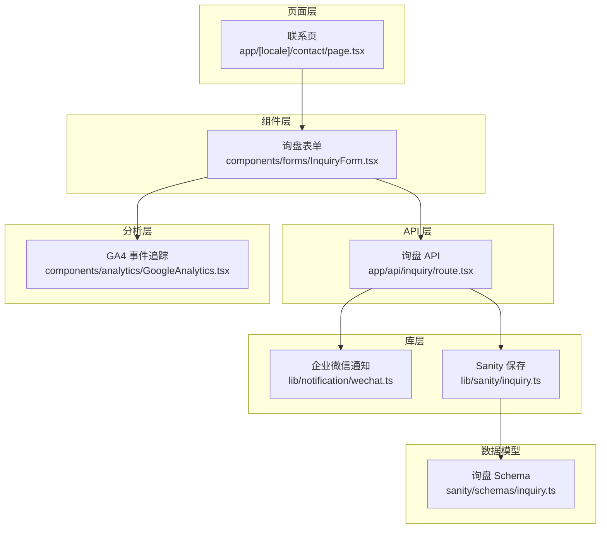
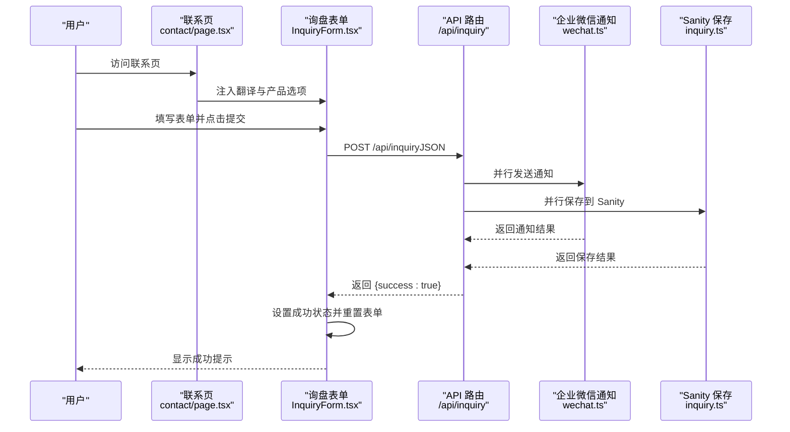
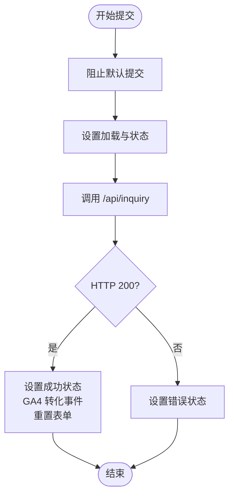
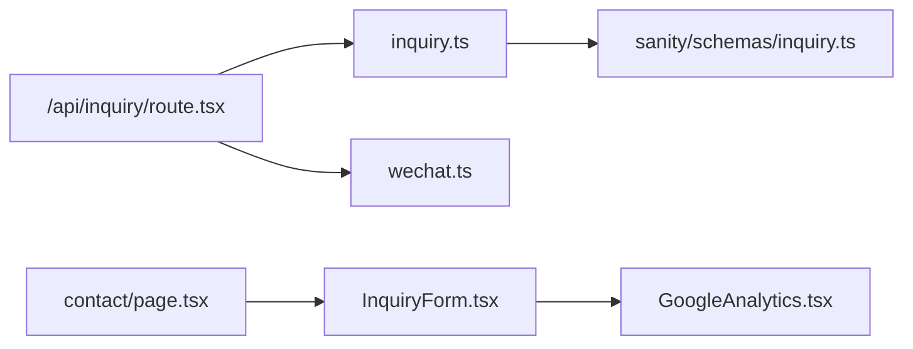

# 表单组件

<cite>
**本文引用的文件**
- [components/forms/InquiryForm.tsx](file://components/forms/InquiryForm.tsx)
- [app/api/inquiry/route.tsx](file://app/api/inquiry/route.tsx)
- [lib/notification/wechat.ts](file://lib/notification/wechat.ts)
- [lib/sanity/inquiry.ts](file://lib/sanity/inquiry.ts)
- [sanity/schemas/inquiry.ts](file://sanity/schemas/inquiry.ts)
- [app/[locale]/contact/page.tsx](file://app/[locale]/contact/page.tsx)
- [components/analytics/GoogleAnalytics.tsx](file://components/analytics/GoogleAnalytics.tsx)
- [messages/en.json](file://messages/en.json)
- [messages/zh.json](file://messages/zh.json)
- [tailwind.config.js](file://tailwind.config.js)
</cite>

## 目录
1. [简介](#简介)
2. [项目结构](#项目结构)
3. [核心组件](#核心组件)
4. [架构总览](#架构总览)
5. [详细组件分析](#详细组件分析)
6. [依赖关系分析](#依赖关系分析)
7. [性能考量](#性能考量)
8. [故障排查指南](#故障排查指南)
9. [结论](#结论)
10. [附录](#附录)

## 简介
本文件为 GoPro Trade 网站“询盘表单”组件的综合技术文档。内容覆盖表单字段设计、前端状态管理、数据校验与错误处理、提交流程控制、与后端 API 的集成方式、国际化文案与样式定制指南，并提供使用示例、最佳实践与常见问题解决方案。目标读者既包括前端开发者，也包括需要理解表单工作流的产品与运营人员。

## 项目结构
与询盘表单相关的代码分布在以下位置：
- 组件层：表单 UI 与交互逻辑位于组件目录
- API 层：Next.js App Router 的 API 路由负责接收与处理请求
- 库层：通知与内容管理库分别对接企业微信与 Sanity
- 数据模型：Sanity 文档类型定义
- 页面层：联系页加载翻译、产品选项并渲染表单
- 分析层：GA4 事件追踪工具

图表来源
- [app/[locale]/contact/page.tsx:167-171](file://app/%5Blocale%5D/contact/page.tsx#L167-L171)
- [components/forms/InquiryForm.tsx:73-117](file://components/forms/InquiryForm.tsx#L73-L117)
- [app/api/inquiry/route.tsx:21-102](file://app/api/inquiry/route.tsx#L21-L102)
- [lib/notification/wechat.ts:21-95](file://lib/notification/wechat.ts#L21-L95)
- [lib/sanity/inquiry.ts:32-72](file://lib/sanity/inquiry.ts#L32-L72)
- [sanity/schemas/inquiry.ts:8-99](file://sanity/schemas/inquiry.ts#L8-L99)
- [components/analytics/GoogleAnalytics.tsx:78-84](file://components/analytics/GoogleAnalytics.tsx#L78-L84)

章节来源
- [app/[locale]/contact/page.tsx:167-171](file://app/%5Blocale%5D/contact/page.tsx#L167-L171)
- [components/forms/InquiryForm.tsx:45-298](file://components/forms/InquiryForm.tsx#L45-L298)
- [app/api/inquiry/route.tsx:21-102](file://app/api/inquiry/route.tsx#L21-L102)
- [lib/notification/wechat.ts:21-95](file://lib/notification/wechat.ts#L21-L95)
- [lib/sanity/inquiry.ts:32-72](file://lib/sanity/inquiry.ts#L32-L72)
- [sanity/schemas/inquiry.ts:8-99](file://sanity/schemas/inquiry.ts#L8-L99)
- [components/analytics/GoogleAnalytics.tsx:78-84](file://components/analytics/GoogleAnalytics.tsx#L78-L84)

## 核心组件
- 询盘表单组件：负责收集公司名称、联系人、邮箱、电话、国家/地区、感兴趣产品、采购数量、留言等字段；管理提交状态（空闲/成功/错误），并在成功后重置表单。
- API 路由：接收表单数据，进行必填字段校验，格式化产品与国家名称，同时并行发送企业微信通知与保存至 Sanity。
- 通知库：通过企业微信 Webhook 推送 Markdown 格式的询盘提醒。
- Sanity 保存库：使用 Sanity 客户端创建询盘文档，写入产品名称、语言、状态等字段。
- 页面容器：联系页加载多语言文案与产品选项，注入到表单组件。
- 分析工具：提供 GA4 事件追踪函数，用于记录询盘提交转化。

章节来源
- [components/forms/InquiryForm.tsx:45-298](file://components/forms/InquiryForm.tsx#L45-L298)
- [app/api/inquiry/route.tsx:21-102](file://app/api/inquiry/route.tsx#L21-L102)
- [lib/notification/wechat.ts:21-95](file://lib/notification/wechat.ts#L21-L95)
- [lib/sanity/inquiry.ts:32-72](file://lib/sanity/inquiry.ts#L32-L72)
- [app/[locale]/contact/page.tsx:167-171](file://app/%5Blocale%5D/contact/page.tsx#L167-L171)
- [components/analytics/GoogleAnalytics.tsx:78-84](file://components/analytics/GoogleAnalytics.tsx#L78-L84)

## 架构总览
下图展示从用户提交到数据落库与通知的完整链路：

图表来源
- [app/[locale]/contact/page.tsx:167-171](file://app/%5Blocale%5D/contact/page.tsx#L167-L171)
- [components/forms/InquiryForm.tsx:73-117](file://components/forms/InquiryForm.tsx#L73-L117)
- [app/api/inquiry/route.tsx:77-80](file://app/api/inquiry/route.tsx#L77-L80)
- [lib/notification/wechat.ts:62-94](file://lib/notification/wechat.ts#L62-L94)
- [lib/sanity/inquiry.ts:65-67](file://lib/sanity/inquiry.ts#L65-L67)

## 详细组件分析

### 表单字段设计与状态管理
- 字段集合：公司名称、联系人、邮箱、电话、国家/地区、感兴趣产品（多选）、预计采购数量、留言。
- 状态管理：
  - 提交状态：空闲、成功、错误
  - 加载状态：禁用提交按钮，显示“提交中…”文案
  - 成功状态：显示绿色成功提示并清空表单
  - 错误状态：显示红色错误提示
- 国际化：文案来自翻译文件，支持中英及多语种占位符与选项文案。
- 样式：基于 Tailwind CSS，蓝色主题与响应式网格布局。

章节来源
- [components/forms/InquiryForm.tsx:48-57](file://components/forms/InquiryForm.tsx#L48-L57)
- [components/forms/InquiryForm.tsx:46-47](file://components/forms/InquiryForm.tsx#L46-L47)
- [components/forms/InquiryForm.tsx:134-143](file://components/forms/InquiryForm.tsx#L134-L143)
- [components/forms/InquiryForm.tsx:284-294](file://components/forms/InquiryForm.tsx#L284-L294)
- [messages/zh.json:51-84](file://messages/zh.json#L51-L84)
- [messages/en.json:51-84](file://messages/en.json#L51-L84)
- [tailwind.config.js:10-13](file://tailwind.config.js#L10-L13)

### 表单验证逻辑
- 前端交互：必填字段使用 HTML5 required；输入变更通过受控组件更新状态。
- 后端校验：必填字段缺失时返回 400；产品与国家名称按语言映射为可读文案。
- 业务规则：产品多选为空时保留“未选择”，数量为空时标记“未填写”。

章节来源
- [components/forms/InquiryForm.tsx:156](file://components/forms/InquiryForm.tsx#L156)
- [components/forms/InquiryForm.tsx:170](file://components/forms/InquiryForm.tsx#L170)
- [components/forms/InquiryForm.tsx:188](file://components/forms/InquiryForm.tsx#L188)
- [components/forms/InquiryForm.tsx:202](file://components/forms/InquiryForm.tsx#L202)
- [components/forms/InquiryForm.tsx:218](file://components/forms/InquiryForm.tsx#L218)
- [app/api/inquiry/route.tsx:36-42](file://app/api/inquiry/route.tsx#L36-L42)
- [app/api/inquiry/route.tsx:44-47](file://app/api/inquiry/route.tsx#L44-L47)
- [app/api/inquiry/route.tsx:49-61](file://app/api/inquiry/route.tsx#L49-L61)

### 提交流程控制
- 阻止默认提交，设置加载与状态，发起 fetch 请求。
- 成功：设置成功状态，触发 GA4 转化事件，重置表单。
- 失败：设置错误状态，捕获异常并记录日志。
- 并行处理：API 层并行执行通知与保存，提升吞吐。

图表来源
- [components/forms/InquiryForm.tsx:73-117](file://components/forms/InquiryForm.tsx#L73-L117)
- [components/analytics/GoogleAnalytics.tsx:78-84](file://components/analytics/GoogleAnalytics.tsx#L78-L84)

章节来源
- [components/forms/InquiryForm.tsx:73-117](file://components/forms/InquiryForm.tsx#L73-L117)

### 与后端 API 的集成
- 请求路径：POST /api/inquiry
- 请求体：包含表单数据与 locale
- 响应：成功返回 {success:true}，失败返回错误信息
- 并行策略：同时调用企业微信通知与 Sanity 保存，任一失败不影响数据持久化

章节来源
- [components/forms/InquiryForm.tsx:79-86](file://components/forms/InquiryForm.tsx#L79-L86)
- [app/api/inquiry/route.tsx:21-34](file://app/api/inquiry/route.tsx#L21-L34)
- [app/api/inquiry/route.tsx:77-94](file://app/api/inquiry/route.tsx#L77-L94)

### 数据模型与存储
- Sanity 文档类型：包含公司名称、联系人、邮箱、电话、国家/地区、产品、数量、留言、语言、状态、提交时间、备注等字段
- 初始状态：new
- 查询与排序：按提交时间倒序/正序排列，预览包含状态与时间

章节来源
- [sanity/schemas/inquiry.ts:12-99](file://sanity/schemas/inquiry.ts#L12-L99)

### 通知与内容管理
- 企业微信通知：Markdown 内容，包含公司信息、联系方式、产品需求、数量、留言与提交时间
- Sanity 保存：创建 inquiry 文档，写入映射后的产品名称、语言、状态与时间戳

章节来源
- [lib/notification/wechat.ts:40-60](file://lib/notification/wechat.ts#L40-L60)
- [lib/sanity/inquiry.ts:50-63](file://lib/sanity/inquiry.ts#L50-L63)

### 国际化与文案
- 页面加载翻译文件并注入到表单组件
- 表单文案包括字段标题、占位符、提交按钮、状态提示与数量选项
- 产品选项支持多语言名称映射

章节来源
- [app/[locale]/contact/page.tsx:7-17](file://app/%5Blocale%5D/contact/page.tsx#L7-L17)
- [app/[locale]/contact/page.tsx:105-150](file://app/%5Blocale%5D/contact/page.tsx#L105-L150)
- [messages/zh.json:51-84](file://messages/zh.json#L51-L84)
- [messages/en.json:51-84](file://messages/en.json#L51-L84)

### 样式与主题定制
- 主题色：蓝色系（gopro-blue、gopro-cyan）
- 响应式：网格布局在移动端与桌面端自适应
- 可访问性：使用语义化标签、必填星号标识、禁用态按钮状态
- 自定义建议：通过 Tailwind 扩展颜色与间距；为不同语言切换 RTL 布局

章节来源
- [tailwind.config.js:10-13](file://tailwind.config.js#L10-L13)
- [components/forms/InquiryForm.tsx:146-175](file://components/forms/InquiryForm.tsx#L146-L175)
- [components/forms/InquiryForm.tsx:178-207](file://components/forms/InquiryForm.tsx#L178-L207)
- [components/forms/InquiryForm.tsx:210-226](file://components/forms/InquiryForm.tsx#L210-L226)
- [components/forms/InquiryForm.tsx:229-247](file://components/forms/InquiryForm.tsx#L229-L247)
- [components/forms/InquiryForm.tsx:250-266](file://components/forms/InquiryForm.tsx#L250-L266)
- [components/forms/InquiryForm.tsx:269-281](file://components/forms/InquiryForm.tsx#L269-L281)
- [components/forms/InquiryForm.tsx:284-294](file://components/forms/InquiryForm.tsx#L284-L294)

## 依赖关系分析
- 组件依赖：InquiryForm 依赖 GA4 工具函数进行转化追踪
- API 依赖：API 路由依赖通知库与 Sanity 保存库
- 数据依赖：Sanity 保存库依赖 Sanity 客户端与环境变量
- 页面依赖：联系页负责加载翻译与产品选项并传递给表单

图表来源
- [components/forms/InquiryForm.tsx:4](file://components/forms/InquiryForm.tsx#L4)
- [components/analytics/GoogleAnalytics.tsx:78-84](file://components/analytics/GoogleAnalytics.tsx#L78-L84)
- [app/api/inquiry/route.tsx:2](file://app/api/inquiry/route.tsx#L2)
- [lib/notification/wechat.ts:21-95](file://lib/notification/wechat.ts#L21-L95)
- [lib/sanity/inquiry.ts:32-72](file://lib/sanity/inquiry.ts#L32-L72)
- [sanity/schemas/inquiry.ts:8-99](file://sanity/schemas/inquiry.ts#L8-L99)
- [app/[locale]/contact/page.tsx:167-171](file://app/%5Blocale%5D/contact/page.tsx#L167-L171)

章节来源
- [components/forms/InquiryForm.tsx:4](file://components/forms/InquiryForm.tsx#L4)
- [components/analytics/GoogleAnalytics.tsx:78-84](file://components/analytics/GoogleAnalytics.tsx#L78-L84)
- [app/api/inquiry/route.tsx:2](file://app/api/inquiry/route.tsx#L2)
- [lib/notification/wechat.ts:21-95](file://lib/notification/wechat.ts#L21-L95)
- [lib/sanity/inquiry.ts:32-72](file://lib/sanity/inquiry.ts#L32-L72)
- [sanity/schemas/inquiry.ts:8-99](file://sanity/schemas/inquiry.ts#L8-L99)
- [app/[locale]/contact/page.tsx:167-171](file://app/%5Blocale%5D/contact/page.tsx#L167-L171)

## 性能考量
- 并行处理：API 层并行发送通知与保存，减少整体延迟
- 本地状态：前端仅维护表单状态与提交状态，避免不必要的全局状态开销
- 样式：Tailwind 原子类减少运行时计算，主题扩展集中管理
- 缓存与 CDN：可结合 Next.js 缓存策略优化静态资源加载

## 故障排查指南
- 提交失败
  - 检查网络请求是否被拦截或跨域限制
  - 查看浏览器控制台与服务器日志中的错误信息
  - 确认 API 路由返回的状态码与消息
- 通知未送达
  - 确认企业微信 Webhook URL 环境变量是否正确配置
  - 检查 Webhook 返回的错误码与响应体
- 数据未入库
  - 确认 Sanity API Token 是否配置
  - 检查客户端初始化参数与网络连通性
- 语言显示异常
  - 确认翻译文件加载顺序与键名一致
  - 检查页面传入的 locale 参数与产品选项映射

章节来源
- [app/api/inquiry/route.tsx:95-101](file://app/api/inquiry/route.tsx#L95-L101)
- [lib/notification/wechat.ts:22-27](file://lib/notification/wechat.ts#L22-L27)
- [lib/notification/wechat.ts:76-87](file://lib/notification/wechat.ts#L76-L87)
- [lib/sanity/inquiry.ts:33-36](file://lib/sanity/inquiry.ts#L33-L36)
- [app/[locale]/contact/page.tsx:7-17](file://app/%5Blocale%5D/contact/page.tsx#L7-L17)

## 结论
该询盘表单组件以清晰的职责分离实现了从前端交互到后端处理与数据落库的完整闭环。通过并行处理与状态管理，保证了良好的用户体验与可靠性。配合国际化与可定制样式，满足多语言市场的业务需求。建议在生产环境中进一步完善错误上报与监控告警，以提升可观测性与稳定性。

## 附录

### 使用示例
- 在联系页中渲染表单并传入翻译与产品选项
  - 参考路径：[app/[locale]/contact/page.tsx:167-171](file://app/%5Blocale%5D/contact/page.tsx#L167-L171)
- 表单组件属性
  - locale: 当前语言
  - messages: 字段标题、占位符、提交文案、状态提示
  - productOptions: 产品选项数组（含 id 与多语言名称）
  - 参考路径：[components/forms/InquiryForm.tsx:11-43](file://components/forms/InquiryForm.tsx#L11-L43)

### 最佳实践
- 前端必填字段使用 HTML5 required，后端仍需进行必填校验
- 对外暴露的 API 应统一返回结构，便于前端处理
- 将敏感配置放入环境变量，避免硬编码
- 为关键事件（如询盘提交）添加 GA4 转化追踪
- 保持翻译键名一致性，避免运行时拼写错误

### 常见问题
- Q: 为什么提交后没有收到企业微信通知？
  - A: 检查 WECHAT_WEBHOOK_URL 是否配置，以及 Webhook 返回的错误码
- Q: 为什么表单提交成功但 Sanity 中看不到数据？
  - A: 检查 SANITY_API_TOKEN 与客户端初始化参数
- Q: 如何新增语言支持？
  - A: 在翻译文件中补充键值，联系页加载对应文件并传入表单组件