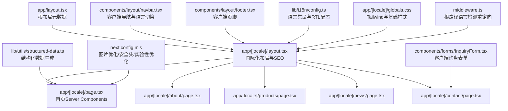
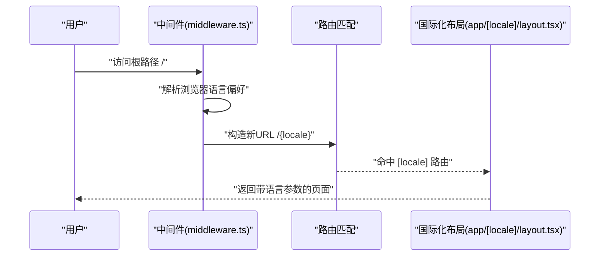
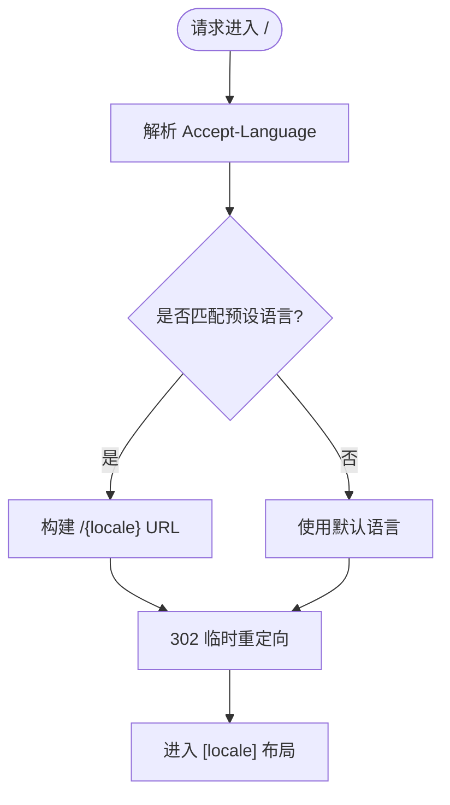
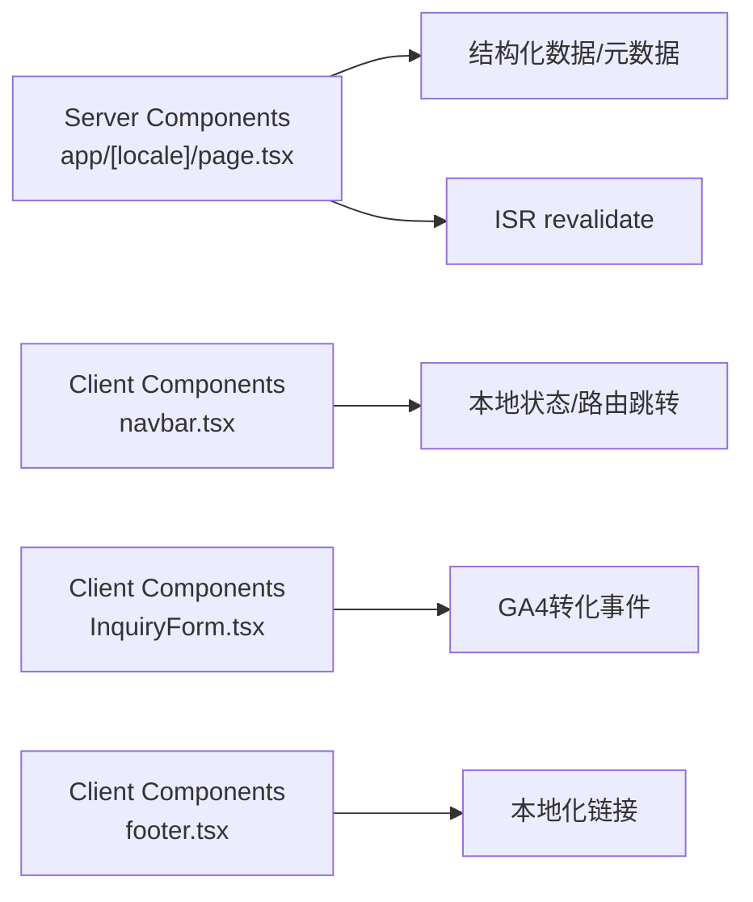
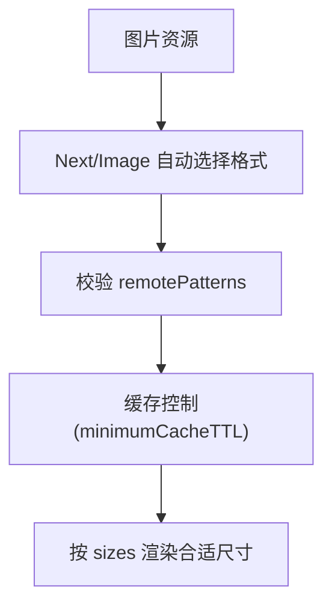
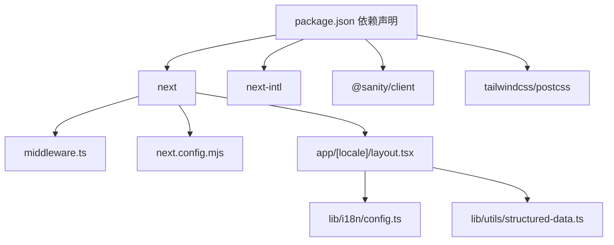

# 前端架构

<cite>
**本文引用的文件**
- [next.config.mjs](file://next.config.mjs)
- [middleware.ts](file://middleware.ts)
- [tailwind.config.js](file://tailwind.config.js)
- [app/layout.tsx](file://app/layout.tsx)
- [app/[locale]/layout.tsx](file://app/[locale]/layout.tsx)
- [app/[locale]/page.tsx](file://app/[locale]/page.tsx)
- [app/[locale]/globals.css](file://app/[locale]/globals.css)
- [lib/i18n/config.ts](file://lib/i18n/config.ts)
- [components/layout/navbar.tsx](file://components/layout/navbar.tsx)
- [components/layout/footer.tsx](file://components/layout/footer.tsx)
- [components/forms/InquiryForm.tsx](file://components/forms/InquiryForm.tsx)
- [lib/utils/structured-data.ts](file://lib/utils/structured-data.ts)
- [package.json](file://package.json)
</cite>

## 目录
1. [简介](#简介)
2. [项目结构](#项目结构)
3. [核心组件](#核心组件)
4. [架构总览](#架构总览)
5. [详细组件分析](#详细组件分析)
6. [依赖关系分析](#依赖关系分析)
7. [性能考量](#性能考量)
8. [故障排查指南](#故障排查指南)
9. [结论](#结论)

## 简介
本文件面向 GoPro Trade 网站的前端架构，围绕 Next.js 14 App Router 进行系统化梳理，重点涵盖：
- 文件系统路由与国际化布局的协同
- Server Components 与 Client Components 的职责划分与使用策略
- 国际化中间件的语言检测、路由重写与动态语言切换机制
- 图片优化配置（现代格式、懒加载、CDN 集成）
- 全局样式系统、响应式设计与 Tailwind CSS 实践
- 前端性能优化（代码分割、预加载、缓存策略）

## 项目结构
该仓库采用 Next.js 14 App Router 的文件系统路由约定，结合国际化目录结构与静态参数生成，形成清晰的层次化组织：
- 根级 app 目录承载国际化路由与页面
- components 提供可复用 UI 组件
- lib 提供国际化、结构化数据、Sanity 查询等工具
- messages 存放多语言文案
- next.config.mjs 定义图片优化、压缩、安全头与实验性优化
- middleware.ts 实现根路径语言检测与重定向
- tailwind.config.js 配置内容扫描与主题扩展

**图表来源**
- [app/layout.tsx:1-19](file://app/layout.tsx#L1-L19)
- [app/[locale]/layout.tsx](file://app/[locale]/layout.tsx#L1-L71)
- [app/[locale]/page.tsx](file://app/[locale]/page.tsx#L1-L334)
- [components/layout/navbar.tsx:1-215](file://components/layout/navbar.tsx#L1-L215)
- [components/layout/footer.tsx:1-170](file://components/layout/footer.tsx#L1-L170)
- [components/forms/InquiryForm.tsx:1-298](file://components/forms/InquiryForm.tsx#L1-L298)
- [lib/i18n/config.ts:1-16](file://lib/i18n/config.ts#L1-L16)
- [lib/utils/structured-data.ts:1-383](file://lib/utils/structured-data.ts#L1-L383)
- [app/[locale]/globals.css](file://app/[locale]/globals.css#L1-L77)
- [next.config.mjs:1-65](file://next.config.mjs#L1-L65)
- [middleware.ts:1-68](file://middleware.ts#L1-L68)

**章节来源**
- [app/layout.tsx:1-19](file://app/layout.tsx#L1-L19)
- [app/[locale]/layout.tsx](file://app/[locale]/layout.tsx#L1-L71)
- [app/[locale]/page.tsx](file://app/[locale]/page.tsx#L1-L334)
- [components/layout/navbar.tsx:1-215](file://components/layout/navbar.tsx#L1-L215)
- [components/layout/footer.tsx:1-170](file://components/layout/footer.tsx#L1-L170)
- [components/forms/InquiryForm.tsx:1-298](file://components/forms/InquiryForm.tsx#L1-L298)
- [lib/i18n/config.ts:1-16](file://lib/i18n/config.ts#L1-L16)
- [lib/utils/structured-data.ts:1-383](file://lib/utils/structured-data.ts#L1-L383)
- [app/[locale]/globals.css](file://app/[locale]/globals.css#L1-L77)
- [next.config.mjs:1-65](file://next.config.mjs#L1-L65)
- [middleware.ts:1-68](file://middleware.ts#L1-L68)

## 核心组件
- 国际化布局与元数据
  - 根布局定义站点基础元数据
  - 国际化布局负责生成 hreflang、加载对应语言消息、注入 GA4 并渲染导航与页脚
- 首页（Server Components）
  - 异步生成 SEO 元数据与结构化数据（组织、网站、FAQ、本地业务）
  - 通过 ISR revalidate 控制更新频率
  - 使用 Next/Image 实现现代格式、懒加载与首屏优先加载策略
- 导航栏与页脚（Client Components）
  - 客户端状态管理（移动端菜单、语言切换下拉）
  - 语言切换通过设置 Cookie 实现持久化
- 表单（Client Components）
  - 客户端提交询盘，集成 GA4 转化事件
- 结构化数据工具
  - 生成组织、网站、面包屑、FAQ、产品列表、本地业务、视频、文章等 Schema
- 样式系统
  - Tailwind 配置内容扫描范围与主题扩展
  - 全局 CSS 注入 Tailwind 层、RTL 支持、骨架屏与滚动条自定义

**章节来源**
- [app/[locale]/layout.tsx](file://app/[locale]/layout.tsx#L11-L71)
- [app/[locale]/page.tsx](file://app/[locale]/page.tsx#L22-L77)
- [components/layout/navbar.tsx:28-215](file://components/layout/navbar.tsx#L28-L215)
- [components/layout/footer.tsx:36-170](file://components/layout/footer.tsx#L36-L170)
- [components/forms/InquiryForm.tsx:45-298](file://components/forms/InquiryForm.tsx#L45-L298)
- [lib/utils/structured-data.ts:104-383](file://lib/utils/structured-data.ts#L104-L383)
- [tailwind.config.js:1-18](file://tailwind.config.js#L1-L18)
- [app/[locale]/globals.css](file://app/[locale]/globals.css#L1-L77)

## 架构总览
Next.js 14 App Router 以“文件系统即路由”的方式组织页面，配合国际化目录与静态参数生成，实现多语言站点的统一入口与 SEO 友好链接。中间件在根路径执行语言检测与 302 重定向，避免与动态语言切换冲突。

**图表来源**
- [middleware.ts:44-63](file://middleware.ts#L44-L63)
- [app/[locale]/layout.tsx](file://app/[locale]/layout.tsx#L11-L31)

**章节来源**
- [middleware.ts:1-68](file://middleware.ts#L1-L68)
- [app/[locale]/layout.tsx](file://app/[locale]/layout.tsx#L1-L71)

## 详细组件分析

### 国际化中间件（语言检测、重写与动态切换）
- 语言检测
  - 解析 Accept-Language 请求头，按优先级匹配预设映射
  - 默认回退至默认语言
- 路由重写
  - 仅对根路径执行 302 临时重定向，禁用缓存
  - 重定向后进入 [locale] 布局，避免与后续动态切换冲突
- 动态语言切换
  - 导航栏通过设置 Cookie 实现语言持久化
  - 切换后保持当前路径的 locale 前缀

**图表来源**
- [middleware.ts:21-63](file://middleware.ts#L21-L63)
- [lib/i18n/config.ts:1-16](file://lib/i18n/config.ts#L1-L16)

**章节来源**
- [middleware.ts:1-68](file://middleware.ts#L1-L68)
- [lib/i18n/config.ts:1-16](file://lib/i18n/config.ts#L1-L16)
- [components/layout/navbar.tsx:35-40](file://components/layout/navbar.tsx#L35-L40)

### Server Components 与 Client Components 使用策略
- Server Components（推荐用于）
  - 首页与列表页的数据获取与 SEO 元数据生成
  - 结构化数据注入与 ISR 控制
  - 布局层的国际化消息加载与 hreflang 生成
- Client Components（推荐用于）
  - 交互性强的组件（导航栏、页脚、表单）
  - 语言切换、移动端菜单、状态管理
  - 事件绑定与第三方 SDK 初始化（如 GA4）

**图表来源**
- [app/[locale]/page.tsx](file://app/[locale]/page.tsx#L149-L201)
- [components/layout/navbar.tsx:28-215](file://components/layout/navbar.tsx#L28-L215)
- [components/forms/InquiryForm.tsx:45-117](file://components/forms/InquiryForm.tsx#L45-L117)
- [components/layout/footer.tsx:36-170](file://components/layout/footer.tsx#L36-L170)

**章节来源**
- [app/[locale]/page.tsx](file://app/[locale]/page.tsx#L149-L201)
- [components/layout/navbar.tsx:28-215](file://components/layout/navbar.tsx#L28-L215)
- [components/forms/InquiryForm.tsx:45-117](file://components/forms/InquiryForm.tsx#L45-L117)
- [components/layout/footer.tsx:36-170](file://components/layout/footer.tsx#L36-L170)

### 图片优化配置（现代格式、懒加载、CDN）
- 现代图片格式
  - 启用 AVIF 与 WebP，提升 LCP 与整体性能
- 设备像素比与尺寸
  - 配置 deviceSizes 与 imageSizes，适配多终端
- CDN 集成
  - 限制 remotePatterns 为 cdn.sanity.io，确保 Sanity 图片安全加载
- 缓存策略
  - minimumCacheTTL 设置为 30 天，降低重复请求
  - 静态图片与字体长期缓存（immutable）
- 首屏与懒加载
  - 首屏关键图片设置 priority 与 eager，其余使用 lazy 与 sizes

**图表来源**
- [next.config.mjs:4-17](file://next.config.mjs#L4-L17)
- [app/[locale]/page.tsx](file://app/[locale]/page.tsx#L296-L305)

**章节来源**
- [next.config.mjs:1-65](file://next.config.mjs#L1-L65)
- [app/[locale]/page.tsx](file://app/[locale]/page.tsx#L296-L305)

### 全局样式系统、响应式设计与 Tailwind CSS
- 内容扫描范围
  - app、components、lib 下的 JS/TS/JSX/TSX/MDX 文件参与编译
- 主题扩展
  - 定义品牌色 gopro-blue 与 gopro-cyan
- 全局样式
  - Tailwind 三层注入（base/components/utilities）
  - 平滑滚动、字体栈（含阿拉伯语支持）、图片懒加载占位
  - RTL/LTR 方向类与骨架屏动画
- 响应式设计
  - 使用 Tailwind 断点与网格系统，确保移动端体验

**章节来源**
- [tailwind.config.js:1-18](file://tailwind.config.js#L1-L18)
- [app/[locale]/globals.css](file://app/[locale]/globals.css#L1-L77)

### 结构化数据与 SEO
- 组织、网站、本地业务、FAQ、产品列表、文章等 Schema 生成
- 首页注入 LD+JSON，提升 SERP 丰富结果
- 生成 alternates 与 canonical，完善 hreflang 与去重

**章节来源**
- [lib/utils/structured-data.ts:104-383](file://lib/utils/structured-data.ts#L104-L383)
- [app/[locale]/page.tsx](file://app/[locale]/page.tsx#L156-L201)
- [app/[locale]/layout.tsx](file://app/[locale]/layout.tsx#L15-L31)

## 依赖关系分析
- 运行时依赖
  - next、react、react-dom、next-intl（国际化）、@sanity/client（内容源）
- 开发依赖
  - tailwindcss、postcss、autoprefixer、typescript、eslint
- 关键耦合点
  - 国际化配置与布局消息加载强关联
  - 中间件与布局的 locale 前缀一致性
  - 图片优化与 CDN 白名单

**图表来源**
- [package.json:12-29](file://package.json#L12-L29)
- [middleware.ts:1-68](file://middleware.ts#L1-L68)
- [next.config.mjs:1-65](file://next.config.mjs#L1-L65)
- [app/[locale]/layout.tsx](file://app/[locale]/layout.tsx#L1-L71)
- [lib/i18n/config.ts:1-16](file://lib/i18n/config.ts#L1-L16)
- [lib/utils/structured-data.ts:1-383](file://lib/utils/structured-data.ts#L1-L383)

**章节来源**
- [package.json:1-45](file://package.json#L1-L45)
- [middleware.ts:1-68](file://middleware.ts#L1-L68)
- [next.config.mjs:1-65](file://next.config.mjs#L1-L65)
- [app/[locale]/layout.tsx](file://app/[locale]/layout.tsx#L1-L71)
- [lib/i18n/config.ts:1-16](file://lib/i18n/config.ts#L1-L16)
- [lib/utils/structured-data.ts:1-383](file://lib/utils/structured-data.ts#L1-L383)

## 性能考量
- 代码分割
  - App Router 自动按路由拆分包，减少初始包体积
- 预加载与预取
  - 首屏关键图片设置 priority 与 eager，提升 LCP
- 缓存策略
  - 图片与字体长期缓存（immutable）
  - 安全头与压缩开启，减少传输体积
- 实验性优化
  - optimizePackageImports 对 lucide-react 与 @sanity/client 进行按需导入优化
- 图片懒加载
  - content-visibility 与 sizes 配置降低 CLS 与带宽占用

**章节来源**
- [next.config.mjs:22-61](file://next.config.mjs#L22-L61)
- [app/[locale]/page.tsx](file://app/[locale]/page.tsx#L296-L305)
- [app/[locale]/globals.css](file://app/[locale]/globals.css#L24-L32)

## 故障排查指南
- 语言切换无效
  - 检查导航栏是否正确设置 Cookie 与 href 构造逻辑
  - 确认 [locale] 布局未拦截语言切换后的路径
- 首次访问未自动重定向
  - 确认中间件仅对根路径生效且未被其他路由规则覆盖
  - 检查 Accept-Language 是否包含预设语言
- 图片加载失败
  - 确认 remotePatterns 已允许 cdn.sanity.io
  - 检查图片 URL 是否为 https
- SEO 标签缺失
  - 确认首页与布局已注入结构化数据与 alternates
  - 检查 ISR revalidate 配置是否导致缓存过期

**章节来源**
- [components/layout/navbar.tsx:35-59](file://components/layout/navbar.tsx#L35-L59)
- [middleware.ts:44-63](file://middleware.ts#L44-L63)
- [next.config.mjs:11-16](file://next.config.mjs#L11-L16)
- [app/[locale]/page.tsx](file://app/[locale]/page.tsx#L156-L201)
- [app/[locale]/layout.tsx](file://app/[locale]/layout.tsx#L15-L31)

## 结论
该前端架构以 Next.js 14 App Router 为核心，结合国际化中间件、Server/Client 组件分工、Tailwind 样式体系与结构化数据，实现了高性能、可维护、SEO 友好的多语言站点。通过现代图片格式、懒加载与 CDN 集成，进一步优化了用户体验与 Core Web Vitals 指标。建议持续关注 ISR 与缓存策略的平衡，以及国际化文案与路由的一致性维护。