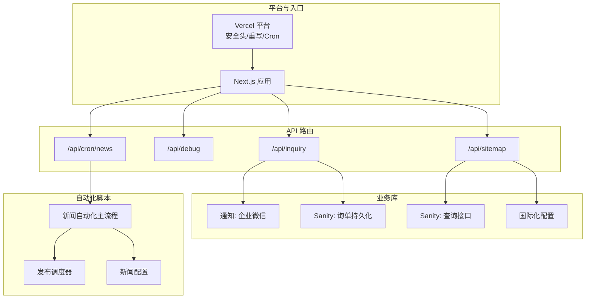
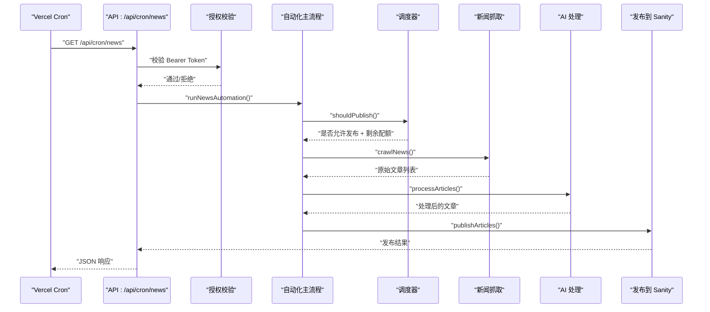
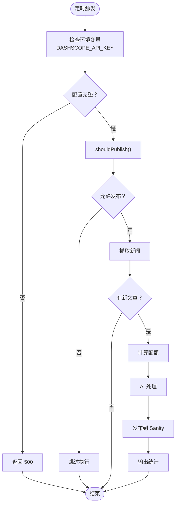
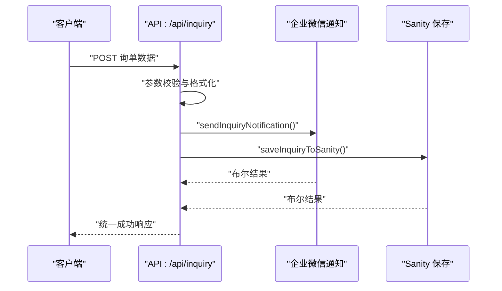
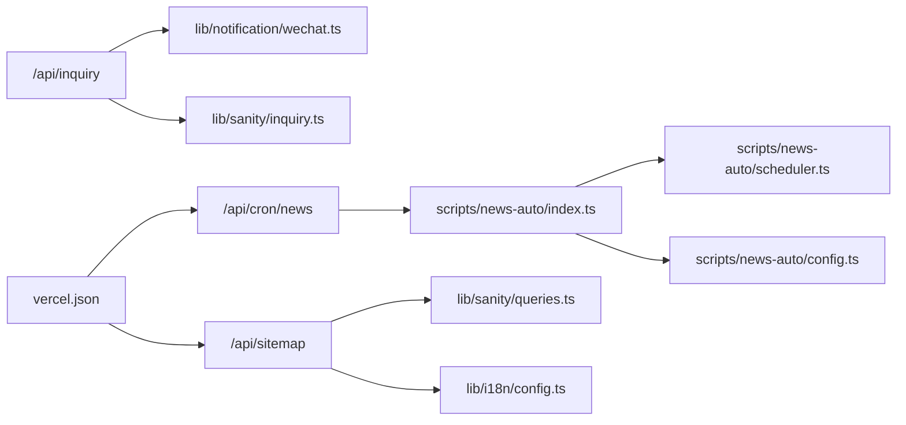

# 后端架构

<cite>
**本文引用的文件**
- [app/api/cron/news/route.ts](file://app/api/cron/news/route.ts)
- [app/api/debug/route.ts](file://app/api/debug/route.ts)
- [app/api/inquiry/route.tsx](file://app/api/inquiry/route.tsx)
- [app/api/sitemap/route.ts](file://app/api/sitemap/route.ts)
- [middleware.ts](file://middleware.ts)
- [lib/notification/wechat.ts](file://lib/notification/wechat.ts)
- [lib/sanity/inquiry.ts](file://lib/sanity/inquiry.ts)
- [lib/sanity/queries.ts](file://lib/sanity/queries.ts)
- [lib/i18n/config.ts](file://lib/i18n/config.ts)
- [scripts/news-auto/index.ts](file://scripts/news-auto/index.ts)
- [scripts/news-auto/scheduler.ts](file://scripts/news-auto/scheduler.ts)
- [scripts/news-auto/config.ts](file://scripts/news-auto/config.ts)
- [vercel.json](file://vercel.json)
- [package.json](file://package.json)
</cite>

## 目录
1. [简介](#简介)
2. [项目结构](#项目结构)
3. [核心组件](#核心组件)
4. [架构总览](#架构总览)
5. [详细组件分析](#详细组件分析)
6. [依赖关系分析](#依赖关系分析)
7. [性能考量](#性能考量)
8. [故障排查指南](#故障排查指南)
9. [结论](#结论)
10. [附录](#附录)

## 简介
本文件面向 GoPro Trade 网站后端，系统性梳理 API 路由体系、定时任务、邮件与通知集成、调试工具、网站地图生成、安全策略、错误处理与性能监控，并提出可扩展与微服务化建议。文档以仓库现有实现为依据，结合 Next.js App Router 的 API 设计与 Vercel 平台部署特性进行说明。

## 项目结构
后端逻辑主要集中在以下区域：
- API 路由：位于 app/api 下，采用 App Router 的路由约定，提供定时任务、调试、询单提交、站点地图等接口。
- 中间件：位于根目录，负责语言检测与重定向。
- 业务库：位于 lib 下，封装通知（企业微信）、Sanity 数据操作与查询、国际化配置等。
- 自动化脚本：位于 scripts/news-auto 下，实现新闻抓取、AI 处理、调度与发布。
- 平台配置：vercel.json 定义安全头、重写规则与 Cron 调度；package.json 管理依赖。

图表来源
- [vercel.json:1-44](file://vercel.json#L1-L44)
- [app/api/cron/news/route.ts:1-52](file://app/api/cron/news/route.ts#L1-L52)
- [app/api/debug/route.ts:1-16](file://app/api/debug/route.ts#L1-L16)
- [app/api/inquiry/route.tsx:1-103](file://app/api/inquiry/route.tsx#L1-L103)
- [app/api/sitemap/route.ts:1-100](file://app/api/sitemap/route.ts#L1-L100)
- [lib/notification/wechat.ts:1-96](file://lib/notification/wechat.ts#L1-L96)
- [lib/sanity/inquiry.ts:1-73](file://lib/sanity/inquiry.ts#L1-L73)
- [lib/sanity/queries.ts:1-120](file://lib/sanity/queries.ts#L1-L120)
- [lib/i18n/config.ts:1-16](file://lib/i18n/config.ts#L1-L16)
- [scripts/news-auto/index.ts:1-83](file://scripts/news-auto/index.ts#L1-L83)
- [scripts/news-auto/scheduler.ts:1-104](file://scripts/news-auto/scheduler.ts#L1-L104)
- [scripts/news-auto/config.ts:1-45](file://scripts/news-auto/config.ts#L1-L45)

章节来源
- [vercel.json:1-44](file://vercel.json#L1-L44)
- [package.json:1-45](file://package.json#L1-L45)

## 核心组件
- API 路由系统
  - /api/cron/news：定时任务入口，支持 Bearer Token 授权校验，调用新闻自动化主流程。
  - /api/debug：调试接口，返回请求头、URL、路径与时间戳，便于诊断。
  - /api/inquiry：询单提交接口，校验参数，异步并行发送企业微信通知与保存至 Sanity。
  - /api/sitemap：动态生成站点地图，聚合静态页面、分类与产品详情页链接，输出 XML。
- 中间件
  - 根路径重定向：根据浏览器 Accept-Language 映射到受支持的语言代码，执行 302 临时重定向并禁用缓存。
- 通知与数据持久化
  - 企业微信通知：通过 Webhook 发送 Markdown 消息，失败时记录日志并返回失败状态。
  - Sanity 询单：创建 inquiry 文档，包含状态与提交时间，失败时记录日志并返回失败状态。
- 自动化新闻系统
  - 主流程：检查发布窗口与配额 -> 抓取新闻 -> AI 处理 -> 发布到 Sanity。
  - 调度器：基于北京时间窗口与每日限额判断是否允许发布。
  - 配置：发布时段、关键词过滤、AI 改写参数、质量阈值等。
- 地图生成
  - 动态生成多语言站点地图，聚合静态页面、分类与产品详情页，包含 lastmod、changefreq、priority，以及可选图片信息。
- 安全与平台配置
  - Vercel 安全头：X-Content-Type-Options、X-Frame-Options、X-XSS-Protection。
  - 重写规则：将 /sitemap.xml 重写到 /api/sitemap。
  - Cron 调度：定义两个固定时间点的定时任务，调用 /api/cron/news。

章节来源
- [app/api/cron/news/route.ts:1-52](file://app/api/cron/news/route.ts#L1-L52)
- [app/api/debug/route.ts:1-16](file://app/api/debug/route.ts#L1-L16)
- [app/api/inquiry/route.tsx:1-103](file://app/api/inquiry/route.tsx#L1-L103)
- [app/api/sitemap/route.ts:1-100](file://app/api/sitemap/route.ts#L1-L100)
- [middleware.ts:1-68](file://middleware.ts#L1-L68)
- [lib/notification/wechat.ts:1-96](file://lib/notification/wechat.ts#L1-L96)
- [lib/sanity/inquiry.ts:1-73](file://lib/sanity/inquiry.ts#L1-L73)
- [scripts/news-auto/index.ts:1-83](file://scripts/news-auto/index.ts#L1-L83)
- [scripts/news-auto/scheduler.ts:1-104](file://scripts/news-auto/scheduler.ts#L1-L104)
- [scripts/news-auto/config.ts:1-45](file://scripts/news-auto/config.ts#L1-L45)
- [vercel.json:1-44](file://vercel.json#L1-L44)

## 架构总览
下图展示了 API 路由、业务库与自动化脚本之间的交互关系，以及平台层对安全与调度的支持。

图表来源
- [app/api/cron/news/route.ts:1-52](file://app/api/cron/news/route.ts#L1-L52)
- [scripts/news-auto/index.ts:1-83](file://scripts/news-auto/index.ts#L1-L83)
- [scripts/news-auto/scheduler.ts:1-104](file://scripts/news-auto/scheduler.ts#L1-L104)

## 详细组件分析

### API 路由系统
- RESTful 组织结构
  - 采用 App Router 的文件系统路由约定，每个 API 路由对应一个文件，如 /api/inquiry/route.tsx。
  - 路由分组清晰：定时任务（/api/cron/*）、调试（/api/debug）、业务接口（/api/inquiry、/api/sitemap）。
- 中间件使用
  - 根路径重定向中间件仅在 / 触发，根据浏览器语言映射到受支持语言，返回 302 并设置缓存控制头。
- 错误处理
  - /api/cron/news：校验失败返回 401；环境变量缺失返回 500；异常捕获统一返回 500。
  - /api/inquiry：参数校验失败返回 400；异常捕获返回 500。
  - /api/sitemap：查询失败时记录错误但继续生成基础 sitemap；返回 XML 并设置缓存控制头。
  - /api/debug：直接返回请求上下文信息，便于前端或运维定位问题。

章节来源
- [middleware.ts:1-68](file://middleware.ts#L1-L68)
- [app/api/cron/news/route.ts:1-52](file://app/api/cron/news/route.ts#L1-L52)
- [app/api/inquiry/route.tsx:1-103](file://app/api/inquiry/route.tsx#L1-L103)
- [app/api/sitemap/route.ts:1-100](file://app/api/sitemap/route.ts#L1-L100)
- [app/api/debug/route.ts:1-16](file://app/api/debug/route.ts#L1-L16)

### 定时任务系统（新闻自动化）
- 触发与授权
  - Vercel Cron 按计划向 /api/cron/news 发起请求，需携带 Bearer Token（CRON_SECRET）。
- 主流程
  - 发布检查：基于北京时间窗口与每日限额决定是否继续。
  - 抓取：从多个新闻源抓取原始文章。
  - 处理：调用 DashScope API 对文章进行改写与优化。
  - 发布：将处理后的文章发布到 Sanity，建立 sourceMap 记录来源。
- 调度策略
  - 时间窗口：考虑 Hobby 套餐 ±1 小时浮动，设定 ±90 分钟窗口。
  - 配额管理：每日最多发布 N 篇，剩余配额动态计算。
- 配置项
  - 发布时间、关键词过滤、AI 模型与参数、内容质量阈值等集中于配置文件。

图表来源
- [app/api/cron/news/route.ts:1-52](file://app/api/cron/news/route.ts#L1-L52)
- [scripts/news-auto/index.ts:1-83](file://scripts/news-auto/index.ts#L1-L83)
- [scripts/news-auto/scheduler.ts:1-104](file://scripts/news-auto/scheduler.ts#L1-L104)
- [scripts/news-auto/config.ts:1-45](file://scripts/news-auto/config.ts#L1-L45)

章节来源
- [vercel.json:33-42](file://vercel.json#L33-L42)
- [app/api/cron/news/route.ts:1-52](file://app/api/cron/news/route.ts#L1-L52)
- [scripts/news-auto/index.ts:1-83](file://scripts/news-auto/index.ts#L1-L83)
- [scripts/news-auto/scheduler.ts:1-104](file://scripts/news-auto/scheduler.ts#L1-L104)
- [scripts/news-auto/config.ts:1-45](file://scripts/news-auto/config.ts#L1-L45)

### 通知与数据持久化（询单）
- 并行处理
  - 询单提交接口并行执行企业微信通知与 Sanity 保存，提升响应速度。
- 参数校验与数据格式化
  - 必填字段校验；产品兴趣与国家名称按语言映射；最终以统一结构保存。
- 错误策略
  - 任一环节失败不影响整体返回（数据已保存），但会记录日志以便后续处理。

图表来源
- [app/api/inquiry/route.tsx:1-103](file://app/api/inquiry/route.tsx#L1-L103)
- [lib/notification/wechat.ts:1-96](file://lib/notification/wechat.ts#L1-L96)
- [lib/sanity/inquiry.ts:1-73](file://lib/sanity/inquiry.ts#L1-L73)

章节来源
- [app/api/inquiry/route.tsx:1-103](file://app/api/inquiry/route.tsx#L1-L103)
- [lib/notification/wechat.ts:1-96](file://lib/notification/wechat.ts#L1-L96)
- [lib/sanity/inquiry.ts:1-73](file://lib/sanity/inquiry.ts#L1-L73)

### 站点地图生成
- 动态生成
  - 强制动态渲染，避免构建期访问数据库；从 Sanity 获取产品与分类数据。
- 多语言覆盖
  - 遍历受支持语言，生成静态页面、分类与产品详情页链接。
- 结构化输出
  - 输出标准 XML，包含 loc、lastmod、changefreq、priority，以及可选图片信息。
- 缓存策略
  - 设置 Content-Type 与缓存控制头，平衡新鲜度与性能。

章节来源
- [app/api/sitemap/route.ts:1-100](file://app/api/sitemap/route.ts#L1-L100)
- [lib/sanity/queries.ts:1-120](file://lib/sanity/queries.ts#L1-L120)
- [lib/i18n/config.ts:1-16](file://lib/i18n/config.ts#L1-L16)

### 调试工具
- /api/debug
  - 返回请求头、URL、路径与时间戳，便于快速验证请求上下文与网络链路。

章节来源
- [app/api/debug/route.ts:1-16](file://app/api/debug/route.ts#L1-L16)

## 依赖关系分析
- 组件耦合
  - API 层与业务库解耦：通知与数据持久化通过独立模块提供能力，API 仅编排调用。
  - 自动化脚本与调度器：主流程依赖调度器的发布决策，降低主流程复杂度。
- 外部依赖
  - Vercel：安全头、重写规则、Cron 调度。
  - Sanity：查询与写入，提供产品、分类与询单数据存储。
  - 企业微信：Webhook 通知，作为外部系统集成点。
- 循环依赖
  - 当前结构未见循环依赖；各模块职责单一，调用方向明确。

图表来源
- [app/api/cron/news/route.ts:1-52](file://app/api/cron/news/route.ts#L1-L52)
- [scripts/news-auto/index.ts:1-83](file://scripts/news-auto/index.ts#L1-L83)
- [scripts/news-auto/scheduler.ts:1-104](file://scripts/news-auto/scheduler.ts#L1-L104)
- [scripts/news-auto/config.ts:1-45](file://scripts/news-auto/config.ts#L1-L45)
- [app/api/inquiry/route.tsx:1-103](file://app/api/inquiry/route.tsx#L1-L103)
- [lib/notification/wechat.ts:1-96](file://lib/notification/wechat.ts#L1-L96)
- [lib/sanity/inquiry.ts:1-73](file://lib/sanity/inquiry.ts#L1-L73)
- [app/api/sitemap/route.ts:1-100](file://app/api/sitemap/route.ts#L1-L100)
- [lib/sanity/queries.ts:1-120](file://lib/sanity/queries.ts#L1-L120)
- [lib/i18n/config.ts:1-16](file://lib/i18n/config.ts#L1-L16)
- [vercel.json:1-44](file://vercel.json#L1-L44)

## 性能考量
- 并行执行
  - 询单提交接口对通知与持久化采用 Promise.all 并行处理，缩短响应时间。
- 缓存与重验证
  - Sanity 查询设置 revalidate，平衡数据新鲜度与请求开销。
  - 站点地图设置缓存控制头，减少重复生成压力。
- 资源限制
  - 新闻自动化按配额限制处理数量，避免一次性高负载。
- 平台优化
  - Vercel 默认启用 CDN 与边缘节点，结合安全头与重写规则提升安全性与可用性。

章节来源
- [app/api/inquiry/route.tsx:76-80](file://app/api/inquiry/route.tsx#L76-L80)
- [lib/sanity/queries.ts:12-12](file://lib/sanity/queries.ts#L12-L12)
- [app/api/sitemap/route.ts:93-98](file://app/api/sitemap/route.ts#L93-L98)
- [scripts/news-auto/index.ts:32-35](file://scripts/news-auto/index.ts#L32-L35)
- [vercel.json:1-44](file://vercel.json#L1-L44)

## 故障排查指南
- 定时任务失败
  - 检查 CRON_SECRET 是否正确配置；确认 DASHSCOPE_API_KEY 是否存在；查看日志中“Automation failed”错误堆栈。
- 询单提交异常
  - 校验必填字段；查看通知与持久化返回结果；关注 400/500 响应与日志。
- 站点地图为空
  - 确认 Sanity 查询是否返回数据；检查环境变量 NEXT_PUBLIC_SITE_URL；查看缓存头设置。
- 语言重定向问题
  - 检查浏览器 Accept-Language；确认中间件匹配器与响应头缓存控制。

章节来源
- [app/api/cron/news/route.ts:36-45](file://app/api/cron/news/route.ts#L36-L45)
- [app/api/inquiry/route.tsx:95-101](file://app/api/inquiry/route.tsx#L95-L101)
- [app/api/sitemap/route.ts:22-31](file://app/api/sitemap/route.ts#L22-L31)
- [middleware.ts:44-62](file://middleware.ts#L44-L62)

## 结论
该后端架构以 Next.js App Router 为基础，结合 Vercel 平台能力，实现了清晰的 API 分层、可靠的定时任务与自动化流程、稳健的通知与数据持久化、以及可维护的站点地图生成。通过并行处理、缓存策略与安全头配置，系统在性能与安全性方面具备良好表现。未来可在微服务化、可观测性与弹性伸缩方面进一步演进。

## 附录
- 安全策略
  - 平台层：X-Content-Type-Options、X-Frame-Options、X-XSS-Protection。
  - 接口层：/api/cron/news 使用 Bearer Token 授权；/api/debug 仅用于调试。
- 错误处理
  - 统一返回 JSON 错误体；异常捕获与日志记录；部分流程（如通知失败）不影响数据持久化。
- 性能监控
  - 建议引入指标采集与日志聚合，结合 Vercel 平台日志与第三方 APM 工具进行监控。
- 可扩展性与微服务化
  - 将自动化脚本迁移为独立服务，通过消息队列或事件驱动解耦；引入 API 网关与服务注册发现；对热点查询引入二级缓存与读写分离。