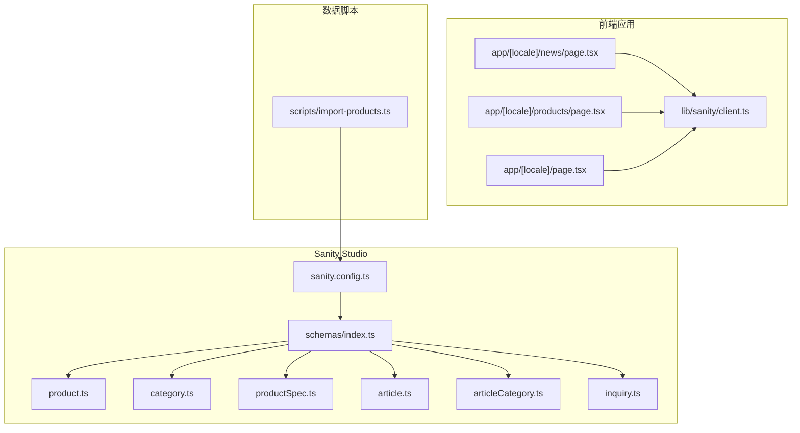
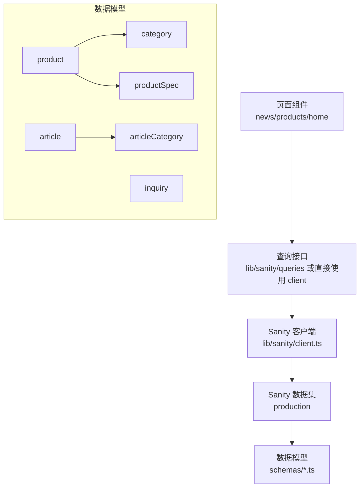
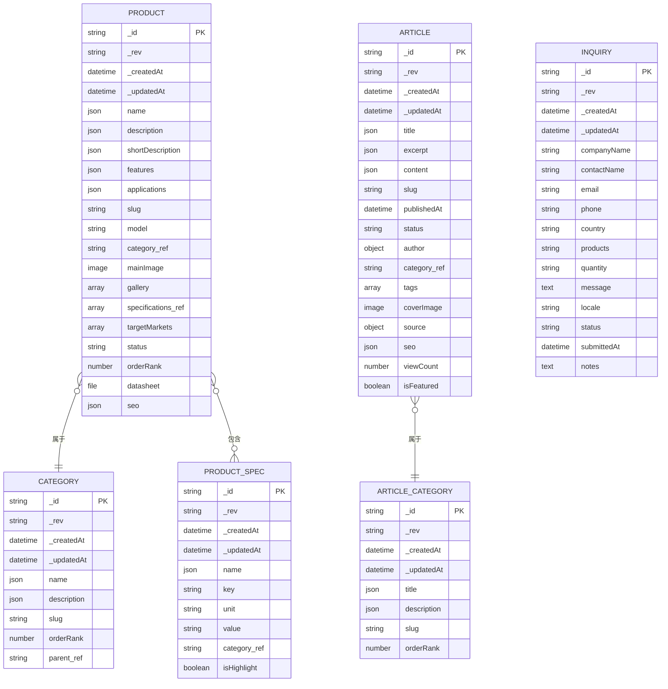
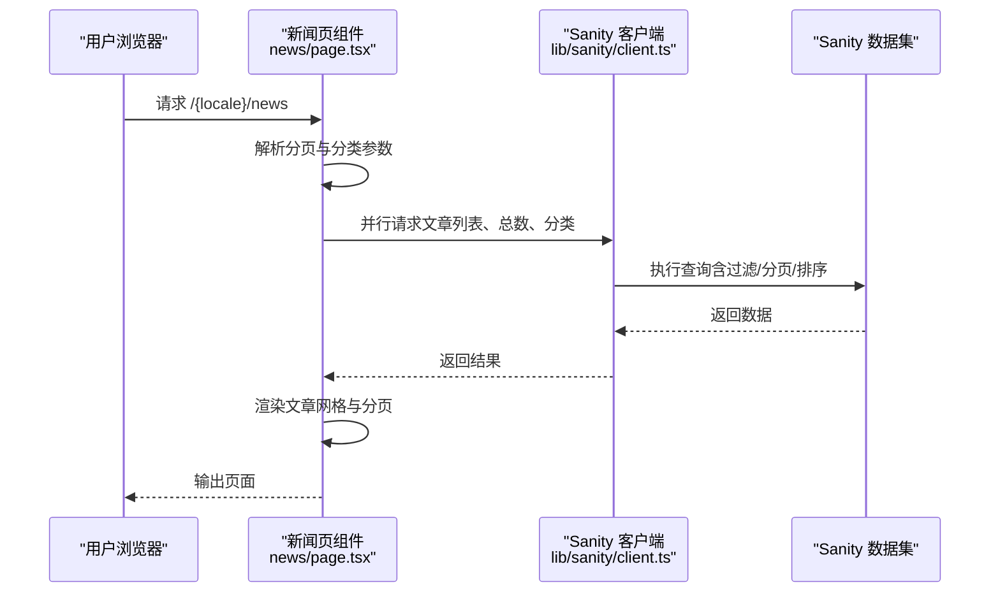
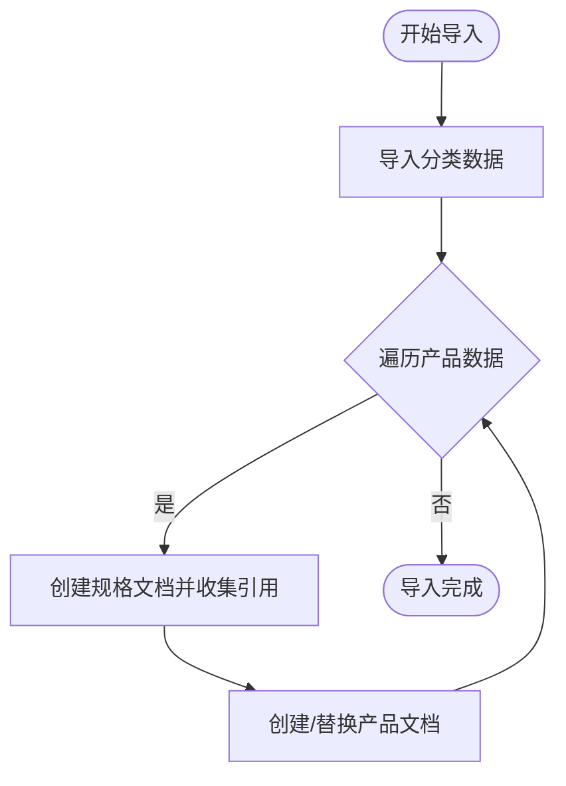
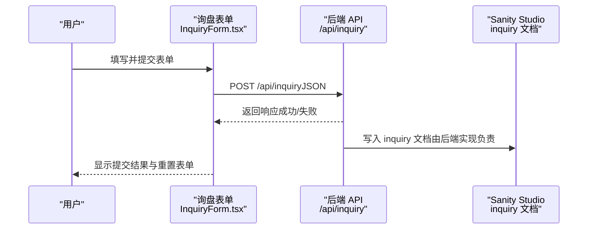
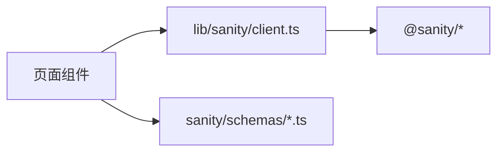

# 数据架构

<cite>
**本文引用的文件**
- [sanity.config.ts](file://sanity/sanity.config.ts)
- [schemas/index.ts](file://sanity/schemas/index.ts)
- [product.ts](file://sanity/schemas/product.ts)
- [category.ts](file://sanity/schemas/category.ts)
- [productSpec.ts](file://sanity/schemas/productSpec.ts)
- [article.ts](file://sanity/schemas/article.ts)
- [articleCategory.ts](file://sanity/schemas/articleCategory.ts)
- [inquiry.ts](file://sanity/schemas/inquiry.ts)
- [client.ts](file://lib/sanity/client.ts)
- [import-products.ts](file://scripts/import-products.ts)
- [InquiryForm.tsx](file://components/forms/InquiryForm.tsx)
- [news/page.tsx](file://app/[locale]/news/page.tsx)
- [products/page.tsx](file://app/[locale]/products/page.tsx)
- [page.tsx](file://app/[locale]/page.tsx)
</cite>

## 目录
1. [简介](#简介)
2. [项目结构](#项目结构)
3. [核心组件](#核心组件)
4. [架构总览](#架构总览)
5. [详细组件分析](#详细组件分析)
6. [依赖分析](#依赖分析)
7. [性能考量](#性能考量)
8. [故障排查指南](#故障排查指南)
9. [结论](#结论)
10. [附录](#附录)

## 简介
本文件面向 GoPro Trade 网站的数据架构，系统化梳理 Sanity CMS 的数据模型设计与查询使用模式，覆盖产品、分类、文章、询盘等核心实体及其关系；总结数据查询优化策略（基于 Next.js ISR 与静态生成）、数据同步机制（导入脚本与内容发布流程）、数据安全与备份恢复建议，并提供数据架构图与实体关系图，帮助开发者与运营人员理解数据流向与存储策略。

## 项目结构
- Sanity Studio 配置集中于根配置文件，定义项目 ID、数据集、插件与本地化。
- 数据模型位于 sanity/schemas 目录，按领域拆分：产品、分类、规格、文章、文章分类、询盘。
- 前端应用通过 lib/sanity/client 提供的客户端访问 Sanity 数据，页面组件使用 ISR 与静态生成策略。
- 脚本目录提供数据导入工具，支撑初始数据与增量同步。

**图表来源**
- [sanity.config.ts:1-33](file://sanity/sanity.config.ts#L1-L33)
- [schemas/index.ts:1-9](file://sanity/schemas/index.ts#L1-L9)
- [product.ts:1-233](file://sanity/schemas/product.ts#L1-L233)
- [category.ts:1-74](file://sanity/schemas/category.ts#L1-L74)
- [productSpec.ts:1-58](file://sanity/schemas/productSpec.ts#L1-L58)
- [article.ts:1-265](file://sanity/schemas/article.ts#L1-L265)
- [articleCategory.ts:1-59](file://sanity/schemas/articleCategory.ts#L1-L59)
- [inquiry.ts:1-134](file://sanity/schemas/inquiry.ts#L1-L134)
- [client.ts:1-30](file://lib/sanity/client.ts#L1-L30)
- [news/page.tsx:1-279](file://app/[locale]/news/page.tsx#L1-L279)
- [products/page.tsx:1-295](file://app/[locale]/products/page.tsx#L1-L295)
- [page.tsx:1-334](file://app/[locale]/page.tsx#L1-L334)
- [import-products.ts:1-161](file://scripts/import-products.ts#L1-L161)

**章节来源**
- [sanity.config.ts:1-33](file://sanity/sanity.config.ts#L1-L33)
- [schemas/index.ts:1-9](file://sanity/schemas/index.ts#L1-L9)

## 核心组件
- 产品（product）
  - 多语言字段：名称、描述、简述、特性、应用场景、SEO 标题与描述
  - 关联：分类（参考）、规格参数（数组引用）
  - 图片：主图、图集
  - 其他：型号、状态、排序权重、数据手册
- 产品分类（category）
  - 多语言名称、描述、URL 标识
  - 层级：父子关系（自引用）
  - 排序权重
- 产品规格（productSpec）
  - 参数键名、单位、取值、所属分类、高亮显示
- 文章（article）
  - 多语言标题、摘要、正文、封面图
  - 分类（文章分类）、标签、作者、发布时间、状态、来源（自动化）、SEO
  - 阅读统计、推荐位
- 文章分类（articleCategory）
  - 多语言标题、描述、URL 标识、排序权重
- 询盘（inquiry）
  - 公司、联系人、邮箱、电话、国家/地区、感兴趣产品、数量、需求详情、语言、状态、提交时间、备注

**章节来源**
- [product.ts:1-233](file://sanity/schemas/product.ts#L1-L233)
- [category.ts:1-74](file://sanity/schemas/category.ts#L1-L74)
- [productSpec.ts:1-58](file://sanity/schemas/productSpec.ts#L1-L58)
- [article.ts:1-265](file://sanity/schemas/article.ts#L1-L265)
- [articleCategory.ts:1-59](file://sanity/schemas/articleCategory.ts#L1-L59)
- [inquiry.ts:1-134](file://sanity/schemas/inquiry.ts#L1-L134)

## 架构总览
- 数据模型层：Sanity Schemas 定义实体与字段约束、多语言对象、引用关系与预览配置。
- 访问层：lib/sanity/client 提供 Sanity 客户端与图像 URL 构建器，统一 API 版本与 CDN 策略。
- 应用层：Next.js 页面组件通过 ISR 与静态生成拉取数据，实现高性能与可预测的缓存。
- 同步层：scripts/import-products.ts 作为一次性或周期性导入工具，支持分类与产品及规格的创建/替换。

**图表来源**
- [client.ts:1-30](file://lib/sanity/client.ts#L1-L30)
- [product.ts:1-233](file://sanity/schemas/product.ts#L1-L233)
- [category.ts:1-74](file://sanity/schemas/category.ts#L1-L74)
- [productSpec.ts:1-58](file://sanity/schemas/productSpec.ts#L1-L58)
- [article.ts:1-265](file://sanity/schemas/article.ts#L1-L265)
- [articleCategory.ts:1-59](file://sanity/schemas/articleCategory.ts#L1-L59)
- [inquiry.ts:1-134](file://sanity/schemas/inquiry.ts#L1-L134)

## 详细组件分析

### 实体关系图（ER）

**图表来源**
- [category.ts:1-74](file://sanity/schemas/category.ts#L1-L74)
- [productSpec.ts:1-58](file://sanity/schemas/productSpec.ts#L1-L58)
- [product.ts:1-233](file://sanity/schemas/product.ts#L1-L233)
- [articleCategory.ts:1-59](file://sanity/schemas/articleCategory.ts#L1-L59)
- [article.ts:1-265](file://sanity/schemas/article.ts#L1-L265)
- [inquiry.ts:1-134](file://sanity/schemas/inquiry.ts#L1-L134)

### 数据查询与使用模式
- 新闻页（文章列表）
  - 使用 ISR revalidate 配置，按语言与分页参数拉取文章、总数与分类，结合封面图 URL 构建器渲染。
  - 查询涉及：文章集合、总数统计、文章分类集合。
- 产品页（产品列表）
  - 使用 ISR revalidate 配置，拉取产品集合与分类树，渲染面包屑、侧边栏与产品网格。
  - 查询涉及：产品集合、分类树。
- 首页
  - 通过 slug 列表获取精选产品，配合结构化数据输出提升 SEO。
  - 查询涉及：按 slug 列表查询产品集合。

**图表来源**
- [news/page.tsx:100-104](file://app/[locale]/news/page.tsx#L100-L104)
- [client.ts:1-30](file://lib/sanity/client.ts#L1-L30)

**章节来源**
- [news/page.tsx:1-279](file://app/[locale]/news/page.tsx#L1-L279)
- [products/page.tsx:1-295](file://app/[locale]/products/page.tsx#L1-L295)
- [page.tsx:1-334](file://app/[locale]/page.tsx#L1-L334)
- [client.ts:1-30](file://lib/sanity/client.ts#L1-L30)

### 数据同步机制与导入流程
- 导入脚本职责
  - 导入产品分类：创建或替换分类文档，记录引用映射。
  - 导入产品与规格：为每个产品创建规格文档并建立引用，再创建或替换产品文档。
  - SEO 字段默认填充：基于产品名称与简述生成 meta 标题与描述、关键词。
- 同步策略
  - 单次执行：适合初始化或修复性导入。
  - 周期性任务：可结合调度器定期运行，保持与源系统的数据一致。

**图表来源**
- [import-products.ts:64-158](file://scripts/import-products.ts#L64-L158)

**章节来源**
- [import-products.ts:1-161](file://scripts/import-products.ts#L1-L161)

### 询盘表单到后端 API
- 前端表单组件收集客户信息，提交到 /api/inquiry，触发后端逻辑（未在本仓库中提供具体实现，但表单明确发起请求）。
- 表单字段覆盖公司、联系人、邮箱、电话、国家、感兴趣产品、数量、需求详情、语言、状态等。

**图表来源**
- [InquiryForm.tsx:73-117](file://components/forms/InquiryForm.tsx#L73-L117)

**章节来源**
- [InquiryForm.tsx:1-298](file://components/forms/InquiryForm.tsx#L1-L298)

## 依赖分析
- 组件耦合
  - 页面组件依赖 lib/sanity/client 提供的客户端与图像 URL 构建器。
  - 产品与文章页面分别依赖各自的数据查询入口（或直接使用 client）。
- 外部依赖
  - Sanity SDK：@sanity/client、@sanity/image-url
  - Next.js：ISR、静态生成、路由参数解析
- 可能的循环依赖
  - 当前结构以 schemas 为中心，页面与客户端分别依赖 schemas，未见循环引用迹象。

**图表来源**
- [client.ts:1-30](file://lib/sanity/client.ts#L1-L30)
- [schemas/index.ts:1-9](file://sanity/schemas/index.ts#L1-L9)

**章节来源**
- [client.ts:1-30](file://lib/sanity/client.ts#L1-L30)
- [schemas/index.ts:1-9](file://sanity/schemas/index.ts#L1-L9)

## 性能考量
- 缓存与重建策略
  - ISR：新闻页与产品页均设置 revalidate，降低实时查询压力，提升冷启动性能。
  - 静态生成：首页与产品页在构建时生成静态 HTML，减少运行时负载。
- 图像优化
  - 使用 urlForImage 构建缩略图 URL，结合 Next.js Image 的 sizes 与 lazy 加载策略，提升首屏性能。
- 查询优化
  - 采用并行请求（Promise.all）减少往返时间。
  - 在页面内进行本地多语言回退与裁剪，避免重复远程查询。
- CDN 与 API 版本
  - 客户端固定 API 版本，避免因版本漂移导致的性能波动。

**章节来源**
- [news/page.tsx:48](file://app/[locale]/news/page.tsx#L48)
- [products/page.tsx:27](file://app/[locale]/products/page.tsx#L27)
- [page.tsx:150](file://app/[locale]/page.tsx#L150)
- [client.ts:1-30](file://lib/sanity/client.ts#L1-L30)

## 故障排查指南
- 常见问题定位
  - 数据缺失：检查导入脚本是否成功创建分类与产品文档，确认引用键与 slug 是否匹配。
  - 图片为空：确认封面图/主图字段存在且 URL 构建正常，检查 urlForImage 的输入。
  - 语言回退：当当前语言字段为空时，页面组件会回退到默认语言或英文，确认多语言对象结构。
- 日志与错误
  - 导入脚本在创建失败时打印错误日志，便于定位具体条目。
  - 前端在提交失败时显示错误状态，便于用户反馈与重试。

**章节来源**
- [import-products.ts:87-94](file://scripts/import-products.ts#L87-L94)
- [import-products.ts:149-155](file://scripts/import-products.ts#L149-L155)
- [news/page.tsx:194-197](file://app/[locale]/news/page.tsx#L194-L197)
- [InquiryForm.tsx:108-114](file://components/forms/InquiryForm.tsx#L108-L114)

## 结论
本数据架构以 Sanity 为核心，围绕产品、分类、规格、文章、文章分类与询盘六大实体构建，通过 Next.js ISR 与静态生成实现高效的数据呈现。导入脚本承担初始与增量同步职责，前端通过统一客户端访问数据并进行本地化渲染。建议在现有基础上完善后端 API 对询盘的持久化与通知流程，并持续优化查询与缓存策略以应对流量增长。

## 附录
- 数据模型速览
  - 产品：多语言名称/描述/特性/应用场景；分类引用；规格数组；图片与文件；SEO；状态与排序权重
  - 分类：多语言名称/描述；URL 标识；层级父子；排序权重
  - 规格：参数键名/单位/取值；所属分类；高亮
  - 文章：多语言标题/摘要/正文；分类引用；标签；作者；发布时间/状态；来源；SEO；阅读统计；推荐
  - 文章分类：多语言标题/描述；URL 标识；排序权重
  - 询盘：公司/联系人/邮箱/电话/国家；感兴趣产品/数量/需求；语言/状态；提交时间/备注