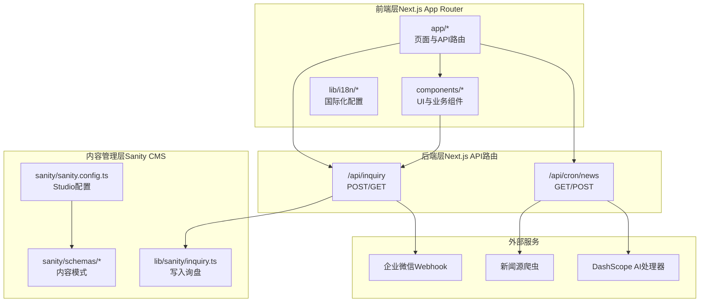
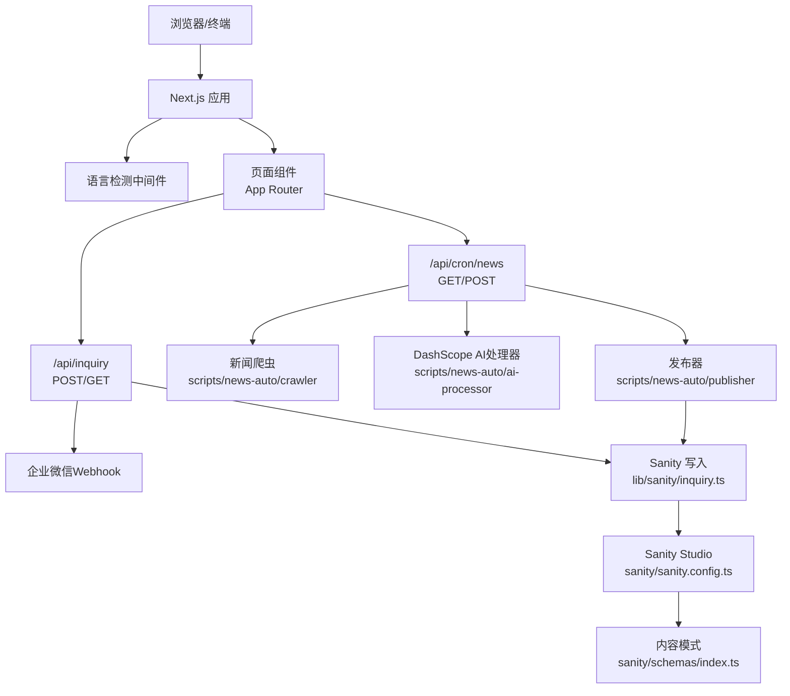
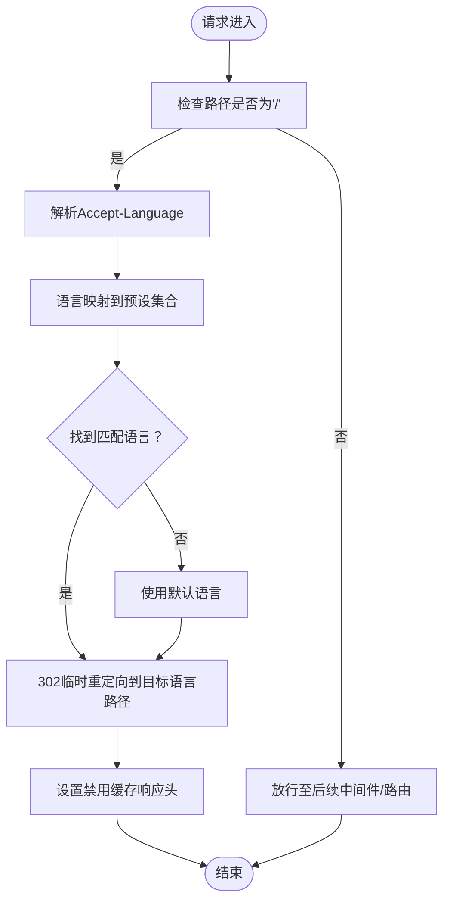
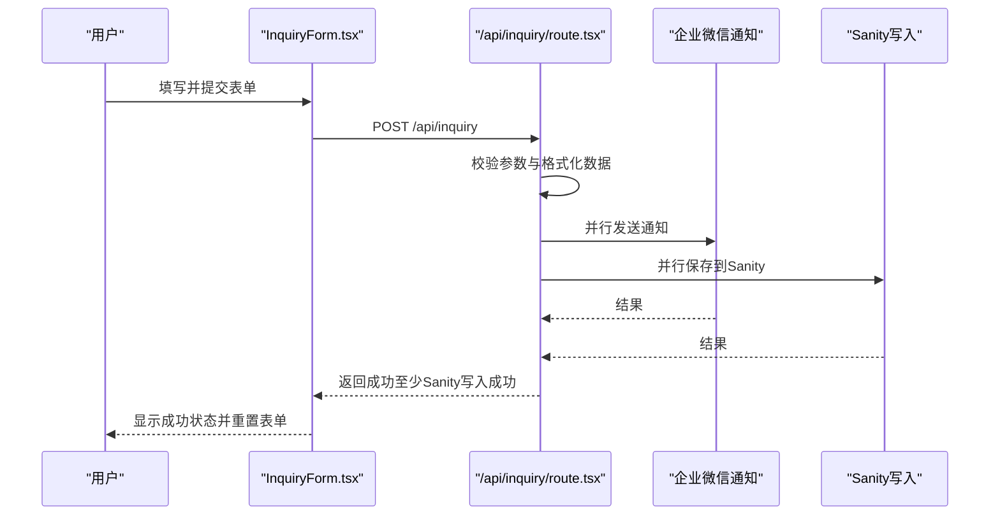
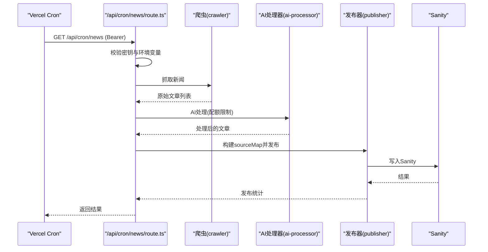
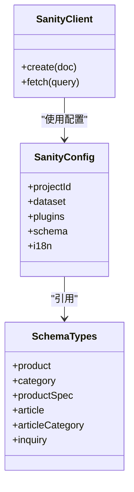
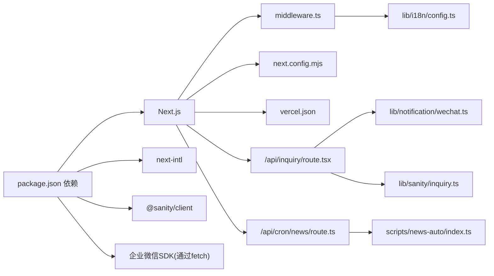

# 系统架构

<cite>
**本文引用的文件**
- [package.json](file://package.json)
- [next.config.mjs](file://next.config.mjs)
- [middleware.ts](file://middleware.ts)
- [vercel.json](file://vercel.json)
- [app/layout.tsx](file://app/layout.tsx)
- [lib/i18n/config.ts](file://lib/i18n/config.ts)
- [app/api/inquiry/route.tsx](file://app/api/inquiry/route.tsx)
- [app/api/cron/news/route.ts](file://app/api/cron/news/route.ts)
- [components/forms/InquiryForm.tsx](file://components/forms/InquiryForm.tsx)
- [lib/sanity/inquiry.ts](file://lib/sanity/inquiry.ts)
- [lib/notification/wechat.ts](file://lib/notification/wechat.ts)
- [sanity/sanity.config.ts](file://sanity/sanity.config.ts)
- [sanity/schemas/index.ts](file://sanity/schemas/index.ts)
- [scripts/news-auto/index.ts](file://scripts/news-auto/index.ts)
</cite>

## 目录
1. [引言](#引言)
2. [项目结构](#项目结构)
3. [核心组件](#核心组件)
4. [架构总览](#架构总览)
5. [详细组件分析](#详细组件分析)
6. [依赖关系分析](#依赖关系分析)
7. [性能考量](#性能考量)
8. [故障排查指南](#故障排查指南)
9. [结论](#结论)
10. [附录](#附录)

## 引言
本系统为 GoPro Trade 网站，采用三层架构设计：
- 前端层：基于 Next.js App Router 的同构应用，提供多语言与国际化支持。
- 后端层：Next.js API 路由，承载业务逻辑与外部服务集成。
- 内容管理层：Sanity CMS，提供可视化内容编辑与数据存储。

技术选型与设计要点：
- 选择 Next.js App Router：统一路由与数据获取，支持增量静态再生（ISR）与服务端渲染（SSR），兼顾性能与SEO。
- 选择 Sanity CMS：结构化内容模型、可视化编辑、版本控制与多语言支持，满足外贸网站对内容灵活性的需求。
- 国际化方案：结合 next-intl 与自定义语言检测中间件，实现浏览器语言自动跳转与静态路径多语言布局。
- 微服务化 API 路由：将不同职责拆分为独立 API 路由（询盘、定时任务、站点地图等），便于扩展与维护。
- 缓存与性能：通过 Next.js 图片优化、响应头缓存策略、CDN 与压缩等手段，提升首屏性能与稳定性。

## 项目结构
系统采用按功能与层次划分的目录组织方式：
- app：Next.js 应用入口与页面路由，包含多语言子路径与 API 路由。
- components：可复用 UI 组件与业务组件（如询盘表单）。
- lib：通用工具库，包括国际化配置、Sanity 客户端封装、通知服务等。
- sanity：Sanity Studio 配置与内容模式定义。
- scripts：后台自动化脚本（新闻采集、AI 处理、发布与定时调度）。
- 根级配置：Next.js、Vercel、ESLint、TailwindCSS 等构建与部署配置。

图表来源
- [app/layout.tsx:1-19](file://app/layout.tsx#L1-L19)
- [lib/i18n/config.ts:1-16](file://lib/i18n/config.ts#L1-L16)
- [app/api/inquiry/route.tsx:1-103](file://app/api/inquiry/route.tsx#L1-L103)
- [app/api/cron/news/route.ts:1-52](file://app/api/cron/news/route.ts#L1-L52)
- [lib/sanity/inquiry.ts:1-73](file://lib/sanity/inquiry.ts#L1-L73)
- [sanity/sanity.config.ts:1-33](file://sanity/sanity.config.ts#L1-L33)
- [sanity/schemas/index.ts:1-9](file://sanity/schemas/index.ts#L1-L9)
- [scripts/news-auto/index.ts:1-83](file://scripts/news-auto/index.ts#L1-L83)

章节来源
- [package.json:1-45](file://package.json#L1-L45)
- [next.config.mjs:1-65](file://next.config.mjs#L1-L65)
- [middleware.ts:1-68](file://middleware.ts#L1-L68)
- [vercel.json:1-44](file://vercel.json#L1-L44)
- [app/layout.tsx:1-19](file://app/layout.tsx#L1-L19)
- [lib/i18n/config.ts:1-16](file://lib/i18n/config.ts#L1-L16)

## 核心组件
- 国际化与语言检测：通过自定义中间件读取浏览器 Accept-Language，匹配预设语言集合并进行 302 临时重定向，同时设置严格的缓存头以避免缓存污染。
- 询盘表单与处理：前端表单收集客户信息并通过 /api/inquiry 提交；后端并行调用企业微信通知与 Sanity 保存，保证数据持久化成功即返回成功。
- 新闻自动化：通过 /api/cron/news 触发，配合 Vercel Cron 定时执行，完成抓取、AI 处理与发布到 Sanity 的闭环。
- Sanity 集成：Sanity Studio 配置支持中英文界面；内容模式定义产品、文章、询盘等类型；客户端封装写入逻辑。
- 构建与部署：Next.js 配置启用图片格式优化、压缩与安全响应头；Vercel 配置框架、重写与定时任务。

章节来源
- [middleware.ts:1-68](file://middleware.ts#L1-L68)
- [components/forms/InquiryForm.tsx:1-298](file://components/forms/InquiryForm.tsx#L1-L298)
- [app/api/inquiry/route.tsx:1-103](file://app/api/inquiry/route.tsx#L1-L103)
- [app/api/cron/news/route.ts:1-52](file://app/api/cron/news/route.ts#L1-L52)
- [sanity/sanity.config.ts:1-33](file://sanity/sanity.config.ts#L1-L33)
- [sanity/schemas/index.ts:1-9](file://sanity/schemas/index.ts#L1-L9)
- [lib/sanity/inquiry.ts:1-73](file://lib/sanity/inquiry.ts#L1-L73)
- [lib/notification/wechat.ts:1-96](file://lib/notification/wechat.ts#L1-L96)
- [next.config.mjs:1-65](file://next.config.mjs#L1-L65)
- [vercel.json:1-44](file://vercel.json#L1-L44)

## 架构总览
系统边界与组件交互如下：

图表来源
- [middleware.ts:1-68](file://middleware.ts#L1-L68)
- [app/api/inquiry/route.tsx:1-103](file://app/api/inquiry/route.tsx#L1-L103)
- [app/api/cron/news/route.ts:1-52](file://app/api/cron/news/route.ts#L1-L52)
- [lib/sanity/inquiry.ts:1-73](file://lib/sanity/inquiry.ts#L1-L73)
- [lib/notification/wechat.ts:1-96](file://lib/notification/wechat.ts#L1-L96)
- [sanity/sanity.config.ts:1-33](file://sanity/sanity.config.ts#L1-L33)
- [sanity/schemas/index.ts:1-9](file://sanity/schemas/index.ts#L1-L9)
- [scripts/news-auto/index.ts:1-83](file://scripts/news-auto/index.ts#L1-L83)

## 详细组件分析

### 组件一：国际化与语言检测中间件
- 功能概述：解析浏览器语言偏好，映射到预设语言集合，对根路径进行 302 临时重定向，并设置严格缓存头。
- 关键点：
  - 语言映射表支持简繁中文与东南亚语种前缀归一。
  - 仅对根路径 '/' 匹配，避免影响已带语言前缀的路由。
  - 设置 Cache-Control、Pragma、Expires 禁止缓存，确保语言检测准确性。

图表来源
- [middleware.ts:1-68](file://middleware.ts#L1-L68)
- [lib/i18n/config.ts:1-16](file://lib/i18n/config.ts#L1-L16)

章节来源
- [middleware.ts:1-68](file://middleware.ts#L1-L68)
- [lib/i18n/config.ts:1-16](file://lib/i18n/config.ts#L1-L16)

### 组件二：询盘表单与处理流程
- 前端表单：收集公司名、联系人、邮箱、电话、国家、产品意向、数量、备注等；支持多语言文案与GA4转化追踪。
- 后端 API：校验必填字段，格式化产品与国家名称，使用 Promise.all 并行发送企业微信通知与保存到 Sanity。
- 错误处理：即使通知失败，只要数据写入 Sanity 成功即返回成功，保证数据可靠性。

图表来源
- [components/forms/InquiryForm.tsx:1-298](file://components/forms/InquiryForm.tsx#L1-L298)
- [app/api/inquiry/route.tsx:1-103](file://app/api/inquiry/route.tsx#L1-L103)
- [lib/notification/wechat.ts:1-96](file://lib/notification/wechat.ts#L1-L96)
- [lib/sanity/inquiry.ts:1-73](file://lib/sanity/inquiry.ts#L1-L73)

章节来源
- [components/forms/InquiryForm.tsx:1-298](file://components/forms/InquiryForm.tsx#L1-L298)
- [app/api/inquiry/route.tsx:1-103](file://app/api/inquiry/route.tsx#L1-L103)
- [lib/notification/wechat.ts:1-96](file://lib/notification/wechat.ts#L1-L96)
- [lib/sanity/inquiry.ts:1-73](file://lib/sanity/inquiry.ts#L1-L73)

### 组件三：新闻自动化与定时发布
- 触发方式：Vercel Cron 定时任务调用 /api/cron/news，支持 Authorization Bearer 校验。
- 自动化流程：检查发布配额与时间窗口 → 抓取新闻 → AI 处理 → 构建 sourceMap → 发布到 Sanity。
- 安全与可观测性：环境变量校验、错误捕获与日志输出，失败时返回 500 并保留错误信息。

图表来源
- [app/api/cron/news/route.ts:1-52](file://app/api/cron/news/route.ts#L1-L52)
- [scripts/news-auto/index.ts:1-83](file://scripts/news-auto/index.ts#L1-L83)

章节来源
- [app/api/cron/news/route.ts:1-52](file://app/api/cron/news/route.ts#L1-L52)
- [scripts/news-auto/index.ts:1-83](file://scripts/news-auto/index.ts#L1-L83)

### 组件四：Sanity CMS 集成
- Studio 配置：定义项目 ID、数据集、插件（Desk Tool、Vision）、Schema 类型与多语言界面。
- 内容模式：产品、分类、规格、文章、文章分类、询盘等类型。
- 客户端封装：创建 Sanity 客户端，关闭 CDN，写入询盘文档并记录状态与时间戳。

图表来源
- [sanity/sanity.config.ts:1-33](file://sanity/sanity.config.ts#L1-L33)
- [sanity/schemas/index.ts:1-9](file://sanity/schemas/index.ts#L1-L9)
- [lib/sanity/inquiry.ts:1-73](file://lib/sanity/inquiry.ts#L1-L73)

章节来源
- [sanity/sanity.config.ts:1-33](file://sanity/sanity.config.ts#L1-L33)
- [sanity/schemas/index.ts:1-9](file://sanity/schemas/index.ts#L1-L9)
- [lib/sanity/inquiry.ts:1-73](file://lib/sanity/inquiry.ts#L1-L73)

## 依赖关系分析
- 前端依赖：Next.js、next-intl、@sanity/client、@sanity/image-url、react、tailwindcss 等。
- 构建与部署：Next.js 配置图片优化、压缩、安全响应头；Vercel 配置框架、重写与定时任务。
- 中间件与国际化：自定义中间件负责语言检测与重定向，国际化配置定义语言集合与 RTL 语言。
- API 依赖：/api/inquiry 依赖企业微信 Webhook 与 Sanity 写入；/api/cron/news 依赖爬虫、AI 处理与发布器。

图表来源
- [package.json:1-45](file://package.json#L1-L45)
- [next.config.mjs:1-65](file://next.config.mjs#L1-L65)
- [middleware.ts:1-68](file://middleware.ts#L1-L68)
- [lib/i18n/config.ts:1-16](file://lib/i18n/config.ts#L1-L16)
- [app/api/inquiry/route.tsx:1-103](file://app/api/inquiry/route.tsx#L1-L103)
- [app/api/cron/news/route.ts:1-52](file://app/api/cron/news/route.ts#L1-L52)
- [lib/notification/wechat.ts:1-96](file://lib/notification/wechat.ts#L1-L96)
- [lib/sanity/inquiry.ts:1-73](file://lib/sanity/inquiry.ts#L1-L73)
- [scripts/news-auto/index.ts:1-83](file://scripts/news-auto/index.ts#L1-L83)

章节来源
- [package.json:1-45](file://package.json#L1-L45)
- [next.config.mjs:1-65](file://next.config.mjs#L1-L65)
- [middleware.ts:1-68](file://middleware.ts#L1-L68)
- [lib/i18n/config.ts:1-16](file://lib/i18n/config.ts#L1-L16)
- [app/api/inquiry/route.tsx:1-103](file://app/api/inquiry/route.tsx#L1-L103)
- [app/api/cron/news/route.ts:1-52](file://app/api/cron/news/route.ts#L1-L52)
- [lib/notification/wechat.ts:1-96](file://lib/notification/wechat.ts#L1-L96)
- [lib/sanity/inquiry.ts:1-73](file://lib/sanity/inquiry.ts#L1-L73)
- [scripts/news-auto/index.ts:1-83](file://scripts/news-auto/index.ts#L1-L83)

## 性能考量
- 图片优化：Next.js 配置支持 AVIF/WebP 现代格式、设备尺寸与懒加载缓存，提升 LCP 指标。
- 压缩与安全头：启用 gzip 压缩，设置安全响应头（X-Content-Type-Options、X-Frame-Options、Referrer-Policy）。
- 缓存策略：静态资源长期缓存（immutable），字体文件长期缓存；语言检测重定向禁用缓存。
- 依赖优化：实验性优化导入，减少包体积与打包时间。
- SSR/ISR：App Router 支持 SSR 与 ISR，结合 Vercel 边缘网络加速静态资源与动态内容生成。

章节来源
- [next.config.mjs:1-65](file://next.config.mjs#L1-L65)
- [vercel.json:1-44](file://vercel.json#L1-L44)

## 故障排查指南
- 询盘提交失败：
  - 检查 /api/inquiry 的必填字段校验与请求体格式。
  - 查看企业微信 Webhook 返回状态与错误码，确认 WECHAT_WEBHOOK_URL 配置。
  - 确认 SANITY_API_TOKEN 已配置，Sanity 写入日志与返回值。
- 新闻自动化失败：
  - 检查 /api/cron/news 的 Authorization Bearer 密钥与 CRON_SECRET。
  - 确认 DASHSCOPE_API_KEY 已配置，查看爬虫与 AI 处理日志。
  - 关注定时任务调度与配额限制逻辑。
- 语言检测异常：
  - 检查 Accept-Language 请求头与中间件映射表，确认仅对根路径生效。
  - 清除浏览器缓存或禁用缓存的响应头是否正确设置。

章节来源
- [app/api/inquiry/route.tsx:1-103](file://app/api/inquiry/route.tsx#L1-L103)
- [lib/notification/wechat.ts:1-96](file://lib/notification/wechat.ts#L1-L96)
- [lib/sanity/inquiry.ts:1-73](file://lib/sanity/inquiry.ts#L1-L73)
- [app/api/cron/news/route.ts:1-52](file://app/api/cron/news/route.ts#L1-L52)
- [middleware.ts:1-68](file://middleware.ts#L1-L68)

## 结论
本系统通过 Next.js App Router 实现高性能的前端体验，借助 API 路由整合企业微信通知与 Sanity 内容管理，形成清晰的三层架构。国际化与语言检测中间件保障用户体验，Vercel 部署与 Next.js 配置提供稳定的性能与安全性。新闻自动化脚本与定时任务进一步增强内容生产效率。建议持续监控 API 健康度与内容发布质量，逐步引入增量静态再生（ISR）与边缘缓存策略以进一步优化性能。

## 附录
- 数据流概览（从用户请求到组件渲染、从组件到 Sanity 查询、从 API 到外部服务）：
  - 用户请求进入 Next.js，中间件根据语言偏好重定向；页面组件渲染并发起 API 请求。
  - API 路由并行调用外部服务与写入 Sanity；前端接收成功响应并更新 UI。
  - Sanity Studio 提供可视化编辑与版本管理，支撑内容生命周期。

[本节为概念性总结，不直接分析具体文件，故不附加章节来源]