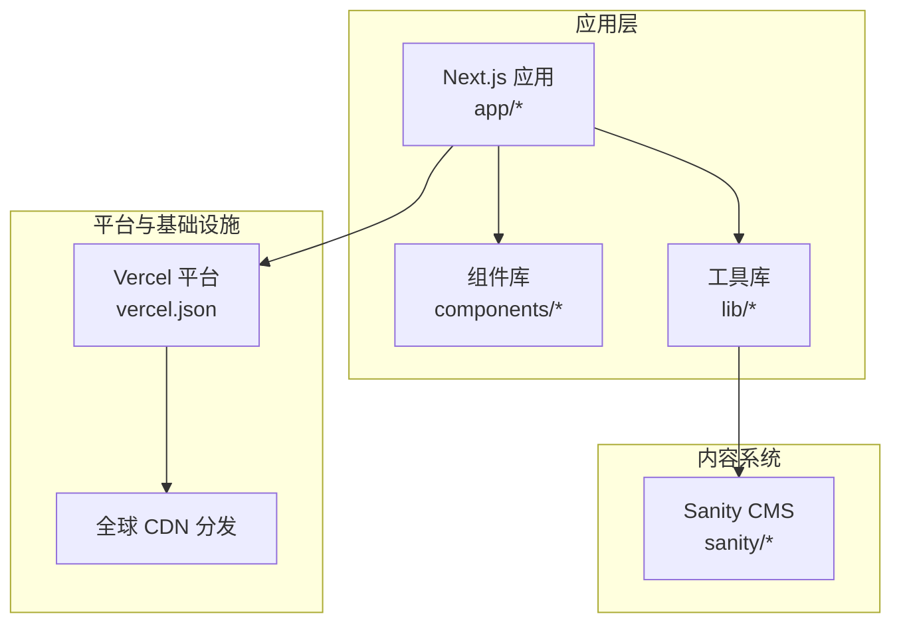
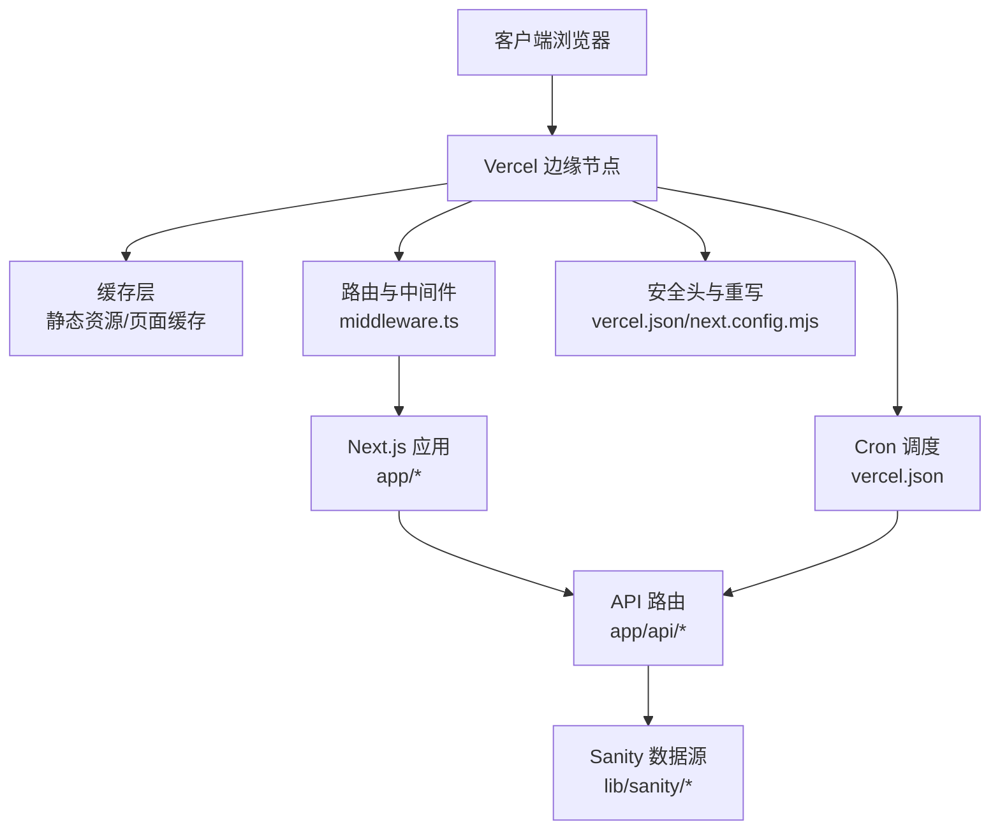
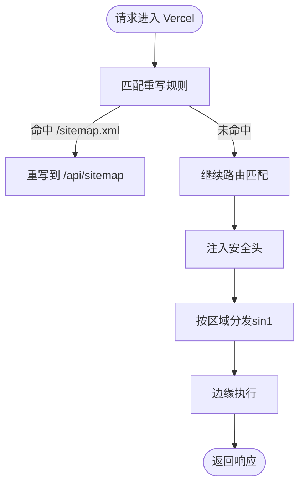
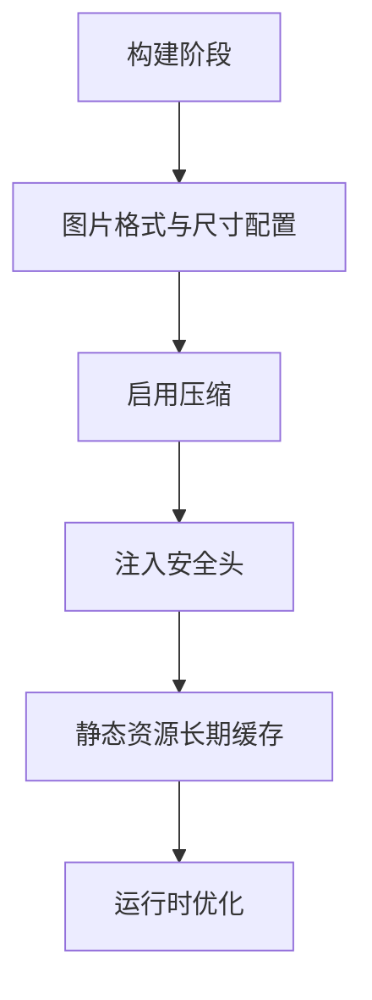
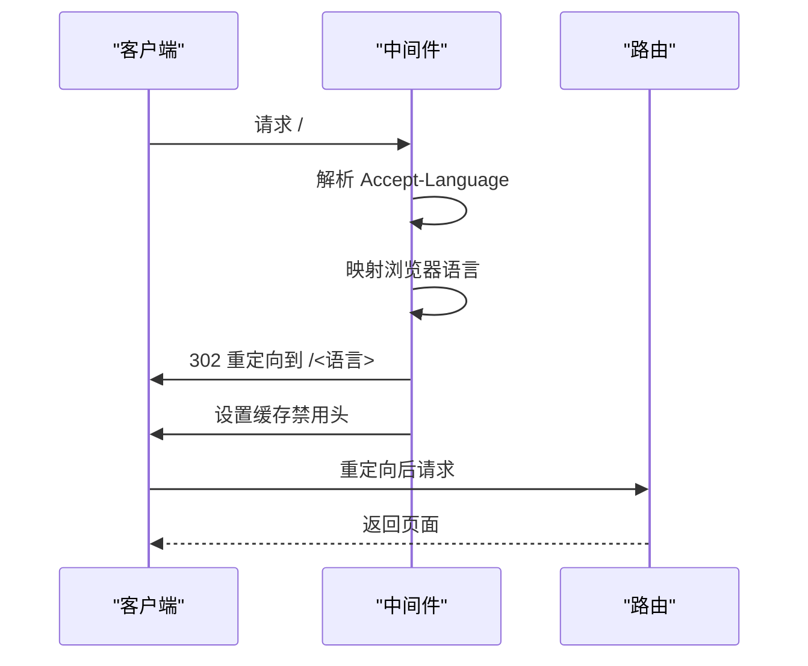
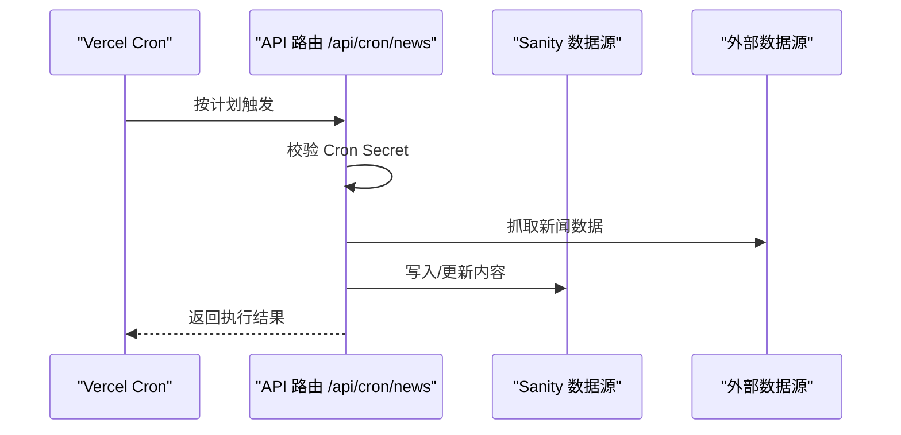
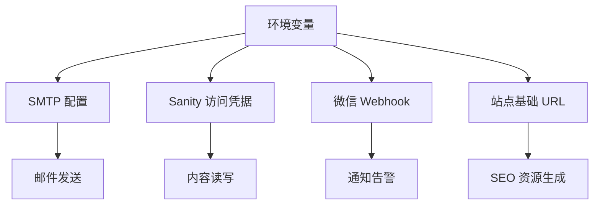
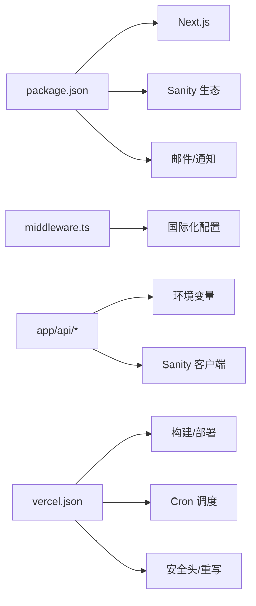

# 部署架构

<cite>
**本文引用的文件**
- [vercel.json](file://vercel.json)
- [next.config.mjs](file://next.config.mjs)
- [package.json](file://package.json)
- [middleware.ts](file://middleware.ts)
- [sanity.config.ts](file://sanity/sanity.config.ts)
- [app/layout.tsx](file://app/layout.tsx)
- [app/api/cron/news/route.ts](file://app/api/cron/news/route.ts)
- [app/api/sitemap/route.ts](file://app/api/sitemap/route.ts)
- [lib/email/smtp-mail.ts](file://lib/email/smtp-mail.ts)
- [lib/sanity/client.ts](file://lib/sanity/client.ts)
- [lib/sanity/inquiry.ts](file://lib/sanity/inquiry.ts)
- [lib/notification/wechat.ts](file://lib/notification/wechat.ts)
- [app/robots.ts](file://app/robots.ts)
</cite>

## 目录
1. [简介](#简介)
2. [项目结构](#项目结构)
3. [核心组件](#核心组件)
4. [架构总览](#架构总览)
5. [详细组件分析](#详细组件分析)
6. [依赖关系分析](#依赖关系分析)
7. [性能考量](#性能考量)
8. [故障排查指南](#故障排查指南)
9. [结论](#结论)
10. [附录](#附录)

## 简介
本文件面向 GoPro Trade 网站的部署架构与运维实践，聚焦于 Vercel 平台的部署配置、构建优化、环境变量管理与 CDN 加速；阐述增量静态再生（ISR）在本项目中的应用现状与可落地策略；梳理 CI/CD 流程、自动化测试与部署流水线；说明监控告警、日志收集与性能指标监控；并提供部署架构图与流量分发策略，解释高可用性与灾难恢复机制。

## 项目结构
该网站采用 Next.js 应用（app 目录模式），结合 Vercel 平台进行托管与加速。关键目录与职责如下：
- app：页面路由、API 路由、国际化布局与元数据
- components：通用 UI 组件与业务组件
- lib：业务工具库（邮件、通知、Sanity 客户端、国际化等）
- sanity：Sanity 内容管理后台配置与 Schema
- scripts：内容采集与自动发布脚本
- 根级配置：vercel.json（Vercel 部署与构建配置）、next.config.mjs（Next.js 构建与运行时优化）、package.json（依赖与脚本）

**图表来源**
- [vercel.json:1-44](file://vercel.json#L1-L44)
- [next.config.mjs:1-65](file://next.config.mjs#L1-L65)
- [package.json:1-45](file://package.json#L1-L45)

**章节来源**
- [vercel.json:1-44](file://vercel.json#L1-L44)
- [next.config.mjs:1-65](file://next.config.mjs#L1-L65)
- [package.json:1-45](file://package.json#L1-L45)

## 核心组件
- Vercel 部署配置：通过 vercel.json 定义构建命令、开发命令、安装参数、框架类型、地区、安全头、重写规则、Cron 调度等。
- Next.js 运行时优化：通过 next.config.mjs 配置图片格式与尺寸、压缩、安全头、实验性优化、静态资源缓存策略等。
- 国际化与中间件：通过 middleware.ts 实现浏览器语言检测与根路径重定向，避免与动态语言检测冲突。
- 内容系统：Sanity CMS 提供内容管理，通过 lib/sanity 下的客户端与查询封装访问数据。
- API 与定时任务：app/api 下的路由提供服务端功能，如站点地图生成与新闻自动抓取；Cron 在 vercel.json 中定义调度计划。
- 环境变量：多处使用 process.env 访问敏感配置，如 SMTP、Sanity Token、微信 Webhook 等。

**章节来源**
- [vercel.json:1-44](file://vercel.json#L1-L44)
- [next.config.mjs:1-65](file://next.config.mjs#L1-L65)
- [middleware.ts:1-68](file://middleware.ts#L1-L68)
- [sanity.config.ts:1-33](file://sanity/sanity.config.ts#L1-L33)
- [app/api/cron/news/route.ts:1-40](file://app/api/cron/news/route.ts#L1-L40)
- [app/api/sitemap/route.ts:1-40](file://app/api/sitemap/route.ts#L1-L40)
- [lib/email/smtp-mail.ts:1-40](file://lib/email/smtp-mail.ts#L1-L40)
- [lib/sanity/client.ts:1-40](file://lib/sanity/client.ts#L1-L40)
- [lib/sanity/inquiry.ts:1-60](file://lib/sanity/inquiry.ts#L1-L60)
- [lib/notification/wechat.ts:1-40](file://lib/notification/wechat.ts#L1-L40)
- [app/robots.ts:1-10](file://app/robots.ts#L1-L10)

## 架构总览
下图展示 GoPro Trade 在 Vercel 上的部署架构与流量路径，包括构建、缓存、安全头、重写与 Cron 调度。

**图表来源**
- [vercel.json:1-44](file://vercel.json#L1-L44)
- [next.config.mjs:1-65](file://next.config.mjs#L1-L65)
- [middleware.ts:1-68](file://middleware.ts#L1-L68)
- [lib/sanity/client.ts:1-40](file://lib/sanity/client.ts#L1-L40)

## 详细组件分析

### Vercel 部署配置（vercel.json）
- 版本与框架：明确使用 Next.js 框架，指定构建/开发/安装命令。
- 地区选择：限制部署区域为 sin1，便于就近分发与合规。
- 安全头：对所有路径设置安全响应头，增强 XSS、点击劫持防护。
- 重写规则：将 /sitemap.xml 重写至 /api/sitemap，统一由服务端生成。
- Cron 调度：定义两条定时任务，分别在每日 01:00 与 07:00 触发新闻自动抓取。

**图表来源**
- [vercel.json:27-32](file://vercel.json#L27-L32)
- [vercel.json:8-26](file://vercel.json#L8-L26)
- [vercel.json:7](file://vercel.json#L7)

**章节来源**
- [vercel.json:1-44](file://vercel.json#L1-L44)

### Next.js 构建与运行时优化（next.config.mjs）
- 图片优化：启用现代图片格式（AVIF/WebP），配置设备与图片尺寸，设置远程图片域名白名单，提升 LCP 指标。
- 缓存策略：静态资源与字体长期缓存，页面安全头统一注入。
- 压缩与安全：开启 gzip 压缩，隐藏 X-Powered-By 头。
- 实验性优化：优化特定包导入以减少打包体积。
- 自定义 headers：针对不同路径设置 Cache-Control 与安全头。

**图表来源**
- [next.config.mjs:4-17](file://next.config.mjs#L4-L17)
- [next.config.mjs:22-32](file://next.config.mjs#L22-L32)
- [next.config.mjs:34-61](file://next.config.mjs#L34-L61)

**章节来源**
- [next.config.mjs:1-65](file://next.config.mjs#L1-L65)

### 国际化与中间件（middleware.ts）
- 浏览器语言检测：解析 Accept-Language，映射到受支持的语言集合。
- 根路径重定向：仅对根路径进行 302 临时重定向，并设置严格缓存禁用头，避免缓存重定向结果。
- 匹配器：仅对根路径生效，降低中间件开销。

**图表来源**
- [middleware.ts:44-63](file://middleware.ts#L44-L63)

**章节来源**
- [middleware.ts:1-68](file://middleware.ts#L1-L68)

### ISR 部署策略（现状与建议）
- 现状：仓库未见 ISR 相关配置（如 revalidate、generateMetadata 或增量更新逻辑）。页面与 API 路由未显式声明 revalidate。
- 建议：
  - 对内容驱动页面（如产品详情、文章详情）在 getServerSideProps 或动态路由中使用 revalidate 控制缓存刷新周期。
  - 利用 Vercel Cron 触发增量更新任务，避免全量重建。
  - 结合 Vercel Edge 缓存与 CDN，确保热点内容就近缓存与快速失效。
  - 通过 app/router 中间件与 API 路由配合，实现按需失效与预渲染。

**章节来源**
- [app/api/sitemap/route.ts:1-40](file://app/api/sitemap/route.ts#L1-L40)
- [vercel.json:33-42](file://vercel.json#L33-L42)

### API 与定时任务（app/api 与 Cron）
- 站点地图：通过 /api/sitemap 动态生成 sitemap.xml，使用环境变量控制基础 URL。
- 新闻自动抓取：通过 /api/cron/news 接口执行定时任务，使用 Cron Secret 保护访问。
- Cron 调度：在 vercel.json 中定义每日两次的定时任务，触发新闻抓取。

**图表来源**
- [vercel.json:33-42](file://vercel.json#L33-L42)
- [app/api/cron/news/route.ts:1-40](file://app/api/cron/news/route.ts#L1-L40)

**章节来源**
- [vercel.json:33-42](file://vercel.json#L33-L42)
- [app/api/cron/news/route.ts:1-40](file://app/api/cron/news/route.ts#L1-L40)
- [app/api/sitemap/route.ts:1-40](file://app/api/sitemap/route.ts#L1-L40)

### 环境变量管理
- SMTP 邮件：用于发送询盘邮件，配置主机、端口、用户名与密码。
- Sanity 访问：通过 API Token 与项目 ID/Dataset 访问内容数据。
- 微信通知：通过 Webhook URL 发送通知。
- 站点 URL：用于生成 sitemap 与 robots.txt。

**图表来源**
- [lib/email/smtp-mail.ts:1-40](file://lib/email/smtp-mail.ts#L1-L40)
- [lib/sanity/client.ts:1-40](file://lib/sanity/client.ts#L1-L40)
- [lib/sanity/inquiry.ts:1-60](file://lib/sanity/inquiry.ts#L1-L60)
- [lib/notification/wechat.ts:1-40](file://lib/notification/wechat.ts#L1-L40)
- [app/api/sitemap/route.ts:1-40](file://app/api/sitemap/route.ts#L1-L40)
- [app/robots.ts:1-10](file://app/robots.ts#L1-L10)

**章节来源**
- [lib/email/smtp-mail.ts:1-40](file://lib/email/smtp-mail.ts#L1-L40)
- [lib/sanity/client.ts:1-40](file://lib/sanity/client.ts#L1-L40)
- [lib/sanity/inquiry.ts:1-60](file://lib/sanity/inquiry.ts#L1-L60)
- [lib/notification/wechat.ts:1-40](file://lib/notification/wechat.ts#L1-L40)
- [app/api/sitemap/route.ts:1-40](file://app/api/sitemap/route.ts#L1-L40)
- [app/robots.ts:1-10](file://app/robots.ts#L1-L10)

### CI/CD 流程与自动化
- 构建与部署：Vercel 通过 vercel.json 的 buildCommand 自动拉取代码、安装依赖并构建 Next.js 应用。
- 开发与调试：devCommand 与 installCommand 支持本地开发与调试。
- 定时任务：Cron 调度在 Vercel 平台上执行，无需额外 CI 工具链。
- 建议：若引入 GitHub/GitLab，可在合并到主分支后触发 Vercel 部署；同时保留本地 lint 与测试脚本（package.json 中已定义）。

**章节来源**
- [vercel.json:3-6](file://vercel.json#L3-L6)
- [package.json:5-11](file://package.json#L5-L11)

## 依赖关系分析
- 应用依赖 Next.js 与第三方库（Sanity、邮件、RSS 解析等）。
- 中间件依赖国际化配置，影响根路径重定向行为。
- API 路由依赖环境变量与 Sanity 客户端，支撑内容与通知能力。
- Vercel 配置决定构建、缓存、安全与调度策略。

**图表来源**
- [package.json:12-29](file://package.json#L12-L29)
- [middleware.ts:3-4](file://middleware.ts#L3-L4)
- [vercel.json:1-44](file://vercel.json#L1-L44)

**章节来源**
- [package.json:1-45](file://package.json#L1-L45)
- [middleware.ts:1-68](file://middleware.ts#L1-L68)
- [vercel.json:1-44](file://vercel.json#L1-L44)

## 性能考量
- 图片优化：启用现代格式与合理尺寸，提升 LCP 指标。
- 缓存策略：静态资源与字体长期缓存，页面安全头统一注入，减少重复传输。
- 压缩与安全：gzip 压缩与安全头减少攻击面并提升传输效率。
- ISR 与 CDN：建议引入 ISR 与边缘缓存，结合 Vercel Cron 实现增量更新与快速失效。
- 国际化重定向：仅对根路径生效并禁用缓存，避免错误缓存导致的重定向问题。

**章节来源**
- [next.config.mjs:4-17](file://next.config.mjs#L4-L17)
- [next.config.mjs:22-32](file://next.config.mjs#L22-L32)
- [next.config.mjs:34-61](file://next.config.mjs#L34-L61)
- [middleware.ts:44-63](file://middleware.ts#L44-L63)

## 故障排查指南
- 站点地图不可用：检查 /api/sitemap 是否可达，确认环境变量 NEXT_PUBLIC_SITE_URL 与基础 URL 一致。
- 邮件发送失败：核对 SMTP 主机、端口、用户名与密码是否正确，确认环境变量已注入。
- Sanity 内容无法读取：检查 API Token 与项目 ID/Dataset，确认网络可达性。
- 微信通知异常：验证 Webhook URL 是否有效，确认网络连通性。
- 国际化重定向异常：检查 Accept-Language 请求头与浏览器语言设置，确认中间件仅对根路径生效且缓存禁用头正确设置。
- Cron 任务未执行：确认 Cron Secret 与调度时间配置，检查 API 日志与 Vercel Cron 仪表板状态。

**章节来源**
- [app/api/sitemap/route.ts:1-40](file://app/api/sitemap/route.ts#L1-L40)
- [lib/email/smtp-mail.ts:1-40](file://lib/email/smtp-mail.ts#L1-L40)
- [lib/sanity/client.ts:1-40](file://lib/sanity/client.ts#L1-L40)
- [lib/notification/wechat.ts:1-40](file://lib/notification/wechat.ts#L1-L40)
- [middleware.ts:44-63](file://middleware.ts#L44-L63)
- [vercel.json:33-42](file://vercel.json#L33-L42)

## 结论
本项目基于 Vercel 的 Next.js 应用具备良好的性能与安全性基线：现代图片格式、长期缓存、安全头与 gzip 压缩；通过 vercel.json 与 next.config.mjs 实现构建与 CDN 加速；中间件保障国际化体验；API 路由与 Cron 支撑内容与定时任务。为进一步提升稳定性与可维护性，建议引入 ISR 与边缘缓存、完善 CI/CD 与自动化测试、强化监控与日志体系，并持续优化 ISR 失效策略与 CDN 分发。

## 附录
- 元数据与根布局：app/layout.tsx 定义站点标题与描述，作为 SEO 基础。
- Sanity 配置：sanity.config.ts 定义项目 ID、数据集与多语言界面，支撑内容管理。

**章节来源**
- [app/layout.tsx:1-19](file://app/layout.tsx#L1-L19)
- [sanity/sanity.config.ts:1-33](file://sanity/sanity.config.ts#L1-L33)