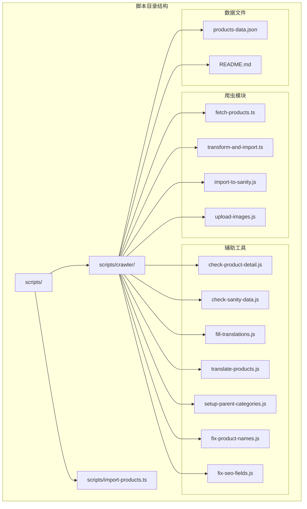
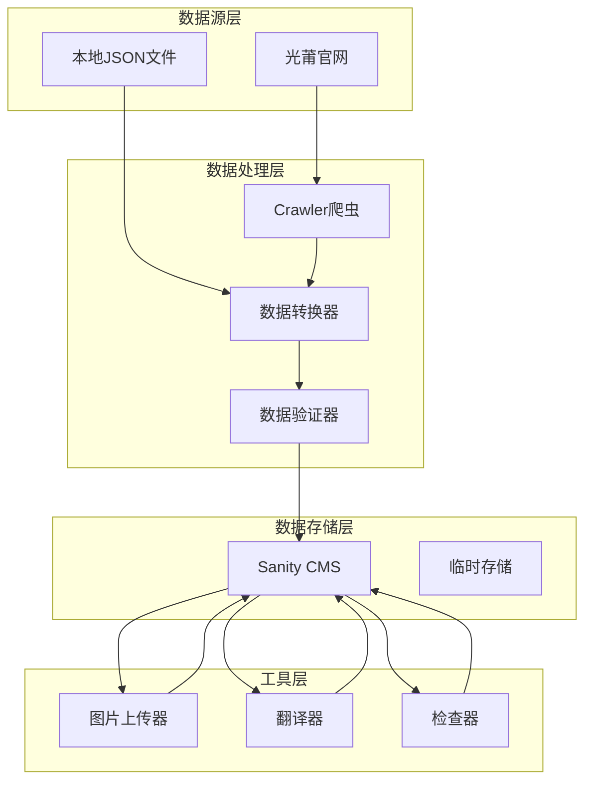
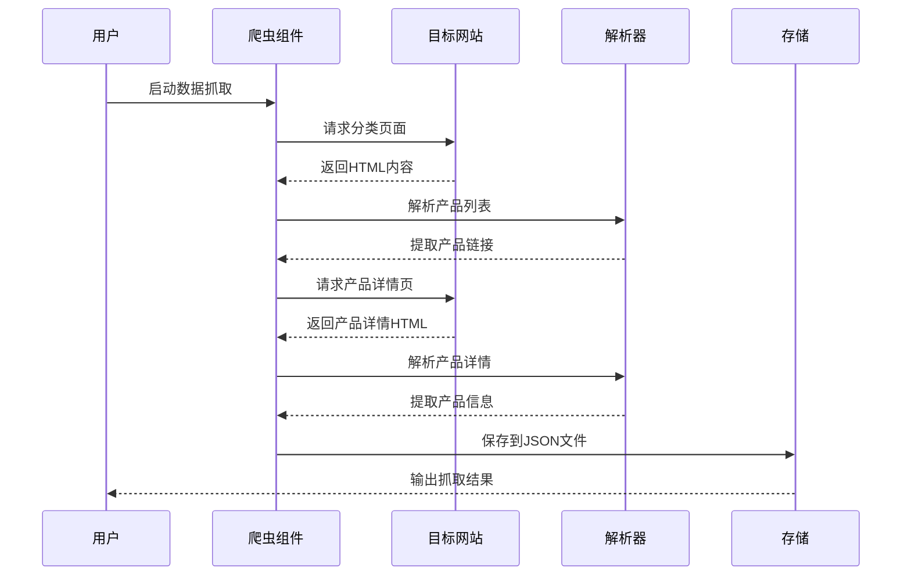
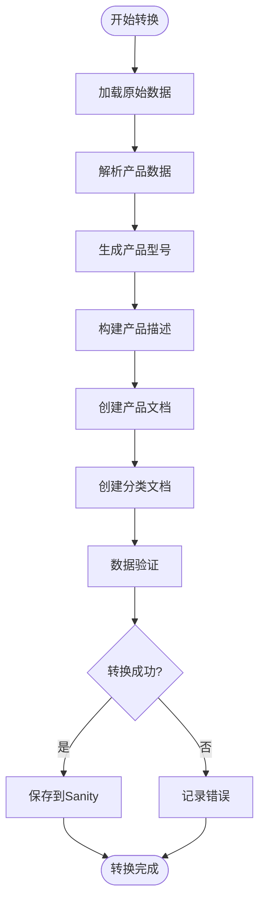
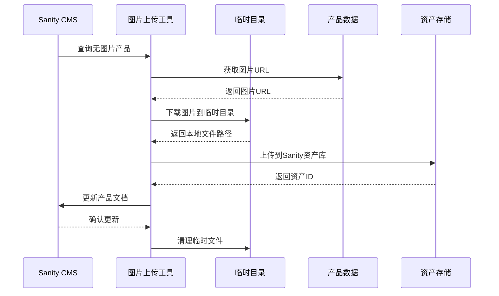
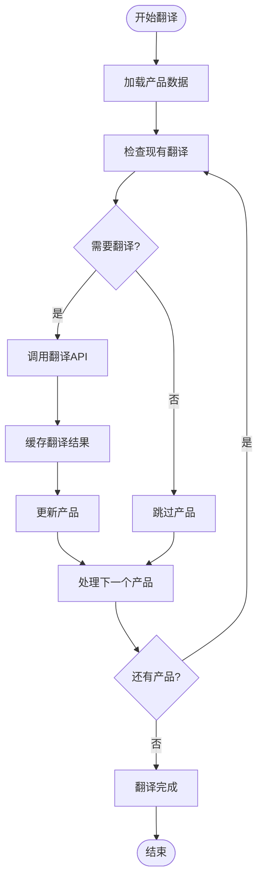

# 数据导入脚本

<cite>
**本文档引用的文件**
- [import-products.ts](file://scripts/import-products.ts)
- [fetch-products.ts](file://scripts/crawler/fetch-products.ts)
- [transform-and-import.ts](file://scripts/crawler/transform-and-import.ts)
- [upload-images.js](file://scripts/crawler/upload-images.js)
- [import-to-sanity.js](file://scripts/crawler/import-to-sanity.js)
- [products-data.json](file://scripts/crawler/products-data.json)
- [README.md](file://scripts/crawler/README.md)
- [check-product-detail.js](file://scripts/crawler/check-product-detail.js)
- [check-sanity-data.js](file://scripts/crawler/check-sanity-data.js)
- [fill-translations.js](file://scripts/crawler/fill-translations.js)
- [translate-products.js](file://scripts/crawler/translate-products.js)
- [setup-parent-categories.js](file://scripts/crawler/setup-parent-categories.js)
- [fix-product-names.js](file://scripts/crawler/fix-product-names.js)
- [fix-seo-fields.js](file://scripts/crawler/fix-seo-fields.js)
</cite>

## 目录
1. [引言](#引言)
2. [项目结构](#项目结构)
3. [核心组件](#核心组件)
4. [架构概览](#架构概览)
5. [详细组件分析](#详细组件分析)
6. [依赖关系分析](#依赖关系分析)
7. [性能考虑](#性能考虑)
8. [故障排除指南](#故障排除指南)
9. [结论](#结论)
10. [附录](#附录)

## 引言

本项目是一个完整的数据导入脚本系统，专门用于从光莆官网抓取产品数据并导入到 Sanity CMS 中。该系统包含了数据抓取、数据转换、批量导入、图片上传、多语言翻译等多个功能模块，为网站内容管理提供了自动化解决方案。

系统采用 TypeScript 和 JavaScript 混合开发，使用 JSDOM 进行网页解析，通过 Sanity API 进行数据导入，支持多语言内容管理和 SEO 优化。整个流程从数据抓取到最终展示，形成了一个完整的数据管道。

## 项目结构

项目采用模块化的文件组织结构，主要分为以下几个部分：



**图表来源**
- [README.md:1-105](file://scripts/crawler/README.md#L1-L105)

**章节来源**
- [README.md:1-105](file://scripts/crawler/README.md#L1-L105)

## 核心组件

### 数据抓取组件
负责从光莆官网自动抓取产品数据，包括产品列表、详情信息、规格参数等。

### 数据转换组件  
将抓取的原始数据转换为 Sanity CMS 所需的标准格式，包括字段映射、数据验证等。

### 数据导入组件
通过 Sanity API 将转换后的数据批量导入到内容管理系统中。

### 图片上传组件
处理产品图片的下载、格式转换和上传到 Sanity 的完整流程。

### 多语言处理组件
提供产品名称、描述等多语言字段的翻译和填充功能。

**章节来源**
- [fetch-products.ts:1-320](file://scripts/crawler/fetch-products.ts#L1-L320)
- [transform-and-import.ts:1-254](file://scripts/crawler/transform-and-import.ts#L1-L254)
- [upload-images.js:1-207](file://scripts/crawler/upload-images.js#L1-L207)

## 架构概览

系统采用分层架构设计，各组件职责明确，相互协作完成完整的数据导入流程：



**图表来源**
- [fetch-products.ts:241-306](file://scripts/crawler/fetch-products.ts#L241-L306)
- [transform-and-import.ts:175-230](file://scripts/crawler/transform-and-import.ts#L175-L230)

## 详细组件分析

### 数据抓取组件分析

数据抓取组件是整个系统的核心，负责从目标网站自动提取产品相关信息。

#### 抓取流程序列图



**图表来源**
- [fetch-products.ts:241-306](file://scripts/crawler/fetch-products.ts#L241-L306)

#### 抓取功能特点

1. **多分类支持**：支持红外LED、可见光LED、紫外LED、光源模组、消杀模组、智能传感等6个产品分类
2. **分页处理**：自动检测和处理产品列表的分页情况
3. **数据解析**：使用JSDOM解析HTML，提取产品名称、规格、应用、图片等信息
4. **去重机制**：自动去除重复的产品记录
5. **错误处理**：完善的异常处理和重试机制

**章节来源**
- [fetch-products.ts:8-46](file://scripts/crawler/fetch-products.ts#L8-L46)
- [fetch-products.ts:86-120](file://scripts/crawler/fetch-products.ts#L86-L120)
- [fetch-products.ts:125-204](file://scripts/crawler/fetch-products.ts#L125-L204)

### 数据转换组件分析

数据转换组件负责将抓取的原始数据转换为Sanity CMS所需的标准化格式。

#### 转换流程图



**图表来源**
- [transform-and-import.ts:56-141](file://scripts/crawler/transform-and-import.ts#L56-L141)
- [transform-and-import.ts:175-230](file://scripts/crawler/transform-and-import.ts#L175-L230)

#### 转换规则

1. **产品模型生成**：根据产品名称和分类ID生成唯一的产品型号
2. **描述构建**：将卖点信息组合为完整的产品描述
3. **字段映射**：将原始字段映射到Sanity标准字段
4. **多语言处理**：为每个字段提供多语言支持
5. **SEO优化**：自动生成Meta标题、描述和关键词

**章节来源**
- [transform-and-import.ts:36-47](file://scripts/crawler/transform-and-import.ts#L36-L47)
- [transform-and-import.ts:56-141](file://scripts/crawler/transform-and-import.ts#L56-L141)

### 图片上传组件分析

图片上传组件处理产品图片的下载、格式转换和上传到Sanity的完整流程。

#### 图片上传流程



**图表来源**
- [upload-images.js:108-193](file://scripts/crawler/upload-images.js#L108-L193)

#### 图片处理功能

1. **自动检测**：查找数据库中缺少主图片的产品
2. **批量下载**：从原始数据文件中获取图片URL并下载
3. **格式转换**：支持多种图片格式的处理
4. **错误恢复**：跳过无法下载的图片，继续处理其他产品
5. **资源清理**：自动清理临时下载的文件

**章节来源**
- [upload-images.js:32-53](file://scripts/crawler/upload-images.js#L32-L53)
- [upload-images.js:58-78](file://scripts/crawler/upload-images.js#L58-L78)

### 多语言翻译组件分析

多语言翻译组件提供产品数据的自动翻译和填充功能。

#### 翻译流程



**图表来源**
- [translate-products.js:71-167](file://scripts/crawler/translate-products.js#L71-L167)

#### 翻译策略

1. **多语言支持**：支持英语、印尼语、泰语、越南语、阿拉伯语
2. **缓存机制**：避免重复翻译相同内容
3. **批量处理**：支持大量数据的高效翻译
4. **错误处理**：API调用失败时提供降级方案
5. **进度跟踪**：实时显示翻译进度和结果

**章节来源**
- [translate-products.js:31-66](file://scripts/crawler/translate-products.js#L31-L66)
- [translate-products.js:199-255](file://scripts/crawler/translate-products.js#L199-L255)

## 依赖关系分析

系统各组件之间的依赖关系如下：

```mermaid
graph TB
subgraph "外部依赖"
JSDOM[JSDOM]
SanityClient[@sanity/client]
UUID[uuid]
DotEnv[dotenv]
end
subgraph "核心组件"
FetchTS[fetch-products.ts]
TransformTS[transform-and-import.ts]
ImportJS[import-to-sanity.js]
UploadJS[upload-images.js]
TranslateJS[translate-products.js]
end
subgraph "辅助组件"
CheckDetail[check-product-detail.js]
CheckData[check-sanity-data.js]
FillTrans[fill-translations.js]
SetupCat[setup-parent-categories.js]
FixNames[fix-product-names.js]
FixSEO[fix-seo-fields.js]
end
JSDOM --> FetchTS
JSDOM --> TransformTS
SanityClient --> TransformTS
SanityClient --> ImportJS
SanityClient --> UploadJS
SanityClient --> TranslateJS
SanityClient --> CheckDetail
SanityClient --> CheckData
SanityClient --> FillTrans
SanityClient --> SetupCat
SanityClient --> FixNames
SanityClient --> FixSEO
UUID --> TransformTS
DotEnv --> ImportJS
```

**图表来源**
- [fetch-products.ts:6](file://scripts/crawler/fetch-products.ts#L6)
- [transform-and-import.ts:5](file://scripts/crawler/transform-and-import.ts#L5)
- [import-to-sanity.js:5](file://scripts/crawler/import-to-sanity.js#L5)

**章节来源**
- [fetch-products.ts:1-320](file://scripts/crawler/fetch-products.ts#L1-L320)
- [transform-and-import.ts:1-254](file://scripts/crawler/transform-and-import.ts#L1-L254)

## 性能考虑

### 网络请求优化

1. **请求延迟**：在每个请求之间添加适当的延迟，避免对目标服务器造成压力
2. **并发控制**：合理控制同时进行的请求数量
3. **重试机制**：对失败的请求进行有限次数的重试

### 内存管理

1. **流式处理**：对于大型JSON文件，采用流式读取方式
2. **及时释放**：及时释放不再使用的内存
3. **分批处理**：将大数据集分成小批次处理

### 数据处理优化

1. **缓存策略**：对翻译结果和API响应进行缓存
2. **批量操作**：使用Sanity的批量操作API减少网络往返
3. **索引优化**：在查询时使用适当的过滤条件

## 故障排除指南

### 常见问题及解决方案

#### 爬虫执行失败
- **症状**：爬虫在某个分类或产品处停止
- **原因**：网络连接问题、页面结构变化、反爬虫机制
- **解决**：检查网络连接，更新选择器，添加User-Agent头

#### 数据导入错误
- **症状**：导入过程中出现API错误
- **原因**：认证失败、数据格式错误、权限不足
- **解决**：验证API令牌，检查数据格式，确认权限设置

#### 图片上传失败
- **症状**：图片无法上传到Sanity
- **原因**：网络问题、文件格式不支持、磁盘空间不足
- **解决**：检查网络连接，验证文件格式，清理磁盘空间

#### 翻译API限制
- **症状**：翻译API调用频繁导致被限制
- **原因**：超出API配额或请求频率过高
- **解决**：增加延迟，使用缓存，升级API计划

**章节来源**
- [check-sanity-data.js:15-70](file://scripts/crawler/check-sanity-data.js#L15-L70)
- [check-product-detail.js:10-19](file://scripts/crawler/check-product-detail.js#L10-L19)

## 结论

本数据导入脚本系统提供了一个完整、自动化的内容管理解决方案。通过模块化的架构设计，系统能够高效地处理从数据抓取到最终展示的整个流程。

系统的主要优势包括：
1. **自动化程度高**：从数据抓取到导入完全自动化
2. **扩展性强**：模块化设计便于功能扩展
3. **错误处理完善**：具备完善的异常处理和恢复机制
4. **多语言支持**：内置多语言处理功能
5. **性能优化**：针对大规模数据处理进行了优化

建议在实际使用中：
1. 定期监控系统运行状态
2. 根据业务需求调整处理逻辑
3. 建立完善的备份和回滚机制
4. 持续优化性能和用户体验

## 附录

### 使用指南

#### 环境准备
1. 安装Node.js和npm
2. 在项目根目录创建`.env.local`文件
3. 配置Sanity项目ID、数据集和API令牌

#### 基本使用流程
1. 运行数据抓取脚本
2. 执行数据转换和导入
3. 处理图片上传
4. 进行多语言翻译
5. 验证数据完整性

#### 最佳实践
1. 定期备份数据
2. 监控系统性能指标
3. 建立错误告警机制
4. 持续优化处理逻辑
5. 建立文档和知识库