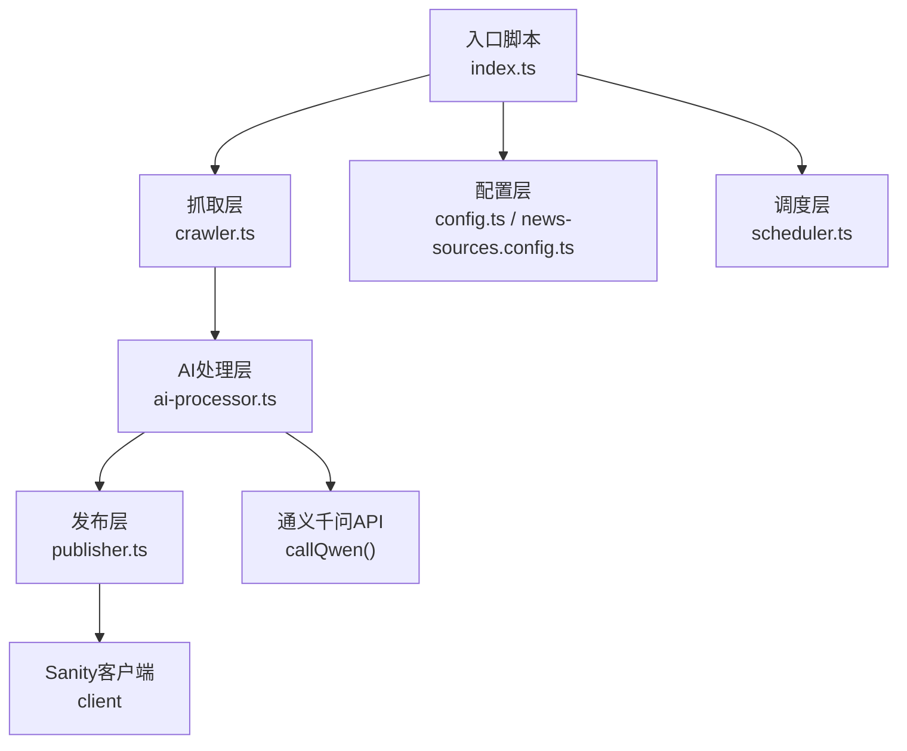
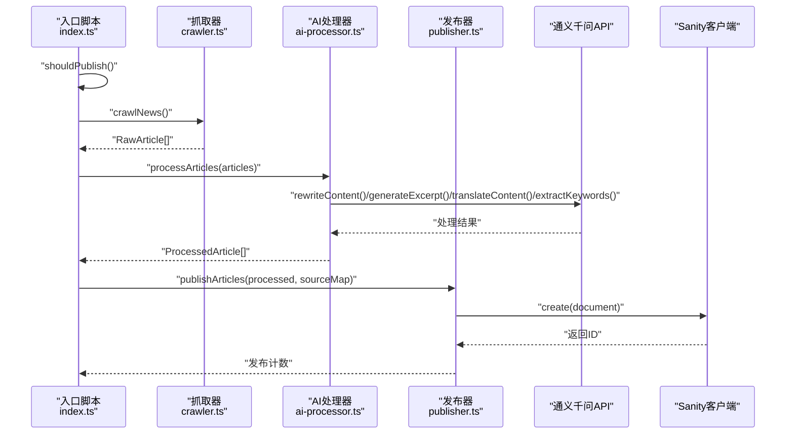
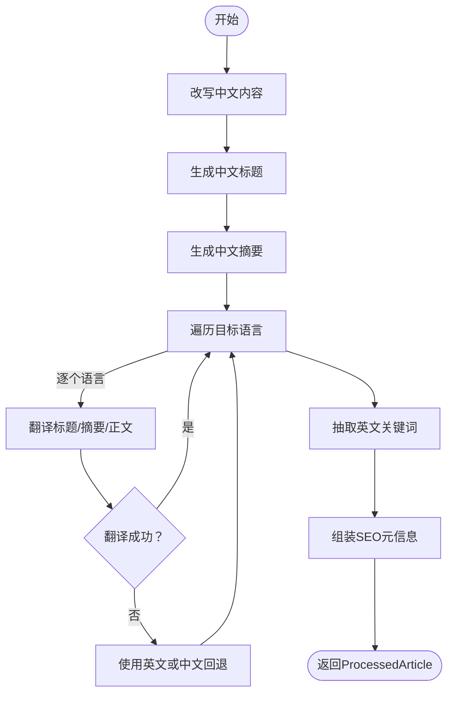
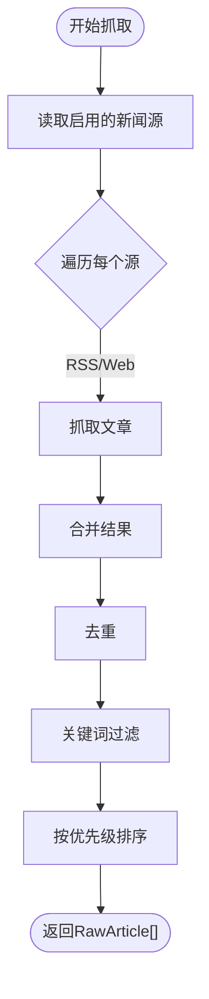
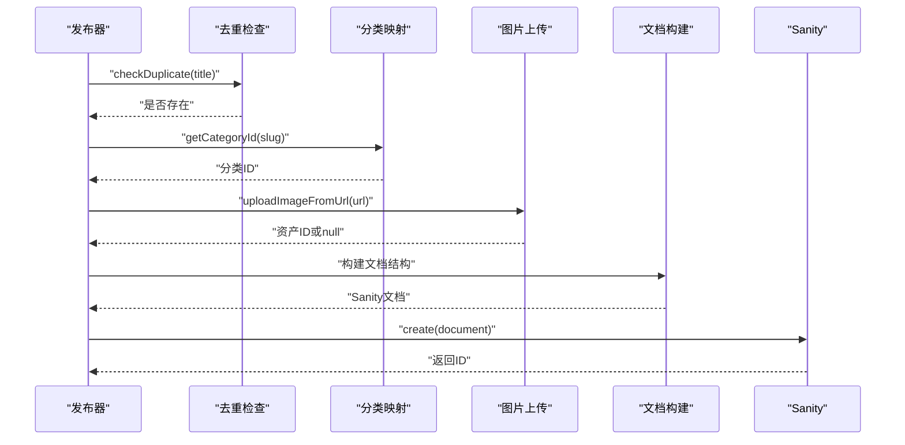
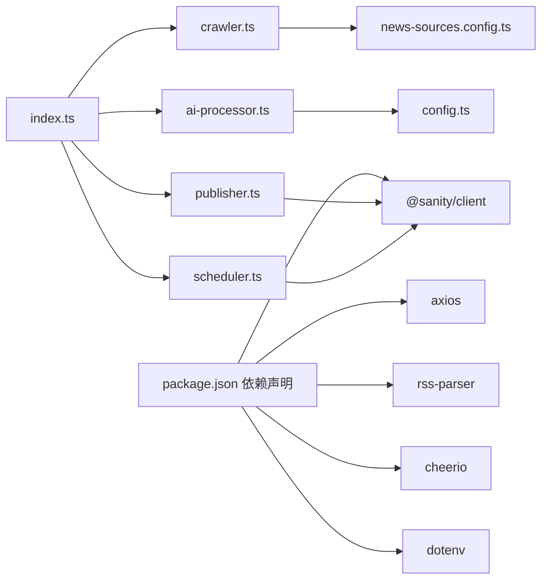

# AI智能处理模块

<cite>
**本文引用的文件**
- [scripts/news-auto/ai-processor.ts](file://scripts/news-auto/ai-processor.ts)
- [scripts/news-auto/config.ts](file://scripts/news-auto/config.ts)
- [scripts/news-auto/index.ts](file://scripts/news-auto/index.ts)
- [scripts/news-auto/crawler.ts](file://scripts/news-auto/crawler.ts)
- [scripts/news-auto/publisher.ts](file://scripts/news-auto/publisher.ts)
- [scripts/news-auto/news-sources.config.ts](file://scripts/news-auto/news-sources.config.ts)
- [scripts/news-auto/scheduler.ts](file://scripts/news-auto/scheduler.ts)
- [package.json](file://package.json)
</cite>

## 目录
1. [简介](#简介)
2. [项目结构](#项目结构)
3. [核心组件](#核心组件)
4. [架构总览](#架构总览)
5. [详细组件分析](#详细组件分析)
6. [依赖关系分析](#依赖关系分析)
7. [性能考量](#性能考量)
8. [故障排除指南](#故障排除指南)
9. [结论](#结论)
10. [附录](#附录)

## 简介
本文件为“AI智能处理模块”的技术文档，聚焦于自动化新闻采集、AI内容改写与多语言翻译、关键词抽取、SEO优化以及最终发布到内容管理系统（Sanity）的完整流程。模块通过调用通义千问（阿里云百炼）大模型完成中文改写、标题与摘要生成、多语言翻译、关键词抽取等任务；同时内置新闻源配置、调度策略、去重与关键词过滤、图片上传与文档构建等功能，形成端到端的自动化内容生产流水线。

## 项目结构
该模块位于脚本目录 scripts/news-auto 下，采用功能分层设计：
- 入口与编排：index.ts
- 抓取层：crawler.ts（支持RSS与网页两种抓取方式）
- AI处理层：ai-processor.ts（内容改写、翻译、关键词抽取、摘要生成、批量处理）
- 发布层：publisher.ts（去重检查、分类映射、图片上传、Sanity文档构建与发布）
- 配置层：config.ts（发布策略、关键词过滤、AI参数、目标语言）、news-sources.config.ts（新闻源配置）
- 调度层：scheduler.ts（每日配额与时间窗口检查）

图表来源
- [scripts/news-auto/index.ts:1-83](file://scripts/news-auto/index.ts#L1-L83)
- [scripts/news-auto/crawler.ts:1-197](file://scripts/news-auto/crawler.ts#L1-L197)
- [scripts/news-auto/ai-processor.ts:1-232](file://scripts/news-auto/ai-processor.ts#L1-L232)
- [scripts/news-auto/publisher.ts:1-240](file://scripts/news-auto/publisher.ts#L1-L240)
- [scripts/news-auto/config.ts:1-45](file://scripts/news-auto/config.ts#L1-L45)
- [scripts/news-auto/news-sources.config.ts:1-155](file://scripts/news-auto/news-sources.config.ts#L1-L155)
- [scripts/news-auto/scheduler.ts:1-104](file://scripts/news-auto/scheduler.ts#L1-L104)

章节来源
- [scripts/news-auto/index.ts:1-83](file://scripts/news-auto/index.ts#L1-L83)
- [scripts/news-auto/config.ts:1-45](file://scripts/news-auto/config.ts#L1-L45)

## 核心组件
- AI处理器（ai-processor.ts）
  - 功能：调用通义千问API进行内容改写、标题与摘要生成、多语言翻译、关键词抽取、批量处理与错误回退。
  - 关键接口：callQwen、rewriteContent、translateContent、extractKeywords、generateExcerpt、processArticle、processArticles。
- 抓取器（crawler.ts）
  - 功能：从RSS与网页两类源抓取原始文章，进行去重、关键词过滤与优先级排序。
  - 关键接口：crawlNews、fetchFromRSS、fetchFromWeb、deduplicate、filterByKeywords。
- 发布器（publisher.ts）
  - 功能：去重检查、分类映射、封面图上传、Sanity文档构建与发布。
  - 关键接口：publishArticle、publishArticles、uploadImageFromUrl、checkDuplicate、getCategoryId。
- 配置（config.ts、news-sources.config.ts）
  - 功能：发布策略（每日配额、发布时间）、关键词过滤规则、AI参数、目标语言、新闻源启用/优先级/类型/语言等。
- 调度器（scheduler.ts）
  - 功能：判断是否在发布窗口内、统计当日已发布数并计算剩余配额。
  - 关键接口：shouldPublish、getPublishQuota、isInPublishWindow、getTodayArticleCount。

章节来源
- [scripts/news-auto/ai-processor.ts:1-232](file://scripts/news-auto/ai-processor.ts#L1-L232)
- [scripts/news-auto/crawler.ts:1-197](file://scripts/news-auto/crawler.ts#L1-L197)
- [scripts/news-auto/publisher.ts:1-240](file://scripts/news-auto/publisher.ts#L1-L240)
- [scripts/news-auto/config.ts:1-45](file://scripts/news-auto/config.ts#L1-L45)
- [scripts/news-auto/news-sources.config.ts:1-155](file://scripts/news-auto/news-sources.config.ts#L1-L155)
- [scripts/news-auto/scheduler.ts:1-104](file://scripts/news-auto/scheduler.ts#L1-L104)

## 架构总览
整体流程从“抓取”开始，经过“AI处理”，再到“发布”，期间受“调度”与“配置”约束。AI处理阶段以通义千问API为核心，围绕中文改写、标题/摘要生成、多语言翻译、关键词抽取展开；发布阶段负责与Sanity集成，确保内容结构化入库。

图表来源
- [scripts/news-auto/index.ts:1-83](file://scripts/news-auto/index.ts#L1-L83)
- [scripts/news-auto/crawler.ts:155-197](file://scripts/news-auto/crawler.ts#L155-L197)
- [scripts/news-auto/ai-processor.ts:153-232](file://scripts/news-auto/ai-processor.ts#L153-L232)
- [scripts/news-auto/publisher.ts:215-240](file://scripts/news-auto/publisher.ts#L215-L240)

## 详细组件分析

### AI处理器（ai-processor.ts）
- 职责与流程
  - 文本预处理：接收原始文章，构造提示词（prompt），调用通义千问API。
  - 模型调用：统一通过callQwen封装HTTP请求，设置模型、温度、最大token等参数。
  - 结果后处理：生成中文标题与摘要、多语言翻译（含回退策略）、抽取英文关键词、组装SEO字段。
  - 批量处理：逐条处理并加入延迟以避免API限流。
- 关键实现点
  - callQwen：校验环境变量、设置超时、封装请求头与请求体。
  - rewriteContent/generateExcerpt/translateContent/extractKeywords：针对不同任务构造专用提示词模板。
  - processArticle：串行执行中文改写、标题/摘要生成、多语言翻译、关键词抽取与SEO组装。
  - 回退策略：翻译失败时回退到英文或中文，保证内容可用性。
- 数据结构
  - ProcessedArticle：包含多语言标题、摘要、内容、通用英文标签、分类、SEO元信息。

图表来源
- [scripts/news-auto/ai-processor.ts:153-211](file://scripts/news-auto/ai-processor.ts#L153-L211)

章节来源
- [scripts/news-auto/ai-processor.ts:1-232](file://scripts/news-auto/ai-processor.ts#L1-L232)

### 抓取器（crawler.ts）
- 职责与流程
  - 从RSS与网页两类源抓取原始文章，支持自定义headers（如UA伪装）。
  - 去重：基于链接去重。
  - 过滤：基于关键词白名单与黑名单过滤。
  - 排序：按新闻源优先级排序。
- 关键实现点
  - fetchFromRSS/fetchFromWeb：分别处理RSS与网页抓取，提取标题、链接、摘要、图片等。
  - deduplicate/filterByKeywords：保证输入质量。
  - crawlNews：聚合多个源的结果并排序。

图表来源
- [scripts/news-auto/crawler.ts:155-197](file://scripts/news-auto/crawler.ts#L155-L197)

章节来源
- [scripts/news-auto/crawler.ts:1-197](file://scripts/news-auto/crawler.ts#L1-L197)

### 发布器（publisher.ts）
- 职责与流程
  - 去重检查：防止重复发布。
  - 分类映射：将文章分类映射为Sanity的分类ID。
  - 图片上传：下载远程图片并上传至Sanity资产。
  - 文档构建：按多语言结构构建内容块，填充SEO、作者、来源等字段。
  - 发布：创建文档并返回发布计数。
- 关键实现点
  - publishArticle：单篇发布，包含完整校验与回退。
  - publishArticles：批量发布，带API限流延迟。
  - uploadImageFromUrl：下载并上传图片，返回资产ID。

图表来源
- [scripts/news-auto/publisher.ts:58-212](file://scripts/news-auto/publisher.ts#L58-L212)

章节来源
- [scripts/news-auto/publisher.ts:1-240](file://scripts/news-auto/publisher.ts#L1-L240)

### 配置与调度（config.ts、news-sources.config.ts、scheduler.ts）
- 配置（config.ts）
  - 发布策略：每日最大发布数、发布时间点、是否自动发布。
  - 关键词过滤：必需词、可选词、排除词。
  - AI参数：模型名、最大token、温度。
  - 内容质量阈值：最小/最大字数、关键词密度阈值。
  - 目标语言：多语言列表。
- 新闻源配置（news-sources.config.ts）
  - 类型：rss、web、rss+web。
  - 属性：名称、URL、RSS地址、CSS选择器、分类、语言、优先级、启用状态、备注、自定义headers。
  - 工具函数：按启用状态、分类、语言筛选，获取启用源列表。
- 调度（scheduler.ts）
  - 时间窗口：将UTC转换为北京时间，考虑±90分钟浮动误差。
  - 每日配额：查询今日已发布数并计算剩余配额。
  - shouldPublish：综合时间窗口与配额判断是否允许发布。

章节来源
- [scripts/news-auto/config.ts:1-45](file://scripts/news-auto/config.ts#L1-L45)
- [scripts/news-auto/news-sources.config.ts:1-155](file://scripts/news-auto/news-sources.config.ts#L1-L155)
- [scripts/news-auto/scheduler.ts:1-104](file://scripts/news-auto/scheduler.ts#L1-L104)

## 依赖关系分析
- 外部依赖
  - axios：HTTP请求（调用通义千问API）。
  - rss-parser、cheerio：RSS解析与网页DOM解析。
  - @sanity/client：与Sanity CMS交互。
  - dotenv：加载环境变量（API密钥等）。
- 模块间耦合
  - index.ts串联各层，耦合度低，便于扩展。
  - ai-processor.ts依赖config.ts中的AI参数与TARGET_LOCALES。
  - crawler.ts依赖news-sources.config.ts的源配置。
  - publisher.ts依赖Sanity客户端与config.ts中的分类映射。
  - scheduler.ts依赖Sanity客户端查询发布计数。

图表来源
- [package.json:12-28](file://package.json#L12-L28)
- [scripts/news-auto/index.ts:1-83](file://scripts/news-auto/index.ts#L1-L83)
- [scripts/news-auto/ai-processor.ts:1-232](file://scripts/news-auto/ai-processor.ts#L1-L232)
- [scripts/news-auto/crawler.ts:1-197](file://scripts/news-auto/crawler.ts#L1-L197)
- [scripts/news-auto/publisher.ts:1-240](file://scripts/news-auto/publisher.ts#L1-L240)
- [scripts/news-auto/scheduler.ts:1-104](file://scripts/news-auto/scheduler.ts#L1-L104)

章节来源
- [package.json:12-28](file://package.json#L12-L28)

## 性能考量
- API限流与延迟
  - AI处理与发布阶段均设置了延迟，避免触发服务端限流。
- 并发与批量化
  - 当前实现为顺序处理，若需提升吞吐，可在不违反限流的前提下引入并发队列与令牌桶控制。
- 内容截断与质量阈值
  - 通过截取输入片段与设定字数阈值，平衡成本与质量。
- 缓存与复用
  - 可在抓取层缓存RSS解析结果或翻译结果（需注意时效性与一致性）。

## 故障排除指南
- 通义千问API错误
  - 现象：调用失败或响应为空。
  - 排查：确认环境变量是否正确、网络连通性、请求头与超时设置、模型可用性。
  - 参考位置：[scripts/news-auto/ai-processor.ts:19-58](file://scripts/news-auto/ai-processor.ts#L19-L58)
- 翻译失败回退
  - 现象：某语言翻译失败。
  - 处理：自动回退到英文或中文，保证内容可用。
  - 参考位置：[scripts/news-auto/ai-processor.ts:178-190](file://scripts/news-auto/ai-processor.ts#L178-L190)
- 发布重复
  - 现象：重复发布相同文章。
  - 处理：启用去重检查，避免重复创建。
  - 参考位置：[scripts/news-auto/publisher.ts:14-18](file://scripts/news-auto/publisher.ts#L14-L18)
- 分类缺失
  - 现象：分类ID无法映射。
  - 处理：确认分类slug与Sanity中一致。
  - 参考位置：[scripts/news-auto/publisher.ts:21-24](file://scripts/news-auto/publisher.ts#L21-L24)
- 图片上传失败
  - 现象：封面图无法上传。
  - 处理：检查图片URL有效性、网络权限、Sanity资产API可用性。
  - 参考位置：[scripts/news-auto/publisher.ts:27-55](file://scripts/news-auto/publisher.ts#L27-L55)
- 时间窗口与配额问题
  - 现象：未在发布窗口内或已达每日配额。
  - 处理：检查调度逻辑与环境变量、确认发布时间点与配额。
  - 参考位置：[scripts/news-auto/scheduler.ts:29-94](file://scripts/news-auto/scheduler.ts#L29-L94)

章节来源
- [scripts/news-auto/ai-processor.ts:19-58](file://scripts/news-auto/ai-processor.ts#L19-L58)
- [scripts/news-auto/ai-processor.ts:178-190](file://scripts/news-auto/ai-processor.ts#L178-L190)
- [scripts/news-auto/publisher.ts:14-18](file://scripts/news-auto/publisher.ts#L14-L18)
- [scripts/news-auto/publisher.ts:21-24](file://scripts/news-auto/publisher.ts#L21-L24)
- [scripts/news-auto/publisher.ts:27-55](file://scripts/news-auto/publisher.ts#L27-L55)
- [scripts/news-auto/scheduler.ts:29-94](file://scripts/news-auto/scheduler.ts#L29-L94)

## 结论
该AI智能处理模块以清晰的分层架构实现了从新闻采集、AI内容改写与翻译、关键词抽取到发布入库的全链路自动化。通过可配置的新闻源、调度策略与AI参数，系统具备良好的可维护性与扩展性。建议后续在保证稳定性前提下引入并发与缓存机制，进一步提升吞吐能力。

## 附录

### 使用示例与最佳实践
- 设置API密钥
  - 在运行环境中设置通义千问API密钥，确保调用可用。
  - 参考位置：[scripts/news-auto/ai-processor.ts:20-24](file://scripts/news-auto/ai-processor.ts#L20-L24)
- 调整AI参数
  - 在配置中调整模型、温度、最大token等，平衡质量与成本。
  - 参考位置：[scripts/news-auto/config.ts:22-26](file://scripts/news-auto/config.ts#L22-L26)
- 维护新闻源
  - 在独立配置文件中新增/停用/调整优先级，无需改动抓取逻辑。
  - 参考位置：[scripts/news-auto/news-sources.config.ts:46-131](file://scripts/news-auto/news-sources.config.ts#L46-L131)
- 控制发布节奏
  - 通过调度器的时间窗口与每日配额，确保发布合规与稳定。
  - 参考位置：[scripts/news-auto/scheduler.ts:67-94](file://scripts/news-auto/scheduler.ts#L67-L94)
- 处理特殊内容格式
  - 若源站点需要特定headers，可在新闻源配置中添加，提高抓取成功率。
  - 参考位置：[scripts/news-auto/news-sources.config.ts:105-107](file://scripts/news-auto/news-sources.config.ts#L105-L107)
- 优化处理性能
  - 在不违反限流的前提下增加并发与缓存，减少重复计算与网络往返。
  - 参考位置：[scripts/news-auto/ai-processor.ts:224](file://scripts/news-auto/ai-processor.ts#L224)、[scripts/news-auto/publisher.ts:235](file://scripts/news-auto/publisher.ts#L235)