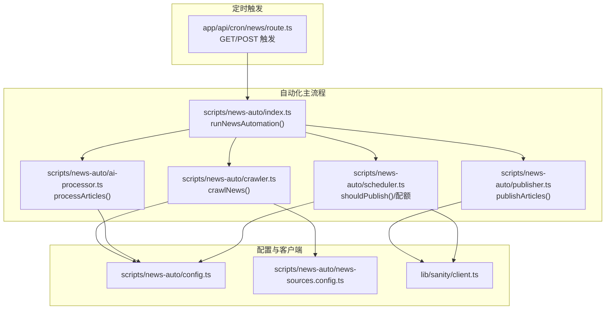
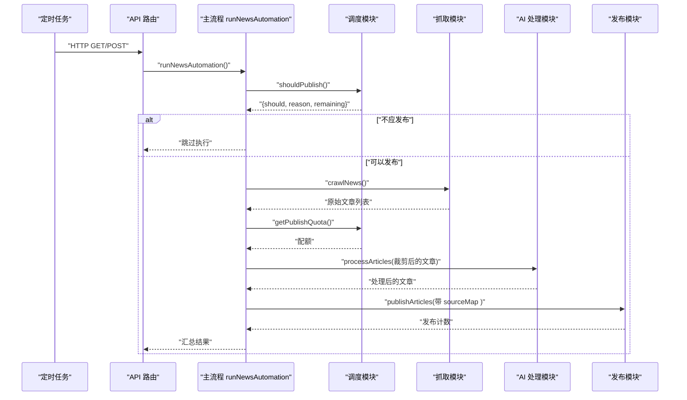
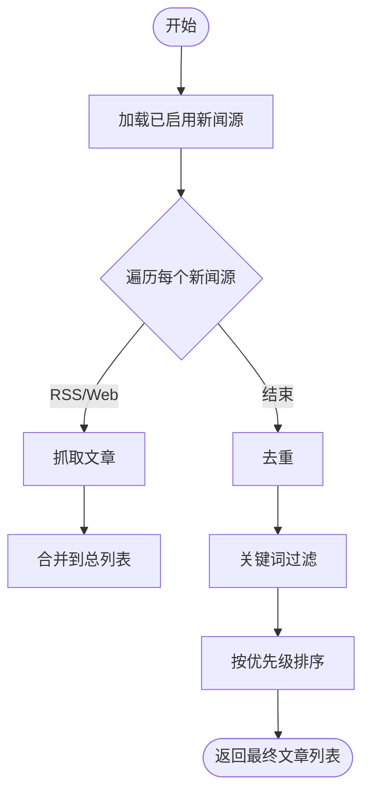
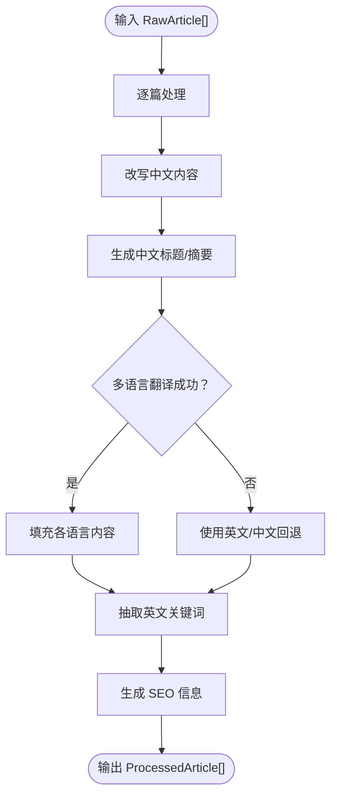
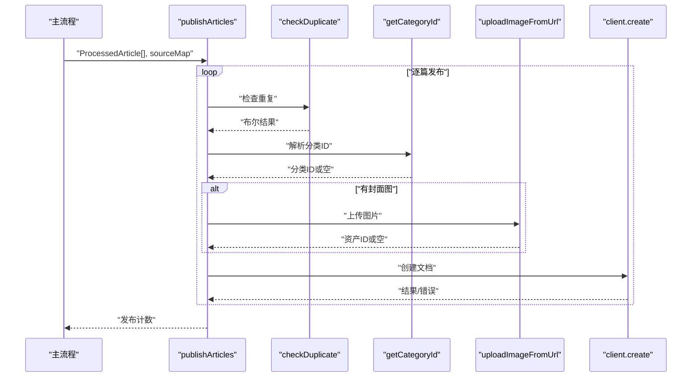
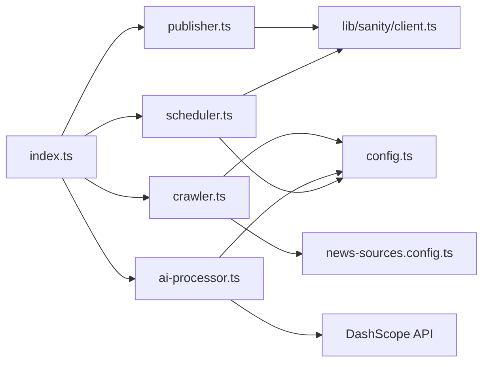

# 主执行流程

<cite>
**本文引用的文件**
- [scripts/news-auto/index.ts](file://scripts/news-auto/index.ts)
- [scripts/news-auto/crawler.ts](file://scripts/news-auto/crawler.ts)
- [scripts/news-auto/ai-processor.ts](file://scripts/news-auto/ai-processor.ts)
- [scripts/news-auto/publisher.ts](file://scripts/news-auto/publisher.ts)
- [scripts/news-auto/scheduler.ts](file://scripts/news-auto/scheduler.ts)
- [scripts/news-auto/config.ts](file://scripts/news-auto/config.ts)
- [scripts/news-auto/news-sources.config.ts](file://scripts/news-auto/news-sources.config.ts)
- [lib/sanity/client.ts](file://lib/sanity/client.ts)
- [app/api/cron/news/route.ts](file://app/api/cron/news/route.ts)
- [app/api/debug/route.ts](file://app/api/debug/route.ts)
- [scripts/test-news.js](file://scripts/test-news.js)
- [package.json](file://package.json)
</cite>

## 目录
1. [简介](#简介)
2. [项目结构](#项目结构)
3. [核心组件](#核心组件)
4. [架构总览](#架构总览)
5. [详细组件分析](#详细组件分析)
6. [依赖关系分析](#依赖关系分析)
7. [性能考量](#性能考量)
8. [故障排查指南](#故障排查指南)
9. [结论](#结论)
10. [附录](#附录)

## 简介
本文件面向“新闻自动化系统”的主执行流程，系统通过定时任务触发，完成从外部新闻源抓取、AI内容改写与翻译、内容质量控制、去重与关键词过滤，再到 Sanity 内容管理系统的发布全流程。文档重点阐述主流程的控制逻辑、模块间调用顺序与数据传递、错误处理与恢复策略、日志与监控方法，并提供使用示例与性能优化建议。

## 项目结构
新闻自动化相关代码集中于 scripts/news-auto 目录，配合 Next.js API 路由与 Sanity 客户端实现定时触发与内容发布。关键文件职责如下：
- 主流程入口与调度：scripts/news-auto/index.ts
- 新闻抓取：scripts/news-auto/crawler.ts
- AI 内容处理：scripts/news-auto/ai-processor.ts
- 发布到 Sanity：scripts/news-auto/publisher.ts
- 发布计划与配额：scripts/news-auto/scheduler.ts
- 全局配置与分类映射：scripts/news-auto/config.ts
- 新闻源配置：scripts/news-auto/news-sources.config.ts
- Sanity 客户端：lib/sanity/client.ts
- 定时任务入口：app/api/cron/news/route.ts
- 调试接口：app/api/debug/route.ts
- 测试脚本：scripts/test-news.js
- 依赖声明：package.json

图表来源
- [app/api/cron/news/route.ts:1-52](file://app/api/cron/news/route.ts#L1-L52)
- [scripts/news-auto/index.ts:1-83](file://scripts/news-auto/index.ts#L1-L83)
- [scripts/news-auto/scheduler.ts:1-104](file://scripts/news-auto/scheduler.ts#L1-L104)
- [scripts/news-auto/crawler.ts:1-197](file://scripts/news-auto/crawler.ts#L1-L197)
- [scripts/news-auto/ai-processor.ts:1-232](file://scripts/news-auto/ai-processor.ts#L1-L232)
- [scripts/news-auto/publisher.ts:1-240](file://scripts/news-auto/publisher.ts#L1-L240)
- [scripts/news-auto/config.ts:1-45](file://scripts/news-auto/config.ts#L1-L45)
- [scripts/news-auto/news-sources.config.ts:1-155](file://scripts/news-auto/news-sources.config.ts#L1-L155)
- [lib/sanity/client.ts:1-30](file://lib/sanity/client.ts#L1-L30)

章节来源
- [scripts/news-auto/index.ts:1-83](file://scripts/news-auto/index.ts#L1-L83)
- [app/api/cron/news/route.ts:1-52](file://app/api/cron/news/route.ts#L1-L52)

## 核心组件
- 主流程 runNewsAutomation：串联“配额检查 → 抓取 → 限额裁剪 → AI 处理 → 构建 sourceMap → 发布”，并在异常时统一抛错。
- 抓取模块 crawlNews：支持 RSS 与网页两种抓取方式，内置去重、关键词过滤、按源优先级排序。
- AI 处理模块 processArticles：调用通义千问 API，完成中文改写、标题与摘要生成、多语言翻译、关键词抽取与 SEO 信息生成。
- 发布模块 publishArticles：检查重复、解析分类、上传封面图、构造 Sanity 文档并创建。
- 调度模块 shouldPublish/getPublishQuota：基于北京时间窗口与每日配额进行发布决策。
- 配置模块 NEWS_CONFIG：发布策略、关键词、AI 参数、质量阈值、目标语言。
- 新闻源配置 NEWS_SOURCES：集中管理新闻源启停、类型、优先级、语言与请求头。
- Sanity 客户端 client：封装写入权限与资源上传能力。

章节来源
- [scripts/news-auto/index.ts:8-69](file://scripts/news-auto/index.ts#L8-L69)
- [scripts/news-auto/crawler.ts:155-196](file://scripts/news-auto/crawler.ts#L155-L196)
- [scripts/news-auto/ai-processor.ts:153-231](file://scripts/news-auto/ai-processor.ts#L153-L231)
- [scripts/news-auto/publisher.ts:215-239](file://scripts/news-auto/publisher.ts#L215-L239)
- [scripts/news-auto/scheduler.ts:67-103](file://scripts/news-auto/scheduler.ts#L67-L103)
- [scripts/news-auto/config.ts:6-45](file://scripts/news-auto/config.ts#L6-L45)
- [scripts/news-auto/news-sources.config.ts:136-155](file://scripts/news-auto/news-sources.config.ts#L136-L155)
- [lib/sanity/client.ts:1-30](file://lib/sanity/client.ts#L1-L30)

## 架构总览
系统采用“定时触发 + 模块化流水线”的架构。定时任务通过 Next.js API 路由触发主流程；主流程内部以“配额驱动”为核心控制点，确保在允许的时间窗口与配额范围内有序执行各阶段。

图表来源
- [app/api/cron/news/route.ts:5-30](file://app/api/cron/news/route.ts#L5-L30)
- [scripts/news-auto/index.ts:9-69](file://scripts/news-auto/index.ts#L9-L69)
- [scripts/news-auto/scheduler.ts:67-103](file://scripts/news-auto/scheduler.ts#L67-L103)
- [scripts/news-auto/crawler.ts:155-196](file://scripts/news-auto/crawler.ts#L155-L196)
- [scripts/news-auto/ai-processor.ts:215-231](file://scripts/news-auto/ai-processor.ts#L215-L231)
- [scripts/news-auto/publisher.ts:215-239](file://scripts/news-auto/publisher.ts#L215-L239)

## 详细组件分析

### 主流程 runNewsAutomation
- 控制流要点
  - 记录启动时间与本地时间信息。
  - 调用 shouldPublish 判断时间窗口与配额，若不可发布则提前返回。
  - 调用 crawlNews 获取原始文章，若无新文章则返回。
  - 依据配额截断待处理文章数量，避免超限。
  - 调用 processArticles 执行 AI 改写与翻译，若无有效结果则返回。
  - 构建 sourceMap（标题→来源信息），用于后续发布。
  - 调用 publishArticles 发布到 Sanity，统计发布数量与剩余配额。
  - 异常统一捕获并向上抛出，便于上层记录与告警。
- 数据传递
  - 原始文章 RawArticle[] → 处理后 ProcessedArticle[]
  - 处理后文章 + sourceMap → 发布结果计数
- 错误处理
  - 任何阶段失败均记录错误并抛出，保证可观测性。

章节来源
- [scripts/news-auto/index.ts:9-69](file://scripts/news-auto/index.ts#L9-L69)

### 抓取模块 crawlNews
- 抓取策略
  - 从 news-sources.config.ts 读取已启用的新闻源，按优先级遍历。
  - 支持 RSS 与网页两种抓取方式，rss+web 类型会先尝试 RSS，失败再回退到网页。
  - 解析 RSS 时优先从 enclosure/media:content/content:encoded 提取图片，否则从正文提取首图。
- 去重与过滤
  - 基于链接去重 deduplicate。
  - 关键词过滤 filterByKeywords：要求至少包含一个必需词，且不包含排除词。
- 排序
  - 按新闻源优先级排序，确保高优源优先。

图表来源
- [scripts/news-auto/crawler.ts:155-196](file://scripts/news-auto/crawler.ts#L155-L196)
- [scripts/news-auto/news-sources.config.ts:136-155](file://scripts/news-auto/news-sources.config.ts#L136-L155)

章节来源
- [scripts/news-auto/crawler.ts:22-196](file://scripts/news-auto/crawler.ts#L22-L196)
- [scripts/news-auto/news-sources.config.ts:46-155](file://scripts/news-auto/news-sources.config.ts#L46-L155)

### AI 处理模块 processArticles
- 处理步骤
  - 中文改写 rewriteContent：基于模板提示词生成专业中文内容。
  - 标题与摘要生成：分别针对中文生成标题与摘要。
  - 多语言翻译：对 en/id/th/vi/ar 进行翻译，失败时回退至英文或中文。
  - 关键词抽取：提取英文关键词用于 SEO。
  - SEO 信息：为各语言生成 metaTitle 与 metaDescription。
- 并发与限流
  - 批量处理时对每篇文章间隔等待，避免 API 限流。
- 错误处理
  - 单篇文章处理失败不影响整体流程，记录错误并继续。

图表来源
- [scripts/news-auto/ai-processor.ts:153-231](file://scripts/news-auto/ai-processor.ts#L153-L231)

章节来源
- [scripts/news-auto/ai-processor.ts:19-231](file://scripts/news-auto/ai-processor.ts#L19-L231)

### 发布模块 publishArticles
- 发布流程
  - 检查重复 checkDuplicate：基于标题去重。
  - 解析分类 getCategoryId：根据分类 slug 获取分类 ID。
  - 图片上传 uploadImageFromUrl：下载并上传至 Sanity 资源库。
  - 构造文档：多语言内容、SEO、作者、来源标记等。
  - 创建文档 client.create，记录成功 ID。
- 并发与限流
  - 每篇文章发布后等待固定时间，避免 API 限流。
- 错误处理
  - 单篇文章失败不影响整体流程，记录错误并继续。

图表来源
- [scripts/news-auto/publisher.ts:215-239](file://scripts/news-auto/publisher.ts#L215-L239)
- [lib/sanity/client.ts:1-30](file://lib/sanity/client.ts#L1-L30)

章节来源
- [scripts/news-auto/publisher.ts:14-239](file://scripts/news-auto/publisher.ts#L14-L239)
- [lib/sanity/client.ts:1-30](file://lib/sanity/client.ts#L1-L30)

### 调度模块 shouldPublish/getPublishQuota
- 时间窗口
  - Vercel Cron 在 UTC，系统将其转换为北京时间（UTC+8）。
  - 考虑 Hobby 套餐 ±1 小时浮动，时间窗口设定为 ±90 分钟。
  - 本地测试可通过环境变量绕过时间检查。
- 配额控制
  - 查询当天自动发布文章数量，与最大配额比较，计算剩余配额。
- 返回值
  - shouldPublish 返回布尔、原因与剩余配额；getPublishQuota 直接返回剩余配额。

章节来源
- [scripts/news-auto/scheduler.ts:29-103](file://scripts/news-auto/scheduler.ts#L29-L103)

### 配置与新闻源
- NEWS_CONFIG
  - 发布策略：每日最大文章数、发布时间点、自动发布开关。
  - 关键词：必需词、可选词、排除词。
  - AI：模型、最大 Token、温度。
  - 质量阈值：最小/最大字数、关键词密度。
  - 目标语言：zh/en/id/th/vi/ar。
- NEWS_SOURCES
  - 统一维护新闻源：名称、URL、类型、RSS/选择器、分类、语言、优先级、启停、备注、请求头。
  - 提供按分类/语言筛选与按优先级排序的工具函数。

章节来源
- [scripts/news-auto/config.ts:6-45](file://scripts/news-auto/config.ts#L6-L45)
- [scripts/news-auto/news-sources.config.ts:136-155](file://scripts/news-auto/news-sources.config.ts#L136-L155)

## 依赖关系分析
- 外部依赖
  - rss-parser：解析 RSS。
  - axios/cheerio：HTTP 请求与 DOM 解析。
  - @sanity/client：写入 Sanity。
  - dotenv：读取环境变量。
- 内部依赖
  - 主流程依赖调度、抓取、AI、发布模块。
  - 抓取模块依赖新闻源配置与全局配置。
  - AI 模块依赖全局配置与 DashScope API。
  - 发布模块依赖 Sanity 客户端。
  - 调度模块依赖全局配置与 Sanity 客户端查询。

图表来源
- [scripts/news-auto/index.ts:1-7](file://scripts/news-auto/index.ts#L1-L7)
- [scripts/news-auto/crawler.ts:1-6](file://scripts/news-auto/crawler.ts#L1-L6)
- [scripts/news-auto/ai-processor.ts:1-3](file://scripts/news-auto/ai-processor.ts#L1-L3)
- [scripts/news-auto/publisher.ts:1-2](file://scripts/news-auto/publisher.ts#L1-L2)
- [scripts/news-auto/scheduler.ts:1-2](file://scripts/news-auto/scheduler.ts#L1-L2)
- [lib/sanity/client.ts:1-30](file://lib/sanity/client.ts#L1-L30)
- [package.json:12-29](file://package.json#L12-L29)

章节来源
- [package.json:12-29](file://package.json#L12-L29)

## 性能考量
- 抓取阶段
  - RSS 解析与网页 DOM 解析可能受网络与站点响应影响，建议在部署环境增加超时与重试策略（当前实现为单次请求）。
- AI 处理阶段
  - 每篇文章间隔等待，避免 API 限流；可根据实际配额与响应时间调整等待时长。
  - 多语言翻译失败时回退策略可减少失败率，但需关注回退内容质量。
- 发布阶段
  - 每篇文章发布后等待固定时间，避免 API 限流；可结合批量大小与并发策略优化吞吐。
- 配额与时间窗口
  - 合理设置每日配额与发布时间点，避免在高峰时段触发导致限流或延迟。
- 日志与监控
  - 建议在生产环境将日志输出到结构化日志系统，结合错误计数与耗时指标进行监控。

## 故障排查指南
- 定时任务无法触发
  - 检查 API 路由是否可达，确认认证头与 Cron Secret 设置正确。
  - 参考：[app/api/cron/news/route.ts:5-15](file://app/api/cron/news/route.ts#L5-L15)
- 缺少 API Key
  - 确认 DASHSCOPE_API_KEY 已配置，否则 AI 处理会失败。
  - 参考：[app/api/cron/news/route.ts:20-26](file://app/api/cron/news/route.ts#L20-L26)
- 新闻源不可用
  - 检查 news-sources.config.ts 中的 RSS/选择器与 headers 设置，必要时启用回退抓取类型。
  - 参考：[scripts/news-auto/news-sources.config.ts:46-131](file://scripts/news-auto/news-sources.config.ts#L46-L131)
- 发布失败
  - 检查分类是否存在、图片上传是否成功、重复检测是否命中。
  - 参考：[scripts/news-auto/publisher.ts:14-239](file://scripts/news-auto/publisher.ts#L14-L239)
- 调试请求头与上下文
  - 使用调试路由查看请求头与路径，辅助定位鉴权与代理问题。
  - 参考：[app/api/debug/route.ts:1-16](file://app/api/debug/route.ts#L1-L16)
- 本地测试抓取
  - 使用测试脚本验证 RSS 可用性与关键词匹配。
  - 参考：[scripts/test-news.js:1-40](file://scripts/test-news.js#L1-L40)

章节来源
- [app/api/cron/news/route.ts:5-46](file://app/api/cron/news/route.ts#L5-L46)
- [scripts/news-auto/publisher.ts:14-239](file://scripts/news-auto/publisher.ts#L14-L239)
- [app/api/debug/route.ts:1-16](file://app/api/debug/route.ts#L1-L16)
- [scripts/test-news.js:1-40](file://scripts/test-news.js#L1-L40)

## 结论
主执行流程以“配额驱动 + 时间窗口”为核心控制点，串联抓取、AI 处理与发布三大阶段，具备完善的日志与错误上报能力。通过集中化的配置与模块化设计，系统易于维护与扩展。建议在生产环境中加强重试、限流与监控，以提升稳定性与可观测性。

## 附录

### 使用示例
- 手动触发定时任务
  - 通过 HTTP GET/POST 访问 API 路由，携带必要的认证头。
  - 参考：[app/api/cron/news/route.ts:5-30](file://app/api/cron/news/route.ts#L5-L30)
- 本地开发与测试
  - 在本地设置绕过时间检查的环境变量，便于快速验证流程。
  - 参考：[scripts/news-auto/scheduler.ts:30-34](file://scripts/news-auto/scheduler.ts#L30-L34)
- 查看执行日志
  - 在控制台与日志系统中查看各阶段输出，定位失败环节。
  - 参考：[scripts/news-auto/index.ts:10-69](file://scripts/news-auto/index.ts#L10-L69)

### 调试指南
- 快速验证抓取链路
  - 使用测试脚本验证 RSS 可用性与关键词匹配。
  - 参考：[scripts/test-news.js:1-40](file://scripts/test-news.js#L1-L40)
- 检查新闻源配置
  - 确认 NEWS_SOURCES 中的 RSS/选择器/headers 设置正确。
  - 参考：[scripts/news-auto/news-sources.config.ts:46-131](file://scripts/news-auto/news-sources.config.ts#L46-L131)
- 监控发布状态
  - 通过 API 返回体与日志确认发布数量与剩余配额。
  - 参考：[scripts/news-auto/index.ts:59-63](file://scripts/news-auto/index.ts#L59-L63)