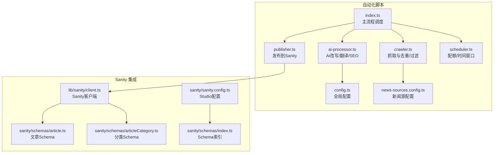
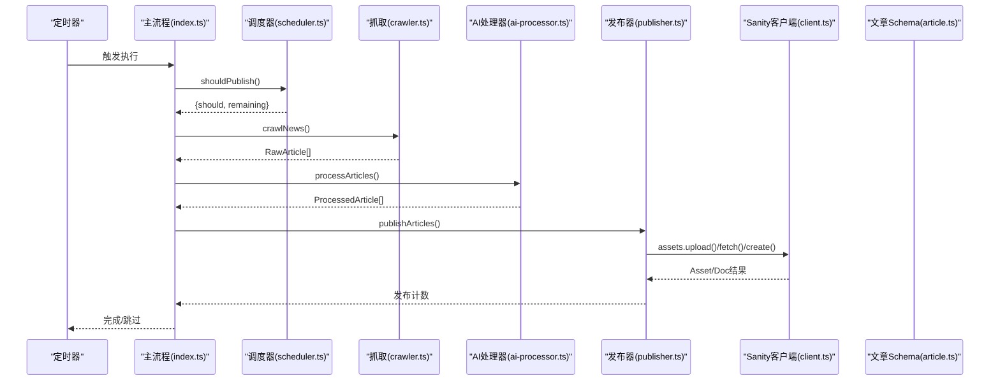
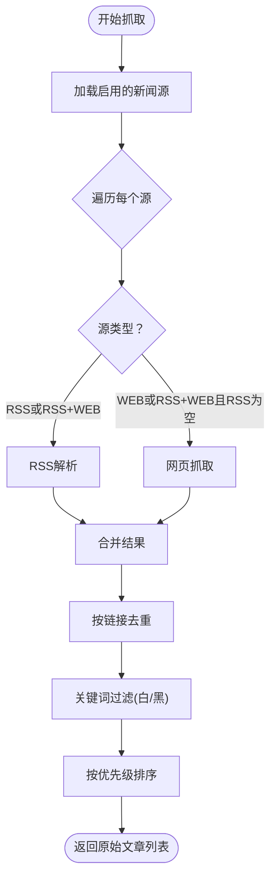
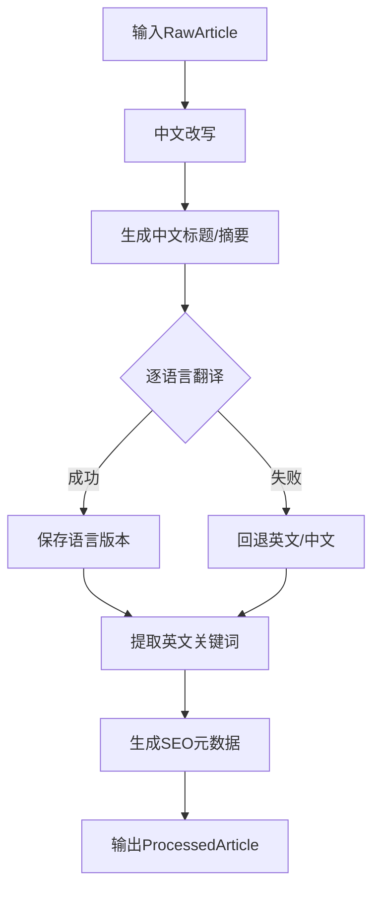
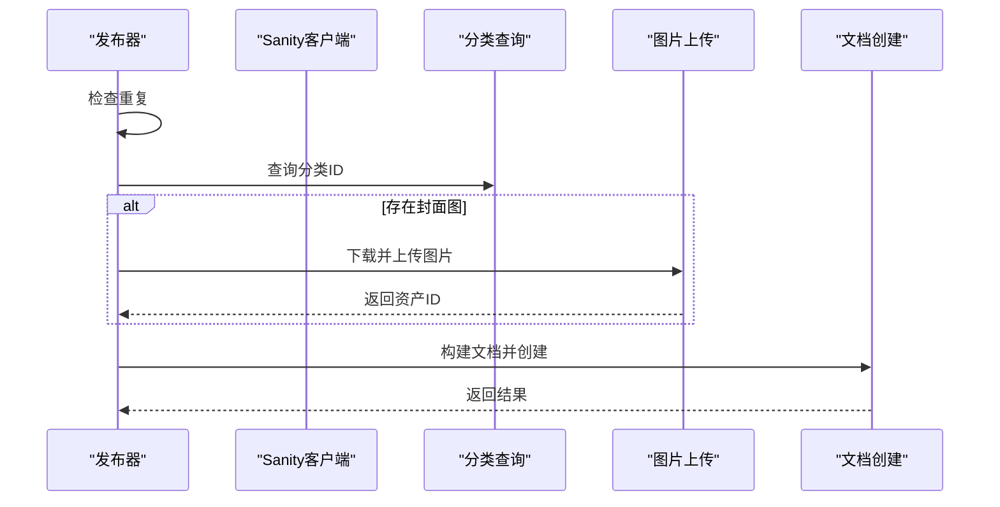
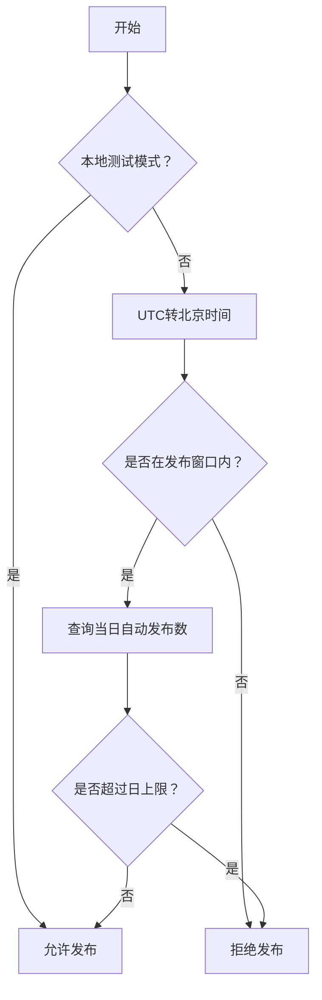
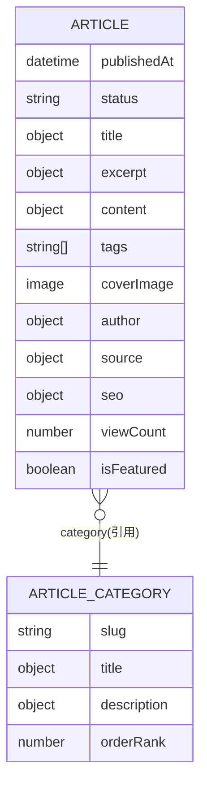
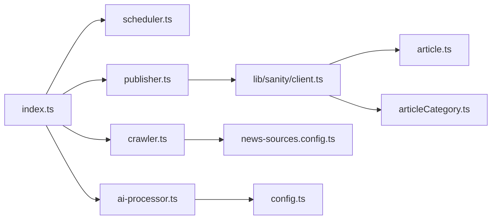

# 发布模块

<cite>
**本文引用的文件**
- [scripts/news-auto/publisher.ts](file://scripts/news-auto/publisher.ts)
- [scripts/news-auto/crawler.ts](file://scripts/news-auto/crawler.ts)
- [scripts/news-auto/scheduler.ts](file://scripts/news-auto/scheduler.ts)
- [scripts/news-auto/config.ts](file://scripts/news-auto/config.ts)
- [scripts/news-auto/news-sources.config.ts](file://scripts/news-auto/news-sources.config.ts)
- [scripts/news-auto/ai-processor.ts](file://scripts/news-auto/ai-processor.ts)
- [scripts/news-auto/index.ts](file://scripts/news-auto/index.ts)
- [lib/sanity/client.ts](file://lib/sanity/client.ts)
- [sanity/schemas/article.ts](file://sanity/schemas/article.ts)
- [sanity/schemas/articleCategory.ts](file://sanity/schemas/articleCategory.ts)
- [sanity/sanity.config.ts](file://sanity/sanity.config.ts)
- [sanity/schemas/index.ts](file://sanity/schemas/index.ts)
- [package.json](file://package.json)
</cite>

## 目录
1. [简介](#简介)
2. [项目结构](#项目结构)
3. [核心组件](#核心组件)
4. [架构总览](#架构总览)
5. [详细组件分析](#详细组件分析)
6. [依赖关系分析](#依赖关系分析)
7. [性能考量](#性能考量)
8. [故障排查指南](#故障排查指南)
9. [结论](#结论)
10. [附录](#附录)

## 简介
本发布模块面向“新闻自动化发布”场景，提供从新闻源抓取、AI改写与翻译、内容校验、Sanity CMS 集成到最终发布的完整链路。系统通过定时调度控制每日发布配额与时间窗口，自动去重与关键词过滤，确保发布内容的质量与合规性；同时对媒体资源进行下载与上传，构建符合 Sanity 文档模型的数据结构，并以“已发布”状态写入 CMS。

## 项目结构
发布模块位于 scripts/news-auto 目录，围绕“抓取-处理-发布”三阶段组织代码；Sanity Schema 定义了文章与分类的结构；客户端封装了 Sanity SDK 的初始化与工具方法；配置文件集中管理关键词、分类映射、目标语言与发布策略。

图表来源
- [scripts/news-auto/index.ts:1-83](file://scripts/news-auto/index.ts#L1-L83)
- [scripts/news-auto/crawler.ts:1-197](file://scripts/news-auto/crawler.ts#L1-L197)
- [scripts/news-auto/ai-processor.ts:1-232](file://scripts/news-auto/ai-processor.ts#L1-L232)
- [scripts/news-auto/publisher.ts:1-240](file://scripts/news-auto/publisher.ts#L1-L240)
- [scripts/news-auto/scheduler.ts:1-104](file://scripts/news-auto/scheduler.ts#L1-L104)
- [scripts/news-auto/config.ts:1-45](file://scripts/news-auto/config.ts#L1-L45)
- [scripts/news-auto/news-sources.config.ts:1-155](file://scripts/news-auto/news-sources.config.ts#L1-L155)
- [lib/sanity/client.ts:1-30](file://lib/sanity/client.ts#L1-L30)
- [sanity/schemas/article.ts:1-265](file://sanity/schemas/article.ts#L1-L265)
- [sanity/schemas/articleCategory.ts:1-59](file://sanity/schemas/articleCategory.ts#L1-L59)
- [sanity/sanity.config.ts:1-33](file://sanity/sanity.config.ts#L1-L33)
- [sanity/schemas/index.ts:1-9](file://sanity/schemas/index.ts#L1-L9)

章节来源
- [scripts/news-auto/index.ts:1-83](file://scripts/news-auto/index.ts#L1-L83)
- [package.json:1-45](file://package.json#L1-L45)

## 核心组件
- 新闻抓取器：支持 RSS 与网页两种抓取方式，自动提取标题、摘要、链接、图片与发布时间；具备去重与关键词过滤能力。
- AI 处理器：调用通义千问模型进行中文改写、多语言翻译、关键词抽取与摘要生成，产出多语言内容与 SEO 元数据。
- 发布器：构建 Sanity 文档对象，上传封面图至资产库，执行重复检测与分类引用解析，最终创建文档并标记为“已发布”。
- 调度器：基于北京时间的时间窗口与每日配额，决定是否允许发布，并计算剩余可发数量。
- 配置中心：集中管理关键词、分类映射、目标语言、AI 参数与发布策略；新闻源配置独立于抓取逻辑，便于维护。
- Sanity 客户端：封装 @sanity/client 初始化、图像 URL 工具与 API 版本设置；Schema 定义文章与分类字段及校验规则。

章节来源
- [scripts/news-auto/crawler.ts:1-197](file://scripts/news-auto/crawler.ts#L1-L197)
- [scripts/news-auto/ai-processor.ts:1-232](file://scripts/news-auto/ai-processor.ts#L1-L232)
- [scripts/news-auto/publisher.ts:1-240](file://scripts/news-auto/publisher.ts#L1-L240)
- [scripts/news-auto/scheduler.ts:1-104](file://scripts/news-auto/scheduler.ts#L1-L104)
- [scripts/news-auto/config.ts:1-45](file://scripts/news-auto/config.ts#L1-L45)
- [scripts/news-auto/news-sources.config.ts:1-155](file://scripts/news-auto/news-sources.config.ts#L1-L155)
- [lib/sanity/client.ts:1-30](file://lib/sanity/client.ts#L1-L30)
- [sanity/schemas/article.ts:1-265](file://sanity/schemas/article.ts#L1-L265)
- [sanity/schemas/articleCategory.ts:1-59](file://sanity/schemas/articleCategory.ts#L1-L59)

## 架构总览
发布流程从定时触发开始，依次完成“是否可发布”的判定、新闻抓取、AI 处理、构建发布数据与写入 Sanity。整个过程严格遵循配置约束与 Schema 规范，确保数据一致性与可维护性。

图表来源
- [scripts/news-auto/index.ts:1-83](file://scripts/news-auto/index.ts#L1-L83)
- [scripts/news-auto/scheduler.ts:1-104](file://scripts/news-auto/scheduler.ts#L1-L104)
- [scripts/news-auto/crawler.ts:1-197](file://scripts/news-auto/crawler.ts#L1-L197)
- [scripts/news-auto/ai-processor.ts:1-232](file://scripts/news-auto/ai-processor.ts#L1-L232)
- [scripts/news-auto/publisher.ts:1-240](file://scripts/news-auto/publisher.ts#L1-L240)
- [lib/sanity/client.ts:1-30](file://lib/sanity/client.ts#L1-L30)
- [sanity/schemas/article.ts:1-265](file://sanity/schemas/article.ts#L1-L265)

## 详细组件分析

### 抓取器（crawler.ts）
职责与流程
- 支持 RSS 与网页两种抓取方式，RSS 优先；若 RSS 失败则回退到网页抓取。
- 自动从 enclosure、media:content 或 HTML 内容中提取首张图片 URL。
- 基于链接去重，再按关键词白名单与黑名单过滤。
- 按新闻源优先级排序，保证高质量内容优先。

关键点
- RSS 解析与自定义 headers 支持，增强反爬兼容性。
- 网页抓取使用 Cheerio，支持相对路径转绝对路径。
- 关键词过滤采用大小写不敏感匹配，排除词优先。

图表来源
- [scripts/news-auto/crawler.ts:155-197](file://scripts/news-auto/crawler.ts#L155-L197)
- [scripts/news-auto/news-sources.config.ts:136-147](file://scripts/news-auto/news-sources.config.ts#L136-L147)

章节来源
- [scripts/news-auto/crawler.ts:1-197](file://scripts/news-auto/crawler.ts#L1-L197)
- [scripts/news-auto/news-sources.config.ts:1-155](file://scripts/news-auto/news-sources.config.ts#L1-L155)

### AI 处理器（ai-processor.ts）
职责与流程
- 调用通义千问模型进行中文改写、标题与摘要生成。
- 对中文内容进行多语言翻译，失败时回退到英文或中文。
- 提取英文关键词，生成 SEO 元数据（标题、描述、关键词）。
- 输出 ProcessedArticle 结构，供发布器使用。

关键点
- DASHSCOPE_API_KEY 必须配置，否则无法调用模型。
- 翻译失败时的回退策略，保障内容可用性。
- 严格控制输入提示词与输出格式，提升稳定性。

图表来源
- [scripts/news-auto/ai-processor.ts:153-211](file://scripts/news-auto/ai-processor.ts#L153-L211)

章节来源
- [scripts/news-auto/ai-processor.ts:1-232](file://scripts/news-auto/ai-processor.ts#L1-L232)

### 发布器（publisher.ts）
职责与流程
- 重复检测：基于标题查询现有文章，避免重复发布。
- 分类解析：根据分类名查询分类 ID，建立引用关系。
- 图片上传：从 URL 下载图片并上传至 Sanity 资产库，生成引用。
- 文档构建：按 Sanity Schema 组装文章对象，设置状态为“已发布”，填充作者、来源、SEO 等字段。
- 批量发布：支持并发控制与限流，逐条创建文档并统计成功数量。

关键点
- 严格遵循 Sanity 文档模型，字段映射与层级结构清晰。
- 错误处理与日志记录，便于定位问题。
- 限流与幂等设计，降低 API 压力与重复风险。

图表来源
- [scripts/news-auto/publisher.ts:58-212](file://scripts/news-auto/publisher.ts#L58-L212)
- [lib/sanity/client.ts:1-30](file://lib/sanity/client.ts#L1-L30)
- [sanity/schemas/article.ts:1-265](file://sanity/schemas/article.ts#L1-L265)

章节来源
- [scripts/news-auto/publisher.ts:1-240](file://scripts/news-auto/publisher.ts#L1-L240)

### 调度器（scheduler.ts）
职责与流程
- 时间窗口判断：将 UTC 时间转换为北京时间，考虑 Vercel Hobby 套餐 ±1 小时浮动，设定 ±90 分钟时间窗。
- 每日配额：查询当天已发布自动文章数量，与配置上限比较，决定是否允许发布。
- 配额计算：返回剩余可发布数量，供主流程裁剪处理数量。

关键点
- 支持本地测试绕过时间检查（通过环境变量）。
- 与 Sanity 查询结合，确保统计口径一致。

图表来源
- [scripts/news-auto/scheduler.ts:29-94](file://scripts/news-auto/scheduler.ts#L29-L94)

章节来源
- [scripts/news-auto/scheduler.ts:1-104](file://scripts/news-auto/scheduler.ts#L1-L104)

### 配置中心（config.ts 与 news-sources.config.ts）
- config.ts：集中管理发布上限、发布时间、关键词过滤、AI 参数、内容质量阈值、分类映射与目标语言。
- news-sources.config.ts：独立维护新闻源清单，支持 RSS/Web/RSS+WEB 三种类型，按优先级启用与排序，便于运维调整。

关键点
- 新闻源配置独立文件，无需改动抓取逻辑即可维护。
- 分类映射与目标语言统一管理，便于扩展与国际化。

章节来源
- [scripts/news-auto/config.ts:1-45](file://scripts/news-auto/config.ts#L1-L45)
- [scripts/news-auto/news-sources.config.ts:1-155](file://scripts/news-auto/news-sources.config.ts#L1-L155)

### Sanity 集成（schema 与客户端）
- 文章 Schema：定义多语言标题、摘要、正文、分类引用、标签、封面图、作者、发布时间、状态、来源、SEO、阅读统计与推荐标志等字段，并设置必填与校验规则。
- 分类 Schema：定义多语言分类名、URL 标识、描述与排序权重。
- 客户端：初始化 @sanity/client，设置 API 版本与令牌，提供图像 URL 工具方法。

图表来源
- [sanity/schemas/article.ts:1-265](file://sanity/schemas/article.ts#L1-L265)
- [sanity/schemas/articleCategory.ts:1-59](file://sanity/schemas/articleCategory.ts#L1-L59)

章节来源
- [sanity/schemas/article.ts:1-265](file://sanity/schemas/article.ts#L1-L265)
- [sanity/schemas/articleCategory.ts:1-59](file://sanity/schemas/articleCategory.ts#L1-L59)
- [lib/sanity/client.ts:1-30](file://lib/sanity/client.ts#L1-L30)

## 依赖关系分析
- 主流程依赖：index.ts 串联调度器、抓取器、AI 处理器与发布器。
- 发布器依赖：publisher.ts 依赖 lib/sanity/client.ts 与 Sanity Schema；需查询分类与上传资产。
- 配置依赖：config.ts 与 news-sources.config.ts 为各模块提供参数与策略。
- 外部依赖：axios、rss-parser、cheerio、@sanity/client、通义千问 API。

图表来源
- [scripts/news-auto/index.ts:1-83](file://scripts/news-auto/index.ts#L1-L83)
- [scripts/news-auto/scheduler.ts:1-104](file://scripts/news-auto/scheduler.ts#L1-L104)
- [scripts/news-auto/crawler.ts:1-197](file://scripts/news-auto/crawler.ts#L1-L197)
- [scripts/news-auto/ai-processor.ts:1-232](file://scripts/news-auto/ai-processor.ts#L1-L232)
- [scripts/news-auto/publisher.ts:1-240](file://scripts/news-auto/publisher.ts#L1-L240)
- [lib/sanity/client.ts:1-30](file://lib/sanity/client.ts#L1-L30)
- [sanity/schemas/article.ts:1-265](file://sanity/schemas/article.ts#L1-L265)
- [sanity/schemas/articleCategory.ts:1-59](file://sanity/schemas/articleCategory.ts#L1-L59)
- [scripts/news-auto/news-sources.config.ts:1-155](file://scripts/news-auto/news-sources.config.ts#L1-L155)
- [scripts/news-auto/config.ts:1-45](file://scripts/news-auto/config.ts#L1-L45)

章节来源
- [package.json:1-45](file://package.json#L1-L45)

## 性能考量
- 限流与节流：发布器与 AI 处理器均内置延时，避免触发第三方 API 限流与网络拥塞。
- 去重与过滤：抓取阶段即去重与关键词过滤，减少无效处理与写入。
- 并发控制：批量发布时逐条创建，避免一次性高负载。
- 缓存与复用：建议在外部缓存热点图片 URL 与翻译结果，降低重复请求成本（当前实现未内置缓存）。

## 故障排查指南
常见问题与处理
- 通义千问 API 失败
  - 现象：AI 处理报错或返回空内容。
  - 排查：确认 DASHSCOPE_API_KEY 是否配置；检查网络连通性与超时设置。
  - 参考路径：[scripts/news-auto/ai-processor.ts:19-58](file://scripts/news-auto/ai-processor.ts#L19-L58)
- Sanity 写入失败
  - 现象：发布器创建失败或图片上传异常。
  - 排查：检查 SANITY_API_TOKEN 与项目/数据集配置；确认分类是否存在；查看网络与 CDN 设置。
  - 参考路径：[lib/sanity/client.ts:1-30](file://lib/sanity/client.ts#L1-L30)，[scripts/news-auto/publisher.ts:27-55](file://scripts/news-auto/publisher.ts#L27-L55)
- 新闻源抓取失败
  - 现象：RSS 解析错误或网页抓取返回空。
  - 排查：检查新闻源 headers（UA 等）、selector 与 RSS 地址；确认站点可用性。
  - 参考路径：[scripts/news-auto/crawler.ts:22-65](file://scripts/news-auto/crawler.ts#L22-L65)，[scripts/news-auto/news-sources.config.ts:136-147](file://scripts/news-auto/news-sources.config.ts#L136-L147)
- 时间窗口与配额限制
  - 现象：定时任务未执行或提前结束。
  - 排查：确认北京时间换算与 ±90 分钟窗口；检查当日自动发布计数与上限配置。
  - 参考路径：[scripts/news-auto/scheduler.ts:29-94](file://scripts/news-auto/scheduler.ts#L29-L94)
- 重复发布
  - 现象：日志提示已存在但未阻止发布。
  - 排查：确认标题比对逻辑与数据库查询条件；必要时增加更严格的去重策略。
  - 参考路径：[scripts/news-auto/publisher.ts:14-18](file://scripts/news-auto/publisher.ts#L14-L18)

章节来源
- [scripts/news-auto/ai-processor.ts:19-58](file://scripts/news-auto/ai-processor.ts#L19-L58)
- [lib/sanity/client.ts:1-30](file://lib/sanity/client.ts#L1-L30)
- [scripts/news-auto/publisher.ts:27-55](file://scripts/news-auto/publisher.ts#L27-L55)
- [scripts/news-auto/crawler.ts:22-65](file://scripts/news-auto/crawler.ts#L22-L65)
- [scripts/news-auto/news-sources.config.ts:136-147](file://scripts/news-auto/news-sources.config.ts#L136-L147)
- [scripts/news-auto/scheduler.ts:29-94](file://scripts/news-auto/scheduler.ts#L29-L94)

## 结论
本发布模块通过清晰的分层设计与严格的配置管理，实现了从新闻源抓取到 AI 处理再到 Sanity 写入的全链路自动化。其核心优势在于：
- 可维护性强：新闻源与配置独立文件，便于运维调整。
- 质量可控：关键词过滤、内容长度与密度阈值、翻译回退策略。
- 稳健可靠：重复检测、限流与错误日志、时间窗口与配额控制。
建议后续增强：引入缓存层与重试机制、完善发布回滚与审计日志、扩展分类与标签的自动识别能力。

## 附录

### 使用与配置指南
- 环境变量
  - DASHSCOPE_API_KEY：通义千问 API 访问密钥。
  - SANITY_API_TOKEN：Sanity 写入令牌。
  - NEWS_BYPASS_TIME_CHECK：本地测试时绕过时间窗口检查（可选）。
- 发布权限与审核
  - 当前实现直接以“已发布”状态写入；如需审核流程，可在 Schema 中新增状态枚举并在发布器中切换。
- 内容审核流程建议
  - 引入“草稿/定时发布”状态，配合 Sanity Desk Tool 进行人工审核后再转“已发布”。
- 发布模板配置
  - 在 Sanity Studio 中通过 Desk Tool 配置文章与分类的默认值、校验规则与预览项。
- 数据同步与迁移
  - 使用 Sanity CLI 导出/导入数据，或通过脚本批量迁移历史内容。

章节来源
- [scripts/news-auto/config.ts:6-34](file://scripts/news-auto/config.ts#L6-L34)
- [sanity/sanity.config.ts:1-33](file://sanity/sanity.config.ts#L1-L33)
- [sanity/schemas/article.ts:162-173](file://sanity/schemas/article.ts#L162-L173)