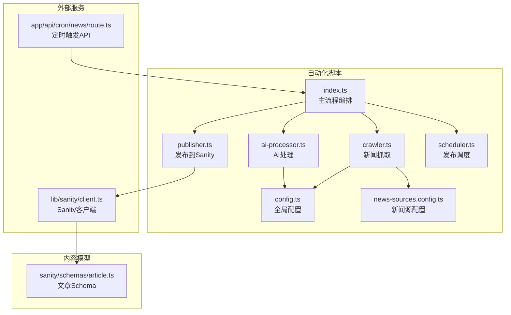
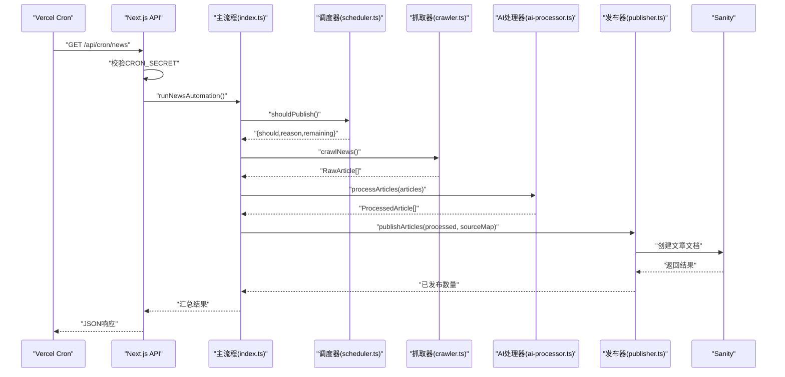
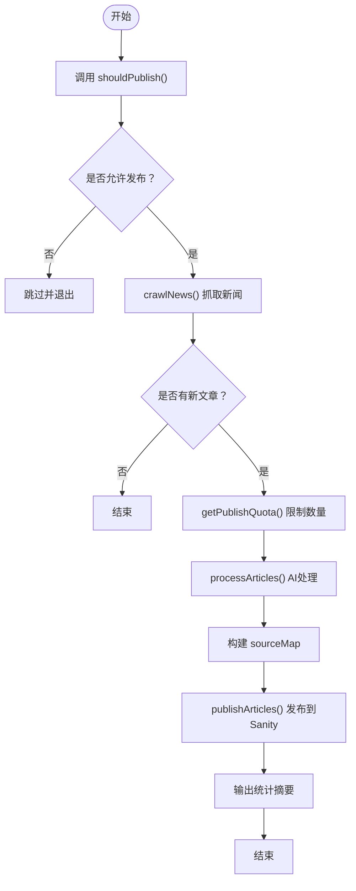
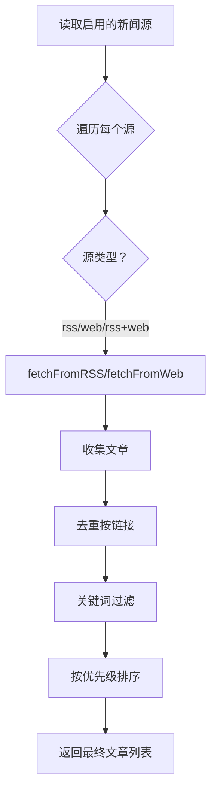
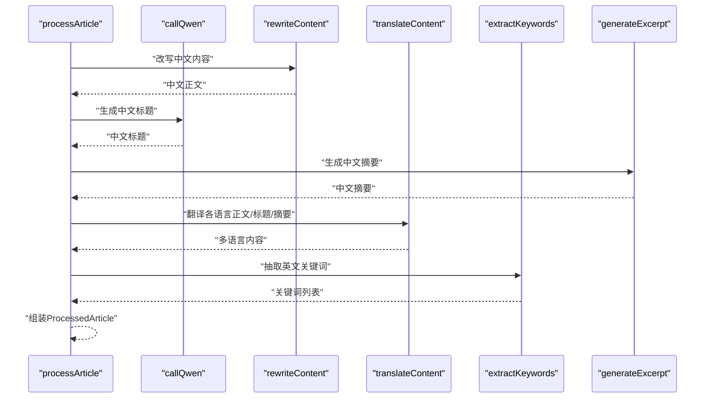
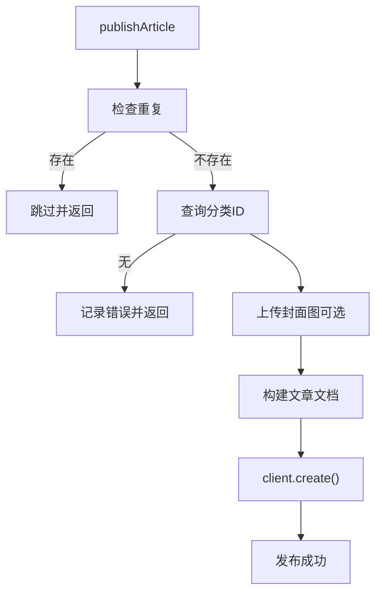
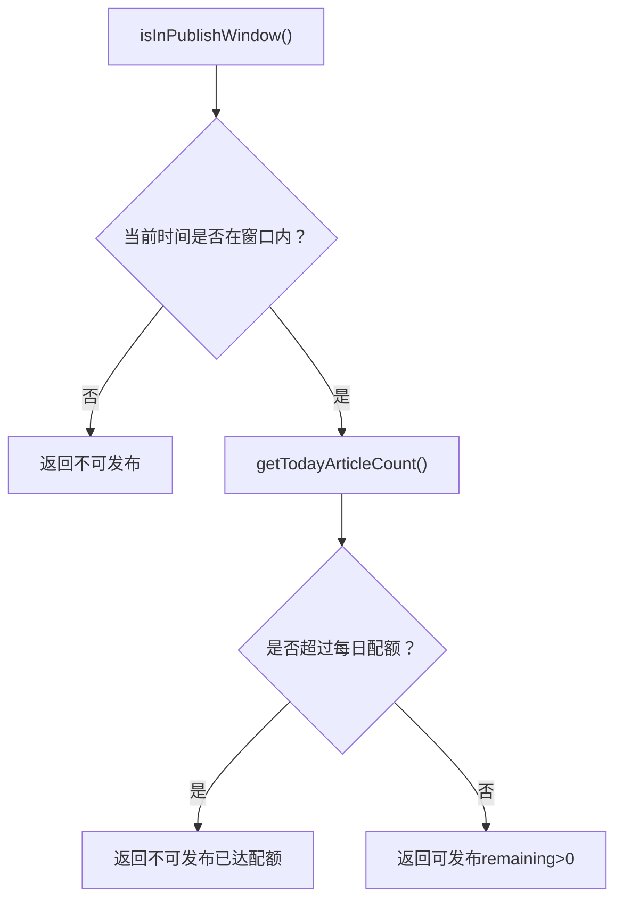
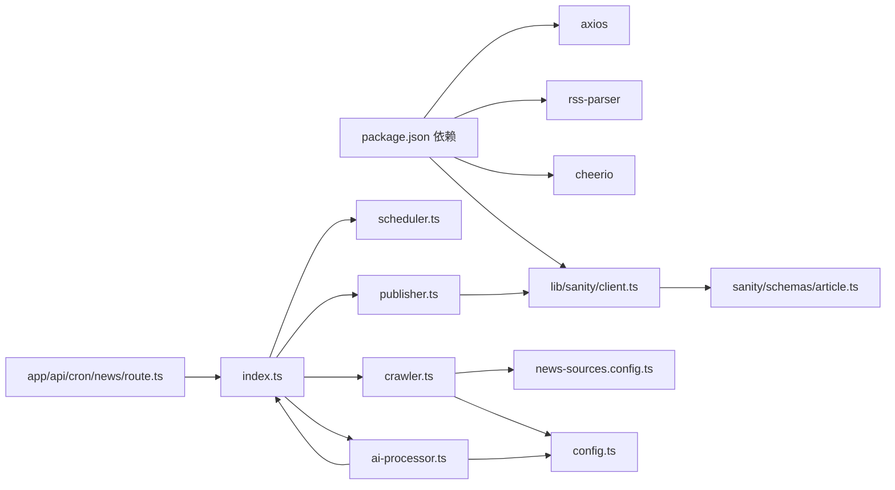

# 新闻自动爬取系统

<cite>
**本文引用的文件**
- [scripts/news-auto/index.ts](file://scripts/news-auto/index.ts)
- [scripts/news-auto/crawler.ts](file://scripts/news-auto/crawler.ts)
- [scripts/news-auto/ai-processor.ts](file://scripts/news-auto/ai-processor.ts)
- [scripts/news-auto/publisher.ts](file://scripts/news-auto/publisher.ts)
- [scripts/news-auto/scheduler.ts](file://scripts/news-auto/scheduler.ts)
- [scripts/news-auto/config.ts](file://scripts/news-auto/config.ts)
- [scripts/news-auto/news-sources.config.ts](file://scripts/news-auto/news-sources.config.ts)
- [lib/sanity/client.ts](file://lib/sanity/client.ts)
- [sanity/schemas/article.ts](file://sanity/schemas/article.ts)
- [app/api/cron/news/route.ts](file://app/api/cron/news/route.ts)
- [scripts/test-news.js](file://scripts/test-news.js)
- [package.json](file://package.json)
</cite>

## 目录
1. [简介](#简介)
2. [项目结构](#项目结构)
3. [核心组件](#核心组件)
4. [架构总览](#架构总览)
5. [详细组件分析](#详细组件分析)
6. [依赖关系分析](#依赖关系分析)
7. [性能考量](#性能考量)
8. [故障排除指南](#故障排除指南)
9. [结论](#结论)
10. [附录](#附录)

## 简介
本系统是一个面向LED行业的新闻自动爬取与发布平台，具备以下能力：
- 多源新闻采集：支持RSS与网页两种抓取方式，内置关键词过滤与去重
- AI智能处理：基于通义千问模型进行内容改写、摘要生成、关键词抽取与多语言翻译
- 发布调度：基于北京时间的时间窗口与每日配额的发布控制
- 自动发布：将处理后的文章发布至Sanity内容管理平台，支持多语言内容结构
- 定时任务：通过Vercel Cron触发自动化流程，具备安全校验与错误处理

## 项目结构
新闻自动爬取系统的核心代码位于 scripts/news-auto 目录，配合Sanity内容模型与Next.js API路由实现端到端自动化。

**图表来源**
- [scripts/news-auto/index.ts:1-83](file://scripts/news-auto/index.ts#L1-L83)
- [scripts/news-auto/crawler.ts:1-197](file://scripts/news-auto/crawler.ts#L1-L197)
- [scripts/news-auto/ai-processor.ts:1-232](file://scripts/news-auto/ai-processor.ts#L1-L232)
- [scripts/news-auto/publisher.ts:1-240](file://scripts/news-auto/publisher.ts#L1-L240)
- [scripts/news-auto/scheduler.ts:1-104](file://scripts/news-auto/scheduler.ts#L1-L104)
- [scripts/news-auto/config.ts:1-45](file://scripts/news-auto/config.ts#L1-L45)
- [scripts/news-auto/news-sources.config.ts:1-155](file://scripts/news-auto/news-sources.config.ts#L1-L155)
- [lib/sanity/client.ts:1-30](file://lib/sanity/client.ts#L1-L30)
- [sanity/schemas/article.ts:1-265](file://sanity/schemas/article.ts#L1-L265)
- [app/api/cron/news/route.ts:1-52](file://app/api/cron/news/route.ts#L1-L52)

**章节来源**
- [scripts/news-auto/index.ts:1-83](file://scripts/news-auto/index.ts#L1-L83)
- [package.json:1-45](file://package.json#L1-L45)

## 核心组件
- 主流程编排：负责按顺序执行发布检查、抓取、AI处理、构建sourceMap与发布，并输出汇总信息
- 新闻抓取器：从RSS与网页两类源抓取，支持自定义headers、图片提取、关键词过滤与去重
- AI处理器：调用通义千问API完成内容改写、标题与摘要生成、多语言翻译、关键词抽取与SEO信息生成
- 发布器：将处理后的文章发布到Sanity，包含重复检测、分类查询、图片上传与文档构建
- 调度器：基于北京时间的时间窗口与每日配额控制发布时机
- 配置中心：集中管理发布策略、关键词过滤、AI参数与目标语言
- 新闻源配置：独立维护新闻源列表，支持启用/停用、优先级、类型与请求头

**章节来源**
- [scripts/news-auto/index.ts:9-69](file://scripts/news-auto/index.ts#L9-L69)
- [scripts/news-auto/crawler.ts:155-196](file://scripts/news-auto/crawler.ts#L155-L196)
- [scripts/news-auto/ai-processor.ts:153-231](file://scripts/news-auto/ai-processor.ts#L153-L231)
- [scripts/news-auto/publisher.ts:58-239](file://scripts/news-auto/publisher.ts#L58-L239)
- [scripts/news-auto/scheduler.ts:67-103](file://scripts/news-auto/scheduler.ts#L67-L103)
- [scripts/news-auto/config.ts:6-45](file://scripts/news-auto/config.ts#L6-L45)
- [scripts/news-auto/news-sources.config.ts:46-155](file://scripts/news-auto/news-sources.config.ts#L46-L155)

## 架构总览
系统采用“定时触发 → 流程编排 → 数据采集 → AI处理 → 发布入库”的流水线式架构。定时任务通过Vercel Cron调用Next.js API，API层进行权限校验后启动自动化流程；流程内部通过配置中心统一管理策略，通过独立的新闻源配置文件实现灵活扩展。

**图表来源**
- [app/api/cron/news/route.ts:5-46](file://app/api/cron/news/route.ts#L5-L46)
- [scripts/news-auto/index.ts:9-69](file://scripts/news-auto/index.ts#L9-L69)
- [scripts/news-auto/scheduler.ts:67-94](file://scripts/news-auto/scheduler.ts#L67-L94)
- [scripts/news-auto/crawler.ts:155-196](file://scripts/news-auto/crawler.ts#L155-L196)
- [scripts/news-auto/ai-processor.ts:215-231](file://scripts/news-auto/ai-processor.ts#L215-L231)
- [scripts/news-auto/publisher.ts:215-239](file://scripts/news-auto/publisher.ts#L215-L239)

## 详细组件分析

### 主流程编排（index.ts）
- 功能要点
  - 输出运行时间（UTC与北京时间）
  - 调用调度器判断是否允许发布与剩余配额
  - 抓取新闻并按配额裁剪
  - 构建sourceMap用于发布时回填来源信息
  - 发布到Sanity并输出统计摘要
- 错误处理
  - 捕获异常并抛出，便于上层API返回错误

**图表来源**
- [scripts/news-auto/index.ts:9-69](file://scripts/news-auto/index.ts#L9-L69)

**章节来源**
- [scripts/news-auto/index.ts:9-69](file://scripts/news-auto/index.ts#L9-L69)

### 新闻抓取器（crawler.ts）
- 数据源类型
  - RSS：解析RSS条目，提取标题、链接、内容、摘要、发布时间、图片
  - 网页：基于CSS选择器批量提取文章块，拼接相对链接与图片URL
- 关键策略
  - 关键词过滤：支持必需词与排除词
  - 去重：基于链接去重
  - 排序：依据新闻源优先级排序
- 反爬虫策略
  - 支持自定义headers（如User-Agent），合并默认UA与配置项
  - RSS解析支持自定义headers
  - 超时控制与错误捕获

**图表来源**
- [scripts/news-auto/crawler.ts:155-196](file://scripts/news-auto/crawler.ts#L155-L196)
- [scripts/news-auto/news-sources.config.ts:136-140](file://scripts/news-auto/news-sources.config.ts#L136-L140)

**章节来源**
- [scripts/news-auto/crawler.ts:21-196](file://scripts/news-auto/crawler.ts#L21-L196)
- [scripts/news-auto/news-sources.config.ts:46-155](file://scripts/news-auto/news-sources.config.ts#L46-L155)

### AI处理器（ai-processor.ts）
- 处理流程
  - 内容改写：生成专业中文行业资讯
  - 标题与摘要：生成吸引人的标题与列表摘要
  - 多语言翻译：对标题、摘要与正文进行多语言翻译
  - 关键词抽取：提取英文SEO关键词
  - SEO信息：生成多语言metaTitle与metaDescription
- API调用
  - 通义千问API（qwen-turbo），支持超时与错误处理
  - 环境变量：DASHSCOPE_API_KEY
- 限流与健壮性
  - 处理间隔延时，避免API限流
  - 单个语言翻译失败时的降级策略（回退到英文或中文）

**图表来源**
- [scripts/news-auto/ai-processor.ts:153-231](file://scripts/news-auto/ai-processor.ts#L153-L231)

**章节来源**
- [scripts/news-auto/ai-processor.ts:18-58](file://scripts/news-auto/ai-processor.ts#L18-L58)
- [scripts/news-auto/ai-processor.ts:60-150](file://scripts/news-auto/ai-processor.ts#L60-L150)
- [scripts/news-auto/ai-processor.ts:153-231](file://scripts/news-auto/ai-processor.ts#L153-L231)

### 发布器（publisher.ts）
- 发布流程
  - 重复检测：按中文标题查询是否存在
  - 分类查询：根据分类别名获取Sanity分类ID
  - 图片上传：下载并上传封面图到Sanity资产
  - 文档构建：按多语言结构构建文章内容块
  - 创建文档：写入Sanity
- 错误处理
  - 重复、分类缺失、图片下载/上传失败均有相应日志与降级

**图表来源**
- [scripts/news-auto/publisher.ts:58-239](file://scripts/news-auto/publisher.ts#L58-L239)

**章节来源**
- [scripts/news-auto/publisher.ts:14-239](file://scripts/news-auto/publisher.ts#L14-L239)
- [lib/sanity/client.ts:1-30](file://lib/sanity/client.ts#L1-L30)
- [sanity/schemas/article.ts:1-265](file://sanity/schemas/article.ts#L1-L265)

### 调度器（scheduler.ts）
- 时间窗口控制
  - 将UTC时间转换为北京时间（UTC+8）
  - 考虑Vercel Hobby套餐±1小时浮动，设置90分钟时间窗口
  - 支持本地测试模式绕过时间检查（通过环境变量）
- 配额管理
  - 查询当日已发布数量（仅统计自动来源）
  - 与最大每日配额比较，计算剩余配额
- 返回结构
  - should、reason、remaining，供主流程决策

**图表来源**
- [scripts/news-auto/scheduler.ts:29-60](file://scripts/news-auto/scheduler.ts#L29-L60)
- [scripts/news-auto/scheduler.ts:67-103](file://scripts/news-auto/scheduler.ts#L67-L103)

**章节来源**
- [scripts/news-auto/scheduler.ts:29-103](file://scripts/news-auto/scheduler.ts#L29-L103)

### 配置中心（config.ts）
- 发布策略：最大每日文章数、发布时间点、自动发布开关
- 关键词过滤：必需词、可选词、排除词
- AI参数：模型、最大Token、温度
- 目标语言：zh/en/id/th/vi/ar
- 分类映射：用于新闻源分类到文章分类的映射

**章节来源**
- [scripts/news-auto/config.ts:6-45](file://scripts/news-auto/config.ts#L6-L45)

### 新闻源配置（news-sources.config.ts）
- 结构定义：名称、URL、类型（rss/web/rss+web）、RSS地址、CSS选择器、分类、语言、优先级、启用状态、备注、自定义headers
- 工具函数：获取启用源、按分类/语言筛选
- 维护建议：新增源在数组中添加对象，停用设为disabled，调整优先级以控制抓取顺序

**章节来源**
- [scripts/news-auto/news-sources.config.ts:17-155](file://scripts/news-auto/news-sources.config.ts#L17-L155)

## 依赖关系分析
- 外部依赖
  - rss-parser：RSS解析
  - axios/cheerio：HTTP请求与HTML解析
  - @sanity/client：Sanity写入
  - dotenv：环境变量加载
- 内部耦合
  - 主流程依赖调度器、抓取器、AI处理器、发布器
  - 抓取器依赖新闻源配置与全局配置
  - 发布器依赖Sanity客户端与文章Schema
  - API路由依赖主流程并进行安全校验

**图表来源**
- [package.json:12-28](file://package.json#L12-L28)
- [scripts/news-auto/index.ts:1-7](file://scripts/news-auto/index.ts#L1-L7)
- [scripts/news-auto/crawler.ts:1-5](file://scripts/news-auto/crawler.ts#L1-L5)
- [scripts/news-auto/ai-processor.ts:1-3](file://scripts/news-auto/ai-processor.ts#L1-L3)
- [scripts/news-auto/publisher.ts:1](file://scripts/news-auto/publisher.ts#L1)
- [lib/sanity/client.ts:1-18](file://lib/sanity/client.ts#L1-L18)
- [sanity/schemas/article.ts:1-2](file://sanity/schemas/article.ts#L1-L2)
- [app/api/cron/news/route.ts:2](file://app/api/cron/news/route.ts#L2)

**章节来源**
- [package.json:12-28](file://package.json#L12-L28)

## 性能考量
- 抓取阶段
  - 控制每源抓取数量（截断前N条），降低后续处理压力
  - 去重与关键词过滤减少无效内容
- AI处理阶段
  - 为避免API限流，处理间隔增加延时
  - 多语言翻译失败时快速降级，保证整体吞吐
- 发布阶段
  - 图片下载与上传为IO密集型，注意网络稳定性
  - 批量发布时加入延时，避免写入限流
- 配置优化
  - 合理设置每日配额与发布时间点，避免高峰期拥堵
  - 优先级高的源先抓取，提升命中率

[本节为通用性能建议，不涉及具体文件分析]

## 故障排除指南
- API密钥缺失
  - 现象：AI处理报错提示缺少API Key
  - 处理：确保环境变量DASHSCOPE_API_KEY已配置
- 定时任务未触发
  - 现象：API返回未授权或流程未执行
  - 处理：确认CRON_SECRET配置正确，且请求头匹配
- 发布失败
  - 现象：分类ID为空、图片上传失败、重复文章
  - 处理：检查文章分类是否存在、图片URL可访问、中文标题唯一性
- 时间窗口不生效
  - 现象：Vercel Hobby套餐时间浮动导致未在窗口内
  - 处理：接受±90分钟窗口；本地测试可开启绕过时间检查
- 新闻源不可用
  - 现象：RSS解析失败或网页抓取无结果
  - 处理：检查RSS地址、选择器有效性、必要时添加自定义headers伪装UA

**章节来源**
- [app/api/cron/news/route.ts:20-26](file://app/api/cron/news/route.ts#L20-L26)
- [scripts/news-auto/ai-processor.ts:22-24](file://scripts/news-auto/ai-processor.ts#L22-L24)
- [scripts/news-auto/publisher.ts:14-18](file://scripts/news-auto/publisher.ts#L14-L18)
- [scripts/news-auto/scheduler.ts:29-60](file://scripts/news-auto/scheduler.ts#L29-L60)
- [scripts/news-auto/crawler.ts:26-29](file://scripts/news-auto/crawler.ts#L26-L29)

## 结论
本系统通过清晰的模块划分与独立配置，实现了从新闻采集、AI智能处理到自动发布的完整闭环。其设计具备良好的可维护性与扩展性：新闻源配置独立于抓取逻辑，调度策略与AI参数集中管理，发布流程与内容模型解耦。结合定时任务的安全校验与完善的错误处理，能够在生产环境中稳定运行。

[本节为总结性内容，不涉及具体文件分析]

## 附录

### 配置示例与使用指南
- 环境变量
  - DASHSCOPE_API_KEY：通义千问API密钥
  - SANITY_API_TOKEN：Sanity写入令牌
  - CRON_SECRET：定时任务访问密钥
  - NEWS_BYPASS_TIME_CHECK：本地测试时绕过时间窗口检查（可选）
- 定时任务配置（Vercel Cron）
  - 在部署平台配置定时触发，指向 /api/cron/news
  - 请求头需携带 Authorization: Bearer {CRON_SECRET}
- 新闻源维护
  - 在 news-sources.config.ts 中新增/停用/调整优先级
  - 仅RSS：type='rss' 并填写 rss
  - 仅网页：type='web' 并填写 selector
  - RSS+网页：type='rss+web'，优先RSS，失败则回退网页
- 关键词过滤
  - required：至少包含一个
  - exclude：全部排除
  - optional：辅助筛选（不影响发布）
- AI参数
  - model：qwen-turbo
  - maxTokens：控制输出长度
  - temperature：控制创造性
- 目标语言
  - zh/en/id/th/vi/ar

**章节来源**
- [scripts/news-auto/config.ts:6-45](file://scripts/news-auto/config.ts#L6-L45)
- [scripts/news-auto/news-sources.config.ts:46-155](file://scripts/news-auto/news-sources.config.ts#L46-L155)
- [app/api/cron/news/route.ts:7-15](file://app/api/cron/news/route.ts#L7-L15)

### 数据模型概览（Sanity）
- 文章Schema支持6种语言的标题、摘要与正文
- 分类为引用类型，关联文章分类
- SEO字段包含多语言metaTitle与metaDescription
- 发布状态、发布时间、来源信息（含是否AI生成）

**章节来源**
- [sanity/schemas/article.ts:8-247](file://sanity/schemas/article.ts#L8-L247)

### 测试与验证
- 快速测试RSS抓取：使用 test-news.js 验证RSS可用性与关键词匹配
- 本地开发：可临时设置绕过时间检查以便调试

**章节来源**
- [scripts/test-news.js:1-40](file://scripts/test-news.js#L1-L40)