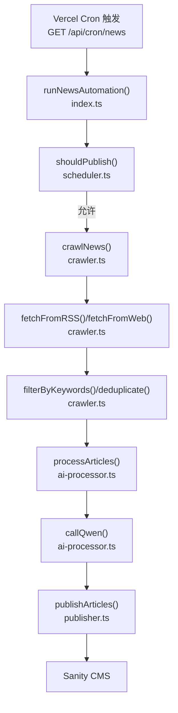
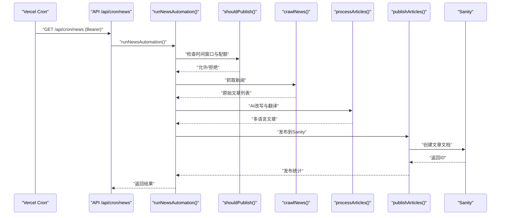
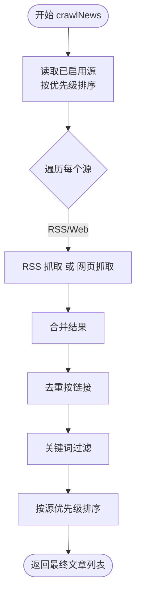
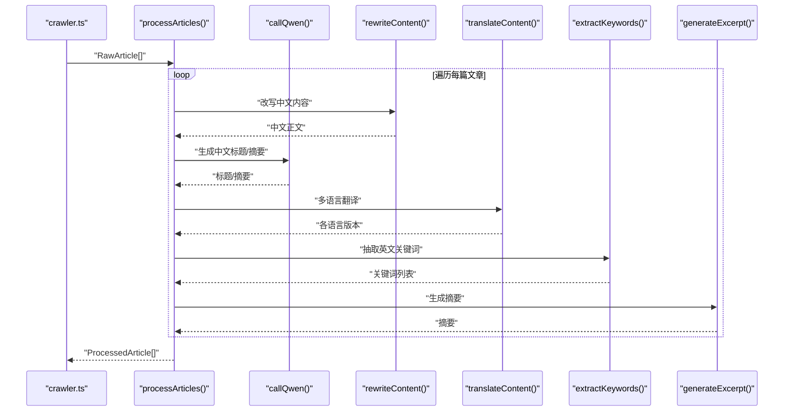
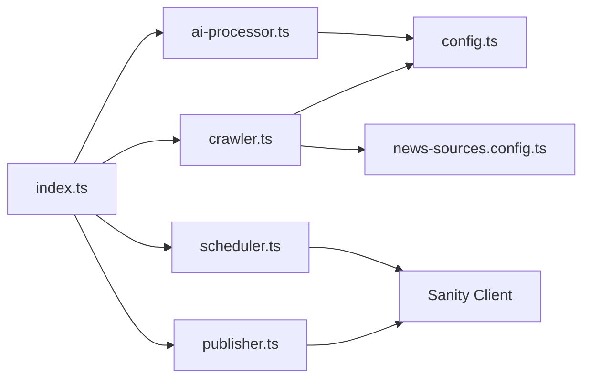

# 爬虫模块

<cite>
**本文引用的文件**
- [scripts/news-auto/crawler.ts](file://scripts/news-auto/crawler.ts)
- [scripts/news-auto/news-sources.config.ts](file://scripts/news-auto/news-sources.config.ts)
- [scripts/news-auto/config.ts](file://scripts/news-auto/config.ts)
- [scripts/news-auto/scheduler.ts](file://scripts/news-auto/scheduler.ts)
- [scripts/news-auto/publisher.ts](file://scripts/news-auto/publisher.ts)
- [scripts/news-auto/ai-processor.ts](file://scripts/news-auto/ai-processor.ts)
- [scripts/news-auto/index.ts](file://scripts/news-auto/index.ts)
- [app/api/cron/news/route.ts](file://app/api/cron/news/route.ts)
- [scripts/test-news.js](file://scripts/test-news.js)
- [scripts/crawler/README.md](file://scripts/crawler/README.md)
- [scripts/crawler/transform-and-import.ts](file://scripts/crawler/transform-and-import.ts)
</cite>

## 目录
1. [简介](#简介)
2. [项目结构](#项目结构)
3. [核心组件](#核心组件)
4. [架构总览](#架构总览)
5. [详细组件分析](#详细组件分析)
6. [依赖关系分析](#依赖关系分析)
7. [性能考量](#性能考量)
8. [故障排查指南](#故障排查指南)
9. [结论](#结论)
10. [附录](#附录)

## 简介
本文件为“新闻自动采集与发布”子系统的完整技术文档，覆盖新闻爬取架构、数据源配置、内容提取算法、反爬虫策略、请求处理机制、内容清洗与AI改写、发布到CMS的全流程。系统采用RSS与网页两种抓取模式，支持关键词过滤、去重、按优先级排序，并通过定时任务在Vercel Cron上触发执行。最终将处理后的文章发布至Sanity CMS。

## 项目结构
新闻自动化脚本位于 scripts/news-auto 目录，核心文件如下：
- crawler.ts：抓取入口与RSS/网页抓取、关键词过滤、去重、排序
- news-sources.config.ts：新闻源独立配置文件（RSS地址、网页选择器、语言、分类、优先级、headers）
- config.ts：全局配置（发布策略、关键词、AI模型、内容质量阈值）
- scheduler.ts：定时调度与配额控制（时间窗口、每日限额）
- ai-processor.ts：AI改写、多语言翻译、关键词抽取、SEO信息生成
- publisher.ts：发布到Sanity（去重检查、分类查找、图片上传、文档构建）
- index.ts：主流程编排（检查配额→抓取→AI处理→发布）
- app/api/cron/news/route.ts：Vercel Cron触发入口（鉴权、密钥检查、执行）



图表来源
- [app/api/cron/news/route.ts:1-52](file://app/api/cron/news/route.ts#L1-L52)
- [scripts/news-auto/index.ts:1-83](file://scripts/news-auto/index.ts#L1-L83)
- [scripts/news-auto/scheduler.ts:1-104](file://scripts/news-auto/scheduler.ts#L1-L104)
- [scripts/news-auto/crawler.ts:1-197](file://scripts/news-auto/crawler.ts#L1-L197)
- [scripts/news-auto/ai-processor.ts:1-232](file://scripts/news-auto/ai-processor.ts#L1-L232)
- [scripts/news-auto/publisher.ts:1-240](file://scripts/news-auto/publisher.ts#L1-L240)

章节来源
- [scripts/news-auto/crawler.ts:1-197](file://scripts/news-auto/crawler.ts#L1-L197)
- [scripts/news-auto/news-sources.config.ts:1-155](file://scripts/news-auto/news-sources.config.ts#L1-L155)
- [scripts/news-auto/config.ts:1-45](file://scripts/news-auto/config.ts#L1-L45)
- [scripts/news-auto/scheduler.ts:1-104](file://scripts/news-auto/scheduler.ts#L1-L104)
- [scripts/news-auto/ai-processor.ts:1-232](file://scripts/news-auto/ai-processor.ts#L1-L232)
- [scripts/news-auto/publisher.ts:1-240](file://scripts/news-auto/publisher.ts#L1-L240)
- [scripts/news-auto/index.ts:1-83](file://scripts/news-auto/index.ts#L1-L83)
- [app/api/cron/news/route.ts:1-52](file://app/api/cron/news/route.ts#L1-L52)

## 核心组件
- 新闻源配置模块：独立配置文件，集中管理RSS地址、网页选择器、语言、分类、优先级、headers等
- 抓取引擎：支持RSS与网页两种模式；RSS优先，若无结果则回退到网页抓取
- 内容处理：关键词过滤、去重、按源优先级排序
- AI处理：中文改写、多语言翻译、关键词抽取、SEO信息生成
- 发布模块：去重检查、分类解析、图片下载上传、Sanity文档构建与创建
- 调度模块：基于北京时间的时间窗口与每日配额控制
- 触发入口：Vercel Cron API，带鉴权与密钥检查

章节来源
- [scripts/news-auto/news-sources.config.ts:13-155](file://scripts/news-auto/news-sources.config.ts#L13-L155)
- [scripts/news-auto/crawler.ts:155-197](file://scripts/news-auto/crawler.ts#L155-L197)
- [scripts/news-auto/ai-processor.ts:153-232](file://scripts/news-auto/ai-processor.ts#L153-L232)
- [scripts/news-auto/publisher.ts:58-240](file://scripts/news-auto/publisher.ts#L58-L240)
- [scripts/news-auto/scheduler.ts:29-104](file://scripts/news-auto/scheduler.ts#L29-L104)
- [app/api/cron/news/route.ts:5-52](file://app/api/cron/news/route.ts#L5-L52)

## 架构总览
系统采用“配置驱动 + 流水线处理”的架构：
- 配置层：news-sources.config.ts集中管理所有新闻源
- 抓取层：crawler.ts负责RSS与网页抓取，提取标题、链接、摘要、内容、封面图
- 过滤层：去重与关键词过滤，确保质量
- 处理层：ai-processor.ts通过通义千问API进行改写与翻译
- 发布层：publisher.ts将处理结果发布到Sanity
- 调度层：scheduler.ts控制发布时间窗口与每日配额
- 触发层：app/api/cron/news/route.ts对外提供受保护的触发接口



图表来源
- [app/api/cron/news/route.ts:5-52](file://app/api/cron/news/route.ts#L5-L52)
- [scripts/news-auto/index.ts:9-69](file://scripts/news-auto/index.ts#L9-L69)
- [scripts/news-auto/scheduler.ts:67-94](file://scripts/news-auto/scheduler.ts#L67-L94)
- [scripts/news-auto/crawler.ts:155-197](file://scripts/news-auto/crawler.ts#L155-L197)
- [scripts/news-auto/ai-processor.ts:215-232](file://scripts/news-auto/ai-processor.ts#L215-L232)
- [scripts/news-auto/publisher.ts:215-240](file://scripts/news-auto/publisher.ts#L215-L240)

## 详细组件分析

### 新闻源配置模块（news-sources.config.ts）
- 结构与字段
  - name：新闻源名称（唯一标识）
  - url：新闻源首页URL
  - type：抓取类型（rss/web/rss+web）
  - rss：RSS地址（当type包含rss时必填）
  - selector：网页抓取CSS选择器（当type包含web时必填）
  - category：文章分类（industry/technical/application）
  - language：语言（zh/en/id/th/vi/ar）
  - priority：优先级（数值越小优先级越高）
  - enabled：是否启用
  - notes：备注
  - headers：自定义请求头（如User-Agent伪装）
- 查询工具
  - getEnabledSources：按优先级排序的已启用源
  - getSourcesByCategory：按分类筛选
  - getSourcesByLanguage：按语言筛选

章节来源
- [scripts/news-auto/news-sources.config.ts:17-40](file://scripts/news-auto/news-sources.config.ts#L17-L40)
- [scripts/news-auto/news-sources.config.ts:136-155](file://scripts/news-auto/news-sources.config.ts#L136-L155)

### 抓取引擎（crawler.ts）
- 抓取流程
  - 从独立配置文件读取已启用源并按优先级排序
  - RSS抓取：解析RSS，提取标题、链接、内容、摘要、发布时间、封面图
  - 网页抓取：加载页面，按selector匹配条目，提取标题、链接、摘要、图片
  - 回退策略：RSS为空时回退到网页抓取
  - 去重：基于链接去重
  - 关键词过滤：基于NEWS_CONFIG.keywords.required/exclude
  - 排序：按源优先级排序
- 反爬虫策略
  - 支持自定义headers（如User-Agent）
  - RSS抓取支持传递headers
  - 网页抓取使用默认UA并合并自定义headers
  - 限制每源抓取数量（各抓取分支均截断为前N条）



图表来源
- [scripts/news-auto/crawler.ts:155-197](file://scripts/news-auto/crawler.ts#L155-L197)

章节来源
- [scripts/news-auto/crawler.ts:21-121](file://scripts/news-auto/crawler.ts#L21-L121)
- [scripts/news-auto/crawler.ts:123-152](file://scripts/news-auto/crawler.ts#L123-L152)
- [scripts/news-auto/crawler.ts:155-197](file://scripts/news-auto/crawler.ts#L155-L197)

### AI处理模块（ai-processor.ts）
- 功能
  - callQwen：调用通义千问API（阿里百炼），支持超时与错误处理
  - rewriteContent：中文改写（基于提示词）
  - translateContent：多语言翻译（英文关键词除外）
  - extractKeywords：抽取英文关键词
  - generateExcerpt：生成摘要
  - processArticle/processArticles：主处理流程与批量处理
- 提示词工程
  - 改写、标题生成、摘要生成、关键词抽取均配有明确指令与示例
- 错误处理
  - 单篇文章处理失败不影响整体流程
  - 翻译失败时回退到英文或中文



图表来源
- [scripts/news-auto/ai-processor.ts:153-232](file://scripts/news-auto/ai-processor.ts#L153-L232)

章节来源
- [scripts/news-auto/ai-processor.ts:18-58](file://scripts/news-auto/ai-processor.ts#L18-L58)
- [scripts/news-auto/ai-processor.ts:60-151](file://scripts/news-auto/ai-processor.ts#L60-L151)
- [scripts/news-auto/ai-processor.ts:153-232](file://scripts/news-auto/ai-processor.ts#L153-L232)

### 发布模块（publisher.ts）
- 功能
  - 去重检查：按标题检查是否已存在
  - 分类解析：根据分类名查询分类ID
  - 图片上传：下载远程图片并上传至Sanity Assets
  - 文档构建：多语言内容、SEO字段、作者、来源等
  - 批量发布：逐条发布并添加延迟避免限流
- 输出
  - 返回发布成功的数量与日志

```mermaid
sequenceDiagram
participant Proc as "processArticles()"
participant Pub as "publishArticles()"
participant Check as "checkDuplicate()"
participant Cat as "getCategoryId()"
participant Img as "uploadImageFromUrl()"
participant Create as "client.create()"
Proc->>Pub : "ProcessedArticle[]"
loop 遍历每篇文章
Pub->>Check : "检查重复"
Check-->>Pub : "是否存在"
Pub->>Cat : "解析分类ID"
Cat-->>Pub : "分类ID"
Pub->>Img : "上传封面图"
Img-->>Pub : "资产ID"
Pub->>Create : "创建文章文档"
Create-->>Pub : "返回ID"
end
Pub-->>Proc : "发布计数"
```

图表来源
- [scripts/news-auto/publisher.ts:58-240](file://scripts/news-auto/publisher.ts#L58-L240)

章节来源
- [scripts/news-auto/publisher.ts:13-24](file://scripts/news-auto/publisher.ts#L13-L24)
- [scripts/news-auto/publisher.ts:26-55](file://scripts/news-auto/publisher.ts#L26-L55)
- [scripts/news-auto/publisher.ts:58-212](file://scripts/news-auto/publisher.ts#L58-L212)

### 调度模块（scheduler.ts）
- 功能
  - getTodayArticleCount：查询当天自动生成文章数量
  - isInPublishWindow：判断是否在目标发布时间窗口（考虑±90分钟误差与UTC+8时区）
  - shouldPublish：综合时间窗口与配额检查
  - getPublishQuota：计算剩余可发布配额
- 测试模式
  - 设置环境变量可绕过时间窗口检查

章节来源
- [scripts/news-auto/scheduler.ts:7-20](file://scripts/news-auto/scheduler.ts#L7-L20)
- [scripts/news-auto/scheduler.ts:29-60](file://scripts/news-auto/scheduler.ts#L29-L60)
- [scripts/news-auto/scheduler.ts:67-104](file://scripts/news-auto/scheduler.ts#L67-L104)

### 触发入口（app/api/cron/news/route.ts）
- 功能
  - 鉴权：Bearer Token（CRON_SECRET）
  - 密钥检查：DASHSCOPE_API_KEY
  - 执行：runNewsAutomation()
- 支持GET/POST

章节来源
- [app/api/cron/news/route.ts:5-52](file://app/api/cron/news/route.ts#L5-L52)

### 测试脚本（scripts/test-news.js）
- 功能：简单测试RSS抓取与关键词匹配
- 适用场景：快速验证RSS可用性与关键词过滤效果

章节来源
- [scripts/test-news.js:1-40](file://scripts/test-news.js#L1-L40)

### 产品爬虫参考（scripts/crawler/README.md 与 transform-and-import.ts）
- 用途：产品数据爬取与导入（非新闻模块，但同属爬虫体系）
- 关键点：环境变量、请求延迟、图片处理、多语言占位、SEO字段

章节来源
- [scripts/crawler/README.md:1-105](file://scripts/crawler/README.md#L1-L105)
- [scripts/crawler/transform-and-import.ts:175-230](file://scripts/crawler/transform-and-import.ts#L175-L230)

## 依赖关系分析
- 模块耦合
  - index.ts串联调度、抓取、AI、发布四大模块
  - crawler.ts依赖news-sources.config.ts与config.ts
  - ai-processor.ts依赖config.ts与环境变量
  - publisher.ts依赖Sanity客户端
  - scheduler.ts依赖Sanity客户端查询
- 外部依赖
  - rss-parser、axios、cheerio
  - 通义千问API（DashScope）
  - Sanity CMS



图表来源
- [scripts/news-auto/index.ts:1-83](file://scripts/news-auto/index.ts#L1-L83)
- [scripts/news-auto/crawler.ts:1-197](file://scripts/news-auto/crawler.ts#L1-L197)
- [scripts/news-auto/news-sources.config.ts:1-155](file://scripts/news-auto/news-sources.config.ts#L1-L155)
- [scripts/news-auto/config.ts:1-45](file://scripts/news-auto/config.ts#L1-L45)
- [scripts/news-auto/ai-processor.ts:1-232](file://scripts/news-auto/ai-processor.ts#L1-L232)
- [scripts/news-auto/publisher.ts:1-240](file://scripts/news-auto/publisher.ts#L1-L240)
- [scripts/news-auto/scheduler.ts:1-104](file://scripts/news-auto/scheduler.ts#L1-L104)

## 性能考量
- 请求频率控制
  - 网页抓取：默认UA与headers合并，避免被识别为爬虫
  - RSS抓取：支持自定义headers，提高成功率
  - 发布阶段：publisher.ts对Sanity API添加1秒延迟，避免限流
  - AI处理：ai-processor.ts对通义千问API添加2秒延迟，避免限流
- 并发与资源
  - 当前为串行处理，适合低频定时任务
  - 若需提升吞吐，可在抓取与发布阶段引入并发池与队列
- 缓存与去重
  - 基于链接的去重减少重复处理
  - 发布前再次检查标题去重，避免重复入库

## 故障排查指南
- 常见错误与定位
  - RSS抓取失败：检查rss字段与headers配置；确认源站可用性
  - 网页抓取失败：检查selector是否正确；确认站点结构变化
  - 关键词过滤导致文章过少：调整required/exclude配置
  - 发布失败：检查Sanity连接与权限；确认分类存在；检查图片下载状态
  - AI处理失败：检查DASHSCOPE_API_KEY；确认网络可达
  - 定时任务未触发：检查CRON_SECRET与API鉴权头
- 日志与调试
  - 使用scripts/test-news.js快速验证RSS
  - 在本地设置绕过时间检查的环境变量进行测试

章节来源
- [scripts/news-auto/crawler.ts:61-65](file://scripts/news-auto/crawler.ts#L61-L65)
- [scripts/news-auto/crawler.ts:117-121](file://scripts/news-auto/crawler.ts#L117-L121)
- [scripts/news-auto/publisher.ts:14-18](file://scripts/news-auto/publisher.ts#L14-L18)
- [scripts/news-auto/publisher.ts:26-55](file://scripts/news-auto/publisher.ts#L26-L55)
- [scripts/news-auto/ai-processor.ts:22-24](file://scripts/news-auto/ai-processor.ts#L22-L24)
- [app/api/cron/news/route.ts:10-15](file://app/api/cron/news/route.ts#L10-L15)
- [scripts/test-news.js:31-34](file://scripts/test-news.js#L31-L34)

## 结论
本模块以“配置驱动 + 明确流水线”的方式实现了从新闻源抓取、内容过滤、AI改写到CMS发布的全链路自动化。通过独立的新闻源配置文件与严格的调度控制，系统具备良好的可维护性与扩展性。建议在生产环境中结合代理与更细粒度的并发策略进一步提升稳定性与吞吐能力。

## 附录

### 新闻源配置文件结构与参数说明
- 字段清单
  - name：唯一标识
  - url：首页URL
  - type：rss/web/rss+web
  - rss：RSS地址（rss或rss+web时必填）
  - selector：网页选择器（web或rss+web时必填）
  - category：分类（industry/technical/application）
  - language：语言（zh/en/id/th/vi/ar）
  - priority：优先级（数字越小越高）
  - enabled：是否启用
  - notes：备注
  - headers：自定义请求头（如User-Agent）

章节来源
- [scripts/news-auto/news-sources.config.ts:17-40](file://scripts/news-auto/news-sources.config.ts#L17-L40)

### 请求处理机制要点
- HTTP头部设置
  - 网页抓取默认UA与自定义headers合并
  - RSS抓取支持传递headers
- 请求频率控制
  - 发布阶段1秒延迟
  - AI处理阶段2秒延迟
- 错误重试策略
  - 抓取失败记录日志并跳过
  - 翻译失败回退到英文或中文
- 代理配置
  - 通过headers与网络环境配置实现（未在仓库中直接体现）

章节来源
- [scripts/news-auto/crawler.ts:72-79](file://scripts/news-auto/crawler.ts#L72-L79)
- [scripts/news-auto/publisher.ts:234-236](file://scripts/news-auto/publisher.ts#L234-L236)
- [scripts/news-auto/ai-processor.ts:223-225](file://scripts/news-auto/ai-processor.ts#L223-L225)

### 内容提取实现细节
- HTML解析与选择器
  - 使用cheerio加载DOM，按selector匹配条目
  - 提取标题、链接、摘要、图片（支持data-src与相对路径）
- 文本清洗
  - 去除空白、保留首匹配元素
- 图片处理
  - 下载远程图片并上传至Sanity
- 链接提取
  - 统一为绝对URL（处理相对路径）

章节来源
- [scripts/news-auto/crawler.ts:68-121](file://scripts/news-auto/crawler.ts#L68-L121)
- [scripts/news-auto/publisher.ts:26-55](file://scripts/news-auto/publisher.ts#L26-L55)

### 配置示例与使用指南
- 添加新的新闻源
  - 在news-sources.config.ts中新增对象，设置name/url/type/rss/selector/category/language/priority/enabled/notes/headers
  - 启用后通过getEnabledSources生效
- 自定义抓取规则
  - RSS：确保rss字段有效，必要时在headers中设置User-Agent
  - 网页：编写稳定的CSS选择器，确保标题、链接、摘要、图片可提取
- 处理特殊网站
  - 对反爬虫站点，优先使用rss；若必须网页抓取，增加headers与延迟
- 关键词过滤
  - 在config.ts中调整required/exclude/optional以适配业务需求

章节来源
- [scripts/news-auto/news-sources.config.ts:46-131](file://scripts/news-auto/news-sources.config.ts#L46-L131)
- [scripts/news-auto/config.ts:6-34](file://scripts/news-auto/config.ts#L6-L34)
- [scripts/news-auto/crawler.ts:123-142](file://scripts/news-auto/crawler.ts#L123-L142)