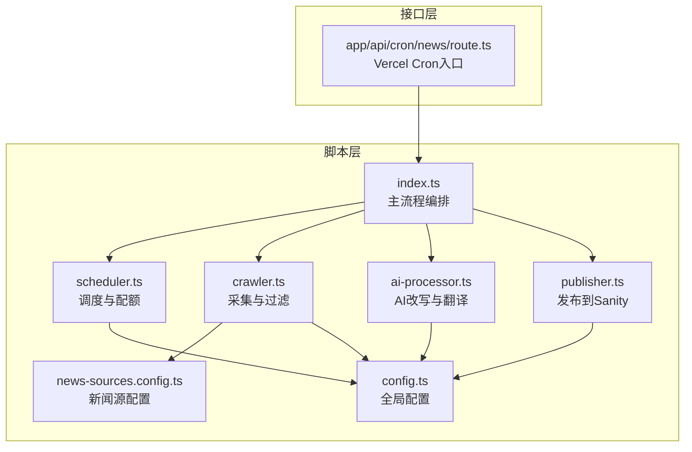
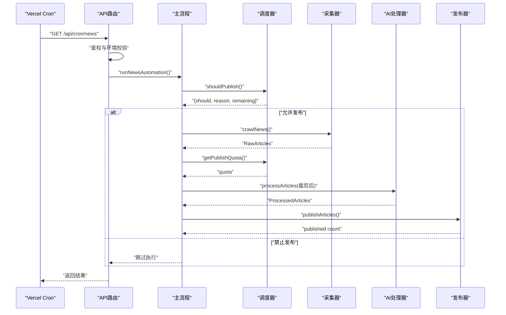
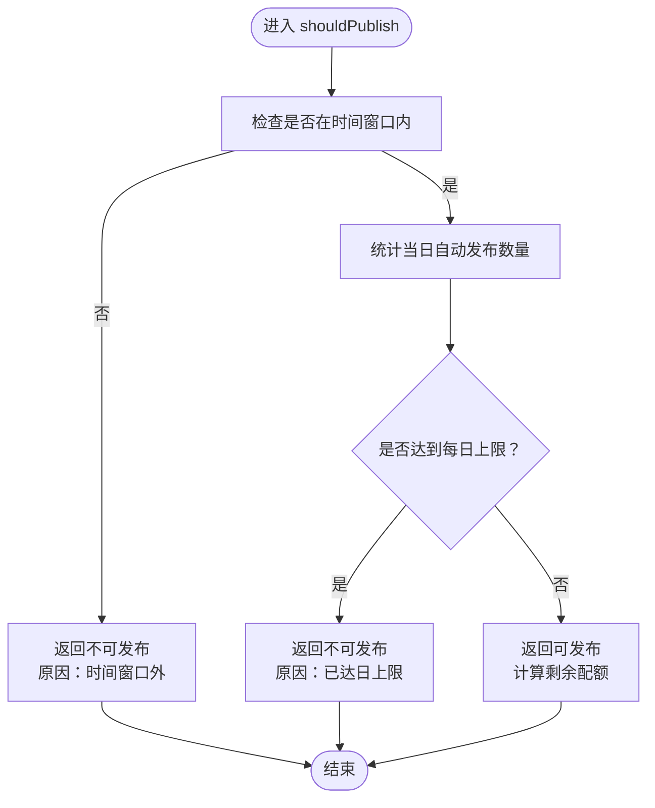
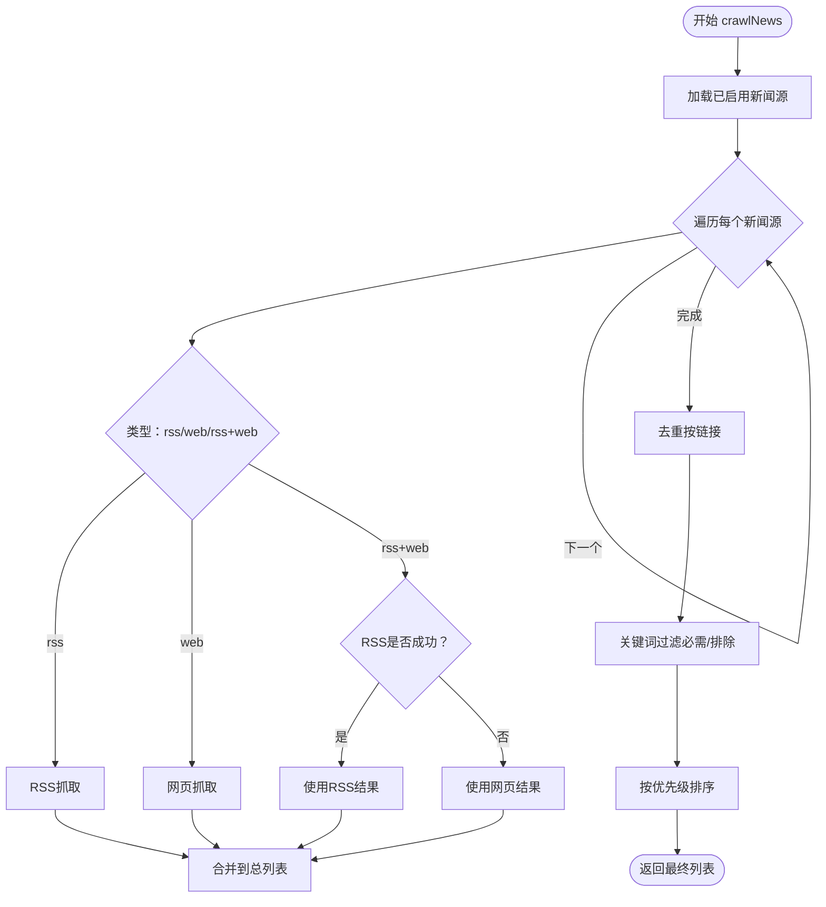
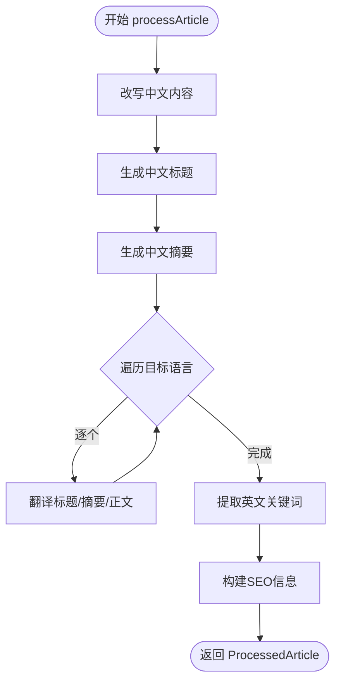
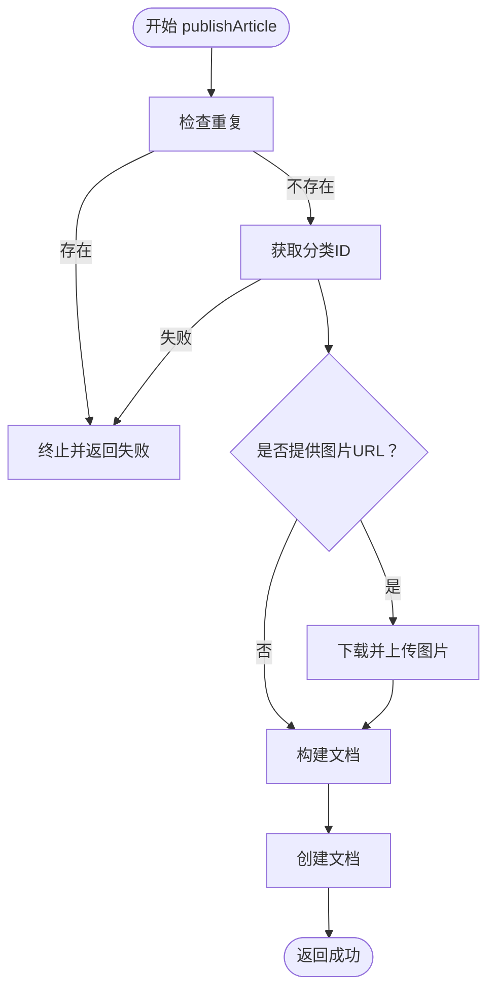
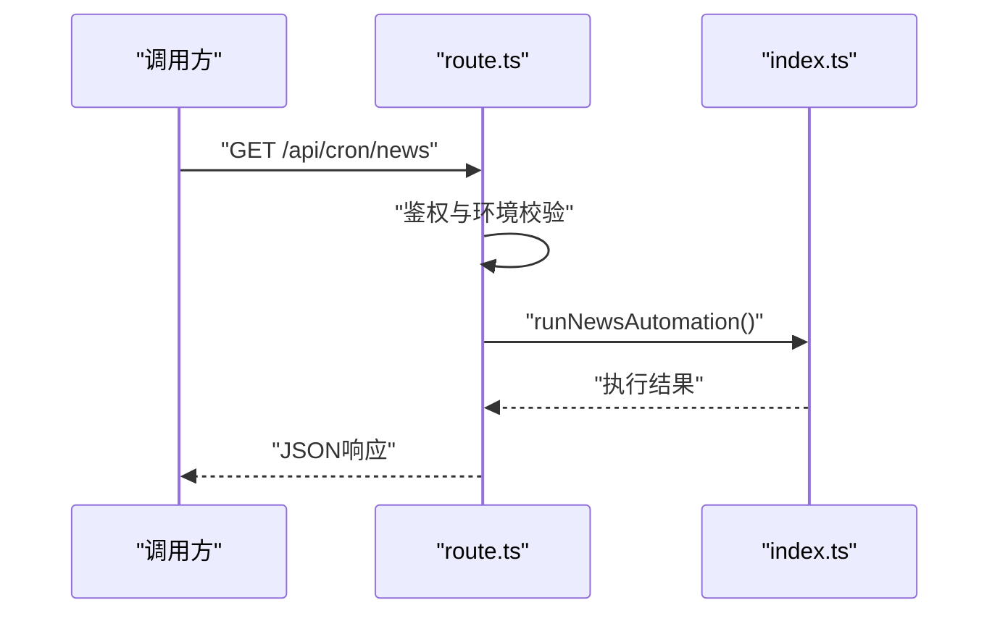
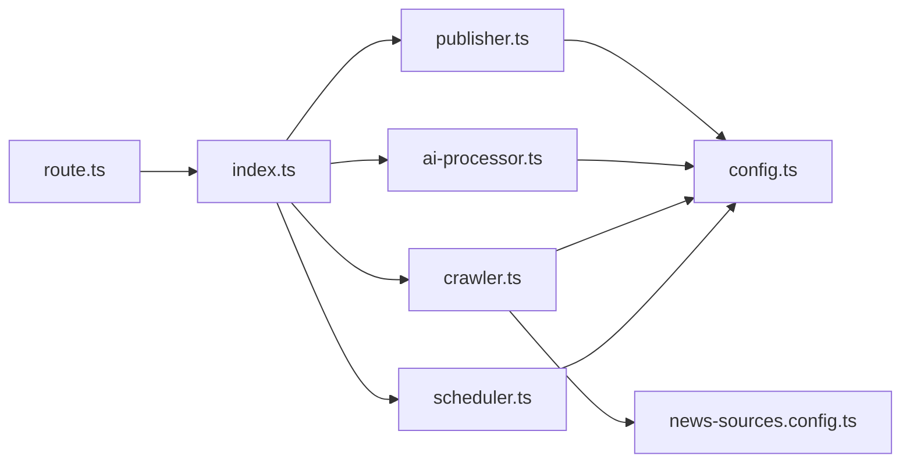

# 调度器模块

<cite>
**本文引用的文件**
- [scheduler.ts](file://scripts/news-auto/scheduler.ts)
- [publisher.ts](file://scripts/news-auto/publisher.ts)
- [config.ts](file://scripts/news-auto/config.ts)
- [index.ts](file://scripts/news-auto/index.ts)
- [crawler.ts](file://scripts/news-auto/crawler.ts)
- [news-sources.config.ts](file://scripts/news-auto/news-sources.config.ts)
- [ai-processor.ts](file://scripts/news-auto/ai-processor.ts)
- [route.ts](file://app/api/cron/news/route.ts)
- [package.json](file://package.json)
</cite>

## 目录
1. [简介](#简介)
2. [项目结构](#项目结构)
3. [核心组件](#核心组件)
4. [架构总览](#架构总览)
5. [详细组件分析](#详细组件分析)
6. [依赖分析](#依赖分析)
7. [性能考量](#性能考量)
8. [故障排查指南](#故障排查指南)
9. [结论](#结论)
10. [附录](#附录)

## 简介
本文件为“调度器模块”的技术文档，聚焦定时发布系统的实现与运维。系统通过 Vercel Cron 触发自动化流程，结合时间窗口控制、每日配额管理与发布状态跟踪，确保在既定时间段内安全、有序地完成新闻内容的采集、AI改写与发布。文档涵盖调度逻辑、配额机制、发布检查、异常处理与系统维护建议，并提供配置示例与使用指南。

## 项目结构
调度器模块位于 scripts/news-auto 目录，围绕“调度-采集-处理-发布”四阶段流水线构建，配合独立的新闻源配置文件与 Next.js API 路由集成 Vercel Cron。

**图表来源**
- [index.ts:1-83](file://scripts/news-auto/index.ts#L1-L83)
- [scheduler.ts:1-104](file://scripts/news-auto/scheduler.ts#L1-L104)
- [crawler.ts:1-197](file://scripts/news-auto/crawler.ts#L1-L197)
- [ai-processor.ts:1-232](file://scripts/news-auto/ai-processor.ts#L1-L232)
- [publisher.ts:1-240](file://scripts/news-auto/publisher.ts#L1-L240)
- [config.ts:1-45](file://scripts/news-auto/config.ts#L1-L45)
- [news-sources.config.ts:1-155](file://scripts/news-auto/news-sources.config.ts#L1-L155)
- [route.ts:1-52](file://app/api/cron/news/route.ts#L1-L52)

**章节来源**
- [index.ts:1-83](file://scripts/news-auto/index.ts#L1-L83)
- [route.ts:1-52](file://app/api/cron/news/route.ts#L1-L52)

## 核心组件
- 调度与配额（scheduler.ts）
  - 时间窗口检查：支持本地测试绕过、Vercel Hobby 套餐时间浮动（±1小时），窗口设定为±90分钟；北京时间换算与跨日差值处理。
  - 每日配额检查：统计当天自动发布文章数，与配置的最大每日配额比较，返回剩余配额。
  - 发布决策：综合时间窗口与配额结果，给出是否发布及原因。
- 采集与过滤（crawler.ts）
  - 多源采集：支持 RSS 与网页两种抓取方式，RSS 优先，其次网页回退。
  - 去重与关键词过滤：基于链接去重，按必需/排除关键词过滤。
  - 新闻源优先级：按配置优先级排序，保证高质量内容优先。
- AI 处理（ai-processor.ts）
  - 通义千问调用：封装 Qwen API，支持改写、翻译、摘要与关键词抽取。
  - 多语言生成：对中文内容进行多语言改写，失败时回退至英文或中文。
- 发布（publisher.ts）
  - 去重检测：避免重复发布。
  - 图片上传：从 URL 下载并上传至 Sanity Assets。
  - 文档构建与创建：按 Sanity Schema 构造文章文档并创建。
- 全局配置（config.ts）
  - 发布策略：最大每日配额、目标发布时间、自动发布开关。
  - 关键词策略：必需词、可选词、排除词。
  - AI 参数：模型、最大 Token、温度。
  - 内容质量阈值：最小/最大字数、关键词密度。
- 新闻源配置（news-sources.config.ts）
  - 类型与字段：名称、URL、类型（rss/web/rss+web）、RSS地址、选择器、分类、语言、优先级、启用状态、备注、请求头。
  - 查询接口：获取已启用源、按分类/语言筛选。
- 主流程（index.ts）
  - 编排：发布检查 → 采集 → 配额裁剪 → AI 处理 → 构建 sourceMap → 发布 → 总结。
- 接口集成（route.ts）
  - Cron 认证：Bearer Token 校验。
  - 环境校验：阿里百炼 API Key 必填。
  - 错误处理：统一返回 401/500 并记录日志。

**章节来源**
- [scheduler.ts:1-104](file://scripts/news-auto/scheduler.ts#L1-L104)
- [crawler.ts:1-197](file://scripts/news-auto/crawler.ts#L1-L197)
- [ai-processor.ts:1-232](file://scripts/news-auto/ai-processor.ts#L1-L232)
- [publisher.ts:1-240](file://scripts/news-auto/publisher.ts#L1-L240)
- [config.ts:1-45](file://scripts/news-auto/config.ts#L1-L45)
- [news-sources.config.ts:1-155](file://scripts/news-auto/news-sources.config.ts#L1-L155)
- [index.ts:1-83](file://scripts/news-auto/index.ts#L1-L83)
- [route.ts:1-52](file://app/api/cron/news/route.ts#L1-L52)

## 架构总览
调度器模块采用“分层流水线”设计：接口层负责触发与鉴权，业务层负责调度与编排，数据层负责内容采集与发布。时间窗口与配额控制贯穿主流程，确保发布行为可控、可观测。

**图表来源**
- [route.ts:1-52](file://app/api/cron/news/route.ts#L1-L52)
- [index.ts:1-83](file://scripts/news-auto/index.ts#L1-L83)
- [scheduler.ts:67-94](file://scripts/news-auto/scheduler.ts#L67-L94)
- [crawler.ts:155-197](file://scripts/news-auto/crawler.ts#L155-L197)
- [ai-processor.ts:215-232](file://scripts/news-auto/ai-processor.ts#L215-L232)
- [publisher.ts:215-240](file://scripts/news-auto/publisher.ts#L215-L240)

## 详细组件分析

### 调度与配额组件（scheduler.ts）
- 时间窗口控制
  - 本地测试绕过：通过环境变量控制，便于开发调试。
  - 北京时间换算：将 UTC 时间换算为北京时间（UTC+8），并处理跨日差值。
  - 浮动容忍：Vercel Hobby 套餐存在 ±1 小时浮动，时间窗口设为 ±90 分钟，兼顾跨日场景。
- 每日配额管理
  - 当日计数：查询当天自动发布文章数量，SQL 查询基于 publishedAt 与自动标记。
  - 配额上限：从配置读取最大每日配额，比较当日计数与上限，返回剩余配额。
- 发布检查与配额获取
  - shouldPublish：综合时间窗口与配额，返回布尔值、原因与剩余配额。
  - getPublishQuota：在允许发布时返回剩余配额，否则返回 0。

**图表来源**
- [scheduler.ts:67-94](file://scripts/news-auto/scheduler.ts#L67-L94)
- [scheduler.ts:7-20](file://scripts/news-auto/scheduler.ts#L7-L20)
- [scheduler.ts:29-60](file://scripts/news-auto/scheduler.ts#L29-L60)

**章节来源**
- [scheduler.ts:1-104](file://scripts/news-auto/scheduler.ts#L1-L104)
- [config.ts:6-12](file://scripts/news-auto/config.ts#L6-L12)

### 采集与过滤组件（crawler.ts）
- 采集策略
  - RSS 优先：若 RSS 可用则优先抓取，否则回退到网页抓取。
  - 图片提取：优先使用 enclosure/media:content，其次从 HTML 内容中提取首张图片。
- 去重与过滤
  - 基于链接去重，避免重复内容入库。
  - 关键词过滤：排除词优先，必需词至少满足其一。
- 排序与输出
  - 按新闻源优先级排序，输出清洗后的文章列表。

**图表来源**
- [crawler.ts:155-197](file://scripts/news-auto/crawler.ts#L155-L197)
- [crawler.ts:21-121](file://scripts/news-auto/crawler.ts#L21-L121)
- [crawler.ts:144-152](file://scripts/news-auto/crawler.ts#L144-L152)
- [crawler.ts:123-142](file://scripts/news-auto/crawler.ts#L123-L142)

**章节来源**
- [crawler.ts:1-197](file://scripts/news-auto/crawler.ts#L1-L197)
- [news-sources.config.ts:136-147](file://scripts/news-auto/news-sources.config.ts#L136-L147)

### AI 处理组件（ai-processor.ts）
- 改写与摘要
  - 中文改写：基于模板提示词，生成专业、可读性强的中文内容。
  - 摘要生成：控制长度，适配列表展示。
- 多语言翻译
  - 对标题、摘要与正文进行多语言改写，失败时回退英文或中文。
- 关键词提取
  - 提取英文关键词，用于 SEO 优化。
- 批量处理
  - 逐条处理并加入延迟，避免 API 限流。

**图表来源**
- [ai-processor.ts:153-211](file://scripts/news-auto/ai-processor.ts#L153-L211)
- [ai-processor.ts:215-232](file://scripts/news-auto/ai-processor.ts#L215-L232)

**章节来源**
- [ai-processor.ts:1-232](file://scripts/news-auto/ai-processor.ts#L1-L232)
- [config.ts:21-34](file://scripts/news-auto/config.ts#L21-L34)

### 发布组件（publisher.ts）
- 去重检测：基于标题进行存在性检查，避免重复发布。
- 分类映射：根据分类别名获取 Sanity 分类 ID。
- 图片上传：下载远程图片并上传至 Sanity Assets，构建封面引用。
- 文档构建与创建：按 Sanity Schema 构造文章文档并创建，记录发布时间、来源标记与 SEO 信息。
- 批量发布：逐条发布并加入延迟，避免 API 限流。

**图表来源**
- [publisher.ts:58-212](file://scripts/news-auto/publisher.ts#L58-L212)

**章节来源**
- [publisher.ts:1-240](file://scripts/news-auto/publisher.ts#L1-L240)
- [config.ts:36-45](file://scripts/news-auto/config.ts#L36-L45)

### 主流程与接口集成（index.ts、route.ts）
- 主流程（index.ts）
  - 发布检查：决定是否继续执行。
  - 采集与配额裁剪：按剩余配额限制处理数量。
  - AI 处理与发布：批量处理并发布，输出汇总信息。
- 接口集成（route.ts）
  - 认证：Bearer Token 校验，防止未授权访问。
  - 环境校验：阿里百炼 API Key 必填。
  - 错误处理：统一返回 JSON 并记录错误日志。

**图表来源**
- [route.ts:1-52](file://app/api/cron/news/route.ts#L1-L52)
- [index.ts:8-69](file://scripts/news-auto/index.ts#L8-L69)

**章节来源**
- [index.ts:1-83](file://scripts/news-auto/index.ts#L1-L83)
- [route.ts:1-52](file://app/api/cron/news/route.ts#L1-L52)

## 依赖分析
- 外部依赖
  - axios：HTTP 请求与 Qwen API 调用。
  - rss-parser：RSS 解析。
  - cheerio：网页 DOM 解析。
  - @sanity/client：Sanity 数据库操作。
- 内部依赖
  - config.ts 为各模块提供统一配置。
  - news-sources.config.ts 为采集模块提供新闻源清单与筛选接口。
  - index.ts 串联调度、采集、AI、发布四个阶段。

**图表来源**
- [index.ts:1-83](file://scripts/news-auto/index.ts#L1-L83)
- [scheduler.ts:1-104](file://scripts/news-auto/scheduler.ts#L1-L104)
- [crawler.ts:1-197](file://scripts/news-auto/crawler.ts#L1-L197)
- [ai-processor.ts:1-232](file://scripts/news-auto/ai-processor.ts#L1-L232)
- [publisher.ts:1-240](file://scripts/news-auto/publisher.ts#L1-L240)
- [config.ts:1-45](file://scripts/news-auto/config.ts#L1-L45)
- [news-sources.config.ts:1-155](file://scripts/news-auto/news-sources.config.ts#L1-L155)
- [route.ts:1-52](file://app/api/cron/news/route.ts#L1-L52)

**章节来源**
- [package.json:12-28](file://package.json#L12-L28)

## 性能考量
- API 限流防护
  - AI 处理与发布阶段均设置了固定延迟，避免触发第三方服务限流。
- 查询效率
  - 采集阶段的关键词过滤与去重在内存中完成，适合中小规模数据集。
- 时间窗口与配额
  - 时间窗口与配额双重控制减少无效工作负载，提高资源利用率。

[本节为通用性能讨论，不直接分析具体文件]

## 故障排查指南
- Cron 认证失败
  - 现象：返回 401 Unauthorized。
  - 排查：确认请求头 Authorization 与环境变量 CRON_SECRET 一致。
- 环境变量缺失
  - 现象：返回 500 DASHSCOPE_API_KEY not configured。
  - 排查：确保 DASHSCOPE_API_KEY 已正确配置。
- 发布被跳过
  - 现象：日志显示“Outside publish time window”或“Daily limit reached”。
  - 排查：检查 NEWS_CONFIG.publish.publishTimes 与 maxArticlesPerDay；确认当前 UTC 时间换算为北京时间后的窗口。
- 采集无结果
  - 现象：日志显示“0 unique articles after deduplication”。
  - 排查：检查新闻源 enabled 与 type；确认 RSS/selector 配置正确；必要时开启调试日志。
- 发布失败
  - 现象：日志出现“Publish failed”或“Image upload failed”。
  - 排查：检查 Sanity 连接、图片 URL 可达性、分类映射是否正确。

**章节来源**
- [route.ts:10-15](file://app/api/cron/news/route.ts#L10-L15)
- [route.ts:20-26](file://app/api/cron/news/route.ts#L20-L26)
- [scheduler.ts:69-87](file://scripts/news-auto/scheduler.ts#L69-L87)
- [crawler.ts:155-197](file://scripts/news-auto/crawler.ts#L155-L197)
- [publisher.ts:208-211](file://scripts/news-auto/publisher.ts#L208-L211)

## 结论
调度器模块通过明确的分层设计与严格的控制点（时间窗口、每日配额、重复检测），实现了稳定可靠的自动化发布流程。结合独立的新闻源配置与统一的全局配置，系统具备良好的可维护性与扩展性。建议在生产环境中持续监控发布指标与错误日志，定期评估配额与时间窗口设置，确保发布节奏与业务目标一致。

[本节为总结性内容，不直接分析具体文件]

## 附录

### 配置示例与使用指南
- 调度时间设置
  - 在配置中设置目标发布时间数组，系统会据此判断是否处于时间窗口内。
  - 示例参考：[config.ts:8-12](file://scripts/news-auto/config.ts#L8-L12)
- 每日配额参数调整
  - 修改最大每日配额，影响剩余配额计算与批量处理数量。
  - 示例参考：[config.ts:9](file://scripts/news-auto/config.ts#L9)
- 新闻源维护
  - 在独立配置文件中新增/停用/调整优先级，无需改动抓取逻辑。
  - 示例参考：[news-sources.config.ts:46-131](file://scripts/news-auto/news-sources.config.ts#L46-L131)
- 关键词策略
  - 调整必需词、可选词与排除词，以提升内容相关性。
  - 示例参考：[config.ts:15-19](file://scripts/news-auto/config.ts#L15-L19)
- AI 参数
  - 调整模型、最大 Token、温度，平衡质量与成本。
  - 示例参考：[config.ts:22-26](file://scripts/news-auto/config.ts#L22-L26)
- 监控与日志
  - Cron 触发日志、主流程日志、发布摘要日志均可用于问题定位。
  - 示例参考：[index.ts:14-69](file://scripts/news-auto/index.ts#L14-L69)

### 系统维护建议
- 定期评估新闻源可用性，及时停用不可用源。
- 根据业务增长调整每日配额与发布时间窗口。
- 监控第三方 API 调用成功率与耗时，必要时增加重试与熔断。
- 保持配置文件集中管理，变更前做好备份与灰度验证。

[本节为通用建议，不直接分析具体文件]