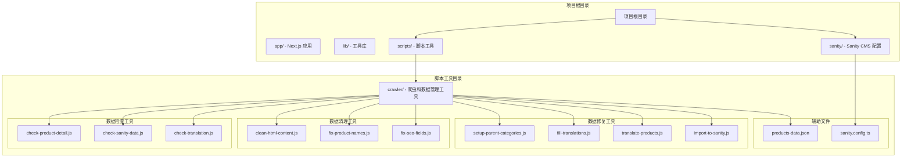
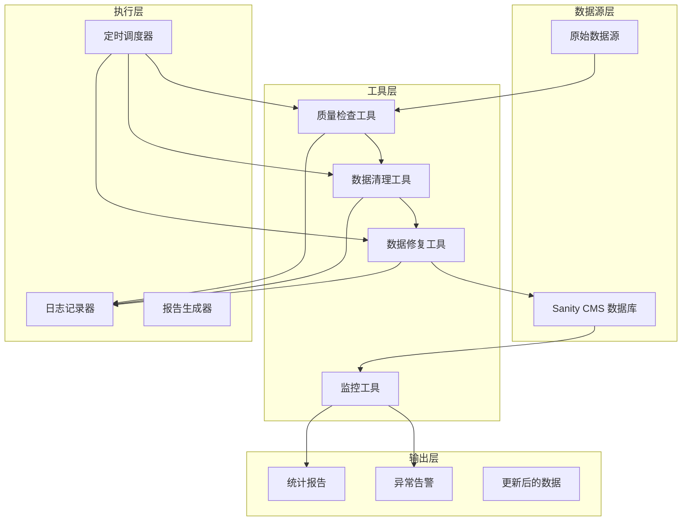
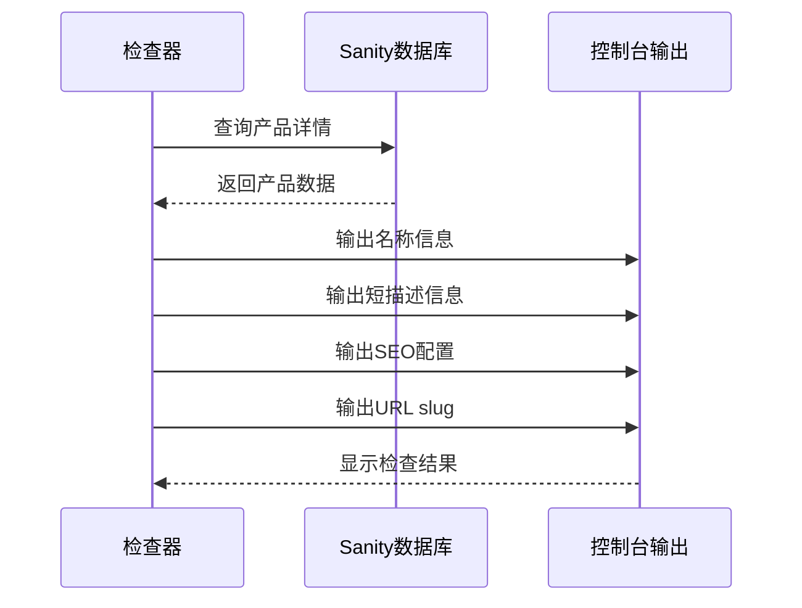
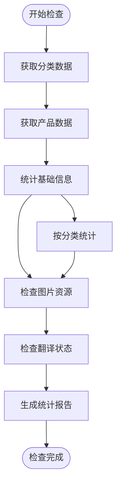
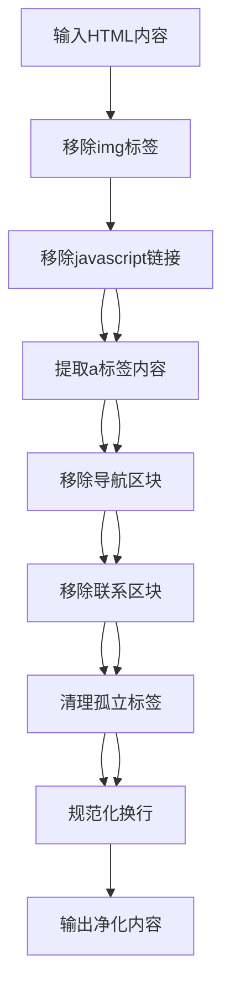
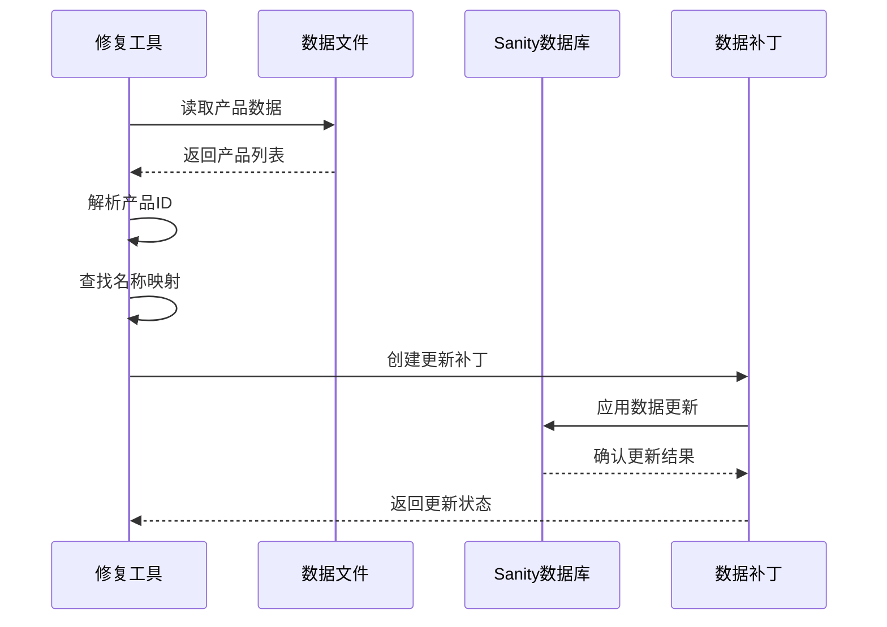
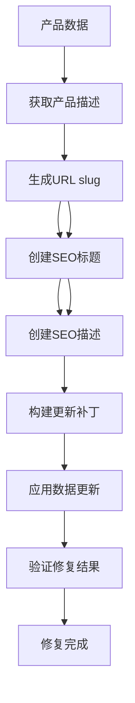
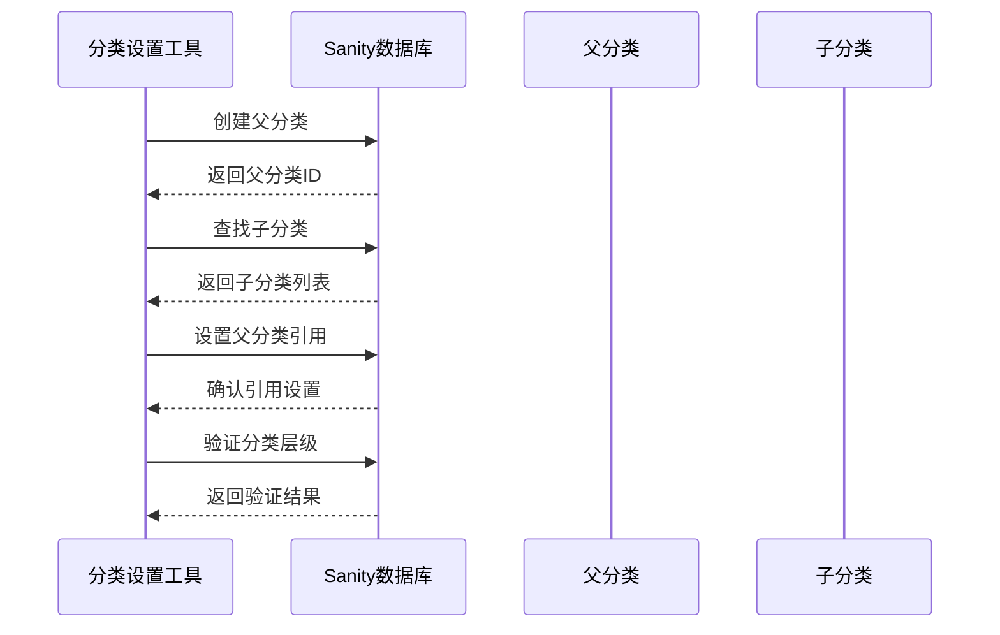
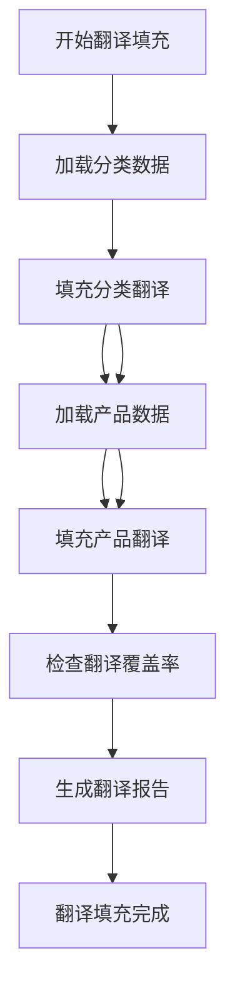
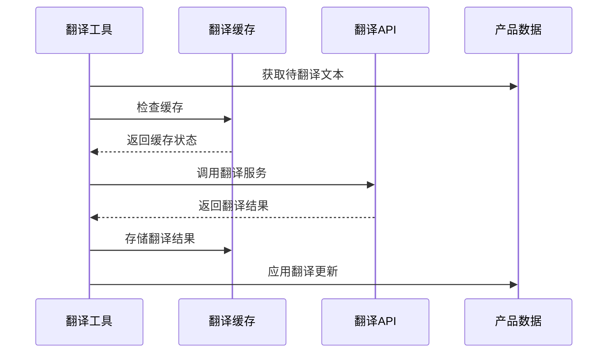

# 监控和维护工具

<cite>
**本文档引用的文件**
- [check-product-detail.js](file://scripts/crawler/check-product-detail.js)
- [check-sanity-data.js](file://scripts/crawler/check-sanity-data.js)
- [check-translation.js](file://scripts/crawler/check-translation.js)
- [clean-html-content.js](file://scripts/crawler/clean-html-content.js)
- [fix-product-names.js](file://scripts/crawler/fix-product-names.js)
- [fix-seo-fields.js](file://scripts/crawler/fix-seo-fields.js)
- [setup-parent-categories.js](file://scripts/crawler/setup-parent-categories.js)
- [fill-translations.js](file://scripts/crawler/fill-translations.js)
- [translate-products.js](file://scripts/crawler/translate-products.js)
- [import-to-sanity.js](file://scripts/crawler/import-to-sanity.js)
- [products-data.json](file://scripts/crawler/products-data.json)
- [sanity.config.ts](file://sanity/sanity.config.ts)
- [package.json](file://package.json)
</cite>

## 目录
1. [简介](#简介)
2. [项目结构](#项目结构)
3. [核心组件](#核心组件)
4. [架构概览](#架构概览)
5. [详细组件分析](#详细组件分析)
6. [依赖关系分析](#依赖关系分析)
7. [性能考虑](#性能考虑)
8. [故障排除指南](#故障排除指南)
9. [结论](#结论)
10. [附录](#附录)

## 简介

这是一个基于 Next.js 和 Sanity CMS 的企业级网站数据管理工具集。该工具集提供了完整的数据质量检查、数据清理、数据修复和监控功能，专门用于维护光莆LED外贸网站的产品数据。

该工具集包含以下主要功能模块：
- **数据质量检查工具**：产品详情完整性检查、Sanity数据一致性验证、翻译准确性检测
- **数据清理工具**：HTML内容净化、产品名称修复、SEO字段修正
- **数据修复工具**：父分类设置、产品翻译更新、数据格式标准化
- **监控工具**：定期检查脚本、异常告警机制、数据统计报告

## 项目结构

项目采用模块化的文件组织方式，所有数据管理工具都位于 `scripts/crawler/` 目录下：



**图表来源**
- [sanity.config.ts:1-33](file://sanity/sanity.config.ts#L1-L33)
- [package.json:1-45](file://package.json#L1-L45)

**章节来源**
- [sanity.config.ts:1-33](file://sanity/sanity.config.ts#L1-L33)
- [package.json:1-45](file://package.json#L1-L45)

## 核心组件

### 数据质量检查系统

数据质量检查系统包含三个核心检查工具，用于确保数据的完整性和一致性：

1. **产品详情完整性检查** (`check-product-detail.js`)
   - 检查产品名称、短描述、完整描述、SEO配置和URL slug
   - 验证多语言字段的完整性
   - 提供实时数据状态反馈

2. **Sanity数据一致性验证** (`check-sanity-data.js`)
   - 统计分类和产品数量
   - 按分类维度进行数据分布分析
   - 检查图片资源和多语言字段状态
   - 识别需要翻译和图片上传的产品

3. **翻译准确性检测** (`check-translation.js`)
   - 检查分类和产品的多语言翻译状态
   - 统计各语言的翻译覆盖率
   - 提供翻译质量评估报告

### 数据清理和修复系统

数据清理和修复系统提供了针对不同问题域的专门工具：

1. **HTML内容净化** (`clean-html-content.js`)
   - 移除爬虫引入的无用HTML标签
   - 清理JavaScript链接和导航区块
   - 规范化HTML结构和格式

2. **产品名称修复** (`fix-product-names.js`)
   - 从原始数据中提取准确的产品名称
   - 基于产品ID映射表进行批量修复
   - 支持多语言名称的标准化

3. **SEO字段修复** (`fix-seo-fields.js`)
   - 生成URL友好的slug
   - 创建多语言SEO标题和描述
   - 标准化SEO元数据格式

### 分类管理工具

分类管理系统提供了完整的分类层级结构维护功能：

1. **父分类设置** (`setup-parent-categories.js`)
   - 创建层次化的分类结构
   - 建立父子分类关系
   - 验证分类层级的正确性

2. **翻译填充** (`fill-translations.js`)
   - 基于预定义映射表填充翻译
   - 支持5种语言的批量翻译
   - 提供精确的人工翻译质量

3. **智能翻译** (`translate-products.js`)
   - 集成Google Translate API
   - 支持自动翻译生成功能
   - 实现翻译缓存和速率控制

**章节来源**
- [check-product-detail.js:1-19](file://scripts/crawler/check-product-detail.js#L1-L19)
- [check-sanity-data.js:1-70](file://scripts/crawler/check-sanity-data.js#L1-L70)
- [check-translation.js:1-60](file://scripts/crawler/check-translation.js#L1-L60)
- [clean-html-content.js:1-107](file://scripts/crawler/clean-html-content.js#L1-L107)
- [fix-product-names.js:1-140](file://scripts/crawler/fix-product-names.js#L1-L140)
- [fix-seo-fields.js:1-304](file://scripts/crawler/fix-seo-fields.js#L1-L304)
- [setup-parent-categories.js:1-89](file://scripts/crawler/setup-parent-categories.js#L1-L89)
- [fill-translations.js:1-331](file://scripts/crawler/fill-translations.js#L1-L331)
- [translate-products.js:1-258](file://scripts/crawler/translate-products.js#L1-L258)

## 架构概览

整个数据管理工具集采用模块化架构设计，各个工具相互独立又协同工作：



**图表来源**
- [sanity.config.ts:11-21](file://sanity/sanity.config.ts#L11-L21)

## 详细组件分析

### 数据质量检查工具

#### 产品详情完整性检查流程



**图表来源**
- [check-product-detail.js:10-16](file://scripts/crawler/check-product-detail.js#L10-L16)

#### Sanity数据一致性验证流程



**图表来源**
- [check-sanity-data.js:15-67](file://scripts/crawler/check-sanity-data.js#L15-L67)

**章节来源**
- [check-product-detail.js:1-19](file://scripts/crawler/check-product-detail.js#L1-L19)
- [check-sanity-data.js:1-70](file://scripts/crawler/check-sanity-data.js#L1-L70)

### 数据清理工具

#### HTML内容净化算法



**图表来源**
- [clean-html-content.js:19-37](file://scripts/crawler/clean-html-content.js#L19-L37)

#### 产品名称修复流程



**图表来源**
- [fix-product-names.js:85-131](file://scripts/crawler/fix-product-names.js#L85-L131)

**章节来源**
- [clean-html-content.js:1-107](file://scripts/crawler/clean-html-content.js#L1-L107)
- [fix-product-names.js:1-140](file://scripts/crawler/fix-product-names.js#L1-L140)

### 数据修复工具

#### SEO字段修复算法



**图表来源**
- [fix-seo-fields.js:247-295](file://scripts/crawler/fix-seo-fields.js#L247-L295)

#### 分类层级设置流程



**图表来源**
- [setup-parent-categories.js:15-86](file://scripts/crawler/setup-parent-categories.js#L15-L86)

**章节来源**
- [fix-seo-fields.js:1-304](file://scripts/crawler/fix-seo-fields.js#L1-L304)
- [setup-parent-categories.js:1-89](file://scripts/crawler/setup-parent-categories.js#L1-L89)

### 翻译管理系统

#### 翻译填充流程



**图表来源**
- [fill-translations.js:264-331](file://scripts/crawler/fill-translations.js#L264-L331)

#### 智能翻译实现



**图表来源**
- [translate-products.js:31-66](file://scripts/crawler/translate-products.js#L31-L66)

**章节来源**
- [fill-translations.js:1-331](file://scripts/crawler/fill-translations.js#L1-L331)
- [translate-products.js:1-258](file://scripts/crawler/translate-products.js#L1-L258)

## 依赖关系分析

项目的主要依赖关系如下：

```mermaid
graph TB
subgraph "核心依赖"
SanityClient[@sanity/client - Sanity客户端]
Dotenv[dotenv - 环境变量]
Cheerio[cheerio - HTML解析]
end
subgraph "工具依赖"
Axios[axios - HTTP客户端]
Cron[node-cron - 定时任务]
RSS[rss-parser - RSS解析]
end
subgraph "Next.js生态"
Next[next - Web框架]
Intl[next-intl - 国际化]
SanityNext[next-sanity - Sanity集成]
end
subgraph "脚本工具"
SanityConfig[sanity.config.ts - Sanity配置]
PackageJSON[package.json - 项目配置]
end
SanityClient --> SanityConfig
Dotenv --> PackageJSON
Cheerio --> SanityClient
Axios --> SanityClient
Cron --> PackageJSON
RSS --> PackageJSON
Next --> SanityConfig
Intl --> SanityConfig
SanityNext --> SanityConfig
```

**图表来源**
- [package.json:12-28](file://package.json#L12-L28)
- [sanity.config.ts:11-21](file://sanity/sanity.config.ts#L11-L21)

**章节来源**
- [package.json:1-45](file://package.json#L1-L45)
- [sanity.config.ts:1-33](file://sanity/sanity.config.ts#L1-L33)

## 性能考虑

### 数据处理优化策略

1. **批量处理机制**
   - 所有更新操作采用批量提交模式
   - 实现适当的延迟机制避免API限制
   - 使用补丁更新减少数据传输量

2. **缓存策略**
   - 翻译结果缓存避免重复请求
   - 分类和产品映射表本地缓存
   - 进度状态持久化支持断点续传

3. **并发控制**
   - API请求速率限制防止被封禁
   - 并发连接数限制保护服务器
   - 错误重试机制提高成功率

### 内存管理

1. **流式处理**
   - 大文件读取采用流式处理
   - 分批处理避免内存溢出
   - 及时释放中间结果占用的内存

2. **垃圾回收**
   - 定期触发垃圾回收机制
   - 及时清理未使用的对象引用
   - 监控内存使用情况及时预警

## 故障排除指南

### 常见问题诊断

#### Sanity连接问题

**症状**：工具无法连接到Sanity数据库
**可能原因**：
- 缺少SANITY_API_TOKEN环境变量
- 项目ID或数据集配置错误
- 网络连接不稳定

**解决步骤**：
1. 验证 `.env.local` 文件中SANITY_API_TOKEN配置
2. 检查项目ID和数据集是否正确
3. 测试网络连接和API访问权限

#### 数据导入失败

**症状**：产品或分类导入过程中出现错误
**可能原因**：
- 数据格式不符合Sanity Schema要求
- 重复的文档ID冲突
- 外键引用无效

**解决步骤**：
1. 检查 `products-data.json` 格式完整性
2. 验证分类ID与产品分类的对应关系
3. 确认外键引用的有效性

#### 翻译服务错误

**症状**：翻译API调用失败或返回空结果
**可能原因**：
- 翻译API配额不足
- 网络请求超时
- 文本格式不兼容

**解决步骤**：
1. 检查翻译API的使用配额
2. 增加请求延迟避免限流
3. 清理文本中的特殊字符

### 日志分析

工具系统提供了详细的日志记录功能：

1. **进度日志**：显示当前处理状态和进度百分比
2. **错误日志**：记录具体的错误信息和堆栈跟踪
3. **统计日志**：提供处理结果的统计信息
4. **调试日志**：包含详细的调试信息用于问题诊断

**章节来源**
- [import-to-sanity.js:132-136](file://scripts/crawler/import-to-sanity.js#L132-L136)
- [translate-products.js:62-66](file://scripts/crawler/translate-products.js#L62-L66)

## 结论

这套监控和维护工具集为光莆LED外贸网站提供了完整的数据管理解决方案。通过模块化的工具设计和完善的错误处理机制，能够有效保证数据的质量和一致性。

### 主要优势

1. **全面的数据质量保障**：从多个维度检查数据完整性
2. **灵活的修复能力**：支持手动和自动两种修复模式
3. **强大的监控功能**：提供实时的数据状态监控和报告
4. **良好的扩展性**：模块化设计便于功能扩展和维护

### 最佳实践建议

1. **定期执行数据检查**：建立定期的数据质量检查机制
2. **建立备份策略**：在执行重大修复操作前做好数据备份
3. **监控API使用**：密切关注翻译API的使用情况和配额
4. **文档化操作流程**：建立标准的操作手册和故障排除流程

## 附录

### 环境配置

项目需要以下环境变量配置：

- `SANITY_API_TOKEN`：Sanity CMS访问令牌
- `NEXT_PUBLIC_SANITY_PROJECT_ID`：Sanity项目ID
- `NEXT_PUBLIC_SANITY_DATASET`：Sanity数据集名称

### 常用命令

```bash
# 启动Sanity Studio
npm run sanity

# 检查产品数据完整性
node scripts/crawler/check-product-detail.js

# 清洗HTML内容
node scripts/crawler/clean-html-content.js

# 修复产品名称
node scripts/crawler/fix-product-names.js

# 设置分类层级
node scripts/crawler/setup-parent-categories.js

# 填充翻译
node scripts/crawler/fill-translations.js

# 批量翻译
node scripts/crawler/translate-products.js
```

### 数据模型

系统涉及的核心数据模型包括：

1. **产品模型** (`product`)
   - 多语言名称和描述
   - SEO元数据
   - 分类关联
   - 图片资源

2. **分类模型** (`category`)
   - 分类层级结构
   - 多语言名称
   - 描述信息

3. **用户模型** (`inquiry`)
   - 客户咨询信息
   - 联系方式
   - 处理状态

**章节来源**
- [sanity.config.ts:23-25](file://sanity/sanity.config.ts#L23-L25)
- [package.json:5-10](file://package.json#L5-L10)