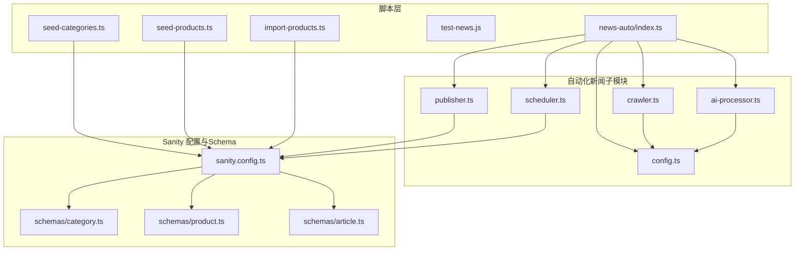
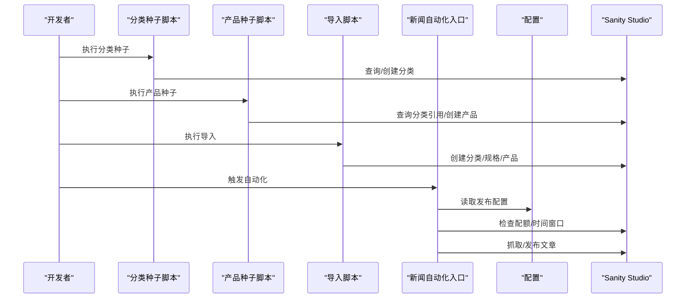
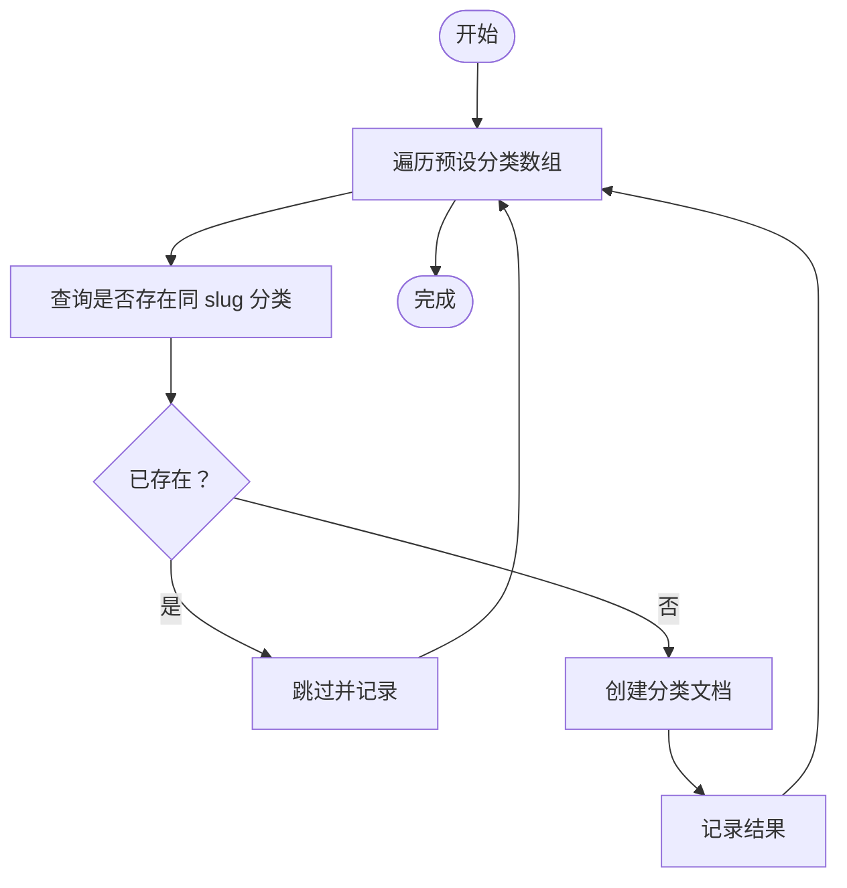
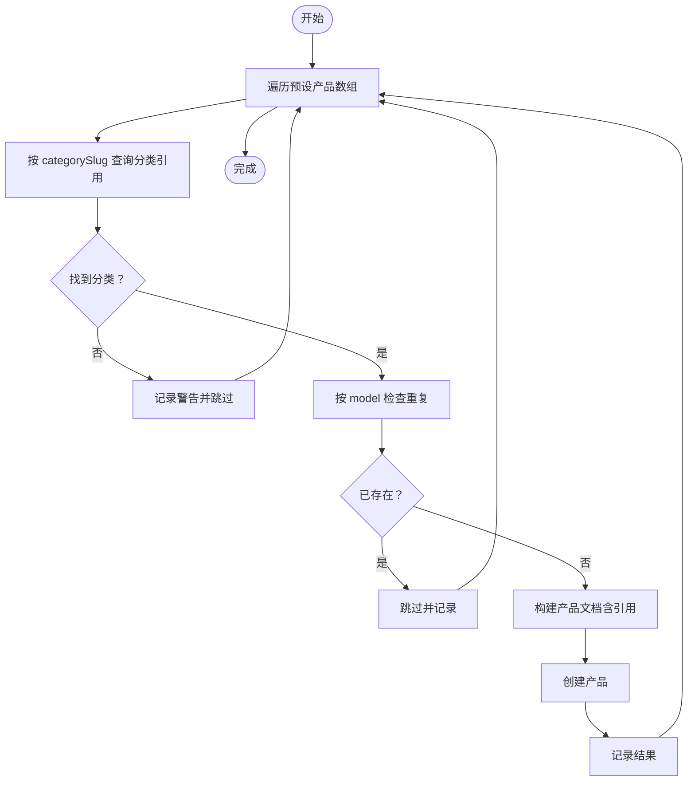
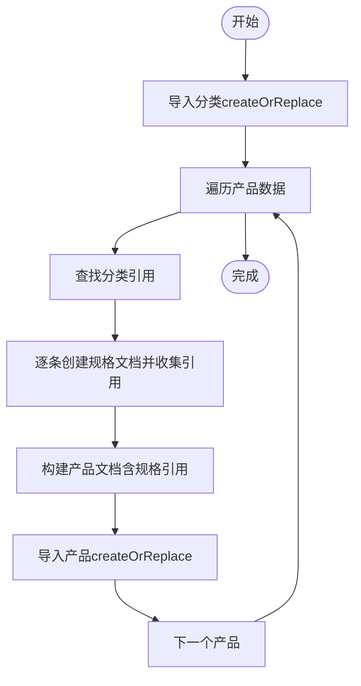
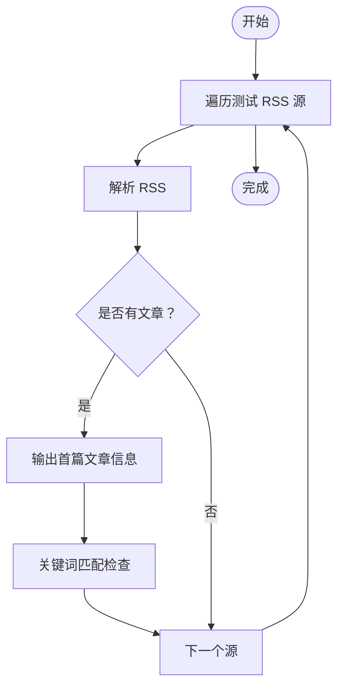
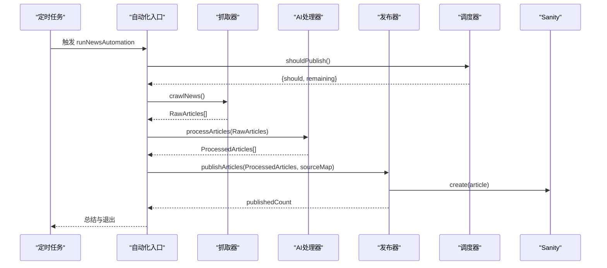
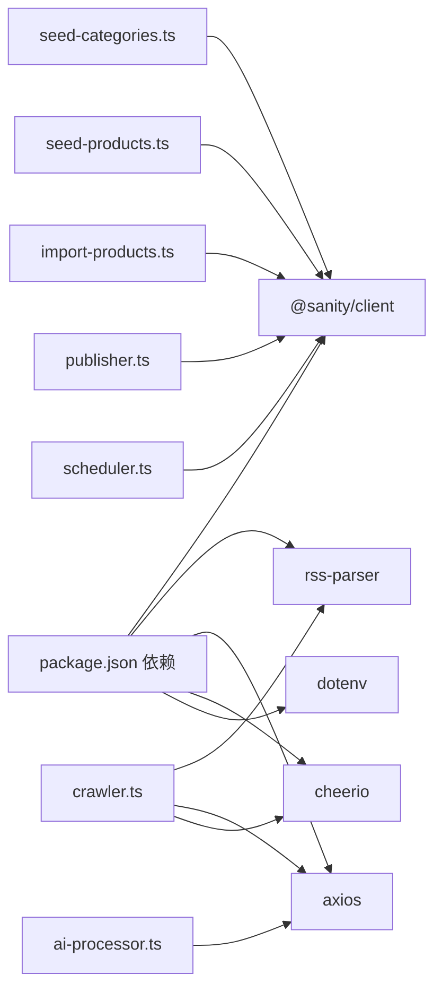

# 种子数据工具

<cite>
**本文引用的文件**
- [scripts/seed-categories.ts](file://scripts/seed-categories.ts)
- [scripts/seed-products.ts](file://scripts/seed-products.ts)
- [scripts/import-products.ts](file://scripts/import-products.ts)
- [scripts/test-news.js](file://scripts/test-news.js)
- [scripts/news-auto/index.ts](file://scripts/news-auto/index.ts)
- [scripts/news-auto/crawler.ts](file://scripts/news-auto/crawler.ts)
- [scripts/news-auto/ai-processor.ts](file://scripts/news-auto/ai-processor.ts)
- [scripts/news-auto/publisher.ts](file://scripts/news-auto/publisher.ts)
- [scripts/news-auto/scheduler.ts](file://scripts/news-auto/scheduler.ts)
- [scripts/news-auto/config.ts](file://scripts/news-auto/config.ts)
- [sanity/sanity.config.ts](file://sanity/sanity.config.ts)
- [sanity/schemas/category.ts](file://sanity/schemas/category.ts)
- [sanity/schemas/product.ts](file://sanity/schemas/product.ts)
- [sanity/schemas/article.ts](file://sanity/schemas/article.ts)
- [package.json](file://package.json)
</cite>

## 目录
1. [简介](#简介)
2. [项目结构](#项目结构)
3. [核心组件](#核心组件)
4. [架构总览](#架构总览)
5. [详细组件分析](#详细组件分析)
6. [依赖关系分析](#依赖关系分析)
7. [性能考量](#性能考量)
8. [故障排查指南](#故障排查指南)
9. [结论](#结论)
10. [附录](#附录)

## 简介
本文件为“种子数据工具”的使用与技术文档，覆盖以下目标：
- 分类数据种子脚本：创建分类层级结构、默认数据填充、测试环境准备
- 产品数据种子脚本：生成产品信息、填充规格数据、建立图片关联
- 测试新闻脚本：验证新闻抓取功能、关键词过滤、基础性能测试
- 自动化新闻管线：从抓取、AI改写、翻译、发布到配额控制的完整流程
- 配置与自定义：数据模板、随机化策略、批量创建与清理
- 开发与测试环境使用指南：如何在不同环境中执行与重置数据

## 项目结构
种子数据工具主要位于 scripts 目录，配合 Sanity Schema 定义与配置文件共同工作。

图表来源
- [scripts/seed-categories.ts:1-110](file://scripts/seed-categories.ts#L1-L110)
- [scripts/seed-products.ts:1-522](file://scripts/seed-products.ts#L1-L522)
- [scripts/import-products.ts:1-161](file://scripts/import-products.ts#L1-L161)
- [scripts/news-auto/index.ts:1-83](file://scripts/news-auto/index.ts#L1-L83)
- [scripts/news-auto/crawler.ts:1-197](file://scripts/news-auto/crawler.ts#L1-L197)
- [scripts/news-auto/ai-processor.ts:1-232](file://scripts/news-auto/ai-processor.ts#L1-L232)
- [scripts/news-auto/publisher.ts:1-240](file://scripts/news-auto/publisher.ts#L1-L240)
- [scripts/news-auto/scheduler.ts:1-104](file://scripts/news-auto/scheduler.ts#L1-L104)
- [scripts/news-auto/config.ts:1-45](file://scripts/news-auto/config.ts#L1-L45)
- [sanity/sanity.config.ts:1-33](file://sanity/sanity.config.ts#L1-L33)
- [sanity/schemas/category.ts:1-74](file://sanity/schemas/category.ts#L1-L74)
- [sanity/schemas/product.ts:1-233](file://sanity/schemas/product.ts#L1-L233)
- [sanity/schemas/article.ts:1-265](file://sanity/schemas/article.ts#L1-L265)

章节来源
- [scripts/seed-categories.ts:1-110](file://scripts/seed-categories.ts#L1-L110)
- [scripts/seed-products.ts:1-522](file://scripts/seed-products.ts#L1-L522)
- [scripts/import-products.ts:1-161](file://scripts/import-products.ts#L1-L161)
- [scripts/test-news.js:1-40](file://scripts/test-news.js#L1-L40)
- [scripts/news-auto/index.ts:1-83](file://scripts/news-auto/index.ts#L1-L83)
- [sanity/sanity.config.ts:1-33](file://sanity/sanity.config.ts#L1-L33)

## 核心组件
- 分类数据种子脚本：批量创建多语言分类，避免重复，支持排序权重
- 产品数据种子脚本：批量创建产品，引用分类，生成 slug，填充多语言字段与特性
- 导入脚本：从外部数据导入产品与规格，建立引用关系，生成 SEO 信息
- 测试新闻脚本：验证 RSS 抓取与关键词匹配
- 自动化新闻管线：抓取 → 过滤 → AI 改写/翻译 → 发布 → 配额控制

章节来源
- [scripts/seed-categories.ts:12-107](file://scripts/seed-categories.ts#L12-L107)
- [scripts/seed-products.ts:13-519](file://scripts/seed-products.ts#L13-L519)
- [scripts/import-products.ts:54-157](file://scripts/import-products.ts#L54-L157)
- [scripts/test-news.js:5-37](file://scripts/test-news.js#L5-L37)
- [scripts/news-auto/index.ts:9-69](file://scripts/news-auto/index.ts#L9-L69)

## 架构总览
种子数据工具通过 Sanity Client 与 Sanity Studio Schema 协作，实现数据的创建、引用与发布。自动化新闻模块独立于前端，通过配置驱动抓取与发布流程。

图表来源
- [scripts/seed-categories.ts:83-107](file://scripts/seed-categories.ts#L83-L107)
- [scripts/seed-products.ts:463-519](file://scripts/seed-products.ts#L463-L519)
- [scripts/import-products.ts:64-157](file://scripts/import-products.ts#L64-L157)
- [scripts/news-auto/index.ts:9-69](file://scripts/news-auto/index.ts#L9-L69)
- [scripts/news-auto/scheduler.ts:67-94](file://scripts/news-auto/scheduler.ts#L67-L94)

## 详细组件分析

### 分类数据种子脚本
- 功能要点
  - 多语言名称与描述填充
  - 唯一性检查（按 slug）
  - 排序权重与 slug 生成
  - 错误处理与进度日志
- 关键流程

图表来源
- [scripts/seed-categories.ts:83-107](file://scripts/seed-categories.ts#L83-L107)

章节来源
- [scripts/seed-categories.ts:12-107](file://scripts/seed-categories.ts#L12-L107)
- [sanity/schemas/category.ts:8-73](file://sanity/schemas/category.ts#L8-L73)

### 产品数据种子脚本
- 功能要点
  - 依据分类 slug 引用分类
  - 唯一性检查（按 model）
  - 自动生成 slug（基于 model）
  - 多语言字段与特性、应用场景填充
  - 目标市场、状态、排序权重设置
- 关键流程

图表来源
- [scripts/seed-products.ts:463-519](file://scripts/seed-products.ts#L463-L519)

章节来源
- [scripts/seed-products.ts:13-519](file://scripts/seed-products.ts#L13-L519)
- [sanity/schemas/product.ts:9-233](file://sanity/schemas/product.ts#L9-L233)

### 导入脚本（外部数据导入）
- 功能要点
  - 导入分类与产品，使用 createOrReplace
  - 规格数据独立文档并建立引用
  - 自动生成 SEO 元信息
- 关键流程

图表来源
- [scripts/import-products.ts:64-157](file://scripts/import-products.ts#L64-L157)

章节来源
- [scripts/import-products.ts:54-157](file://scripts/import-products.ts#L54-L157)

### 测试新闻脚本
- 功能要点
  - 验证 RSS 源抓取
  - 关键词匹配示例
  - 输出抓取结果概要
- 关键流程

图表来源
- [scripts/test-news.js:5-37](file://scripts/test-news.js#L5-L37)

章节来源
- [scripts/test-news.js:1-40](file://scripts/test-news.js#L1-L40)

### 自动化新闻管线
- 组件职责
  - 抓取：从 RSS/Web 源抓取，去重与关键词过滤
  - AI 处理：改写中文、生成多语言、提取关键词、生成摘要与 SEO
  - 发布：上传封面图、构建文档、写入 Sanity
  - 调度：时间窗口检查、每日配额控制
- 关键流程

图表来源
- [scripts/news-auto/index.ts:9-69](file://scripts/news-auto/index.ts#L9-L69)
- [scripts/news-auto/crawler.ts:155-196](file://scripts/news-auto/crawler.ts#L155-L196)
- [scripts/news-auto/ai-processor.ts:153-231](file://scripts/news-auto/ai-processor.ts#L153-L231)
- [scripts/news-auto/publisher.ts:58-212](file://scripts/news-auto/publisher.ts#L58-L212)
- [scripts/news-auto/scheduler.ts:67-94](file://scripts/news-auto/scheduler.ts#L67-L94)

章节来源
- [scripts/news-auto/index.ts:1-83](file://scripts/news-auto/index.ts#L1-L83)
- [scripts/news-auto/crawler.ts:1-197](file://scripts/news-auto/crawler.ts#L1-L197)
- [scripts/news-auto/ai-processor.ts:1-232](file://scripts/news-auto/ai-processor.ts#L1-L232)
- [scripts/news-auto/publisher.ts:1-240](file://scripts/news-auto/publisher.ts#L1-L240)
- [scripts/news-auto/scheduler.ts:1-104](file://scripts/news-auto/scheduler.ts#L1-L104)
- [scripts/news-auto/config.ts:1-45](file://scripts/news-auto/config.ts#L1-L45)
- [sanity/schemas/article.ts:1-265](file://sanity/schemas/article.ts#L1-L265)

## 依赖关系分析
- 脚本依赖
  - @sanity/client：与 Sanity 交互
  - rss-parser、axios、cheerio：新闻抓取与解析
  - dotenv：环境变量加载（导入脚本）
  - node-cron：定时任务（API 层）
- Sanity 配置
  - 项目 ID、数据集、Schema 类型注册、国际化

图表来源
- [package.json:12-28](file://package.json#L12-L28)
- [scripts/seed-categories.ts:2](file://scripts/seed-categories.ts#L2)
- [scripts/seed-products.ts:2](file://scripts/seed-products.ts#L2)
- [scripts/import-products.ts:1](file://scripts/import-products.ts#L1)
- [scripts/news-auto/crawler.ts:1-3](file://scripts/news-auto/crawler.ts#L1-L3)
- [scripts/news-auto/ai-processor.ts:1](file://scripts/news-auto/ai-processor.ts#L1)
- [scripts/news-auto/publisher.ts:1](file://scripts/news-auto/publisher.ts#L1)
- [scripts/news-auto/scheduler.ts:2](file://scripts/news-auto/scheduler.ts#L2)

章节来源
- [package.json:1-45](file://package.json#L1-L45)
- [sanity/sanity.config.ts:7-16](file://sanity/sanity.config.ts#L7-L16)

## 性能考量
- 批量操作
  - 使用 createOrReplace 与 create，避免重复创建
  - 在 AI 处理与图片上传之间设置延迟，避免 API 限流
- 网络请求
  - 抓取超时与错误重试策略
  - 图片下载与 Sanity 资产上传分离
- 数据库查询
  - 使用精确查询条件（slug/model），减少扫描范围
  - 分类引用先查询再创建，降低失败概率

## 故障排查指南
- 分类/产品未创建
  - 检查唯一性条件（slug/model）是否冲突
  - 确认分类 slug 是否正确对应
- 新闻抓取失败
  - 检查 RSS 地址与网络连通性
  - 关注关键词过滤与去重逻辑
- AI 处理报错
  - 确认 DASHSCOPE_API_KEY 环境变量
  - 控制输入长度与请求超时
- 发布失败
  - 检查分类是否存在
  - 图片 URL 是否有效、可访问
- 时间窗口与配额
  - 本地测试可通过环境变量绕过时间检查
  - 查看当日发布计数与剩余配额

章节来源
- [scripts/seed-categories.ts:88-103](file://scripts/seed-categories.ts#L88-L103)
- [scripts/seed-products.ts:474-515](file://scripts/seed-products.ts#L474-L515)
- [scripts/test-news.js:31-33](file://scripts/test-news.js#L31-L33)
- [scripts/news-auto/ai-processor.ts:20-24](file://scripts/news-auto/ai-processor.ts#L20-L24)
- [scripts/news-auto/publisher.ts:65-77](file://scripts/news-auto/publisher.ts#L65-L77)
- [scripts/news-auto/scheduler.ts:29-60](file://scripts/news-auto/scheduler.ts#L29-L60)

## 结论
本工具链提供了从分类与产品到新闻内容的完整种子数据方案，具备可配置、可扩展与可维护的特点。通过合理的数据结构与流程控制，能够在开发与测试环境中快速搭建一致的数据基线，并为生产环境提供自动化内容补充能力。

## 附录

### 使用指南（开发/测试环境）
- 执行分类种子
  - 运行脚本：[scripts/seed-categories.ts:109-110](file://scripts/seed-categories.ts#L109-L110)
  - 确认 Sanity Studio 中分类已创建
- 执行产品种子
  - 运行脚本：[scripts/seed-products.ts:521-522](file://scripts/seed-products.ts#L521-L522)
  - 确认产品引用的分类存在
- 导入外部数据
  - 准备数据：[scripts/import-products.ts:5-52](file://scripts/import-products.ts#L5-L52)
  - 运行脚本：[scripts/import-products.ts:160-161](file://scripts/import-products.ts#L160-L161)
- 测试新闻抓取
  - 运行脚本：[scripts/test-news.js:39-40](file://scripts/test-news.js#L39-L40)
- 启动自动化新闻
  - 运行入口：[scripts/news-auto/index.ts:72-82](file://scripts/news-auto/index.ts#L72-L82)
  - 配置项参考：[scripts/news-auto/config.ts:6-34](file://scripts/news-auto/config.ts#L6-L34)

章节来源
- [scripts/seed-categories.ts:109-110](file://scripts/seed-categories.ts#L109-L110)
- [scripts/seed-products.ts:521-522](file://scripts/seed-products.ts#L521-L522)
- [scripts/import-products.ts:160-161](file://scripts/import-products.ts#L160-L161)
- [scripts/test-news.js:39-40](file://scripts/test-news.js#L39-L40)
- [scripts/news-auto/index.ts:72-82](file://scripts/news-auto/index.ts#L72-L82)
- [scripts/news-auto/config.ts:6-34](file://scripts/news-auto/config.ts#L6-L34)

### 数据清理与重置
- 清理策略建议
  - 分类与产品：删除对应文档或使用 createOrReplace 覆盖
  - 新闻文章：按分类或日期范围查询并删除
  - 图片资产：通过 Sanity Studio 或 API 删除
- 注意事项
  - 删除前备份数据
  - 对引用关系进行断开或重建
  - 在测试环境执行，避免影响生产数据

### 配置选项与自定义
- 新闻自动化配置
  - 发布时间与配额：[scripts/news-auto/config.ts:8-12](file://scripts/news-auto/config.ts#L8-L12)
  - 关键词过滤规则：[scripts/news-auto/config.ts:14-19](file://scripts/news-auto/config.ts#L14-L19)
  - AI 参数与质量阈值：[scripts/news-auto/config.ts:21-34](file://scripts/news-auto/config.ts#L21-L34)
- Sanity Studio 配置
  - 项目 ID 与数据集：[sanity/sanity.config.ts:7-16](file://sanity/sanity.config.ts#L7-L16)
  - Schema 类型：[sanity/schemas/category.ts:4-73](file://sanity/schemas/category.ts#L4-L73)、[sanity/schemas/product.ts:4-233](file://sanity/schemas/product.ts#L4-L233)、[sanity/schemas/article.ts:4-265](file://sanity/schemas/article.ts#L4-L265)

章节来源
- [scripts/news-auto/config.ts:6-45](file://scripts/news-auto/config.ts#L6-L45)
- [sanity/sanity.config.ts:7-16](file://sanity/sanity.config.ts#L7-L16)
- [sanity/schemas/category.ts:4-73](file://sanity/schemas/category.ts#L4-L73)
- [sanity/schemas/product.ts:4-233](file://sanity/schemas/product.ts#L4-L233)
- [sanity/schemas/article.ts:4-265](file://sanity/schemas/article.ts#L4-L265)