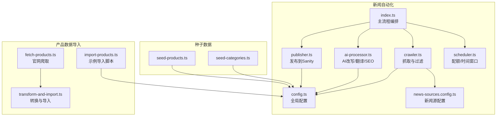
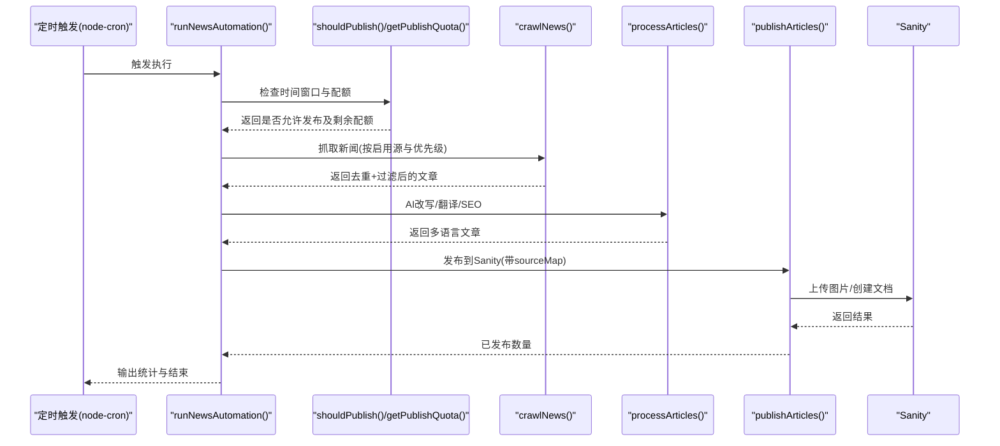
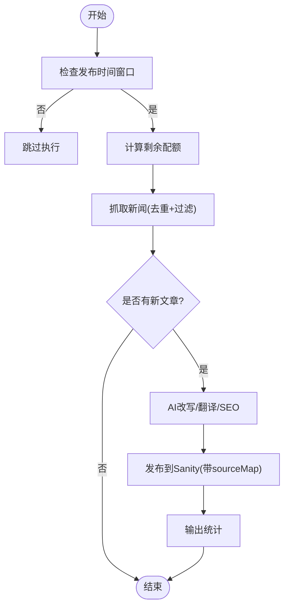
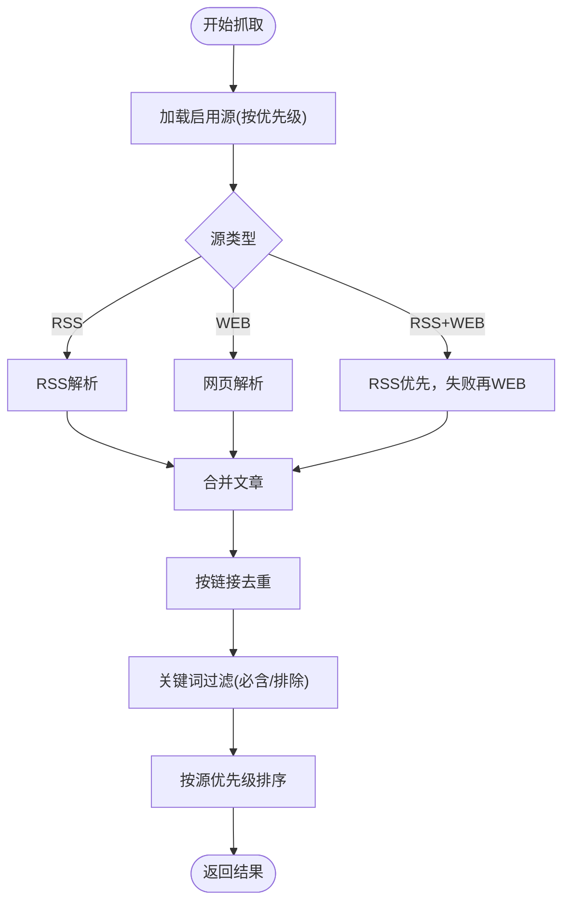
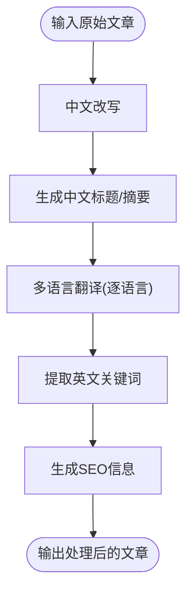
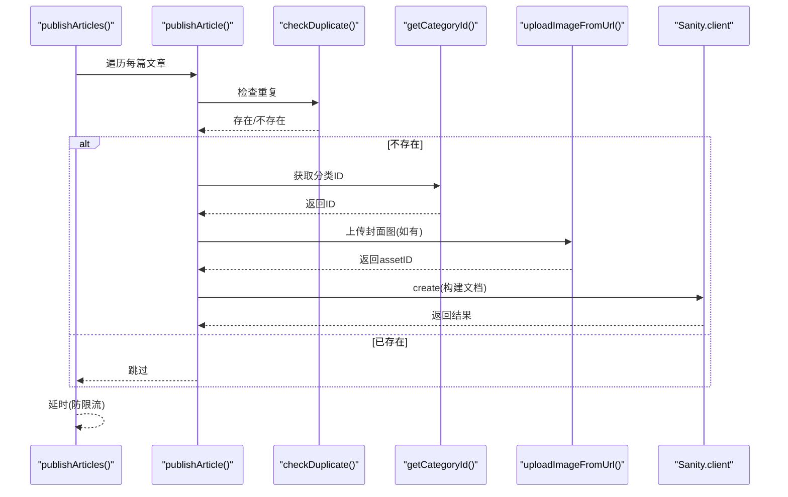
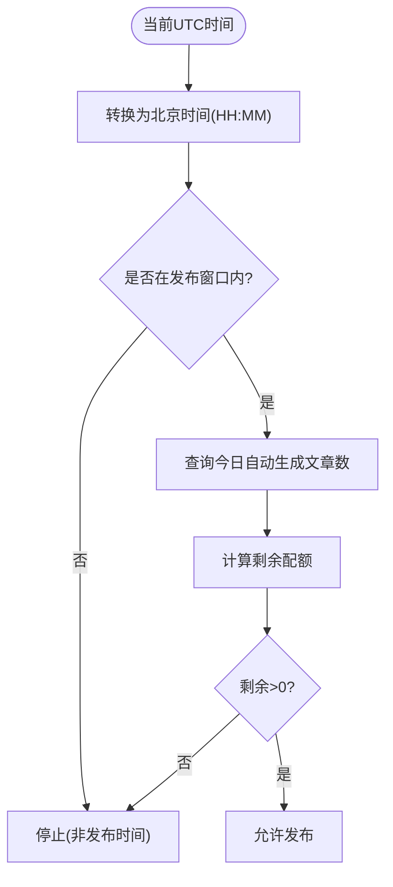
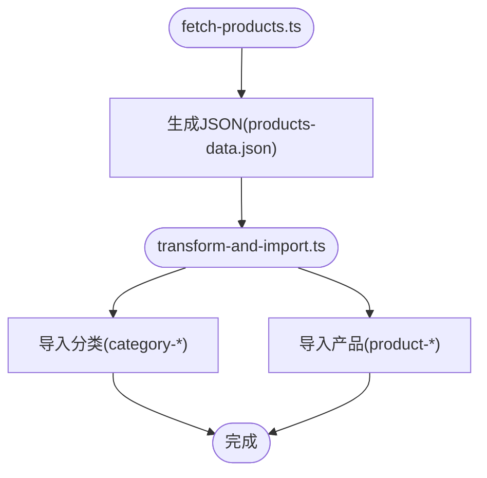
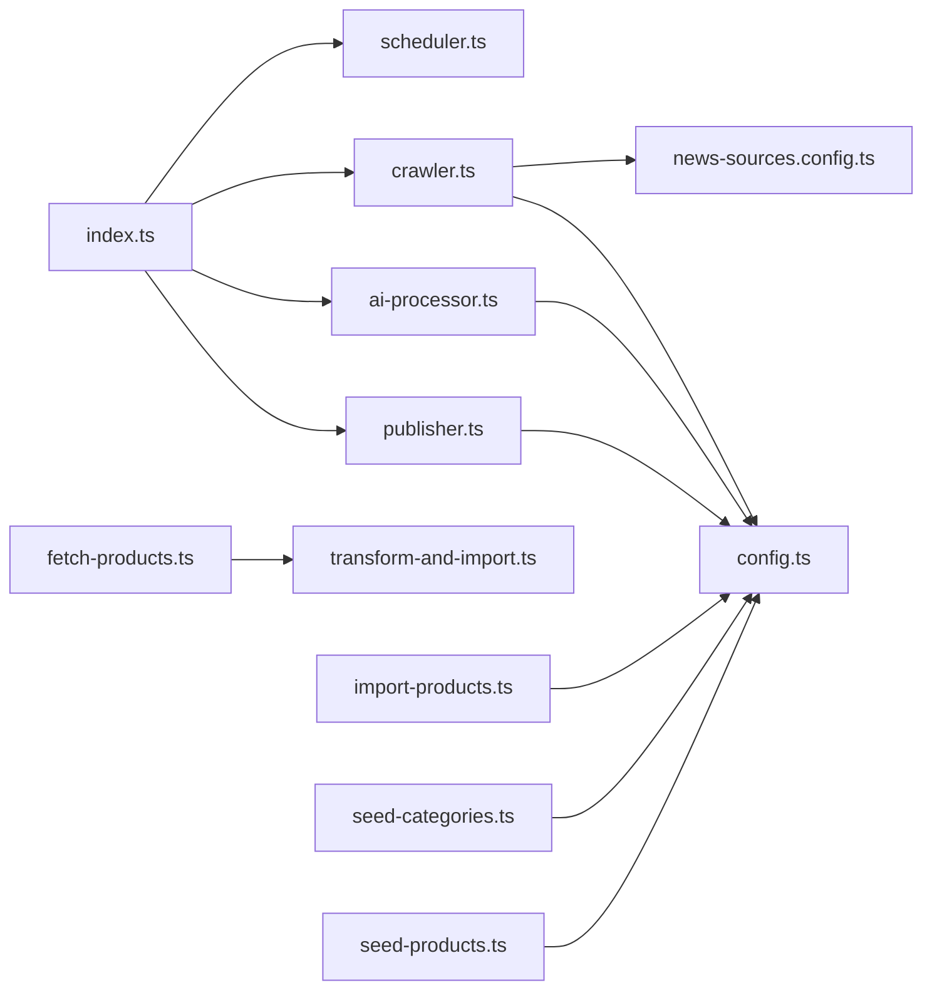

# 自动化工具

<cite>
**本文引用的文件**
- [scripts/news-auto/index.ts](file://scripts/news-auto/index.ts)
- [scripts/news-auto/crawler.ts](file://scripts/news-auto/crawler.ts)
- [scripts/news-auto/publisher.ts](file://scripts/news-auto/publisher.ts)
- [scripts/news-auto/scheduler.ts](file://scripts/news-auto/scheduler.ts)
- [scripts/news-auto/config.ts](file://scripts/news-auto/config.ts)
- [scripts/news-auto/news-sources.config.ts](file://scripts/news-auto/news-sources.config.ts)
- [scripts/news-auto/ai-processor.ts](file://scripts/news-auto/ai-processor.ts)
- [scripts/import-products.ts](file://scripts/import-products.ts)
- [scripts/seed-categories.ts](file://scripts/seed-categories.ts)
- [scripts/seed-products.ts](file://scripts/seed-products.ts)
- [scripts/crawler/fetch-products.ts](file://scripts/crawler/fetch-products.ts)
- [scripts/crawler/transform-and-import.ts](file://scripts/crawler/transform-and-import.ts)
- [scripts/test-news.js](file://scripts/test-news.js)
- [package.json](file://package.json)
</cite>

## 目录
1. [简介](#简介)
2. [项目结构](#项目结构)
3. [核心组件](#核心组件)
4. [架构总览](#架构总览)
5. [详细组件分析](#详细组件分析)
6. [依赖关系分析](#依赖关系分析)
7. [性能考量](#性能考量)
8. [故障排除指南](#故障排除指南)
9. [结论](#结论)
10. [附录](#附录)

## 简介
本文件面向 GoPro Trade 网站的自动化工具系统，覆盖三大主线：
- 新闻自动爬取与发布流水线：从多源 RSS/Web 抓取、去重与关键词过滤、AI 内容改写与翻译、配额与时间窗口控制、最终发布到 Sanity。
- 产品数据导入与初始化：从光莆官网爬取产品数据，转换为 Sanity 结构并批量导入；提供分类与核心产品种子数据初始化脚本。
- 种子数据生成工具：初始化产品分类与核心产品数据，便于快速搭建演示与测试环境。

文档还解释定时任务配置思路（基于 node-cron 的使用建议），以及数据清理与维护、监控与日志管理、故障排除与性能调优建议。

## 项目结构
自动化工具主要分布在 scripts 目录下，分为两类：
- news-auto：完整的新闻自动化流水线（抓取 → AI 处理 → 发布 → 调度）
- crawler：面向产品数据的爬取与导入脚本（光莆官网 → JSON → 转换 → 导入）
- seed-*：种子数据初始化脚本（分类与核心产品）

图表来源
- [scripts/news-auto/index.ts:1-83](file://scripts/news-auto/index.ts#L1-L83)
- [scripts/news-auto/crawler.ts:1-197](file://scripts/news-auto/crawler.ts#L1-L197)
- [scripts/news-auto/ai-processor.ts:1-232](file://scripts/news-auto/ai-processor.ts#L1-L232)
- [scripts/news-auto/publisher.ts:1-240](file://scripts/news-auto/publisher.ts#L1-L240)
- [scripts/news-auto/scheduler.ts:1-104](file://scripts/news-auto/scheduler.ts#L1-L104)
- [scripts/news-auto/config.ts:1-45](file://scripts/news-auto/config.ts#L1-L45)
- [scripts/news-auto/news-sources.config.ts:1-155](file://scripts/news-auto/news-sources.config.ts#L1-L155)
- [scripts/crawler/fetch-products.ts:1-320](file://scripts/crawler/fetch-products.ts#L1-L320)
- [scripts/crawler/transform-and-import.ts:1-254](file://scripts/crawler/transform-and-import.ts#L1-L254)
- [scripts/import-products.ts:1-161](file://scripts/import-products.ts#L1-L161)
- [scripts/seed-categories.ts:1-110](file://scripts/seed-categories.ts#L1-L110)
- [scripts/seed-products.ts:1-522](file://scripts/seed-products.ts#L1-L522)

章节来源
- [scripts/news-auto/index.ts:1-83](file://scripts/news-auto/index.ts#L1-L83)
- [scripts/news-auto/crawler.ts:1-197](file://scripts/news-auto/crawler.ts#L1-L197)
- [scripts/news-auto/ai-processor.ts:1-232](file://scripts/news-auto/ai-processor.ts#L1-L232)
- [scripts/news-auto/publisher.ts:1-240](file://scripts/news-auto/publisher.ts#L1-L240)
- [scripts/news-auto/scheduler.ts:1-104](file://scripts/news-auto/scheduler.ts#L1-L104)
- [scripts/news-auto/config.ts:1-45](file://scripts/news-auto/config.ts#L1-L45)
- [scripts/news-auto/news-sources.config.ts:1-155](file://scripts/news-auto/news-sources.config.ts#L1-L155)
- [scripts/crawler/fetch-products.ts:1-320](file://scripts/crawler/fetch-products.ts#L1-L320)
- [scripts/crawler/transform-and-import.ts:1-254](file://scripts/crawler/transform-and-import.ts#L1-L254)
- [scripts/import-products.ts:1-161](file://scripts/import-products.ts#L1-L161)
- [scripts/seed-categories.ts:1-110](file://scripts/seed-categories.ts#L1-L110)
- [scripts/seed-products.ts:1-522](file://scripts/seed-products.ts#L1-L522)

## 核心组件
- 新闻自动化主流程：负责整体编排，按配额与时间窗口决定是否执行，串联抓取、AI 处理与发布。
- 爬虫模块：支持 RSS 与网页两种抓取方式，统一抽取标题、摘要、内容、封面图、发布时间等字段，进行去重与关键词过滤。
- AI 处理模块：调用通义千问模型进行内容改写、多语言翻译、关键词抽取与 SEO 信息生成。
- 发布模块：检查重复、上传图片、构建 Sanity 文档并创建。
- 调度模块：基于北京时间窗口与每日配额控制发布节奏。
- 新闻源配置：集中维护新闻源清单、抓取方式、分类、语言、优先级与启用状态。
- 产品爬取与导入：从光莆官网抓取分类与产品详情，转换为 Sanity 结构并批量导入。
- 种子数据：初始化产品分类与核心产品，便于快速搭建演示环境。

章节来源
- [scripts/news-auto/index.ts:9-69](file://scripts/news-auto/index.ts#L9-L69)
- [scripts/news-auto/crawler.ts:155-196](file://scripts/news-auto/crawler.ts#L155-L196)
- [scripts/news-auto/ai-processor.ts:153-231](file://scripts/news-auto/ai-processor.ts#L153-L231)
- [scripts/news-auto/publisher.ts:58-239](file://scripts/news-auto/publisher.ts#L58-L239)
- [scripts/news-auto/scheduler.ts:67-94](file://scripts/news-auto/scheduler.ts#L67-L94)
- [scripts/news-auto/news-sources.config.ts:136-154](file://scripts/news-auto/news-sources.config.ts#L136-L154)
- [scripts/crawler/fetch-products.ts:241-306](file://scripts/crawler/fetch-products.ts#L241-L306)
- [scripts/crawler/transform-and-import.ts:175-230](file://scripts/crawler/transform-and-import.ts#L175-L230)
- [scripts/seed-categories.ts:83-107](file://scripts/seed-categories.ts#L83-L107)
- [scripts/seed-products.ts:463-519](file://scripts/seed-products.ts#L463-L519)

## 架构总览
新闻自动化系统采用“配置驱动 + 流水线编排”的架构：
- 配置层：NEWS_CONFIG（全局）、CATEGORY_MAP、TARGET_LOCALES、NEWS_SOURCES（独立配置文件）
- 流水线层：抓取 → 过滤 → AI 处理 → 发布 → 计数与配额
- 外部集成：RSS 解析、HTTP 抓取、Sanity API、通义千问 API

图表来源
- [scripts/news-auto/index.ts:9-69](file://scripts/news-auto/index.ts#L9-L69)
- [scripts/news-auto/scheduler.ts:67-94](file://scripts/news-auto/scheduler.ts#L67-L94)
- [scripts/news-auto/crawler.ts:155-196](file://scripts/news-auto/crawler.ts#L155-L196)
- [scripts/news-auto/ai-processor.ts:215-231](file://scripts/news-auto/ai-processor.ts#L215-L231)
- [scripts/news-auto/publisher.ts:215-239](file://scripts/news-auto/publisher.ts#L215-L239)

## 详细组件分析

### 新闻自动化主流程
- 功能要点
  - 时间窗口与配额检查：确保在目标市场北京时间范围内且未超过每日上限
  - 抓取与配额裁剪：按剩余配额限制处理数量
  - AI 处理与发布：生成多语言内容与 SEO 信息，发布到 Sanity
  - 统计输出：记录抓取、处理、发布与剩余配额
- 错误处理：捕获异常并抛出，便于外部监控告警

图表来源
- [scripts/news-auto/index.ts:9-69](file://scripts/news-auto/index.ts#L9-L69)
- [scripts/news-auto/scheduler.ts:67-94](file://scripts/news-auto/scheduler.ts#L67-L94)
- [scripts/news-auto/crawler.ts:155-196](file://scripts/news-auto/crawler.ts#L155-L196)
- [scripts/news-auto/ai-processor.ts:215-231](file://scripts/news-auto/ai-processor.ts#L215-L231)
- [scripts/news-auto/publisher.ts:215-239](file://scripts/news-auto/publisher.ts#L215-L239)

章节来源
- [scripts/news-auto/index.ts:9-69](file://scripts/news-auto/index.ts#L9-L69)

### 爬虫模块（新闻）
- 抓取策略
  - RSS 源：解析 RSS，提取标题、链接、内容、摘要、发布时间、封面图
  - 网页源：使用选择器定位列表项，提取标题、链接、摘要与图片
  - 图片优先级：enclosure/media:content > 内容中首张图 > 相对路径修正
- 过滤与去重
  - 基于关键词集合进行必要词与排除词过滤
  - 基于链接去重
  - 按新闻源优先级排序
- 配置来源：独立配置文件，支持启用/停用、优先级、headers、分类与语言

图表来源
- [scripts/news-auto/crawler.ts:22-196](file://scripts/news-auto/crawler.ts#L22-L196)
- [scripts/news-auto/news-sources.config.ts:136-154](file://scripts/news-auto/news-sources.config.ts#L136-L154)

章节来源
- [scripts/news-auto/crawler.ts:22-196](file://scripts/news-auto/crawler.ts#L22-L196)
- [scripts/news-auto/news-sources.config.ts:1-155](file://scripts/news-auto/news-sources.config.ts#L1-L155)

### AI 处理模块
- 改写与翻译
  - 中文改写：基于模板提示词，生成专业、客观、适合 B2B 的中文文章
  - 多语言翻译：对标题、摘要、正文进行翻译，失败时回退到英文或中文
- SEO 与关键词
  - 自动生成英文关键词列表
  - 生成 metaTitle/metaDescription 与 keywords
- 质量控制
  - 配额与时间窗口已在上游控制并发与数量
  - 通过提示词约束字数与风格

图表来源
- [scripts/news-auto/ai-processor.ts:153-231](file://scripts/news-auto/ai-processor.ts#L153-L231)

章节来源
- [scripts/news-auto/ai-processor.ts:19-58](file://scripts/news-auto/ai-processor.ts#L19-L58)
- [scripts/news-auto/ai-processor.ts:153-231](file://scripts/news-auto/ai-processor.ts#L153-L231)

### 发布模块（Sanity）
- 去重检查：按中文标题查询是否存在
- 分类解析：按分类 slug 获取分类 ID
- 图片上传：下载远程图片并上传到 Sanity Assets
- 文档构建：按多语言结构构建 content、seo 等字段
- 批量发布：逐条发布并延时避免限流

图表来源
- [scripts/news-auto/publisher.ts:58-239](file://scripts/news-auto/publisher.ts#L58-L239)

章节来源
- [scripts/news-auto/publisher.ts:14-239](file://scripts/news-auto/publisher.ts#L14-L239)

### 调度模块（时间窗口与配额）
- 时间窗口：将 UTC 转换为北京时间，判断是否在设定时间段内（±90 分钟容差）
- 每日配额：查询当天自动生成文章数量，计算剩余配额
- 测试模式：可通过环境变量绕过时间检查，便于本地调试

图表来源
- [scripts/news-auto/scheduler.ts:29-94](file://scripts/news-auto/scheduler.ts#L29-L94)

章节来源
- [scripts/news-auto/scheduler.ts:7-20](file://scripts/news-auto/scheduler.ts#L7-L20)
- [scripts/news-auto/scheduler.ts:29-94](file://scripts/news-auto/scheduler.ts#L29-L94)

### 新闻源配置
- 结构化配置：name/url/type/rss/selector/category/language/priority/enabled/headers/notes
- 查询接口：按启用状态、分类、语言筛选，按 priority 排序
- 维护建议：新增源在数组中添加，停用设 enabled=false，调整优先级修改 priority

章节来源
- [scripts/news-auto/news-sources.config.ts:17-154](file://scripts/news-auto/news-sources.config.ts#L17-L154)

### 产品数据导入与初始化
- 光莆官网爬取：遍历分类页与分页，抓取产品列表与详情，解析卖点、应用、规格、图片等
- 转换导入：将原始数据转换为 Sanity 结构（产品/规格/分类），批量 createOrReplace
- 示例导入：提供静态数据的导入脚本，便于快速验证
- 种子数据：初始化核心分类与20个核心产品，便于演示与测试

图表来源
- [scripts/crawler/fetch-products.ts:241-306](file://scripts/crawler/fetch-products.ts#L241-L306)
- [scripts/crawler/transform-and-import.ts:175-230](file://scripts/crawler/transform-and-import.ts#L175-L230)
- [scripts/import-products.ts:64-158](file://scripts/import-products.ts#L64-L158)
- [scripts/seed-categories.ts:83-107](file://scripts/seed-categories.ts#L83-L107)
- [scripts/seed-products.ts:463-519](file://scripts/seed-products.ts#L463-L519)

章节来源
- [scripts/crawler/fetch-products.ts:69-306](file://scripts/crawler/fetch-products.ts#L69-L306)
- [scripts/crawler/transform-and-import.ts:55-230](file://scripts/crawler/transform-and-import.ts#L55-L230)
- [scripts/import-products.ts:64-158](file://scripts/import-products.ts#L64-L158)
- [scripts/seed-categories.ts:83-107](file://scripts/seed-categories.ts#L83-L107)
- [scripts/seed-products.ts:463-519](file://scripts/seed-products.ts#L463-L519)

## 依赖关系分析
- 外部库
  - rss-parser：RSS 解析
  - axios/cheerio：HTTP 抓取与 DOM 解析
  - jsdom：网页解析（产品爬取）
  - @sanity/client：Sanity API
  - node-cron：定时任务（建议使用）
  - dotenv：环境变量加载
- 模块间耦合
  - index.ts 依赖 scheduler、crawler、ai-processor、publisher
  - crawler 依赖 news-sources.config 与 config
  - ai-processor 依赖 config 与通义千问 API
  - publisher 依赖 config 与 sanity/client
  - 产品导入链路相互独立，与新闻自动化无直接耦合

图表来源
- [scripts/news-auto/index.ts:1-7](file://scripts/news-auto/index.ts#L1-L7)
- [scripts/news-auto/crawler.ts:1-6](file://scripts/news-auto/crawler.ts#L1-L6)
- [scripts/news-auto/ai-processor.ts:1-3](file://scripts/news-auto/ai-processor.ts#L1-L3)
- [scripts/news-auto/publisher.ts:1-2](file://scripts/news-auto/publisher.ts#L1-L2)
- [scripts/news-auto/news-sources.config.ts:1-155](file://scripts/news-auto/news-sources.config.ts#L1-L155)
- [scripts/news-auto/config.ts:1-45](file://scripts/news-auto/config.ts#L1-L45)
- [scripts/crawler/fetch-products.ts:1-320](file://scripts/crawler/fetch-products.ts#L1-L320)
- [scripts/crawler/transform-and-import.ts:1-254](file://scripts/crawler/transform-and-import.ts#L1-L254)
- [scripts/import-products.ts:1-161](file://scripts/import-products.ts#L1-L161)
- [scripts/seed-categories.ts:1-110](file://scripts/seed-categories.ts#L1-L110)
- [scripts/seed-products.ts:1-522](file://scripts/seed-products.ts#L1-L522)

章节来源
- [package.json:12-28](file://package.json#L12-L28)

## 性能考量
- 并发与限流
  - 发布与 AI 处理均设置了延时，避免 API 限流与服务端压力
  - 建议在生产环境结合 node-cron 的并发策略与重试机制
- 网络与解析
  - 抓取超时与错误重试策略需在上游配置
  - RSS 与网页解析的稳定性取决于目标站点结构变化
- 存储与索引
  - 发布前的重复检查与分类查询会增加查询开销，建议在 Sanity 端确保相关字段建立索引
- 配额与窗口
  - 合理设置每日配额与发布时间窗口，避免突发流量导致限流或延迟

## 故障排除指南
- 新闻抓取失败
  - 检查新闻源 headers（如 UA）与 RSS/网页可用性
  - 使用测试脚本验证 RSS 可用性与关键词匹配
- AI 处理报错
  - 确认通义千问 API Key 环境变量配置正确
  - 检查提示词与模型参数是否合理
- 发布失败
  - 检查分类 slug 是否存在、图片下载是否成功
  - 查看 Sanity 返回的错误信息，确认文档结构与字段类型
- 产品导入异常
  - 确认分类 ID 映射正确，产品 JSON 文件存在
  - 检查 Sanity Token 权限与 API 版本
- 调度问题
  - 本地测试可设置绕过时间检查的环境变量
  - 在 Vercel/Cron 环境下注意时区转换与 ±1 小时浮动误差

章节来源
- [scripts/test-news.js:5-37](file://scripts/test-news.js#L5-L37)
- [scripts/news-auto/ai-processor.ts:20-24](file://scripts/news-auto/ai-processor.ts#L20-L24)
- [scripts/news-auto/publisher.ts:14-239](file://scripts/news-auto/publisher.ts#L14-L239)
- [scripts/crawler/transform-and-import.ts:233-251](file://scripts/crawler/transform-and-import.ts#L233-L251)
- [scripts/news-auto/scheduler.ts:30-34](file://scripts/news-auto/scheduler.ts#L30-L34)

## 结论
本自动化工具体系以“配置驱动 + 流水线编排”为核心，覆盖新闻与产品两大业务域：
- 新闻自动化：具备完善的抓取、过滤、AI 处理、发布与调度能力，适配多源、多语言与多分类场景
- 产品数据导入：提供从官网爬取到 Sanity 导入的完整链路，支持种子数据初始化
- 可扩展性：通过独立配置文件与模块化设计，便于维护与扩展

建议在生产环境中结合 node-cron 的调度策略、完善的日志与告警、以及定期的配置与数据健康检查，持续优化性能与稳定性。

## 附录
- 定时任务配置（node-cron 使用建议）
  - 在 Vercel/Cron 环境下，注意 UTC 与目标市场时区转换
  - 设置合理的执行周期与容差窗口，避免 ±1 小时浮动带来的偏差
  - 结合 shouldPublish 的时间窗口与配额控制，确保任务在合适的时间窗口内执行
- 监控与日志
  - 在关键步骤输出统计信息（抓取/处理/发布数量）
  - 对异常进行统一捕获与上报，便于快速定位问题
- 数据清理与维护
  - 定期检查重复文章与重复产品，清理无效数据
  - 对图片资源进行去重与失效检测，保持存储整洁
- 性能调优
  - 合理设置并发与延时，避免触发第三方限流
  - 对 RSS 与网页解析的稳定性进行监控与降级策略设计