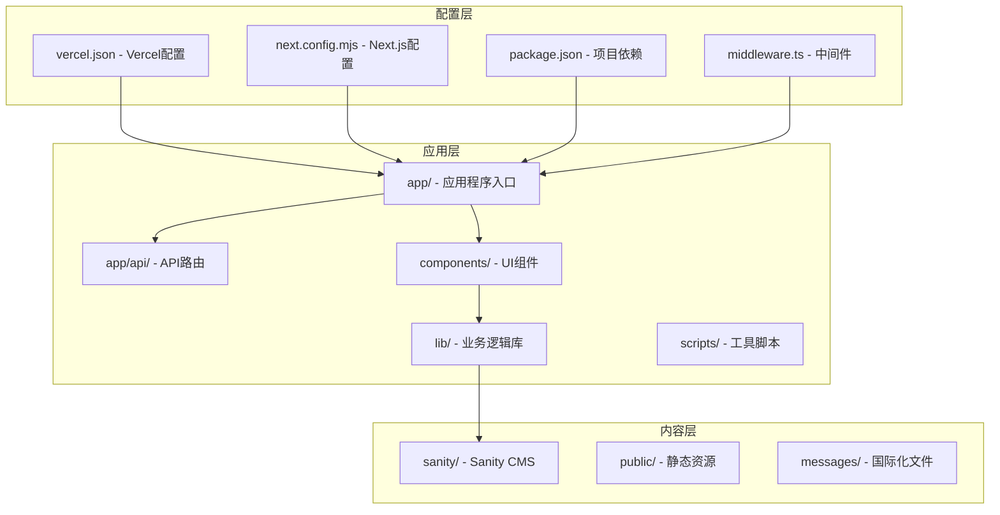
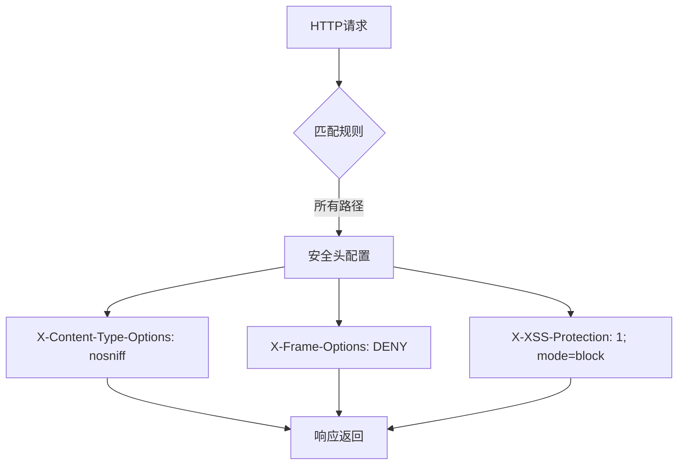
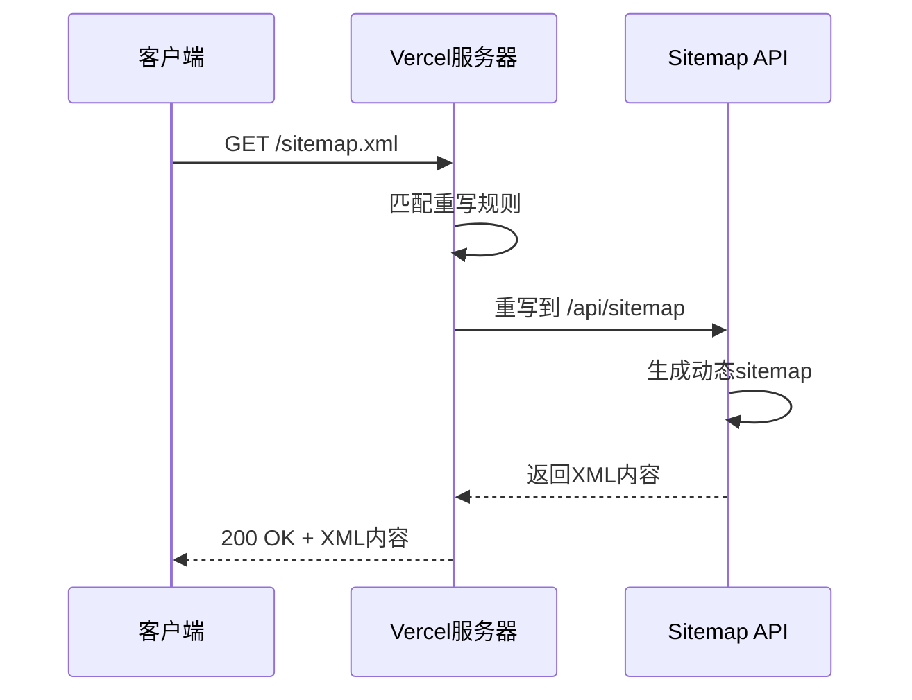
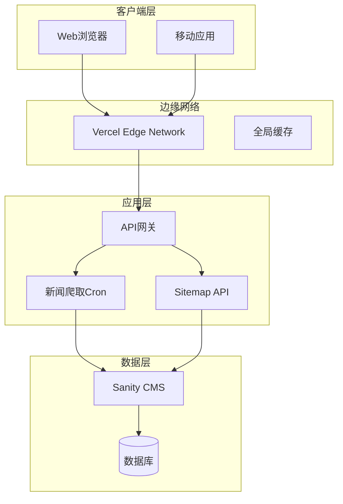
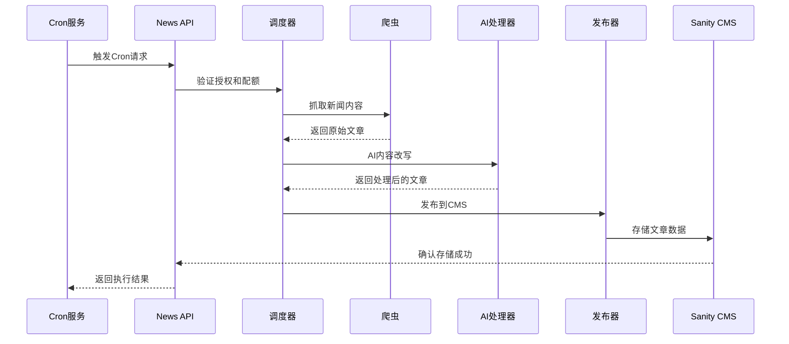
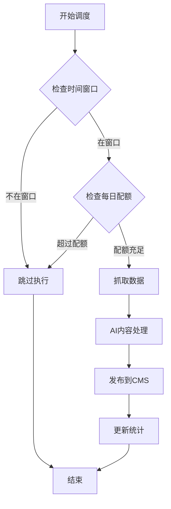
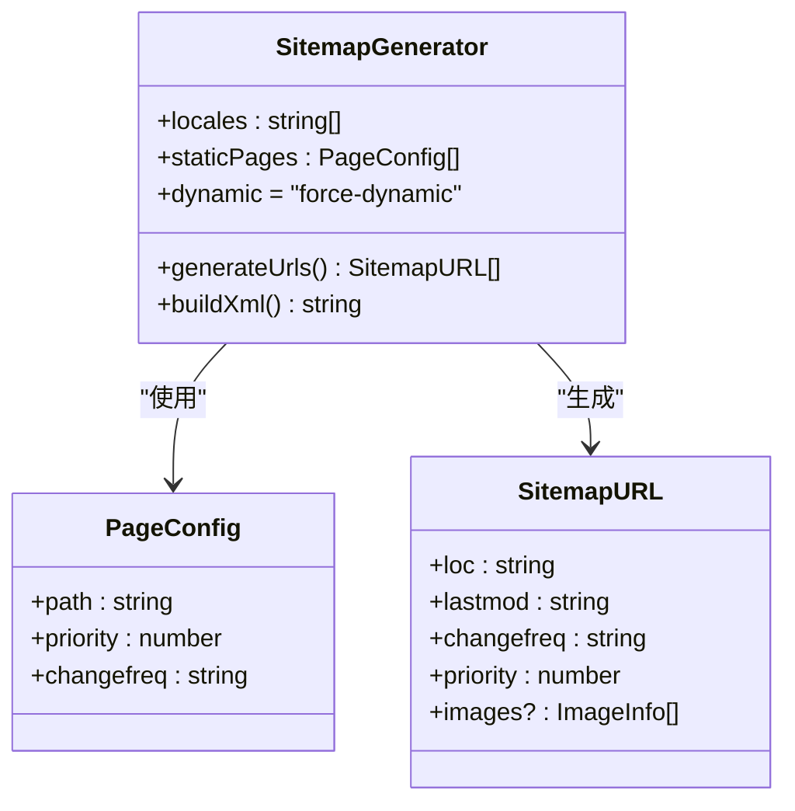
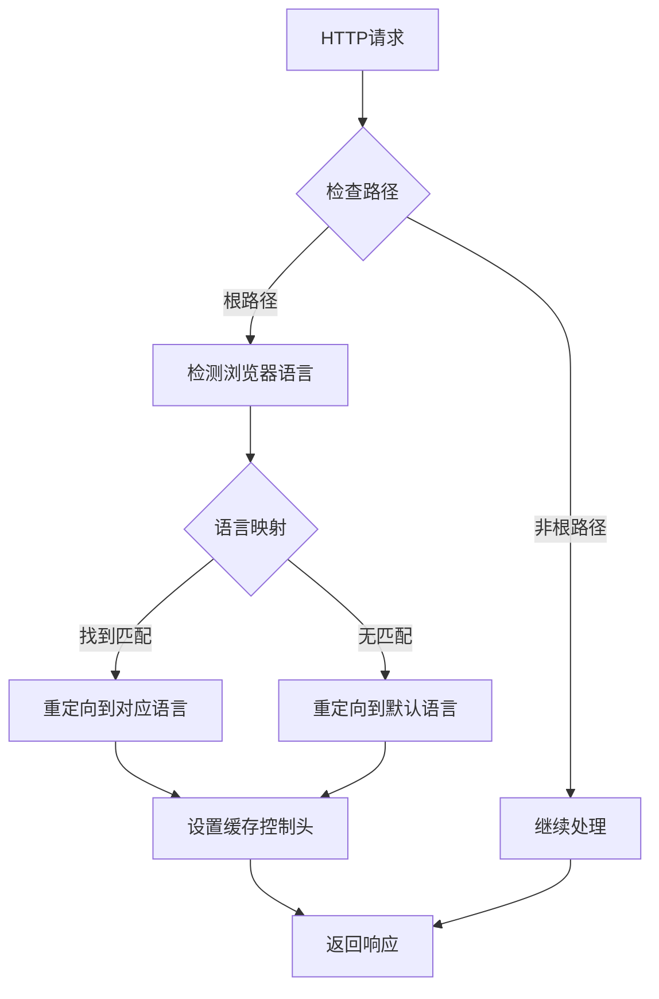
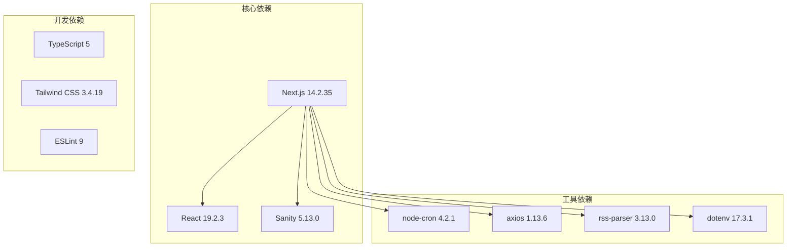
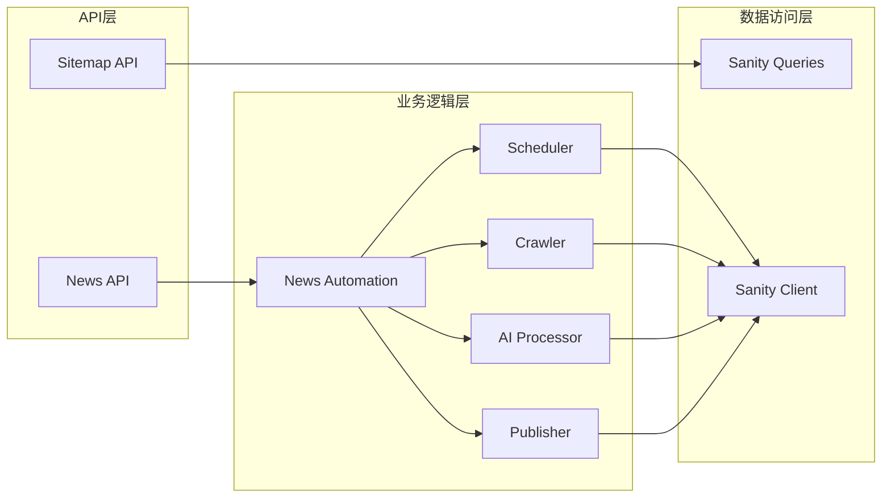

# Vercel部署配置

<cite>
**本文档引用的文件**
- [vercel.json](file://vercel.json)
- [package.json](file://package.json)
- [next.config.mjs](file://next.config.mjs)
- [middleware.ts](file://middleware.ts)
- [app/api/cron/news/route.ts](file://app/api/cron/news/route.ts)
- [app/api/sitemap/route.ts](file://app/api/sitemap/route.ts)
- [scripts/news-auto/index.ts](file://scripts/news-auto/index.ts)
- [scripts/news-auto/scheduler.ts](file://scripts/news-auto/scheduler.ts)
- [scripts/news-auto/config.ts](file://scripts/news-auto/config.ts)
- [lib/sanity/queries.ts](file://lib/sanity/queries.ts)
- [lib/i18n/config.ts](file://lib/i18n/config.ts)
- [app/layout.tsx](file://app/layout.tsx)
</cite>

## 目录
1. [简介](#简介)
2. [项目结构](#项目结构)
3. [核心组件](#核心组件)
4. [架构概览](#架构概览)
5. [详细组件分析](#详细组件分析)
6. [依赖关系分析](#依赖关系分析)
7. [性能考虑](#性能考虑)
8. [故障排除指南](#故障排除指南)
9. [结论](#结论)
10. [附录](#附录)

## 简介

本指南详细说明了GoPro Trade网站在Vercel平台上的部署配置。该网站基于Next.js 14构建，采用多语言国际化支持，集成了Sanity CMS内容管理系统，并实现了自动化的新闻爬取和SEO优化功能。本文档重点涵盖Vercel配置文件的各项设置、HTTP安全头配置、URL重写规则、定时任务配置、环境变量管理以及域名绑定等关键部署要素。

## 项目结构

GoPro Trade网站采用现代化的Next.js应用架构，主要目录结构如下：



**图表来源**
- [vercel.json:1-44](file://vercel.json#L1-L44)
- [package.json:1-45](file://package.json#L1-L45)
- [next.config.mjs:1-65](file://next.config.mjs#L1-L65)

**章节来源**
- [vercel.json:1-44](file://vercel.json#L1-L44)
- [package.json:1-45](file://package.json#L1-L45)
- [next.config.mjs:1-65](file://next.config.mjs#L1-L65)

## 核心组件

### Vercel配置文件详解

Vercel配置文件是整个部署系统的核心，包含了构建、开发、安全和调度等关键配置：

#### 基础配置项

| 配置项 | 值 | 说明 |
|--------|-----|------|
| version | 2 | Vercel配置版本 |
| framework | nextjs | 指定使用Next.js框架 |
| regions | ["sin1"] | 部署区域选择新加坡 |
| installCommand | "npm install --legacy-peer-deps" | 安装命令，使用遗留peer依赖模式 |
| buildCommand | "rm -rf .next && npm run build" | 构建命令，清理缓存后执行构建 |
| devCommand | "npm run dev" | 开发服务器启动命令 |

#### HTTP安全头配置

Vercel配置中定义了三层安全头保护：



**图表来源**
- [vercel.json:8-26](file://vercel.json#L8-L26)

#### URL重写规则

系统实现了sitemap.xml到API端点的重写机制：



**图表来源**
- [vercel.json:27-32](file://vercel.json#L27-L32)
- [app/api/sitemap/route.ts:16-99](file://app/api/sitemap/route.ts#L16-L99)

#### 定时任务配置

系统配置了两个Cron作业，用于自动化新闻爬取：

| Cron表达式 | 用途 | 时间点 |
|------------|------|--------|
| 0 1 * * * | 凌晨1点UTC | 北京时间9点 |
| 0 7 * * * | 上午7点UTC | 北京时间15点 |

**章节来源**
- [vercel.json:33-42](file://vercel.json#L33-L42)
- [app/api/cron/news/route.ts:1-52](file://app/api/cron/news/route.ts#L1-L52)

### Next.js配置优化

Next.js配置文件进一步增强了应用的性能和安全性：

#### 图片优化配置

```mermaid
classDiagram
class ImageConfig {
+formats : ["image/avif", "image/webp"]
+deviceSizes : [640,750,828,1080,1920]
+imageSizes : [16,32,48,64,96,128,256,384]
+minimumCacheTTL : 2592000
+remotePatterns : [{protocol : "https", hostname : "cdn.sanity.io"}]
}
class PerformanceOptimization {
+compress : true
+optimizePackageImports : ["lucide-react","@sanity/client"]
}
ImageConfig --> PerformanceOptimization : "增强"
```

**图表来源**
- [next.config.mjs:4-17](file://next.config.mjs#L4-L17)
- [next.config.mjs:29-32](file://next.config.mjs#L29-L32)

#### 缓存策略配置

Next.js配置实现了多层次的缓存策略：

| 资源类型 | 缓存策略 | 有效期 |
|----------|----------|--------|
| 图片资源 | public, max-age=31536000, immutable | 1年 |
| 字体文件 | public, max-age=31536000, immutable | 1年 |
| 页面安全头 | 动态生成 | 每次请求 |

**章节来源**
- [next.config.mjs:34-61](file://next.config.mjs#L34-L61)

## 架构概览

整个部署架构采用了微服务化的API设计模式：



**图表来源**
- [vercel.json:1-44](file://vercel.json#L1-L44)
- [app/api/cron/news/route.ts:1-52](file://app/api/cron/news/route.ts#L1-L52)
- [app/api/sitemap/route.ts:1-100](file://app/api/sitemap/route.ts#L1-L100)

## 详细组件分析

### 新闻自动化系统

新闻自动化系统是网站的核心功能模块，实现了完整的新闻采集、处理和发布流程：



**图表来源**
- [scripts/news-auto/index.ts:9-69](file://scripts/news-auto/index.ts#L9-L69)
- [app/api/cron/news/route.ts:5-46](file://app/api/cron/news/route.ts#L5-L46)

#### 调度策略分析

调度器实现了智能的时间窗口管理和配额控制：



**图表来源**
- [scripts/news-auto/scheduler.ts:29-94](file://scripts/news-auto/scheduler.ts#L29-L94)

#### 配置参数详解

新闻自动化系统的关键配置参数：

| 配置类别 | 参数名 | 默认值 | 说明 |
|----------|--------|--------|------|
| 发布设置 | maxArticlesPerDay | 2 | 每日最大发布数量 |
| 发布设置 | publishTimes | ['09:00', '15:00'] | 发布时间窗口 |
| 关键词过滤 | required | ['LED','半导体','光运用'] | 必须包含的关键词 |
| 关键词过滤 | optional | ['光莆','GOPRO','红外'] | 可选关键词 |
| AI配置 | model | 'qwen-turbo' | AI模型名称 |
| AI配置 | maxTokens | 2000 | 最大Token数 |
| 质量阈值 | minWordCount | 500 | 最小字数 |
| 质量阈值 | maxWordCount | 2000 | 最大字数 |

**章节来源**
- [scripts/news-auto/config.ts:6-34](file://scripts/news-auto/config.ts#L6-L34)
- [scripts/news-auto/scheduler.ts:7-20](file://scripts/news-auto/scheduler.ts#L7-L20)

### Sitemap生成系统

Sitemap生成系统提供了多语言支持的动态XML生成：



**图表来源**
- [app/api/sitemap/route.ts:8-74](file://app/api/sitemap/route.ts#L8-L74)

#### 多语言支持机制

系统支持6种语言的sitemap生成，每种语言都会生成对应的URL列表：

| 语言代码 | 语言名称 | 语言方向 |
|----------|----------|----------|
| en | English | 左到右 |
| zh | 中文 | 左到右 |
| id | Bahasa Indonesia | 左到右 |
| th | ไทย | 左到右 |
| vi | Tiếng Việt | 左到右 |
| ar | العربية | 右到左 |

**章节来源**
- [lib/i18n/config.ts:1-16](file://lib/i18n/config.ts#L1-L16)
- [app/api/sitemap/route.ts:41-74](file://app/api/sitemap/route.ts#L41-L74)

### 国际化中间件

国际化中间件负责根据用户浏览器语言进行自动重定向：



**图表来源**
- [middleware.ts:44-63](file://middleware.ts#L44-L63)

**章节来源**
- [middleware.ts:1-68](file://middleware.ts#L1-L68)

## 依赖关系分析

### 外部依赖关系



**图表来源**
- [package.json:12-28](file://package.json#L12-L28)
- [package.json:30-42](file://package.json#L30-L42)

### 内部模块依赖



**图表来源**
- [app/api/cron/news/route.ts:2](file://app/api/cron/news/route.ts#L2)
- [app/api/sitemap/route.ts:3](file://app/api/sitemap/route.ts#L3)
- [lib/sanity/queries.ts:1-120](file://lib/sanity/queries.ts#L1-L120)

**章节来源**
- [package.json:1-45](file://package.json#L1-L45)

## 性能考虑

### 缓存策略优化

系统实现了多层次的缓存策略以提升性能：

#### 边缘缓存配置

| 缓存类型 | 规则 | 缓存时间 | 适用场景 |
|----------|------|----------|----------|
| 图片缓存 | /images/:path* | 31536000秒 | 静态图片资源 |
| 字体缓存 | :path*.woff2 | 31536000秒 | 字体文件 |
| Sitemap缓存 | 动态生成 | 3600秒 | XML网站地图 |
| 动态API缓存 | 动态生成 | 3600秒 | 内容API响应 |

#### 图片优化配置

系统支持现代图片格式和智能尺寸选择：

- **支持格式**: AVIF, WebP
- **设备尺寸**: 640px, 750px, 828px, 1080px, 1920px
- **图像尺寸**: 16px到384px
- **缓存策略**: 30天长期缓存

### 压缩和传输优化

- **Gzip压缩**: 启用gzip压缩减少传输体积
- **HTTP/2支持**: 利用HTTP/2多路复用提升并发性能
- **CDN加速**: 通过Vercel全球CDN网络提升访问速度

## 故障排除指南

### 常见部署问题

#### Cron作业失败排查

当Cron作业执行失败时，首先检查以下配置：

1. **授权验证失败**
   - 检查CRON_SECRET环境变量是否正确设置
   - 验证Authorization头格式是否为Bearer token

2. **API密钥缺失**
   - 确认DASHSCOPE_API_KEY环境变量已配置
   - 检查API密钥的有效性和权限范围

3. **时间窗口检查**
   - 验证NEWS_BYPASS_TIME_CHECK环境变量设置
   - 检查Vercel Cron的时区设置（UTC）

#### Sitemap生成错误

如果sitemap生成失败，检查：

1. **Sanity连接**
   - 验证SANITY_PROJECT_ID和SANITY_TOKEN配置
   - 检查网络连接和防火墙设置

2. **数据查询**
   - 确认相关schema定义完整
   - 检查数据权限和访问控制

#### 国际化重定向问题

如果语言重定向异常：

1. **浏览器语言检测**
   - 检查Accept-Language头信息
   - 验证语言代码映射表完整性

2. **缓存问题**
   - 清除浏览器缓存
   - 检查Cache-Control头设置

**章节来源**
- [app/api/cron/news/route.ts:6-15](file://app/api/cron/news/route.ts#L6-L15)
- [app/api/sitemap/route.ts:17](file://app/api/sitemap/route.ts#L17)
- [middleware.ts:21-42](file://middleware.ts#L21-L42)

## 结论

GoPro Trade网站的Vercel部署配置展现了现代化Web应用的最佳实践。通过合理的配置文件设计、多层次的安全防护、智能化的缓存策略和完善的监控机制，系统实现了高性能、高可用的部署架构。

关键优势包括：
- **安全优先**: 完整的HTTP安全头配置和Cron作业授权机制
- **性能优化**: 多层次缓存策略和现代图片格式支持
- **可扩展性**: 模块化的API设计和清晰的依赖关系
- **可靠性**: 智能的调度策略和错误处理机制

建议在生产环境中定期监控以下指标：
- Cron作业成功率
- Sitemap生成响应时间
- 图片加载性能
- 用户语言重定向准确率

## 附录

### 环境变量配置清单

| 变量名 | 类型 | 必需 | 说明 |
|--------|------|------|------|
| CRON_SECRET | String | 是 | Cron作业授权密钥 |
| DASHSCOPE_API_KEY | String | 是 | 通义千问API密钥 |
| SANITY_PROJECT_ID | String | 是 | Sanity项目ID |
| SANITY_TOKEN | String | 是 | Sanity访问令牌 |
| NEXT_PUBLIC_SITE_URL | String | 是 | 站点URL |
| NEWS_BYPASS_TIME_CHECK | Boolean | 否 | 跳过时间检查（测试模式） |

### 部署最佳实践

1. **构建优化**
   - 使用Vercel的增量构建功能
   - 启用静态导出优化
   - 配置适当的缓存策略

2. **监控和日志**
   - 设置Cron作业执行监控
   - 配置错误日志告警
   - 监控站点性能指标

3. **安全加固**
   - 定期轮换CRON_SECRET
   - 实施IP白名单限制
   - 启用HTTPS强制跳转

4. **备份策略**
   - 定期备份Sanity内容
   - 备份关键配置文件
   - 建立灾难恢复计划