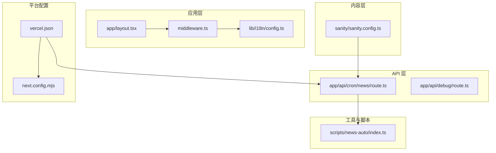
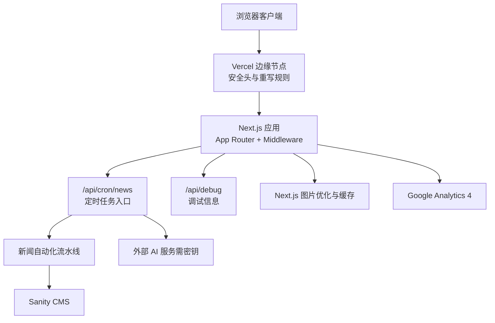
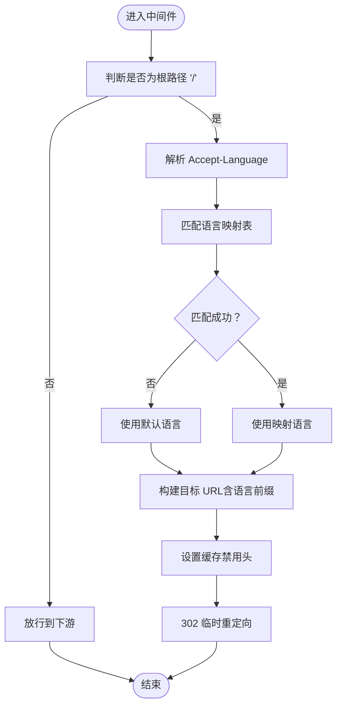
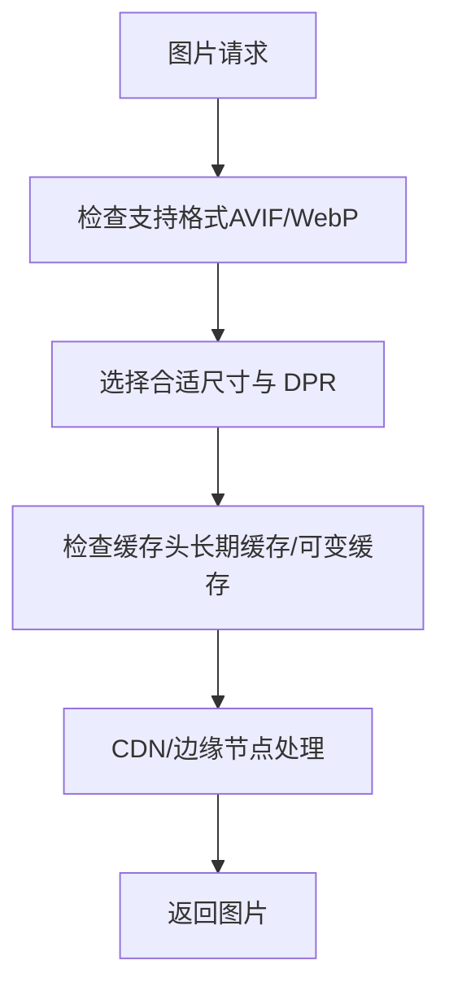
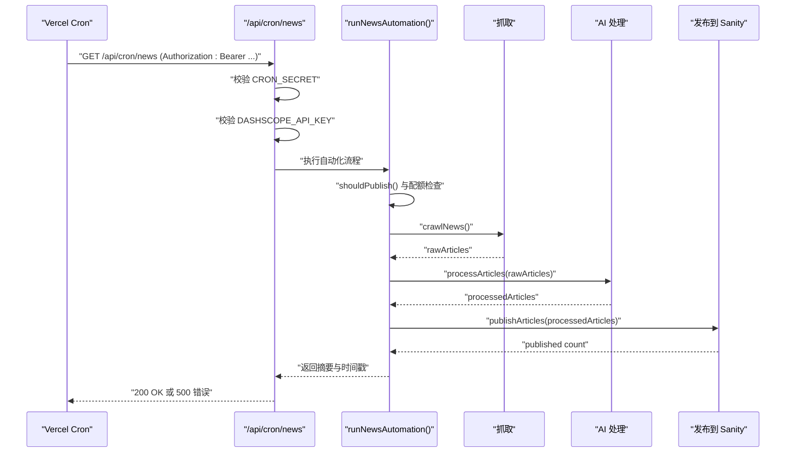
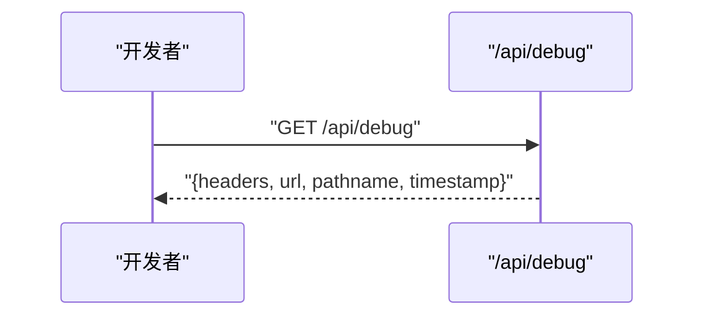
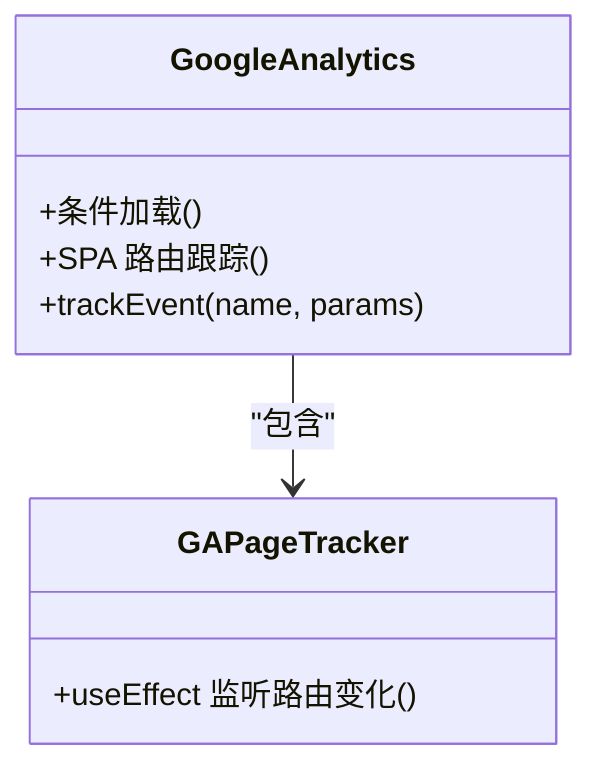
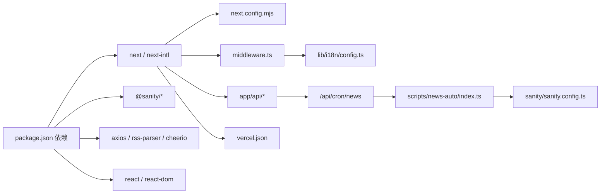

# 故障排除和应急响应

<cite>
**本文引用的文件**
- [README.md](file://README.md)
- [package.json](file://package.json)
- [next.config.mjs](file://next.config.mjs)
- [middleware.ts](file://middleware.ts)
- [lib/i18n/config.ts](file://lib/i18n/config.ts)
- [app/layout.tsx](file://app/layout.tsx)
- [app/api/cron/news/route.ts](file://app/api/cron/news/route.ts)
- [app/api/debug/route.ts](file://app/api/debug/route.ts)
- [sanity/sanity.config.ts](file://sanity/sanity.config.ts)
- [scripts/news-auto/index.ts](file://scripts/news-auto/index.ts)
- [components/analytics/GoogleAnalytics.tsx](file://components/analytics/GoogleAnalytics.tsx)
- [vercel.json](file://vercel.json)
</cite>

## 目录
1. [简介](#简介)
2. [项目结构](#项目结构)
3. [核心组件](#核心组件)
4. [架构总览](#架构总览)
5. [详细组件分析](#详细组件分析)
6. [依赖关系分析](#依赖关系分析)
7. [性能考量](#性能考量)
8. [故障排除指南](#故障排除指南)
9. [结论](#结论)
10. [附录](#附录)

## 简介
本指南面向 GoPro Trade 网站的运维与开发团队，提供系统化的故障排除与应急响应流程，涵盖页面加载失败、API 调用错误、图片显示问题、SEO 标签异常等常见问题的诊断步骤；同时给出调试工具使用方法（浏览器开发者工具、网络面板、控制台日志、性能分析）、紧急响应流程（故障分类、影响评估、应急处理、恢复验证）、数据恢复策略（数据库备份、内容回滚、配置恢复、版本回退）、安全事件处理（DDoS 防护、恶意请求拦截、数据泄露应急、权限恢复）、性能问题排查（内存泄漏检测、CPU 占用分析、网络延迟诊断、缓存失效处理），以及预防性维护建议（定期检查、健康检查、容量规划、安全审计）。

## 项目结构
该网站基于 Next.js 应用，采用 App Router 结构，前端静态资源与服务端 API 分离，内容管理通过 Sanity CMS 提供。关键模块包括：
- 应用层：页面、布局、国际化配置、中间件
- API 层：定时任务、调试接口、站点地图等
- 内容层：Sanity 配置与模式
- 工具与脚本：新闻自动化流水线、爬虫、AI 处理、发布器
- 平台配置：Vercel 部署与重写规则

图表来源
- [app/layout.tsx:1-19](file://app/layout.tsx#L1-L19)
- [middleware.ts:1-68](file://middleware.ts#L1-L68)
- [lib/i18n/config.ts:1-16](file://lib/i18n/config.ts#L1-L16)
- [app/api/cron/news/route.ts:1-52](file://app/api/cron/news/route.ts#L1-L52)
- [app/api/debug/route.ts:1-16](file://app/api/debug/route.ts#L1-L16)
- [sanity/sanity.config.ts:1-33](file://sanity/sanity.config.ts#L1-L33)
- [scripts/news-auto/index.ts:1-83](file://scripts/news-auto/index.ts#L1-L83)
- [vercel.json:1-44](file://vercel.json#L1-L44)
- [next.config.mjs:1-65](file://next.config.mjs#L1-L65)

章节来源
- [README.md:1-42](file://README.md#L1-L42)
- [package.json:1-45](file://package.json#L1-L45)
- [next.config.mjs:1-65](file://next.config.mjs#L1-L65)
- [middleware.ts:1-68](file://middleware.ts#L1-L68)
- [lib/i18n/config.ts:1-16](file://lib/i18n/config.ts#L1-L16)
- [app/layout.tsx:1-19](file://app/layout.tsx#L1-L19)
- [app/api/cron/news/route.ts:1-52](file://app/api/cron/news/route.ts#L1-L52)
- [app/api/debug/route.ts:1-16](file://app/api/debug/route.ts#L1-L16)
- [sanity/sanity.config.ts:1-33](file://sanity/sanity.config.ts#L1-L33)
- [scripts/news-auto/index.ts:1-83](file://scripts/news-auto/index.ts#L1-L83)
- [vercel.json:1-44](file://vercel.json#L1-L44)

## 核心组件
- 国际化与语言检测：通过中间件根据浏览器 Accept-Language 选择语言并进行 302 临时重定向，避免缓存污染。
- 图片与缓存策略：Next.js 图片优化与长期缓存头配置，减少带宽与提升 LCP。
- 安全响应头：统一注入 X-Content-Type-Options、X-Frame-Options、X-XSS-Protection 等安全头。
- 定时任务：通过 Vercel Cron 调用 /api/cron/news，受 Bearer Token 保护，内部校验 DASHSCOPE_API_KEY。
- 新闻自动化流水线：抓取 -> AI 处理 -> 发布到 Sanity，具备配额与跳过逻辑。
- 调试接口：输出请求头、URL、路径、时间戳，便于快速定位环境与代理问题。
- 统计分析：Google Analytics 4 集成，支持 SPA 路由跟踪与自定义事件。

章节来源
- [middleware.ts:1-68](file://middleware.ts#L1-L68)
- [next.config.mjs:1-65](file://next.config.mjs#L1-L65)
- [vercel.json:1-44](file://vercel.json#L1-L44)
- [app/api/cron/news/route.ts:1-52](file://app/api/cron/news/route.ts#L1-L52)
- [scripts/news-auto/index.ts:1-83](file://scripts/news-auto/index.ts#L1-L83)
- [app/api/debug/route.ts:1-16](file://app/api/debug/route.ts#L1-L16)
- [components/analytics/GoogleAnalytics.tsx:1-93](file://components/analytics/GoogleAnalytics.tsx#L1-L93)

## 架构总览
下图展示从浏览器到 API、再到内容源（Sanity）与外部服务（AI）的整体链路，以及关键的安全与缓存策略。

图表来源
- [vercel.json:1-44](file://vercel.json#L1-L44)
- [middleware.ts:1-68](file://middleware.ts#L1-L68)
- [app/api/cron/news/route.ts:1-52](file://app/api/cron/news/route.ts#L1-L52)
- [scripts/news-auto/index.ts:1-83](file://scripts/news-auto/index.ts#L1-L83)
- [sanity/sanity.config.ts:1-33](file://sanity/sanity.config.ts#L1-L33)
- [next.config.mjs:1-65](file://next.config.mjs#L1-L65)
- [components/analytics/GoogleAnalytics.tsx:1-93](file://components/analytics/GoogleAnalytics.tsx#L1-L93)

## 详细组件分析

### 组件一：语言检测与重定向中间件
- 功能要点
  - 解析浏览器 Accept-Language，匹配预设语言集合
  - 对根路径执行 302 临时重定向至对应语言路径
  - 设置严格缓存禁用头，避免语言重定向被缓存
- 关键参数
  - 支持语言列表与默认语言
  - 匹配规则包含简繁中文、东南亚语族等
- 常见问题
  - 重定向循环：检查浏览器语言设置与匹配表
  - 缓存污染：确认响应头已禁用缓存
  - 非根路径不生效：中间件仅对根路径生效

图表来源
- [middleware.ts:1-68](file://middleware.ts#L1-L68)
- [lib/i18n/config.ts:1-16](file://lib/i18n/config.ts#L1-L16)

章节来源
- [middleware.ts:1-68](file://middleware.ts#L1-L68)
- [lib/i18n/config.ts:1-16](file://lib/i18n/config.ts#L1-L16)

### 组件二：图片与缓存策略
- 功能要点
  - 启用现代图片格式（AVIF/WebP）
  - 设备像素比与尺寸配置
  - 长期缓存头（静态资源与字体）
  - 实验性优化与压缩
- 常见问题
  - 图片不显示：检查 remotePatterns 与协议
  - LCP 变差：核对设备尺寸与格式支持
  - 缓存未命中：确认缓存头与 CDN 行为

图表来源
- [next.config.mjs:1-65](file://next.config.mjs#L1-L65)

章节来源
- [next.config.mjs:1-65](file://next.config.mjs#L1-L65)

### 组件三：定时任务与新闻自动化
- 功能要点
  - Vercel Cron 触发 /api/cron/news
  - Bearer Token 授权校验
  - DASHSCOPE_API_KEY 必填校验
  - 自动化流程：配额检查 -> 抓取 -> AI 处理 -> 发布
- 常见问题
  - 401 未授权：检查 CRON_SECRET 是否正确配置
  - 500 缺少密钥：检查 DASHSCOPE_API_KEY
  - 无文章发布：检查配额与抓取结果
  - 发布失败：查看自动化日志与错误堆栈

图表来源
- [vercel.json:33-42](file://vercel.json#L33-L42)
- [app/api/cron/news/route.ts:1-52](file://app/api/cron/news/route.ts#L1-L52)
- [scripts/news-auto/index.ts:1-83](file://scripts/news-auto/index.ts#L1-L83)
- [sanity/sanity.config.ts:1-33](file://sanity/sanity.config.ts#L1-L33)

章节来源
- [vercel.json:1-44](file://vercel.json#L1-L44)
- [app/api/cron/news/route.ts:1-52](file://app/api/cron/news/route.ts#L1-L52)
- [scripts/news-auto/index.ts:1-83](file://scripts/news-auto/index.ts#L1-L83)
- [sanity/sanity.config.ts:1-33](file://sanity/sanity.config.ts#L1-L33)

### 组件四：调试接口
- 功能要点
  - 输出请求头、URL、路径、时间戳
  - 便于快速定位代理、鉴权、路径问题
- 使用场景
  - 部署后无法访问 API
  - 重写规则导致路径异常
  - 鉴权头缺失或格式错误

图表来源
- [app/api/debug/route.ts:1-16](file://app/api/debug/route.ts#L1-L16)
- [vercel.json:27-32](file://vercel.json#L27-L32)

章节来源
- [app/api/debug/route.ts:1-16](file://app/api/debug/route.ts#L1-L16)
- [vercel.json:1-44](file://vercel.json#L1-L44)

### 组件五：统计分析（Google Analytics）
- 功能要点
  - 条件加载（NEXT_PUBLIC_GA_ID 存在时）
  - SPA 路由切换自动发送 pageview
  - 自定义事件跟踪工具函数
- 常见问题
  - 未加载：检查 NEXT_PUBLIC_GA_ID 是否配置
  - 事件未上报：确认 gtag 可用与参数类型

图表来源
- [components/analytics/GoogleAnalytics.tsx:1-93](file://components/analytics/GoogleAnalytics.tsx#L1-L93)

章节来源
- [components/analytics/GoogleAnalytics.tsx:1-93](file://components/analytics/GoogleAnalytics.tsx#L1-L93)

## 依赖关系分析
- 外部依赖
  - @sanity/*：内容管理与可视化
  - axios、rss-parser：网络请求与 RSS 解析
  - next、next-intl：框架与国际化
  - node-cron：定时任务（在服务端运行）
  - react、react-dom：UI 基础
- 内部耦合
  - 定时任务依赖自动化脚本与 Sanity 配置
  - 中间件与国际化配置共同决定语言重定向行为
  - Next.js 配置影响图片优化与安全头
  - Vercel 配置决定部署、重写与 Cron 调度

图表来源
- [package.json:1-45](file://package.json#L1-L45)
- [next.config.mjs:1-65](file://next.config.mjs#L1-L65)
- [middleware.ts:1-68](file://middleware.ts#L1-L68)
- [lib/i18n/config.ts:1-16](file://lib/i18n/config.ts#L1-L16)
- [app/api/cron/news/route.ts:1-52](file://app/api/cron/news/route.ts#L1-L52)
- [scripts/news-auto/index.ts:1-83](file://scripts/news-auto/index.ts#L1-L83)
- [sanity/sanity.config.ts:1-33](file://sanity/sanity.config.ts#L1-L33)
- [vercel.json:1-44](file://vercel.json#L1-L44)

章节来源
- [package.json:1-45](file://package.json#L1-L45)
- [next.config.mjs:1-65](file://next.config.mjs#L1-L65)
- [middleware.ts:1-68](file://middleware.ts#L1-L68)
- [lib/i18n/config.ts:1-16](file://lib/i18n/config.ts#L1-L16)
- [app/api/cron/news/route.ts:1-52](file://app/api/cron/news/route.ts#L1-L52)
- [scripts/news-auto/index.ts:1-83](file://scripts/news-auto/index.ts#L1-L83)
- [sanity/sanity.config.ts:1-33](file://sanity/sanity.config.ts#L1-L33)
- [vercel.json:1-44](file://vercel.json#L1-L44)

## 性能考量
- 图片与缓存
  - 使用现代格式与长期缓存头，降低带宽与提升 LCP
  - 检查 remotePatterns 与设备尺寸配置
- 安全头与压缩
  - 统一注入安全头，减少攻击面
  - 启用 gzip 压缩，降低传输体积
- 中间件与路由
  - 语言重定向仅作用于根路径，避免对非根路径造成额外开销
- 统计与可观测性
  - GA4 SPA 路由跟踪不阻塞渲染，注意隐私合规与事件命名规范

章节来源
- [next.config.mjs:1-65](file://next.config.mjs#L1-L65)
- [middleware.ts:1-68](file://middleware.ts#L1-L68)
- [components/analytics/GoogleAnalytics.tsx:1-93](file://components/analytics/GoogleAnalytics.tsx#L1-L93)

## 故障排除指南

### 页面加载失败
- 症状
  - 白屏、长时间加载、JS/CSS 404
- 诊断步骤
  - 使用浏览器开发者工具 Network 面板检查静态资源与路由
  - 查看 Console 日志是否存在运行时错误
  - 检查 Vercel 重写规则是否正确（如 sitemap.xml 重写）
  - 核对 next.config.mjs 中图片与缓存头配置
- 关联文件
  - [vercel.json:27-32](file://vercel.json#L27-L32)
  - [next.config.mjs:1-65](file://next.config.mjs#L1-L65)

章节来源
- [vercel.json:1-44](file://vercel.json#L1-L44)
- [next.config.mjs:1-65](file://next.config.mjs#L1-L65)

### API 调用错误
- 症状
  - /api/cron/news 返回 401 或 500
  - /api/debug 返回预期 JSON
- 诊断步骤
  - 校验 Authorization 头是否为 Bearer + 正确的 CRON_SECRET
  - 检查 DASHSCOPE_API_KEY 是否配置
  - 查看 API 控制台日志中的错误堆栈
  - 使用 /api/debug 获取请求上下文辅助定位
- 关联文件
  - [app/api/cron/news/route.ts:1-52](file://app/api/cron/news/route.ts#L1-L52)
  - [app/api/debug/route.ts:1-16](file://app/api/debug/route.ts#L1-L16)
  - [vercel.json:33-42](file://vercel.json#L33-L42)

章节来源
- [app/api/cron/news/route.ts:1-52](file://app/api/cron/news/route.ts#L1-L52)
- [app/api/debug/route.ts:1-16](file://app/api/debug/route.ts#L1-L16)
- [vercel.json:1-44](file://vercel.json#L1-L44)

### 图片显示问题
- 症状
  - 图片不显示、模糊、加载缓慢
- 诊断步骤
  - 检查 remotePatterns 是否允许目标域名
  - 确认图片格式支持（AVIF/WebP）与设备尺寸
  - 查看缓存头是否正确（静态资源长期缓存）
- 关联文件
  - [next.config.mjs:1-65](file://next.config.mjs#L1-L65)

章节来源
- [next.config.mjs:1-65](file://next.config.mjs#L1-L65)

### SEO 标签异常
- 症状
  - 标题、描述不正确，sitemap.xml 访问异常
- 诊断步骤
  - 检查 app/layout.tsx 中的 Metadata 配置
  - 验证 /sitemap.xml 到 /api/sitemap 的重写规则
  - 使用浏览器查看页面源码与响应头
- 关联文件
  - [app/layout.tsx:1-19](file://app/layout.tsx#L1-L19)
  - [vercel.json:27-32](file://vercel.json#L27-L32)

章节来源
- [app/layout.tsx:1-19](file://app/layout.tsx#L1-L19)
- [vercel.json:1-44](file://vercel.json#L1-L44)

### 语言重定向异常
- 症状
  - 302 循环、重定向不生效、缓存污染
- 诊断步骤
  - 检查 Accept-Language 请求头
  - 确认中间件仅对根路径生效且设置了缓存禁用头
  - 核对语言映射表与默认语言
- 关联文件
  - [middleware.ts:1-68](file://middleware.ts#L1-L68)
  - [lib/i18n/config.ts:1-16](file://lib/i18n/config.ts#L1-L16)

章节来源
- [middleware.ts:1-68](file://middleware.ts#L1-L68)
- [lib/i18n/config.ts:1-16](file://lib/i18n/config.ts#L1-L16)

### 统计埋点问题
- 症状
  - 页面未统计、事件未上报
- 诊断步骤
  - 检查 NEXT_PUBLIC_GA_ID 是否配置
  - 确认 gtag 可用与 SPA 路由跟踪生效
  - 使用控制台查看 gtag 调用
- 关联文件
  - [components/analytics/GoogleAnalytics.tsx:1-93](file://components/analytics/GoogleAnalytics.tsx#L1-L93)

章节来源
- [components/analytics/GoogleAnalytics.tsx:1-93](file://components/analytics/GoogleAnalytics.tsx#L1-L93)

## 紧急响应流程

### 故障分类与影响评估
- 分类
  - 严重：站点不可用、核心 API 不可用
  - 高：语言重定向循环、图片大面积不显示
  - 中：SEO 标签异常、统计埋点失效
  - 低：局部样式或次要功能异常
- 影响评估
  - 用户可见性、转化率、搜索引擎收录、合规风险

### 应急处理
- 立即措施
  - 停止变更，回滚最近一次稳定版本
  - 临时关闭相关 API 或功能开关
  - 通知相关团队与用户
- 修复与验证
  - 修复后在测试环境验证
  - 逐步放量并监控指标
  - 更新发布记录与知识库

### 恢复验证
- 关键指标
  - 页面加载时间、图片加载率、API 响应成功率
  - SEO 标签与 sitemap 正常
  - 统计埋点事件正常上报

[本节为流程性内容，无需列出具体文件来源]

## 数据恢复策略
- 数据库与内容
  - Sanity：通过 Sanity Studio 检查与回滚内容版本
  - 外部服务：确保密钥与配额可用，必要时降级处理
- 配置恢复
  - next.config.mjs 与 vercel.json 的关键配置项
  - 环境变量（CRON_SECRET、DASHSCOPE_API_KEY、NEXT_PUBLIC_GA_ID）
- 版本回退
  - 使用 Git 标签与分支策略回退到上一个稳定版本
  - 逐步回退并验证各组件

章节来源
- [sanity/sanity.config.ts:1-33](file://sanity/sanity.config.ts#L1-L33)
- [app/api/cron/news/route.ts:1-52](file://app/api/cron/news/route.ts#L1-L52)
- [next.config.mjs:1-65](file://next.config.mjs#L1-L65)
- [vercel.json:1-44](file://vercel.json#L1-L44)

## 安全事件处理
- DDoS 防护
  - 利用平台提供的速率限制与 WAF
  - 识别异常来源并封禁
- 恶意请求拦截
  - 校验 Authorization 头与 Cron 密钥
  - 限制请求频率与来源 IP
- 数据泄露应急
  - 更换密钥与撤销授权
  - 审计访问日志与受影响范围
- 权限恢复
  - 重新配置环境变量与平台权限
  - 审核最小权限原则与访问控制

[本节为通用安全实践，无需列出具体文件来源]

## 性能问题排查指南
- 内存泄漏检测
  - 使用浏览器 Performance 面板录制长页面交互
  - 关注堆内存增长趋势与回收情况
- CPU 占用分析
  - 查看主线程耗时长的任务（如大计算、频繁重排）
- 网络延迟诊断
  - Network 面板分析 TTFB、DNS、TLS、传输时间
  - 检查 CDN 与缓存命中率
- 缓存失效处理
  - 核对 Cache-Control 与 ETag
  - 验证图片与静态资源缓存头

[本节为通用性能实践，无需列出具体文件来源]

## 结论
通过明确的故障分类、标准化的应急流程、完善的日志与调试手段、严格的配置与安全策略，以及持续的性能与安全审计，可以有效保障 GoPro Trade 网站的稳定性与可靠性。建议将本指南纳入团队知识库，并定期演练应急响应与回滚流程。

## 附录

### 调试工具清单
- 浏览器开发者工具
  - Elements：检查 DOM 与样式
  - Network：分析请求、缓存与性能
  - Console：查看错误与日志
  - Performance：分析 CPU 与内存
- 服务器端日志
  - Vercel 平台日志与 API 控制台日志
  - 自动化脚本日志（配额、抓取、处理、发布）

章节来源
- [app/api/debug/route.ts:1-16](file://app/api/debug/route.ts#L1-L16)
- [app/api/cron/news/route.ts:1-52](file://app/api/cron/news/route.ts#L1-L52)
- [scripts/news-auto/index.ts:1-83](file://scripts/news-auto/index.ts#L1-L83)