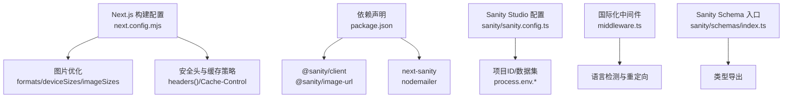
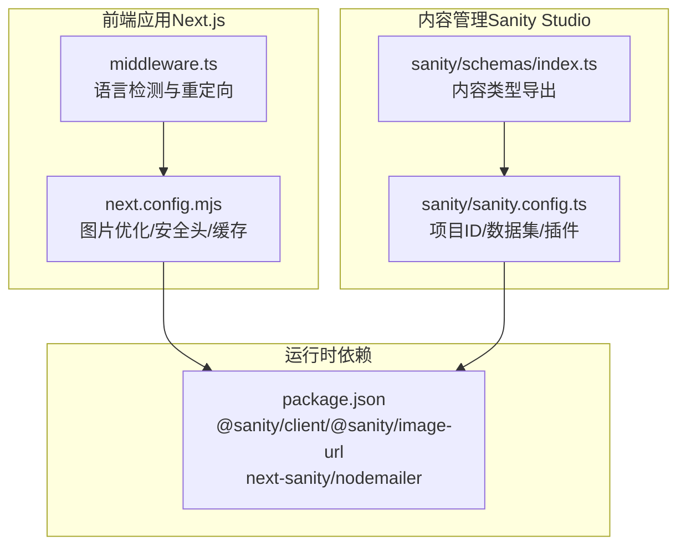
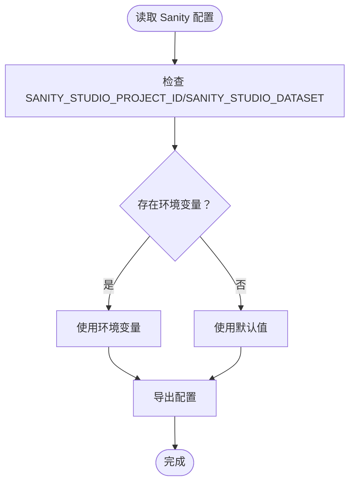
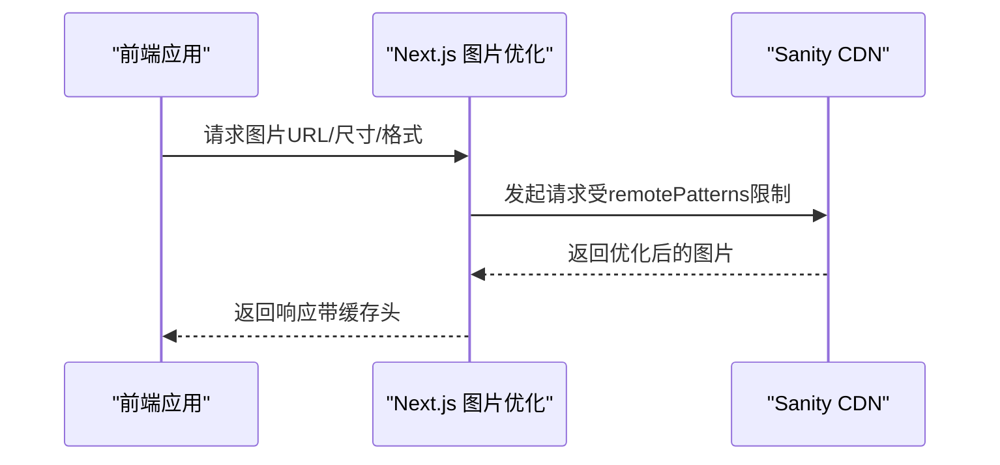
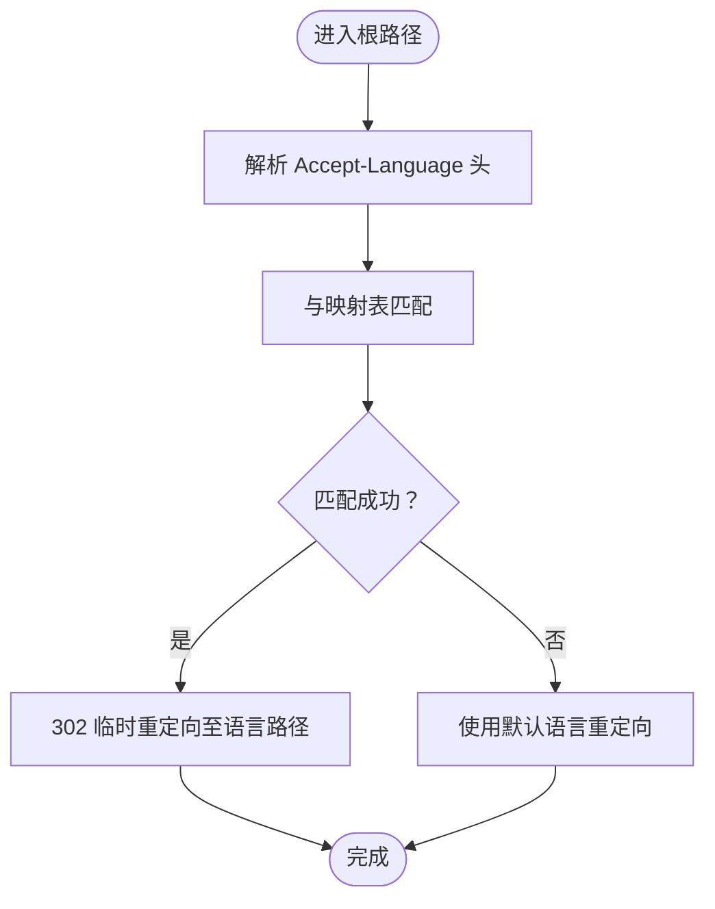
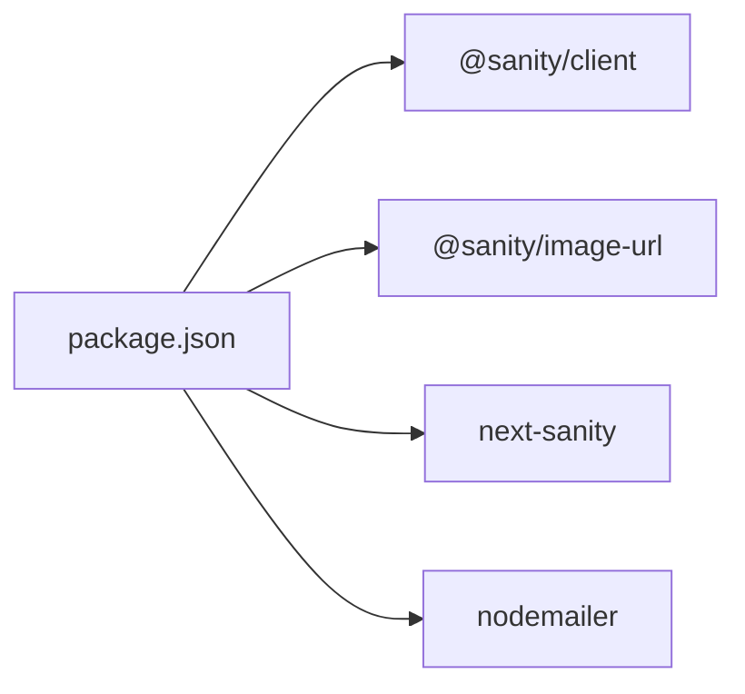

# 环境配置管理

<cite>
**本文引用的文件**
- [next.config.mjs](file://next.config.mjs)
- [package.json](file://package.json)
- [sanity.config.ts](file://sanity/sanity.config.ts)
- [middleware.ts](file://middleware.ts)
- [index.ts](file://sanity/schemas/index.ts)
</cite>

## 目录
1. [简介](#简介)
2. [项目结构](#项目结构)
3. [核心组件](#核心组件)
4. [架构总览](#架构总览)
5. [详细组件分析](#详细组件分析)
6. [依赖分析](#依赖分析)
7. [性能考虑](#性能考虑)
8. [故障排查指南](#故障排查指南)
9. [结论](#结论)
10. [附录](#附录)

## 简介
本指南面向 GoPro Trade 网站的环境配置管理，聚焦于 Next.js 环境变量的正确使用方式（含 NEXT_PUBLIC_ 前缀的公共变量与私有变量）、生产与开发环境差异、Sanity CMS 的关键配置项、图片优化服务（Sanity CDN）以及邮件服务相关配置要点。同时提供安全实践、配置验证与错误处理建议，帮助团队在多环境部署中保持一致性与安全性。

## 项目结构
围绕环境配置的关键位置如下：
- Next.js 图片优化与安全头配置位于构建配置文件中
- 依赖声明包含 Sanity 客户端、Next-Sanity、Nodemailer 等
- Sanity Studio 配置读取项目 ID 与数据集
- 国际化中间件用于语言检测与重定向
- Sanity Schema 导出入口

图表来源
- [next.config.mjs:1-65](file://next.config.mjs#L1-L65)
- [package.json:12-28](file://package.json#L12-L28)
- [sanity/sanity.config.ts:7-16](file://sanity/sanity.config.ts#L7-L16)
- [middleware.ts:44-67](file://middleware.ts#L44-L67)
- [sanity/schemas/index.ts:1-9](file://sanity/schemas/index.ts#L1-L9)

章节来源
- [next.config.mjs:1-65](file://next.config.mjs#L1-L65)
- [package.json:12-28](file://package.json#L12-L28)
- [sanity/sanity.config.ts:7-16](file://sanity/sanity.config.ts#L7-L16)
- [middleware.ts:44-67](file://middleware.ts#L44-L67)
- [sanity/schemas/index.ts:1-9](file://sanity/schemas/index.ts#L1-L9)

## 核心组件
- Next.js 构建配置：定义图片格式、尺寸、CDN 白名单、压缩、安全头与缓存策略
- 依赖声明：Sanity 客户端、Next-Sanity、Nodemailer 等运行时依赖
- Sanity Studio 配置：读取项目 ID 与数据集，支持中英文界面
- 国际化中间件：基于浏览器语言进行重定向
- Sanity Schema 入口：聚合内容类型

章节来源
- [next.config.mjs:1-65](file://next.config.mjs#L1-L65)
- [package.json:12-28](file://package.json#L12-L28)
- [sanity/sanity.config.ts:7-16](file://sanity/sanity.config.ts#L7-L16)
- [middleware.ts:44-67](file://middleware.ts#L44-L67)
- [sanity/schemas/index.ts:1-9](file://sanity/schemas/index.ts#L1-L9)

## 架构总览
下图展示环境配置在系统中的作用与交互：

图表来源
- [next.config.mjs:1-65](file://next.config.mjs#L1-L65)
- [middleware.ts:44-67](file://middleware.ts#L44-L67)
- [sanity/sanity.config.ts:7-16](file://sanity/sanity.config.ts#L7-L16)
- [sanity/schemas/index.ts:1-9](file://sanity/schemas/index.ts#L1-L9)
- [package.json:12-28](file://package.json#L12-L28)

## 详细组件分析

### Next.js 环境变量与公共/私有变量
- 公共变量（NEXT_PUBLIC_）：仅在客户端可见，适合公开的前端配置，如站点标题、公开 API 路径等
- 私有变量：仅在服务端可用，适合数据库连接、第三方密钥等敏感信息
- 在当前仓库中未发现显式的 NEXT_PUBLIC_* 或私有变量使用示例；建议在实际部署时按上述原则区分

章节来源
- [next.config.mjs:1-65](file://next.config.mjs#L1-L65)
- [package.json:12-28](file://package.json#L12-L28)

### 生产环境与开发环境差异
- 开发环境：通过脚本启动本地服务，Sanity Studio 通过独立命令启动
- 生产环境：构建后运行，需确保所有环境变量在部署平台正确注入
- 当前仓库未包含环境变量文件（如 .env），建议在 CI/CD 中分别注入开发与生产所需的变量

章节来源
- [package.json:5-11](file://package.json#L5-L11)

### Sanity CMS 环境配置
- 项目 ID 与数据集优先从 Sanity Studio 环境变量读取，若不存在则回退到默认值
- 该设计便于在不同环境中切换数据集（如 development/production）
- 建议在部署平台为 Sanity Studio 注入对应项目 ID 与数据集

图表来源
- [sanity/sanity.config.ts:7-16](file://sanity/sanity.config.ts#L7-L16)

章节来源
- [sanity/sanity.config.ts:7-16](file://sanity/sanity.config.ts#L7-L16)

### 邮件服务配置
- 项目依赖包含邮件发送库，但当前仓库未发现具体的邮件配置文件或使用示例
- 建议在部署平台注入 SMTP 主机、端口、用户名、密码等敏感信息，并遵循私有变量原则

章节来源
- [package.json:24](file://package.json#L24)

### 图片优化服务配置（Sanity CDN）
- Next.js 图片优化已配置对 Sanity CDN 的远程模式白名单
- 启用了现代图片格式（AVIF/WebP）与缓存策略，提升性能指标
- 建议在前端渲染图片时使用 Sanity 提供的图像 URL 工具生成带参数的 URL

图表来源
- [next.config.mjs:4-17](file://next.config.mjs#L4-L17)
- [package.json:13-14](file://package.json#L13-L14)

章节来源
- [next.config.mjs:4-17](file://next.config.mjs#L4-L17)
- [package.json:13-14](file://package.json#L13-L14)

### 国际化与语言检测
- 中间件根据浏览器语言偏好进行匹配与重定向
- 对根路径进行拦截，避免与动态路由冲突
- 建议在部署平台注入语言列表与默认语言配置

图表来源
- [middleware.ts:21-42](file://middleware.ts#L21-L42)
- [middleware.ts:44-67](file://middleware.ts#L44-L67)

章节来源
- [middleware.ts:21-42](file://middleware.ts#L21-L42)
- [middleware.ts:44-67](file://middleware.ts#L44-L67)

## 依赖分析
- 运行时依赖包含 Sanity 客户端、图像 URL 工具、Next-Sanity、Nodemailer 等
- 这些依赖与环境变量配合，决定应用在不同环境下的行为

图表来源
- [package.json:12-28](file://package.json#L12-L28)

章节来源
- [package.json:12-28](file://package.json#L12-L28)

## 性能考虑
- 图片优化：启用现代格式与缓存，减少传输体积
- 压缩与安全头：开启压缩与安全响应头，提升性能与安全性
- 缓存策略：静态资源与字体文件长期缓存，页面安全头统一设置

章节来源
- [next.config.mjs:4-17](file://next.config.mjs#L4-L17)
- [next.config.mjs:22-26](file://next.config.mjs#L22-L26)
- [next.config.mjs:35-61](file://next.config.mjs#L35-L61)

## 故障排查指南
- Sanity 数据集不可见或为空
  - 检查环境变量是否正确注入（项目 ID 与数据集）
  - 确认 Sanity Studio 与前端使用的数据集一致
- 图片无法从 CDN 加载
  - 确认 remotePatterns 中的主机名与协议配置正确
  - 检查图片 URL 是否符合远程模式要求
- 语言重定向异常
  - 检查 Accept-Language 头是否被正确解析
  - 确认映射表是否包含目标语言前缀
- 邮件发送失败
  - 检查 SMTP 主机、端口、认证信息是否正确
  - 确保敏感信息使用私有变量注入

章节来源
- [sanity/sanity.config.ts:7-16](file://sanity/sanity.config.ts#L7-L16)
- [next.config.mjs:11-16](file://next.config.mjs#L11-L16)
- [middleware.ts:21-42](file://middleware.ts#L21-L42)
- [package.json:24](file://package.json#L24)

## 结论
本指南梳理了 GoPro Trade 网站在 Next.js、Sanity 与国际化方面的环境配置现状与最佳实践。建议在实际部署中明确区分公共与私有变量、完善各环境的变量注入、强化敏感信息保护，并结合本文提供的验证与排错方法，确保系统在多环境下稳定运行。

## 附录
- 环境变量清单（建议）
  - 公共变量（客户端可见）
    - 站点标题/描述等前端展示信息
  - 私有变量（服务端可见）
    - 数据库连接字符串
    - 第三方 API 密钥（如 Sanity、邮件服务）
    - 机密令牌与签名密钥
- 安全实践
  - 将敏感信息存储在部署平台的机密管理器中
  - 使用最小权限原则配置访问控制
  - 定期轮换密钥与令牌
- 高级技巧
  - 配置验证：在启动时校验关键变量是否存在且格式正确
  - 错误处理：对缺失或无效配置抛出明确错误，阻止不安全启动
  - 配置热更新：在支持的平台上实现配置变更的平滑生效（如通过进程重启或重新加载）