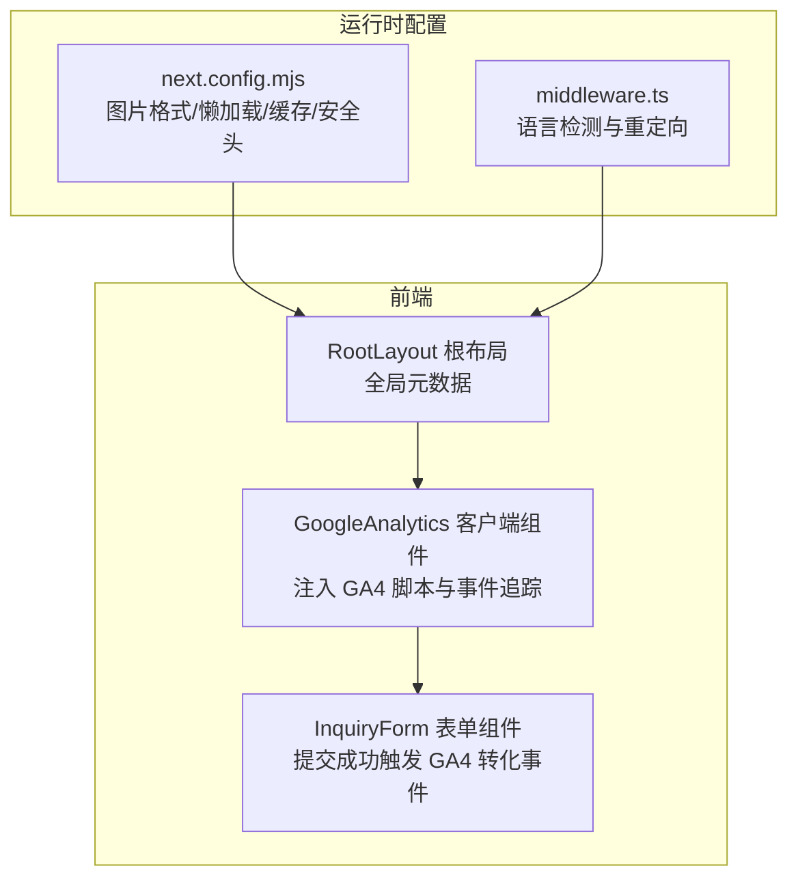
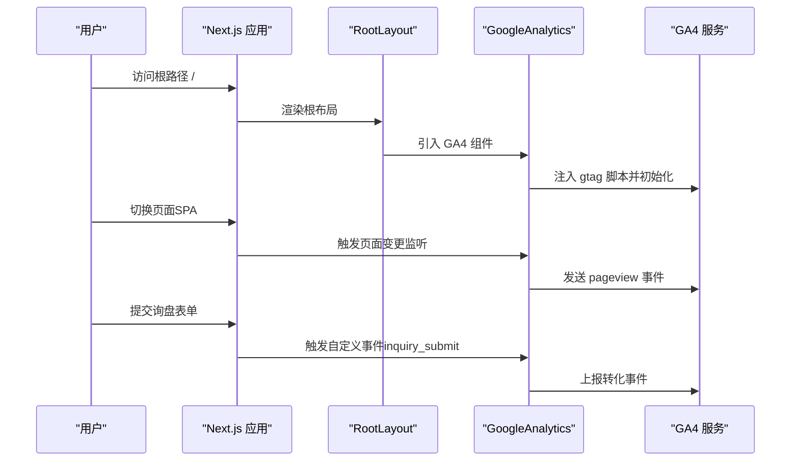
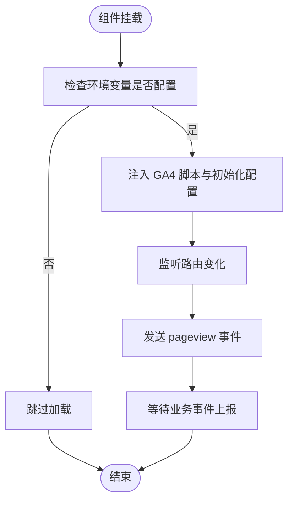
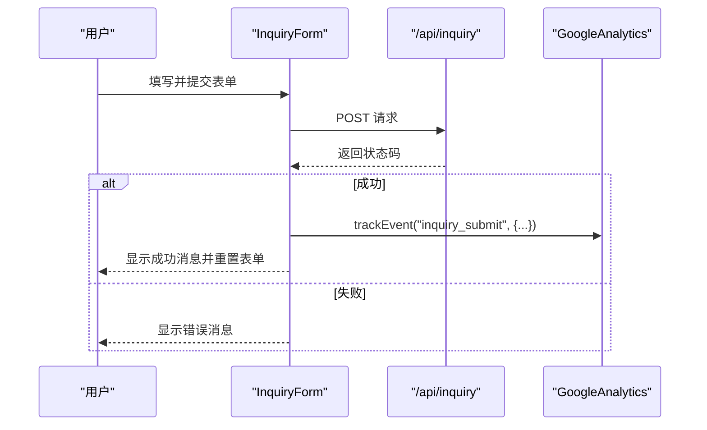
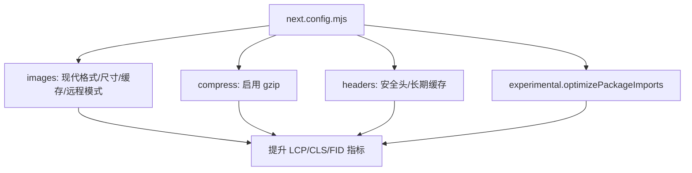
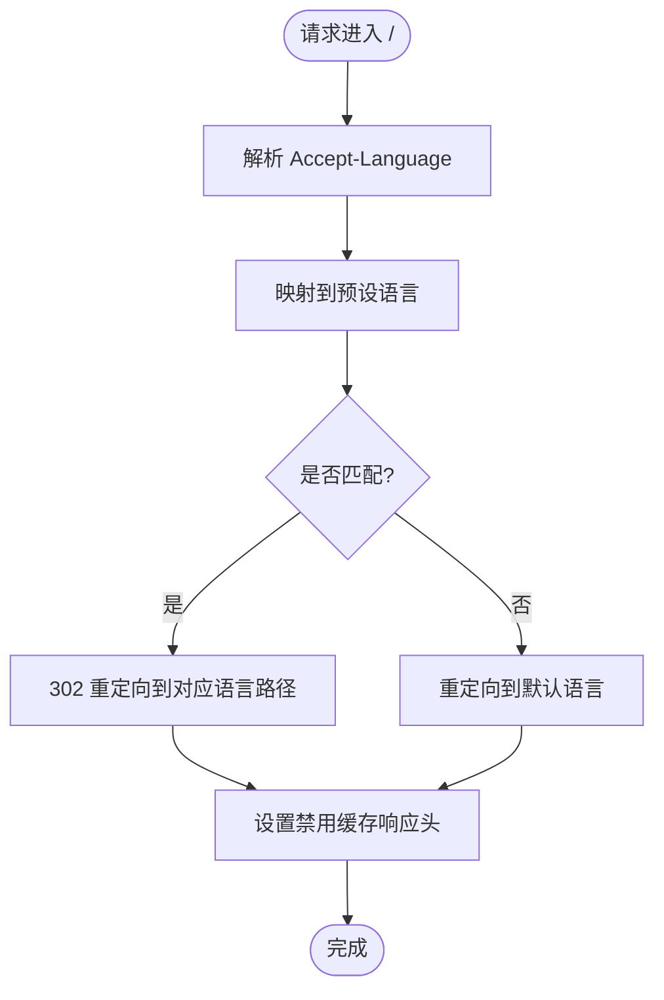
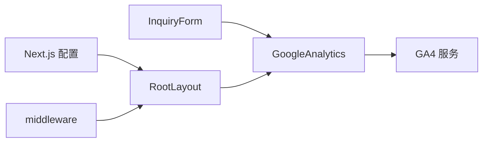

# 监控和告警系统

<cite>
**本文引用的文件**
- [components/analytics/GoogleAnalytics.tsx](file://components/analytics/GoogleAnalytics.tsx)
- [components/forms/InquiryForm.tsx](file://components/forms/InquiryForm.tsx)
- [next.config.mjs](file://next.config.mjs)
- [middleware.ts](file://middleware.ts)
- [app/layout.tsx](file://app/layout.tsx)
- [package.json](file://package.json)
</cite>

## 目录
1. [简介](#简介)
2. [项目结构](#项目结构)
3. [核心组件](#核心组件)
4. [架构总览](#架构总览)
5. [详细组件分析](#详细组件分析)
6. [依赖关系分析](#依赖关系分析)
7. [性能考量](#性能考量)
8. [故障排查指南](#故障排查指南)
9. [结论](#结论)
10. [附录](#附录)

## 简介
本指南面向 GoPro Trade 网站的监控与告警体系，目标是帮助团队建立完善的可观测性能力，覆盖应用性能监控（APM）、用户行为分析（GA4）、错误与日志管理、性能指标（Lighthouse/Core Web Vitals/图片加载）以及告警与实时仪表板。当前仓库已具备基础的前端埋点与图片优化配置，但缺少服务端监控、错误追踪、日志存储与告警通道等能力。本文将基于现有代码，给出可落地的实施步骤与最佳实践。

## 项目结构
该网站采用 Next.js App Router 架构，前端监控与埋点集中在 analytics 组件与表单组件中；构建与运行时性能优化通过 next.config.mjs 配置；国际化与语言检测通过中间件实现；GA4 脚本与事件追踪通过客户端组件注入。

**图示来源**
- [components/analytics/GoogleAnalytics.tsx:1-93](file://components/analytics/GoogleAnalytics.tsx#L1-L93)
- [components/forms/InquiryForm.tsx:1-298](file://components/forms/InquiryForm.tsx#L1-L298)
- [next.config.mjs:1-65](file://next.config.mjs#L1-L65)
- [middleware.ts:1-68](file://middleware.ts#L1-L68)
- [app/layout.tsx:1-19](file://app/layout.tsx#L1-L19)

**章节来源**
- [next.config.mjs:1-65](file://next.config.mjs#L1-L65)
- [middleware.ts:1-68](file://middleware.ts#L1-L68)
- [app/layout.tsx:1-19](file://app/layout.tsx#L1-L19)

## 核心组件
- Google Analytics 集成组件：负责在客户端注入 GA4 脚本、自动追踪 SPA 页面变更、提供自定义事件工具函数。
- 询盘表单组件：在提交成功后触发 GA4 转化事件，用于转化率分析。
- 运行时性能配置：Next.js 图片优化、压缩、安全响应头与长期缓存策略。
- 国际化中间件：根据浏览器语言进行根路径重定向与缓存控制。

**章节来源**
- [components/analytics/GoogleAnalytics.tsx:1-93](file://components/analytics/GoogleAnalytics.tsx#L1-L93)
- [components/forms/InquiryForm.tsx:1-298](file://components/forms/InquiryForm.tsx#L1-L298)
- [next.config.mjs:1-65](file://next.config.mjs#L1-L65)
- [middleware.ts:1-68](file://middleware.ts#L1-L68)

## 架构总览
下图展示了从用户访问到前端埋点与性能配置的整体流程，以及与外部服务（GA4）的交互。

**图示来源**
- [components/analytics/GoogleAnalytics.tsx:37-68](file://components/analytics/GoogleAnalytics.tsx#L37-L68)
- [components/forms/InquiryForm.tsx:73-117](file://components/forms/InquiryForm.tsx#L73-L117)
- [app/layout.tsx:8-18](file://app/layout.tsx#L8-L18)

## 详细组件分析

### Google Analytics 集成组件
- 功能要点
  - 条件加载：仅当环境变量存在时注入 GA4 脚本，避免本地开发误上报。
  - SPA 路由跟踪：监听路由变化，自动发送 pageview。
  - 自定义事件：提供 trackEvent 工具函数，便于业务事件上报。
  - 隐私合规：开启 IP 匿名化与页面视图发送控制。
- 关键实现位置
  - 脚本注入与初始化逻辑
  - SPA 页面变更监听与上报
  - 自定义事件工具函数

**图示来源**
- [components/analytics/GoogleAnalytics.tsx:37-68](file://components/analytics/GoogleAnalytics.tsx#L37-L68)
- [components/analytics/GoogleAnalytics.tsx:12-26](file://components/analytics/GoogleAnalytics.tsx#L12-L26)

**章节来源**
- [components/analytics/GoogleAnalytics.tsx:1-93](file://components/analytics/GoogleAnalytics.tsx#L1-L93)

### 询盘表单组件与转化事件
- 功能要点
  - 表单提交成功后，调用 GA4 事件工具函数上报转化事件，包含语言、产品数量、数量区间、国家等维度。
  - 错误状态反馈，便于后续分析用户提交失败原因。
- 关键实现位置
  - 提交流程与响应处理
  - 成功后的事件上报与表单重置

**图示来源**
- [components/forms/InquiryForm.tsx:73-117](file://components/forms/InquiryForm.tsx#L73-L117)
- [components/analytics/GoogleAnalytics.tsx:78-84](file://components/analytics/GoogleAnalytics.tsx#L78-L84)

**章节来源**
- [components/forms/InquiryForm.tsx:1-298](file://components/forms/InquiryForm.tsx#L1-L298)

### 运行时性能配置（Next.js）
- 功能要点
  - 图片优化：支持现代图片格式（AVIF/WebP），配置设备像素比与尺寸集，启用远程图片缓存。
  - 压缩与安全：启用 gzip 压缩，隐藏敏感响应头，设置安全响应头与长期缓存策略。
  - 实验性优化：优化包导入以减少打包体积。
- 关键实现位置
  - 图片格式与缓存配置
  - 响应头与安全策略
  - 实验性优化选项

**图示来源**
- [next.config.mjs:4-17](file://next.config.mjs#L4-L17)
- [next.config.mjs:22-32](file://next.config.mjs#L22-L32)
- [next.config.mjs:35-61](file://next.config.mjs#L35-L61)

**章节来源**
- [next.config.mjs:1-65](file://next.config.mjs#L1-L65)

### 国际化中间件与语言检测
- 功能要点
  - 解析浏览器 Accept-Language，匹配预设语言集合，进行根路径重定向。
  - 设置响应头禁用缓存，确保语言检测一致性。
- 关键实现位置
  - 语言映射与优先级解析
  - 重定向与缓存控制

**图示来源**
- [middleware.ts:21-42](file://middleware.ts#L21-L42)
- [middleware.ts:44-63](file://middleware.ts#L44-L63)

**章节来源**
- [middleware.ts:1-68](file://middleware.ts#L1-L68)

## 依赖关系分析
- 组件耦合
  - InquiryForm 依赖 GoogleAnalytics 的事件工具函数，形成业务层与埋点层的弱耦合。
  - RootLayout 作为顶层容器，承载 GA4 注入，影响全局页面行为。
- 外部依赖
  - Next.js 生态：脚本注入、响应头、图片优化。
  - GA4：客户端事件上报与分析。
- 潜在风险
  - 缺少服务端错误追踪与日志聚合，无法形成完整的端到端可观测性。
  - 无告警通道与阈值配置，无法实现自动化告警。

**图示来源**
- [components/forms/InquiryForm.tsx:4](file://components/forms/InquiryForm.tsx#L4)
- [components/analytics/GoogleAnalytics.tsx:37-68](file://components/analytics/GoogleAnalytics.tsx#L37-L68)
- [app/layout.tsx:8-18](file://app/layout.tsx#L8-L18)
- [next.config.mjs:1-65](file://next.config.mjs#L1-L65)
- [middleware.ts:1-68](file://middleware.ts#L1-L68)

**章节来源**
- [package.json:12-29](file://package.json#L12-L29)

## 性能考量
- 已有优化
  - 现代图片格式与远程缓存有助于降低首屏加载时间与带宽消耗。
  - gzip 压缩与安全响应头提升传输效率与安全性。
- 建议补充
  - Lighthouse 集成：在 CI 中执行 Lighthouse 扫描，记录性能基线与回归趋势。
  - Core Web Vitals 监控：结合 GA4 或 Web Vitals API，采集 CLS、FID、LCP 等指标。
  - 图片加载优化监控：统计图片加载失败率、平均加载时延、缓存命中率。
  - CDN 与缓存策略：对静态资源与字体文件设置长期缓存，减少重复下载。

[本节为通用性能建议，无需特定文件引用]

## 故障排查指南
- GA4 未生效
  - 检查环境变量是否正确配置，确认客户端组件已引入且未被条件渲染跳过。
  - 核对页面变更监听是否正常触发，确认 gtag 方法可用。
- 表单转化未上报
  - 确认提交成功分支已调用事件工具函数，检查参数是否包含必要字段。
  - 查看网络面板，确认 /api/inquiry 接口返回状态正常。
- 图片加载异常
  - 检查 remotePatterns 是否允许目标域名，确认图片尺寸与格式是否在配置范围内。
  - 对比缓存头与浏览器缓存行为，排查 304/200 响应差异。
- 语言重定向问题
  - 检查 Accept-Language 请求头与中间件映射逻辑，确认响应头禁用缓存生效。

**章节来源**
- [components/analytics/GoogleAnalytics.tsx:37-68](file://components/analytics/GoogleAnalytics.tsx#L37-L68)
- [components/forms/InquiryForm.tsx:73-117](file://components/forms/InquiryForm.tsx#L73-L117)
- [next.config.mjs:11-17](file://next.config.mjs#L11-L17)
- [middleware.ts:56-60](file://middleware.ts#L56-L60)

## 结论
当前代码库已具备前端埋点与基础性能优化能力，建议在此基础上补齐服务端监控、错误追踪、日志聚合与告警通道，形成端到端的可观测性闭环。同时引入 Lighthouse 与 Core Web Vitals 监控，持续跟踪用户体验指标，配合阈值与升级策略，构建稳定可靠的告警体系与实时仪表板。

[本节为总结性内容，无需特定文件引用]

## 附录

### A. 监控与告警系统实施清单
- 基础埋点
  - 确保 GA4 脚本按条件注入，页面变更自动上报 pageview。
  - 在关键业务事件（如询盘提交）调用自定义事件工具函数。
- 性能监控
  - 在 CI 中集成 Lighthouse，记录性能基线与回归。
  - 采集 Core Web Vitals 指标，建立阈值与趋势分析。
  - 监控图片加载时延、失败率与缓存命中率。
- 错误与日志
  - 服务端：统一错误捕获与结构化日志输出，按级别分类存储。
  - 客户端：上报未捕获异常与性能异常，关联用户会话信息。
- 告警与仪表板
  - 设定关键指标阈值与告警规则，配置多通道通知（邮件/IM/电话）。
  - 升级策略：首次告警延迟通知，持续失败快速升级。
  - 仪表板：展示实时指标、趋势图与报告，支持导出与分享。

[本节为通用实施建议，无需特定文件引用]