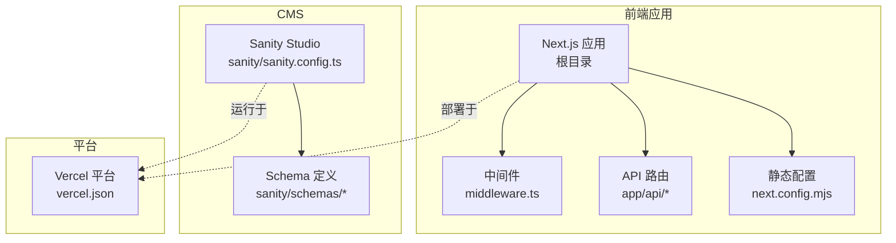
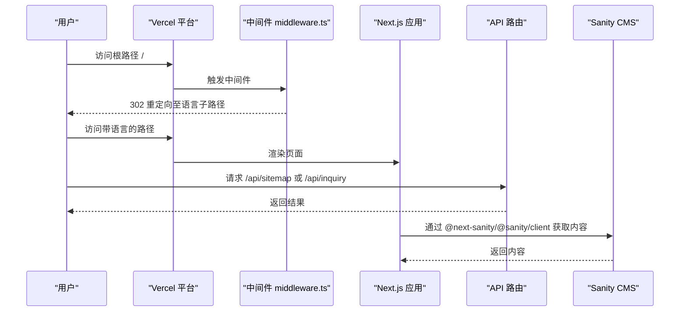
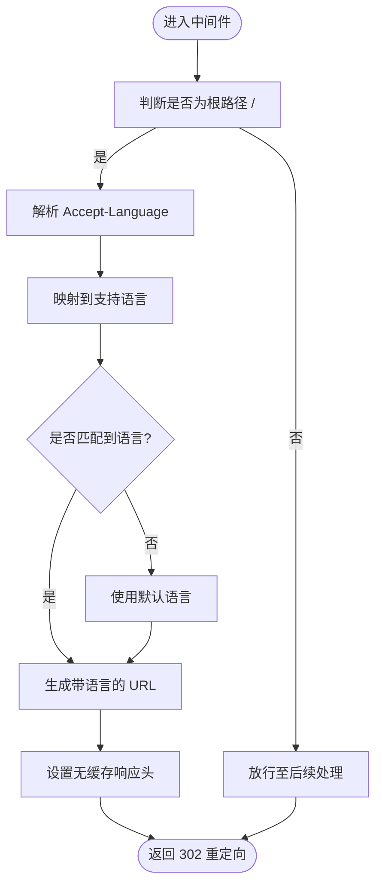
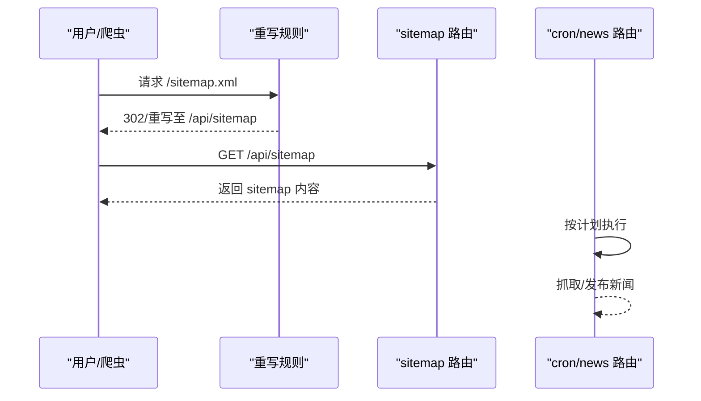
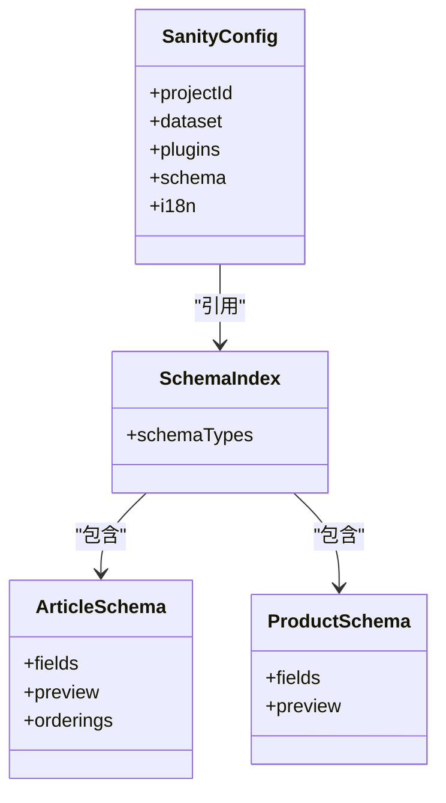
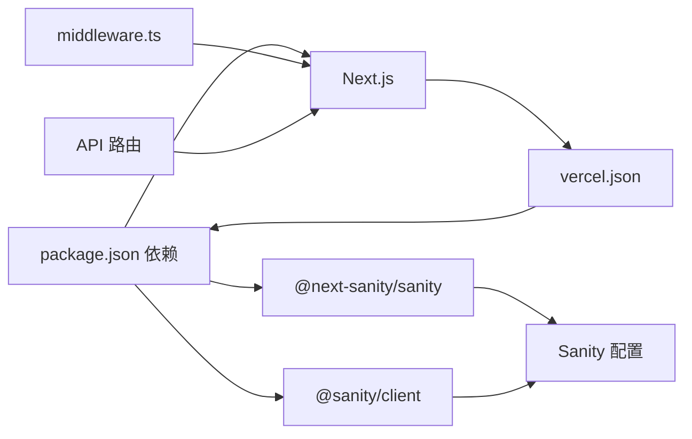

# 部署和运维

<cite>
**本文引用的文件**
- [vercel.json](file://vercel.json)
- [package.json](file://package.json)
- [next.config.mjs](file://next.config.mjs)
- [middleware.ts](file://middleware.ts)
- [sanity/sanity.config.ts](file://sanity/sanity.config.ts)
- [sanity/package.json](file://sanity/package.json)
- [sanity/schemas/index.ts](file://sanity/schemas/index.ts)
- [sanity/schemas/article.ts](file://sanity/schemas/article.ts)
- [sanity/schemas/product.ts](file://sanity/schemas/product.ts)
- [app/api/cron/news/route.ts](file://app/api/cron/news/route.ts)
- [app/api/sitemap/route.ts](file://app/api/sitemap/route.ts)
- [app/api/inquiry/route.tsx](file://app/api/inquiry/route.tsx)
- [lib/analytics/GoogleAnalytics.tsx](file://lib/analytics/GoogleAnalytics.tsx)
- [components/forms/InquiryForm.tsx](file://components/forms/InquiryForm.tsx)
</cite>

## 目录
1. [简介](#简介)
2. [项目结构](#项目结构)
3. [核心组件](#核心组件)
4. [架构总览](#架构总览)
5. [详细组件分析](#详细组件分析)
6. [依赖关系分析](#依赖关系分析)
7. [性能考量](#性能考量)
8. [故障排除指南](#故障排除指南)
9. [结论](#结论)
10. [附录](#附录)

## 简介
本指南面向 GoPro Trade 网站的部署与运维团队，涵盖以下主题：
- Vercel 部署配置：环境变量、构建命令、重写规则、Cron 调度、安全响应头等
- 生产环境运维：环境变量管理、日志与错误监控、性能监控建议
- Sanity CMS 部署与管理：项目 ID/数据集配置、内容预览与发布、版本控制与协作
- CI/CD 实践：自动化测试、构建验证、部署策略建议
- 监控与告警：APM、错误追踪、用户行为分析工具建议
- 故障排除与应急响应：常见问题诊断、性能问题排查、安全事件处理
- 备份与灾难恢复：数据备份策略与恢复流程

## 项目结构
该仓库采用 Next.js 应用与 Sanity CMS 分离的双工程结构：
- 前端应用位于根目录，使用 Next.js 14，默认框架为 Next.js
- Sanity CMS 位于 sanity 子目录，独立运行与部署
- 关键配置集中在 vercel.json、next.config.mjs、sanity/sanity.config.ts 等文件

图表来源
- [vercel.json:1-44](file://vercel.json#L1-L44)
- [next.config.mjs:1-65](file://next.config.mjs#L1-L65)
- [sanity/sanity.config.ts:1-33](file://sanity/sanity.config.ts#L1-L33)

章节来源
- [vercel.json:1-44](file://vercel.json#L1-L44)
- [package.json:1-45](file://package.json#L1-L45)
- [next.config.mjs:1-65](file://next.config.mjs#L1-L65)
- [sanity/sanity.config.ts:1-33](file://sanity/sanity.config.ts#L1-L33)

## 核心组件
- Vercel 配置：定义构建命令、开发命令、安装参数、框架类型、地区、安全响应头、重写规则、Cron 调度
- Next.js 配置：图片优化、压缩、响应头、实验性优化
- 中间件：基于浏览器语言的根路径重定向与缓存控制
- API 路由：站点地图生成、询盘提交、新闻 Cron 调度
- Sanity 配置：项目 ID/数据集来源、Schema 类型注册、国际化界面
- Analytics：Google Analytics 组件接入

章节来源
- [vercel.json:1-44](file://vercel.json#L1-L44)
- [next.config.mjs:1-65](file://next.config.mjs#L1-L65)
- [middleware.ts:1-68](file://middleware.ts#L1-L68)
- [sanity/sanity.config.ts:1-33](file://sanity/sanity.config.ts#L1-L33)
- [lib/analytics/GoogleAnalytics.tsx](file://lib/analytics/GoogleAnalytics.tsx)

## 架构总览
下图展示了前端应用、API 路由、中间件与 Vercel 平台之间的交互关系。

图表来源
- [middleware.ts:44-63](file://middleware.ts#L44-L63)
- [app/api/sitemap/route.ts](file://app/api/sitemap/route.ts)
- [app/api/inquiry/route.tsx](file://app/api/inquiry/route.tsx)
- [sanity/sanity.config.ts:7-16](file://sanity/sanity.config.ts#L7-L16)

## 详细组件分析

### Vercel 部署配置
- 构建与开发命令：通过 vercel.json 显式指定构建、开发与安装命令，确保一致的构建环境
- 框架类型：声明为 Next.js，便于平台优化
- 地区选择：指定新加坡区域以优化亚太地区访问延迟
- 安全响应头：对所有请求注入安全相关响应头，增强 XSS、点击劫持防护
- 重写规则：将 sitemap.xml 请求重写到 /api/sitemap，统一由 API 路由生成
- Cron 调度：配置定时任务调用 /api/cron/news，支持多个时间点触发

章节来源
- [vercel.json:1-44](file://vercel.json#L1-L44)

### Next.js 运行时配置
- 图片优化：启用现代图片格式与远程图片模式，配置设备像素比与缓存 TTL
- 压缩：开启 gzip 压缩以降低传输体积
- 响应头：为静态资源与字体设置长期缓存；为页面注入安全响应头
- 实验性优化：按需导入优化以减少打包体积

章节来源
- [next.config.mjs:1-65](file://next.config.mjs#L1-L65)

### 中间件与语言重定向
- 功能：根据浏览器 Accept-Language 自动识别语言，进行 302 临时重定向
- 缓存控制：对根路径重定向响应禁用缓存，避免错误缓存导致的语言错乱
- 匹配器：仅对根路径 / 生效

图表来源
- [middleware.ts:21-63](file://middleware.ts#L21-L63)

章节来源
- [middleware.ts:1-68](file://middleware.ts#L1-L68)

### API 路由与功能
- 站点地图路由：将动态生成的 sitemap.xml 重写至 /api/sitemap，统一由 API 路由处理
- 询盘提交：提供表单提交接口，用于收集用户咨询
- 新闻 Cron：定时拉取与发布新闻，支持多时间点调度

图表来源
- [vercel.json:27-32](file://vercel.json#L27-L32)
- [app/api/sitemap/route.ts](file://app/api/sitemap/route.ts)
- [app/api/cron/news/route.ts](file://app/api/cron/news/route.ts)

章节来源
- [vercel.json:27-42](file://vercel.json#L27-L42)
- [app/api/sitemap/route.ts](file://app/api/sitemap/route.ts)
- [app/api/cron/news/route.ts](file://app/api/cron/news/route.ts)

### Sanity CMS 部署与管理
- 项目 ID 与数据集：优先从环境变量读取，其次回退到公共环境变量，最后使用默认值
- Schema 注册：集中导出类型，便于 Studio 加载
- 国际化界面：支持中英文界面切换
- 开发与部署：提供本地开发、构建与部署脚本

图表来源
- [sanity/sanity.config.ts:7-31](file://sanity/sanity.config.ts#L7-L31)
- [sanity/schemas/index.ts:1-9](file://sanity/schemas/index.ts#L1-L9)
- [sanity/schemas/article.ts:1-265](file://sanity/schemas/article.ts#L1-L265)
- [sanity/schemas/product.ts:1-233](file://sanity/schemas/product.ts#L1-L233)

章节来源
- [sanity/sanity.config.ts:1-33](file://sanity/sanity.config.ts#L1-L33)
- [sanity/schemas/index.ts:1-9](file://sanity/schemas/index.ts#L1-L9)
- [sanity/schemas/article.ts:1-265](file://sanity/schemas/article.ts#L1-L265)
- [sanity/schemas/product.ts:1-233](file://sanity/schemas/product.ts#L1-L233)
- [sanity/package.json:1-16](file://sanity/package.json#L1-L16)

### Analytics 与表单
- Google Analytics：在应用层集成分析组件
- 询盘表单：提供前端表单与后端提交接口，便于收集潜在客户信息

章节来源
- [lib/analytics/GoogleAnalytics.tsx](file://lib/analytics/GoogleAnalytics.tsx)
- [components/forms/InquiryForm.tsx](file://components/forms/InquiryForm.tsx)
- [app/api/inquiry/route.tsx](file://app/api/inquiry/route.tsx)

## 依赖关系分析
- 前端应用依赖 Next.js 与 @next-sanity/sanity，通过 @sanity/client 与 Sanity 通信
- Vercel 作为托管平台，负责构建、部署与运行时优化
- 中间件与 API 路由共同构成运行时控制层

图表来源
- [package.json:12-28](file://package.json#L12-L28)
- [vercel.json:1-44](file://vercel.json#L1-L44)
- [sanity/sanity.config.ts:1-33](file://sanity/sanity.config.ts#L1-L33)

章节来源
- [package.json:1-45](file://package.json#L1-L45)
- [vercel.json:1-44](file://vercel.json#L1-L44)
- [sanity/sanity.config.ts:1-33](file://sanity/sanity.config.ts#L1-L33)

## 性能考量
- 图片优化：启用现代图片格式与远程图片模式，合理设置设备像素比与缓存 TTL
- 压缩：开启 gzip 压缩以降低传输体积
- 响应头：为静态资源与字体设置长期缓存，减少重复下载
- 实验性优化：按需导入优化以减少打包体积
- 语言重定向：避免根路径缓存导致的语言错乱，确保首次访问正确重定向

章节来源
- [next.config.mjs:4-32](file://next.config.mjs#L4-L32)
- [next.config.mjs:34-61](file://next.config.mjs#L34-L61)
- [middleware.ts:52-62](file://middleware.ts#L52-L62)

## 故障排除指南
- 构建失败
  - 检查 vercel.json 中的构建命令与安装命令是否与项目一致
  - 确认 Node.js 版本与依赖兼容性
- 语言重定向异常
  - 检查浏览器 Accept-Language 是否符合预期
  - 确认中间件仅对根路径生效且无缓存头
- API 路由不可达
  - 确认重写规则是否正确将 /sitemap.xml 重写到 /api/sitemap
  - 检查 Cron 调度路径是否与 vercel.json 中配置一致
- Sanity 内容未更新
  - 检查项目 ID 与数据集是否正确，确认环境变量优先级
  - 确认 Schema 已正确注册并重启 Studio

章节来源
- [vercel.json:3-6](file://vercel.json#L3-L6)
- [middleware.ts:44-63](file://middleware.ts#L44-L63)
- [vercel.json:27-42](file://vercel.json#L27-L42)
- [sanity/sanity.config.ts:7-16](file://sanity/sanity.config.ts#L7-L16)
- [sanity/schemas/index.ts:1-9](file://sanity/schemas/index.ts#L1-L9)

## 结论
本指南提供了 GoPro Trade 网站在 Vercel 上的部署与运维实践，涵盖前端配置、中间件与 API 路由、Sanity CMS 管理以及性能与故障排除建议。建议结合监控与告警工具进一步完善生产环境可观测性，并制定完善的备份与灾难恢复策略。

## 附录

### Vercel 环境变量与部署清单
- 必备环境变量（建议在 Vercel 控制台配置）
  - SANITY_STUDIO_PROJECT_ID：Sanity 项目 ID
  - SANITY_STUDIO_DATASET：Sanity 数据集名称
- 公共环境变量（可在客户端读取）
  - NEXT_PUBLIC_SANITY_PROJECT_ID：客户端可见的项目 ID
  - NEXT_PUBLIC_SANITY_DATASET：客户端可见的数据集
- 其他建议
  - 设置地区为新加坡以优化亚太访问
  - 启用安全响应头并保持更新
  - 为 sitemap 与 Cron 路由配置稳定重写与调度

章节来源
- [vercel.json:7](file://vercel.json#L7)
- [vercel.json:8-26](file://vercel.json#L8-L26)
- [vercel.json:27-42](file://vercel.json#L27-L42)
- [sanity/sanity.config.ts:7-9](file://sanity/sanity.config.ts#L7-L9)

### Sanity 内容管理流程
- 内容预览：在本地或 Vercel 预览环境中启动 Studio，实时查看变更
- 生产发布：在生产数据集上进行内容发布，确保版本隔离
- 版本控制：利用 Sanity 的版本历史与协作功能，保留变更记录
- 数据集分离：开发/预览/生产使用不同数据集，避免相互污染

章节来源
- [sanity/sanity.config.ts:8-9](file://sanity/sanity.config.ts#L8-L9)
- [sanity/sanity.config.ts:18-21](file://sanity/sanity.config.ts#L18-L21)

### CI/CD 流水线建议
- 自动化测试：在合并前运行单元测试与集成测试
- 构建验证：在 PR 中执行构建检查，确保 vercel.json 与 next.config.mjs 无误
- 部署策略：采用蓝绿部署或滚动更新，配合健康检查
- 安全扫描：在流水线中加入依赖漏洞扫描与代码质量检查

[本节为通用实践建议，不直接分析具体文件]

### 监控与告警
- 应用性能监控（APM）：建议接入平台内置 APM 或第三方 APM 工具
- 错误追踪：集成错误上报工具，捕获前端与服务端异常
- 用户行为分析：结合 Google Analytics 或类似工具，分析用户路径与转化率
- 告警策略：针对 5xx 错误率、响应时间、吞吐量设置阈值告警

[本节为通用实践建议，不直接分析具体文件]

### 备份与灾难恢复
- 数据备份：定期导出 Sanity 数据集，保存至安全存储
- 配置备份：备份 vercel.json、next.config.mjs、sanity/sanity.config.ts 等关键配置
- 恢复演练：定期进行恢复演练，验证备份可用性与恢复流程
- 灾难预案：制定站点停机、内容丢失、安全事件等场景的应急预案

[本节为通用实践建议，不直接分析具体文件]