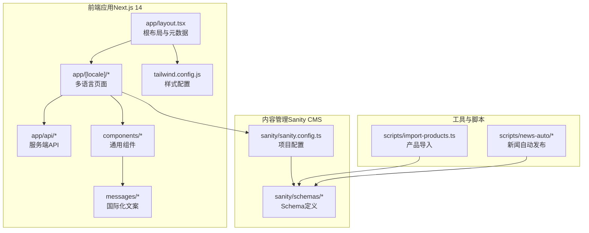
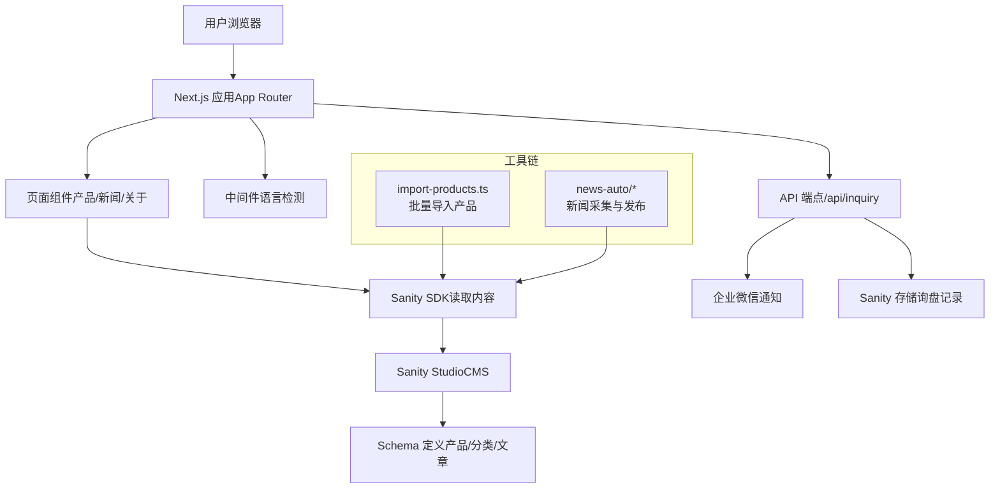
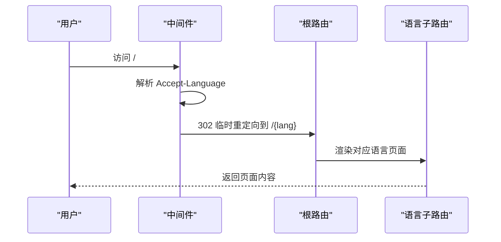
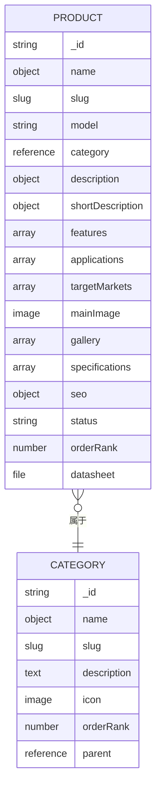
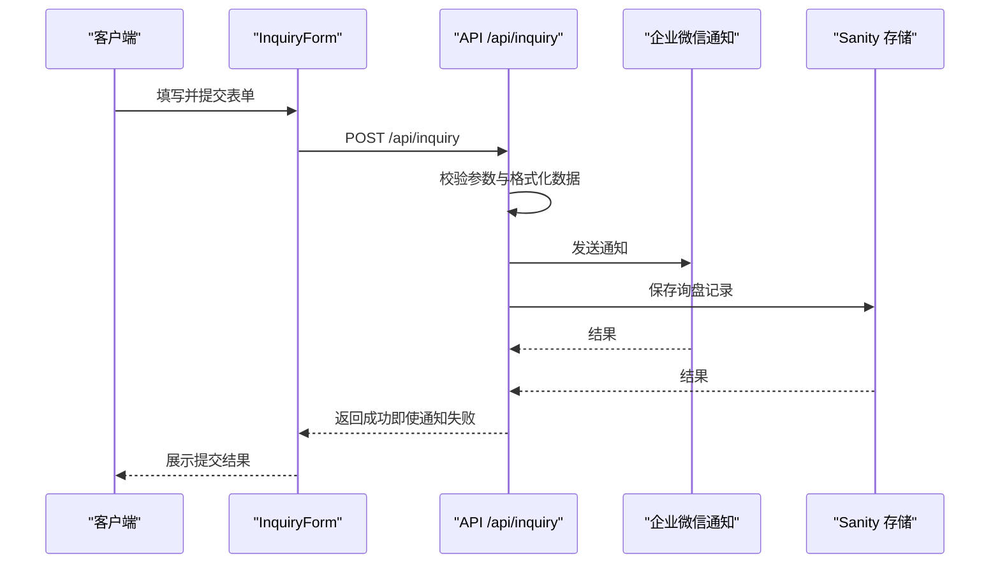
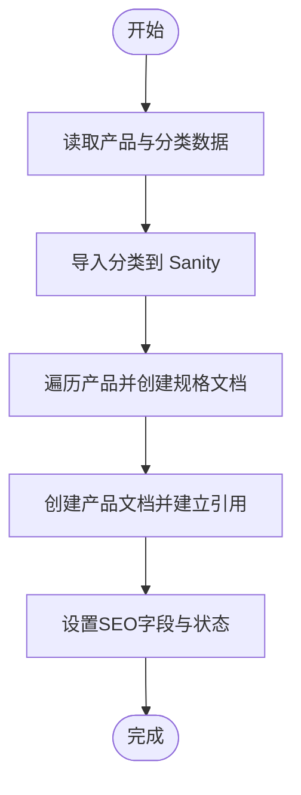
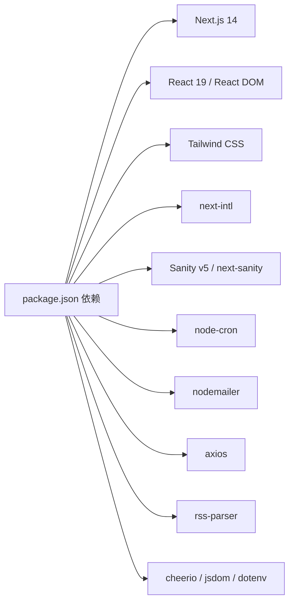

# 项目概述

<cite>
**本文引用的文件**
- [package.json](file://package.json)
- [README.md](file://README.md)
- [next.config.mjs](file://next.config.mjs)
- [middleware.ts](file://middleware.ts)
- [sanity.config.ts](file://sanity/sanity.config.ts)
- [app/layout.tsx](file://app/layout.tsx)
- [components/forms/InquiryForm.tsx](file://components/forms/InquiryForm.tsx)
- [app/api/inquiry/route.tsx](file://app/api/inquiry/route.tsx)
- [sanity/schemas/product.ts](file://sanity/schemas/product.ts)
- [sanity/schemas/category.ts](file://sanity/schemas/category.ts)
- [messages/en.json](file://messages/en.json)
- [scripts/import-products.ts](file://scripts/import-products.ts)
- [tailwind.config.js](file://tailwind.config.js)
</cite>

## 目录
1. [引言](#引言)
2. [项目结构](#项目结构)
3. [核心组件](#核心组件)
4. [架构总览](#架构总览)
5. [详细组件分析](#详细组件分析)
6. [依赖关系分析](#依赖关系分析)
7. [性能考量](#性能考量)
8. [故障排查指南](#故障排查指南)
9. [结论](#结论)
10. [附录](#附录)

## 引言
本项目是面向B2B市场的LED产品营销网站，以“GoPro Trade”品牌为核心，聚焦红外LED、可见光LED与紫外LED等专业LED产品的展示与销售线索收集。项目采用Next.js 14 App Router + Sanity CMS的混合架构，结合多语言国际化系统与自动化运维脚本，构建高性能、可扩展且易于维护的营销平台。

业务目标与定位：
- 面向全球特别是东南亚与中东地区客户，提供专业LED产品解决方案与询盘转化通道。
- 通过内容管理系统实现产品与新闻内容的快速更新，降低运营成本。
- 以SEO优化与现代化前端技术提升搜索引擎可见性与用户体验。

## 项目结构
项目采用按路由分层的App Router目录组织，核心模块包括：
- 路由页面与布局：app/[locale]/...、app/api/...、app/layout.tsx
- 组件层：components/...（导航、页脚、表单、UI等）
- 内容管理：sanity/...（Schema定义、CMS配置）
- 多语言：messages/*.json
- 工具与脚本：scripts/...（数据导入、爬虫、定时任务等）
- 构建与样式：next.config.mjs、tailwind.config.js

图表来源
- [app/layout.tsx:1-19](file://app/layout.tsx#L1-L19)
- [sanity/sanity.config.ts:1-33](file://sanity/sanity.config.ts#L1-L33)
- [tailwind.config.js:1-18](file://tailwind.config.js#L1-L18)

章节来源
- [package.json:1-45](file://package.json#L1-L45)
- [README.md:39-42](file://README.md#L39-L42)
- [next.config.mjs:1-65](file://next.config.mjs#L1-L65)
- [tailwind.config.js:1-18](file://tailwind.config.js#L1-L18)

## 核心组件
- 多语言国际化系统：基于 next-intl 实现，支持英语、中文、印尼语、泰语、越南语、阿拉伯语；根路径根据浏览器语言进行302临时重定向，确保首屏即适配语言。
- 产品与内容管理：Sanity CMS 提供产品、分类、文章等内容模型，支持6语言字段与SEO字段，便于运营团队独立维护。
- 用户交互与转化：内置询盘表单，提交后并行推送企业微信通知与保存到Sanity，保障数据可靠与及时触达。
- SEO与性能：Next.js 图片优化、静态资源长期缓存、安全响应头、隐藏Powered-By等策略，提升SEO与安全等级。
- 样式体系：Tailwind CSS + 自定义品牌色，统一视觉规范。

章节来源
- [middleware.ts:1-68](file://middleware.ts#L1-L68)
- [sanity/sanity.config.ts:27-31](file://sanity/sanity.config.ts#L27-L31)
- [sanity/schemas/product.ts:1-233](file://sanity/schemas/product.ts#L1-L233)
- [sanity/schemas/category.ts:1-74](file://sanity/schemas/category.ts#L1-L74)
- [components/forms/InquiryForm.tsx:1-298](file://components/forms/InquiryForm.tsx#L1-L298)
- [app/api/inquiry/route.tsx:1-103](file://app/api/inquiry/route.tsx#L1-L103)
- [next.config.mjs:4-17](file://next.config.mjs#L4-L17)
- [next.config.mjs:35-61](file://next.config.mjs#L35-L61)

## 架构总览
整体架构由“前端Next.js应用 + Sanity内容管理 + 运维脚本工具”构成，前后端通过API端点与Sanity SDK交互，形成“内容驱动 + 数据驱动”的营销平台。

图表来源
- [middleware.ts:44-63](file://middleware.ts#L44-L63)
- [app/api/inquiry/route.tsx:21-102](file://app/api/inquiry/route.tsx#L21-L102)
- [sanity/sanity.config.ts:11-25](file://sanity/sanity.config.ts#L11-L25)
- [sanity/schemas/product.ts:1-233](file://sanity/schemas/product.ts#L1-L233)
- [sanity/schemas/category.ts:1-74](file://sanity/schemas/category.ts#L1-L74)
- [scripts/import-products.ts:64-160](file://scripts/import-products.ts#L64-L160)

## 详细组件分析

### 多语言国际化与语言检测
- 语言集合与默认语言：支持英语、中文、印尼语、泰语、越南语、阿拉伯语，默认英语。
- 浏览器语言映射：将浏览器 Accept-Language 映射到站点语言，根路径仅做302临时重定向，避免缓存污染。
- 文案来源：messages/*.json，页面通过国际化库注入对应语言文本。

图表来源
- [middleware.ts:21-63](file://middleware.ts#L21-L63)
- [lib/i18n/config.ts:1-16](file://lib/i18n/config.ts#L1-L16)

章节来源
- [middleware.ts:1-68](file://middleware.ts#L1-L68)
- [lib/i18n/config.ts:1-16](file://lib/i18n/config.ts#L1-L16)
- [messages/en.json:1-200](file://messages/en.json#L1-L200)

### 产品与内容模型（Sanity）
- 产品模型：包含6语言标题/描述/特性/应用场景、分类引用、图集、规格引用、SEO字段、状态与排序权重等。
- 分类模型：支持6语言名称与描述、父子层级、图标与排序权重。
- CMS界面：支持中英文界面切换，便于运营团队维护。

图表来源
- [sanity/schemas/category.ts:4-73](file://sanity/schemas/category.ts#L4-L73)
- [sanity/schemas/product.ts:4-232](file://sanity/schemas/product.ts#L4-L232)

章节来源
- [sanity/sanity.config.ts:1-33](file://sanity/sanity.config.ts#L1-L33)
- [sanity/schemas/category.ts:1-74](file://sanity/schemas/category.ts#L1-L74)
- [sanity/schemas/product.ts:1-233](file://sanity/schemas/product.ts#L1-L233)

### 询盘表单与API处理
- 表单组件：支持公司名、联系人、邮箱、电话、国家、感兴趣产品、数量区间、留言等字段；多语言文案注入；提交后GA4转化追踪。
- API端点：校验必填字段，格式化产品与国家名称，使用Promise.all并行发送企业微信通知与保存到Sanity，保证数据可靠性。

图表来源
- [components/forms/InquiryForm.tsx:73-117](file://components/forms/InquiryForm.tsx#L73-L117)
- [app/api/inquiry/route.tsx:21-102](file://app/api/inquiry/route.tsx#L21-L102)

章节来源
- [components/forms/InquiryForm.tsx:1-298](file://components/forms/InquiryForm.tsx#L1-L298)
- [app/api/inquiry/route.tsx:1-103](file://app/api/inquiry/route.tsx#L1-L103)

### 产品导入与数据迁移
- 脚本职责：从既有数据源抽取产品与分类，创建规格文档并建立引用，生成产品文档并写入Sanity。
- 关键流程：先导入分类，再导入产品并建立关联，最后设置SEO字段与状态。

图表来源
- [scripts/import-products.ts:64-160](file://scripts/import-products.ts#L64-L160)

章节来源
- [scripts/import-products.ts:1-161](file://scripts/import-products.ts#L1-L161)

### 样式与主题
- Tailwind 配置：扫描 app 与 components/lib 目录，自定义品牌色 gopro-blue 与 gopro-cyan，统一视觉风格。
- 与组件协作：各页面与组件通过类名使用品牌色与排版规范，确保一致性。

章节来源
- [tailwind.config.js:1-18](file://tailwind.config.js#L1-L18)

## 依赖关系分析
- 前端依赖：Next.js 14、React 19、TypeScript、Tailwind CSS、next-intl、node-cron、nodemailer、axios、rss-parser、cheerio、jsdom、dotenv 等。
- CMS依赖：Sanity v5、next-sanity、@sanity/client、@sanity/image-url、@sanity/vision。
- 开发依赖：Tailwind PostCSS插件、ESLint、PostCSS、Autoprefixer、TypeScript类型声明等。

图表来源
- [package.json:12-28](file://package.json#L12-L28)
- [package.json:30-42](file://package.json#L30-L42)

章节来源
- [package.json:1-45](file://package.json#L1-L45)

## 性能考量
- 图片优化：启用现代图片格式（WebP/AVIF）、设备像素比与尺寸配置、CDN远程模式、图片懒加载缓存。
- 缓存策略：静态资源长期缓存（immutable），字体文件一年缓存，页面安全响应头强化。
- 压缩与安全：开启gzip压缩，隐藏Powered-By，设置X-Content-Type-Options、X-Frame-Options、Referrer-Policy。
- 包体积优化：实验性优化导入，减少打包体积，提升启动性能。

章节来源
- [next.config.mjs:4-17](file://next.config.mjs#L4-L17)
- [next.config.mjs:22-32](file://next.config.mjs#L22-L32)
- [next.config.mjs:35-61](file://next.config.mjs#L35-L61)

## 故障排查指南
- 语言重定向异常
  - 症状：访问 / 未正确跳转到语言子路径或出现缓存问题。
  - 排查：检查中间件匹配器与缓存头设置，确认 Accept-Language 是否包含预期语言。
  - 参考：[middleware.ts:44-63](file://middleware.ts#L44-L63)
- 询盘提交失败
  - 症状：前端显示错误，或后台日志报错。
  - 排查：检查必填字段校验、企业微信通知接口连通性、Sanity写入权限与网络。
  - 参考：[app/api/inquiry/route.tsx:36-42](file://app/api/inquiry/route.tsx#L36-L42)，[app/api/inquiry/route.tsx:95-101](file://app/api/inquiry/route.tsx#L95-L101)
- 图片加载缓慢
  - 症状：图片加载慢或占位时间长。
  - 排查：确认 CDN 远程模式、图片格式支持、设备尺寸配置是否合理。
  - 参考：[next.config.mjs:4-17](file://next.config.mjs#L4-L17)
- 样式未生效
  - 症状：品牌色或组件样式异常。
  - 排查：确认 Tailwind 扫描路径与类名拼写，重新构建验证。
  - 参考：[tailwind.config.js:3-7](file://tailwind.config.js#L3-L7)

## 结论
本项目以Next.js 14 + Sanity CMS为核心，构建了面向B2B市场的LED产品营销平台。通过完善的多语言国际化、严谨的内容模型、可靠的用户转化链路与全面的SEO/性能优化策略，实现了“内容易维护、用户易转化、平台易扩展”的目标。相较其他LED营销平台，本项目在以下方面具备差异化优势：
- 一体化内容与营销：Sanity负责内容，Next.js负责展示与转化，API统一调度，降低耦合。
- 全球化语言与区域化体验：浏览器语言检测与多语言文案，快速适配不同市场。
- 数据驱动与自动化：脚本化导入与新闻自动发布，提升运营效率。
- 安全与性能：严格的响应头与图片优化策略，兼顾安全与体验。

## 附录
- 快速启动与开发
  - 启动命令参考：dev、build、start、lint、sanity（进入Sanity Studio）。
  - 参考：[package.json:5-10](file://package.json#L5-L10)
- 项目简介
  - 项目名称与技术栈简介：Next.js + Sanity CMS。
  - 参考：[README.md:39-42](file://README.md#L39-L42)